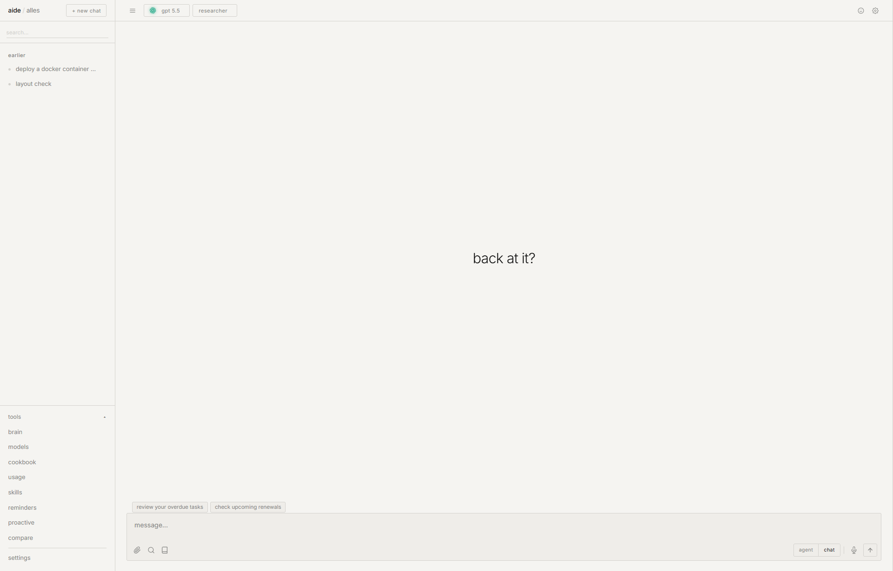

# alles

```
─────────────────────────────────────────────
 ⊹ ࣪ ˖ ( ◕ ‿ ◕ )つ  alles — your everything
─────────────────────────────────────────────
```

**alles** is a self-hosted everything-app. one program that runs on your own computer and gives you ai chat, email, notes & docs, a journal, files, a calendar, tasks, money & budgets, photos, contacts, an encrypted secrets vault, subscription tracking, and countdowns — all behind one login, all storing their data in a single folder you control. nothing phones home.

think of **alles** as the whole house, and **aide** as the assistant who lives in it — like what gemini is to google, except it's yours and it can actually open the other rooms: read your mail, edit your docs, add to your calendar, file your tasks.

it's *one python process*. no build step, no bundler, no `node_modules`, no account, no analytics. you clone it, run `python app.py`, and open a browser. that's the entire setup.

<p align="center"></p>

---

## the 30-second version

- **everything in one place, one login.** stop bouncing between fifteen tabs and ten companies.
- **it's yours.** all your data is plain files + one database in a folder called `data/`. copy that folder = you've copied your whole life. delete the app = you still have your files.
- **the ai isn't a gimmick.** it talks to *any* model (claude, gpt, deepseek, gemini, a local model — switchable mid-chat), it remembers things across conversations, and in "agent" mode it can actually *do* things: edit files, run commands, search the web, touch your other apps.
- **private by default.** no telemetry, no cloud, runs offline if you want (with a local model).
- **single user, on purpose.** this is *your* workspace, not a service you host for a hundred people.

## is this for me?

if you've ever wished you could mash together **notion + gmail + obsidian + google photos + google calendar + a password manager + a chatgpt that can actually open your files** — and own the whole thing on hardware you control — yes.

if you want a multi-user team product with billing and admin roles: no, that's not what this is. alles is deliberately one person, one machine.

you do **not** need to be technical to *use* it. you need to be a little technical to *install* it (two commands in a terminal, once). the rest is clicking around a normal-looking app.

---

## the apps

each one is a real, finished app — they live on their own subdomain so it feels like a suite, but it's all one program.

| app | what it is |
|---|---|
| **aide** | ai chat that talks to any model, remembers you across chats, and (in agent mode) does real work — files, shell, web, your other apps. also research, compare, personas, projects, voice, vision, skills. |
| **home** | a customizable launcher with a quick-capture box for fast notes/tasks |
| **today** | your whole day on one screen — events, due tasks, renewals, unread mail — with one "ask aide about my day" button |
| **activity** | a timeline of everything you actually did, across every app |
| **docs** | obsidian-style linked markdown notes (`[[wikilinks]]`, backlinks, graph, live editor) — your notes are plain files you own |
| **mail** | a real imap/smtp email client with threads, attachments, and ai help |
| **calendar** | month / week / day views, recurring events, `.ics` + optional caldav sync, natural-language quick-add |
| **tasks** | natural-language to-dos with recurring, priorities, tags, subtasks, smart views |
| **notes** | lightweight scratch notes for zero-ceremony jotting |
| **journal** | a daily diary with mood, prompts, a streak, and a year heatmap |
| **subs** | subscription tracker — renewals, forecast, price-change tracking, auto-post to money |
| **money** | accounts, transactions, budgets, csv import, charts |
| **days** | countdowns and day-counts (birthdays, anniversaries) |
| **files** | a file browser with inline preview (pdf/video/audio/images) and search |
| **gallery** | a local photo library with moments, albums, exif search |
| **contacts** | an address book the ai can read (e.g. when drafting mail), with vcard import/export |
| **system** | a built-in live system monitor (cpu/ram/disk/gpu) |
| **secrets** | an encrypted vault with typed entries (logins, cards, api keys, notes…) |
| **automations** | *when this happens, do that* — set a rule once and alles runs it |

plus the smaller stuff: global search (cmd/ctrl+k), scheduled messages, prompt cookbook, webhooks, api tokens, an openai-compatible api, backup/restore to a zip, light/dark themes with a custom accent, and it installs like a pwa with real push notifications.

**→ full details on every app, the internals, the api, and the architecture are in [specifications.md](./specifications.md).**

---

## quick start

you need **python 3.11 or newer**. then:

```bash
git clone https://github.com/jxherc/alles.git
cd alles
pip install -r requirements.txt
python app.py
```

open **http://localhost:8000** and you're in.

**no api key is needed to boot.** mail, docs, files, calendar, tasks, subs, days, photos, contacts, secrets — all work out of the box. when you want aide to talk, add a model under **settings → models** (one click for openai / anthropic / deepseek / groq / gemini / ollama and ~10 more), or drop a key like `deepseek_api_key` into `.env`.

**prefer docker?** `docker build -t alles . && docker run -p 8000:8000 -v alles-data:/app/data alles` — the `data/` volume keeps your db, vault, uploads, and keys across rebuilds.

**want it fully offline and free?** install [ollama](https://ollama.com), `ollama pull` a model, add an endpoint pointing at `http://localhost:11434` — no key or internet needed for the ai.

> **before you put it on a network:** alles ships with auth off. set `auth_enabled=true`, a strong `auth_password`, and a real `secret_key` first. details in the [security section](./specifications.md#security--read-before-exposing-it).

---

## what it's based on

aide was inspired by **[odysseus](https://github.com/pewdiepie-archdaemon/odysseus)** by pewdiepie-archdaemon. the concept — a self-hosted personal ai with memory, research mode, shell access, mcp, a multi-provider model backend, and a suite of apps around it — comes from that project. alles is an independent reimplementation written from scratch, but odysseus is where the idea came from and it deserves the credit. go give that repo a star. full note in [acknowledgments.md](./acknowledgments.md).

it stands on the shoulders of some great open-source work: [fastapi](https://fastapi.tiangolo.com) + [uvicorn](https://www.uvicorn.org), [sqlalchemy](https://www.sqlalchemy.org), [httpx](https://www.python-httpx.org), [fastembed](https://github.com/qdrant/fastembed), [codemirror](https://codemirror.net), [leaflet](https://leafletjs.com) with map tiles from [openstreetmap](https://www.openstreetmap.org/copyright), [katex](https://katex.org), [mermaid](https://mermaid.js.org), [pillow](https://python-pillow.org), [python-docx](https://python-docx.readthedocs.io), [pypdf](https://pypdf.readthedocs.io), [cryptography](https://cryptography.io), and python's own `imaplib`/`smtplib`. models come from whichever provider you point it at; local ones via [ollama](https://ollama.com).

---

## license

mit. do whatever you want with it. if you build something cool on top, a link back is appreciated but not required.
