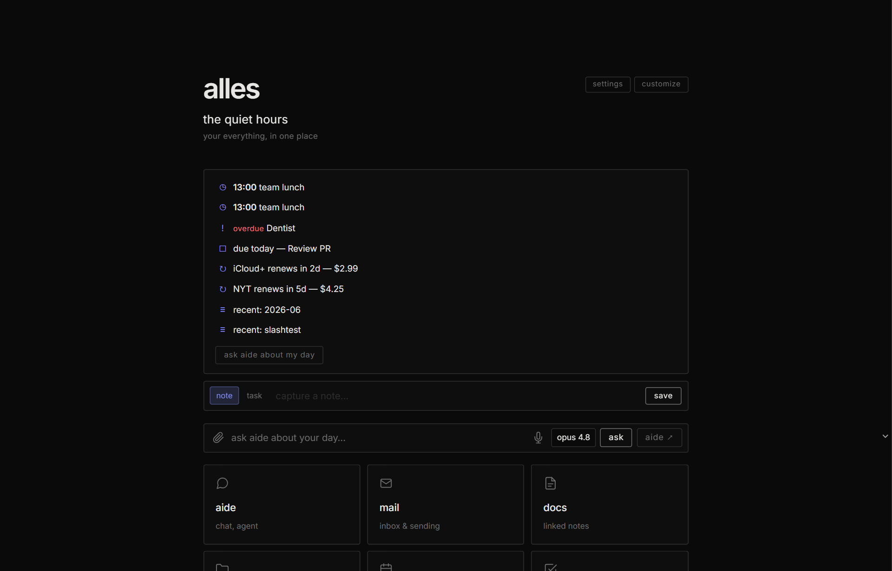
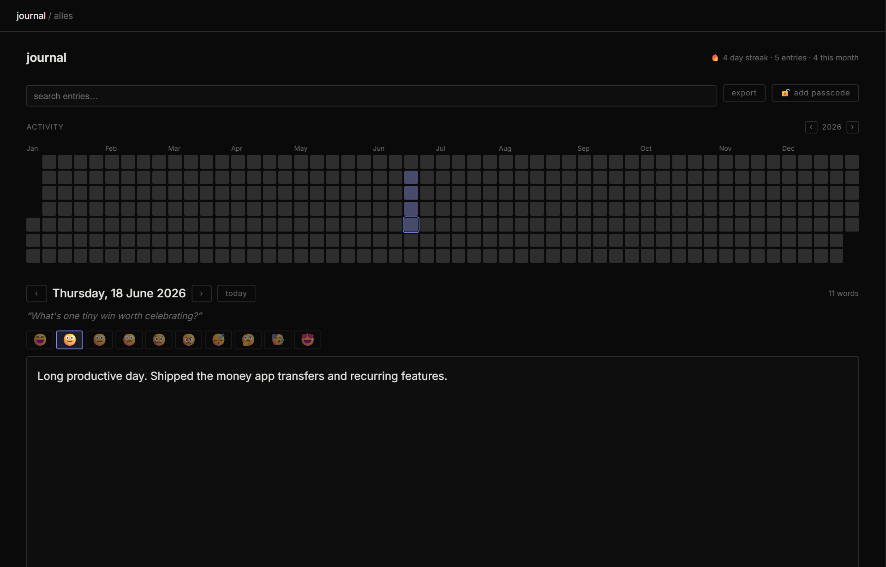
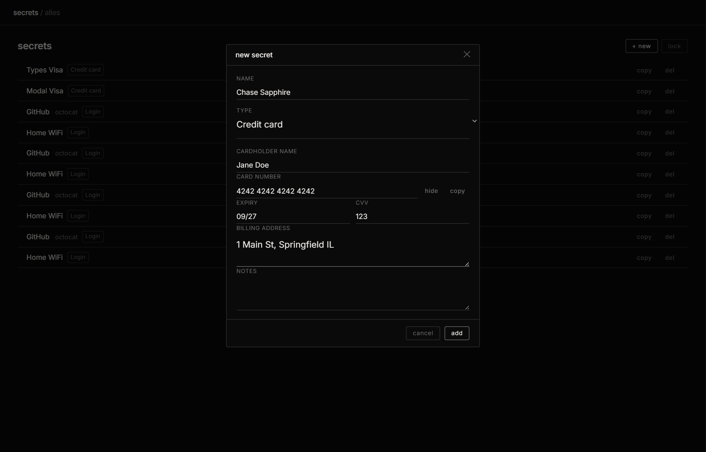
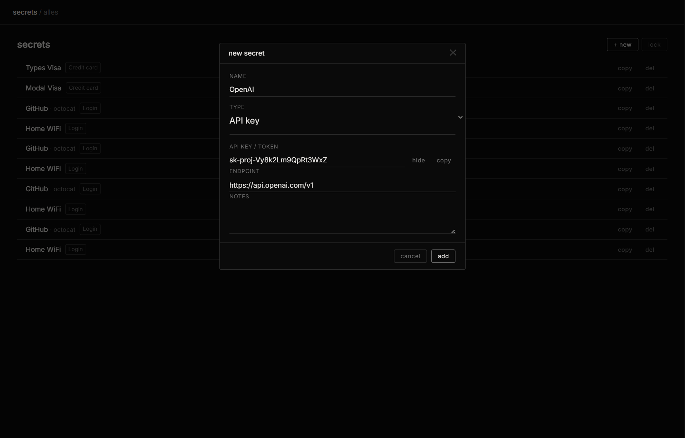

# alles

```
─────────────────────────────────────────────
 ⊹ ࣪ ˖ ( ◕ ‿ ◕ )つ  alles — your everything
─────────────────────────────────────────────
```

**alles** is a self-hosted everything-app. one program that runs on your own computer and gives you ai chat, email, notes & docs, a journal, files, a calendar, tasks, money & budgets, photos, contacts, an encrypted secrets vault, subscription tracking, and countdowns — all behind one login, all storing their data in a single folder you control. nothing phones home. nothing's in someone else's cloud unless you put it there yourself.

think of **alles** as the whole house, and **aide** as the assistant who lives in it — kind of like what gemini is to google, except it's yours and it can actually open the other rooms: read your mail, edit your docs, add to your calendar, file your tasks. and with automation rules, it keeps doing little jobs for you even when you've closed the laptop.

it's *one python process*. no build step, no bundler, no `node_modules`, no account to sign up for, no analytics watching you. you clone it, run `python app.py`, and open a browser. that is genuinely the entire setup.

> **two-audience note:** this readme is written to be read two ways. if you're not a programmer, read the plain sentences and skip the grey "*under the hood*" bits — you'll still understand what every part does. if you are a programmer, the under-the-hood bits and the spec tables have the precise details (protocols, endpoints, algorithms, file formats). jargon gets a quick plain-english gloss the first time it shows up.

<p align="center"></p>

---

## the 30-second version

- **everything in one place, one login.** stop bouncing between fifteen tabs and ten companies.
- **it's yours.** all your data is plain files + one database in a folder called `data/`. copy that folder = you've copied your whole life. delete the app = you still have your files.
- **the ai isn't a gimmick.** it talks to *any* model (claude, gpt, deepseek, gemini, a model running on your own machine — your choice, switchable mid-chat), it remembers things across conversations, and in "agent" mode it can actually *do* things: edit files, run commands, search the web, touch your other apps.
- **private by default.** no telemetry, no cloud, runs offline if you want (with a local model). you decide what leaves your machine.
- **single user, on purpose.** this is *your* workspace, not a service you host for a hundred people.

---

## is this for me?

if you've ever wished you could mash together **notion + gmail + obsidian + google photos + google calendar + a password manager + a chatgpt that can actually open your files** — and own the whole thing on hardware you control — yes.

if you want a multi-user team product with billing and admin roles: no, that's not what this is. alles is deliberately one person, one machine.

you do **not** need to be technical to *use* it. you need to be a little technical to *install* it (you run two commands in a terminal once). the rest is clicking around a normal-looking app.

---

## table of contents

- [the apps — what you actually get](#the-apps--what-you-actually-get)
  - [aide (the ai)](#aide-the-ai) · [home](#home) · [today](#today) · [activity](#activity) · [docs](#docs) · [mail](#mail) · [calendar](#calendar) · [tasks](#tasks) · [notes](#notes) · [journal](#journal) · [subs](#subs) · [money](#money) · [days](#days) · [files](#files) · [gallery](#gallery) · [contacts](#contacts) · [secrets](#secrets) · [system](#system) · [automations](#automations)
- [aide in depth](#aide-in-depth)
- [how the model switch works](#how-the-model-switch-works) — *the part everyone asks about*
- [the agent in depth](#the-agent-in-depth)
- [how each app works under the hood](#how-each-app-works-under-the-hood)
- [keyboard shortcuts & global search](#keyboard-shortcuts--global-search)
- [quick start](#quick-start)
- [the cli](#the-cli)
- [configuration](#configuration)
- [architecture: one server, many subdomains](#architecture-one-server-many-subdomains)
- [the api (for other tools)](#the-api-for-other-tools)
- [your data: where everything lives](#your-data-where-everything-lives)
- [how it's built](#how-its-built)
- [project layout](#project-layout)
- [security — read before exposing it](#security--read-before-exposing-it)
- [performance & reliability](#performance--reliability)
- [testing](#testing)
- [what it's based on](#what-its-based-on)
- [license](#license)

---

## the apps — what you actually get

every one of these is a real, finished app — not a placeholder. they each live on their own subdomain (more on that later) so it feels like a proper suite, but it's all one program.

### aide (the ai)
**plain version:** a chat window that talks to whatever ai model you want, remembers you between chats, and — when you let it — can do real work on your machine instead of just talking.

**what's in it:**
- streaming chat (the reply types itself out live, word by word)
- works with any provider: claude, openai/gpt, deepseek, gemini, groq, mistral, a local model, and ~15 others — switch any time, even mid-conversation
- **agent mode** — a do-it-for-me mode with files, shell, web, and cross-app tools (full section below)
- **app actions from plain chat** — just ask ("what's on my calendar", "any new emails", "remind me to call the dentist", "add lunch friday 1pm") and aide does it; reads happen freely, anything that changes/sends asks first. plus Discord/Telegram pings when a long run finishes.
- **research mode** — searches the web, *reads the pages*, and writes you a cited report
- **compare** — run one prompt against several models at once, side by side, and vote
- **long-term memory** — it remembers facts/preferences across all your chats
- **personas** — saved system prompts / characters you can switch between
- **projects** — group chats together with shared context
- **artifacts** — when the model writes html/svg/a webpage/code, you see it rendered live, not as a wall of text
- **voice** — talk to it and have it talk back (speech-to-text in, text-to-speech out)
- **vision** — drop in an image and capable models can see it
- **incognito chats** — conversations that aren't saved
- **slash commands** (`/new`, `/clear`, `/rename`, …) and `@`-mentions to pull a file into context
- **cookbook** — a browser over **900+ open models** ranked against *your* actual hardware (what fits, at what quant, how fast), so you can pick + pull a local model that'll actually run
- **usage** — a token dashboard: totals, a tokens-by-month chart, and a per-model breakdown, so you can see what you're spending
- **skills** — write reusable procedures (a name, when-to-use, and the steps in markdown) that the agent discovers and loads on its own; it ranks your skills against each task and reaches for the right one. ships with a few starters (summarize, web research, code review)

### home
**plain version:** the front page. a launcher you can arrange however you like, with a box to jot something down fast.

- a grid of tiles, one per app — **drag them to reorder**, and when you drag, a glowing line shows exactly where the tile will drop
- hit **customize** to rearrange or **hide** apps you never use (×/+ on each tile); your layout is remembered
- a **quick-capture** box up top: type a thought and save it as a **note** (it names the note after what you wrote) or a **task**, without leaving the page
- a "today" strip and a live clock + greeting

### today
**plain version:** your whole day on one screen the moment you open alles.

- today's calendar events, tasks that are overdue or due today, reminders, subscriptions about to renew, day-countdowns, unread mail, and recently-edited docs — all in one list
- one button: **"ask aide about my day"** — hands all of that to the ai for a friendly rundown of what to do first and what you're about to miss

### activity
**plain version:** one scrollable feed of *everything you did*, across every app, newest first. if today is what's coming up, activity is what already happened.

- a single reverse-chron timeline merging journal entries, tasks you added and ticked off, calendar events, money transactions, mail you received, photos you added, docs you edited, agent runs, and subscription renewals — grouped by day (today / yesterday / weekday / date)
- **filter chips** to show/hide any source, and a range toggle (7d / 30d / 90d / 1y); click any row to jump straight to it in its app
- *under the hood:* it's a **read-time aggregator** ([`routes/timeline.py`](routes/timeline.py)) — it queries each app's own tables on request instead of keeping a separate "events" log, so it's always correct and never needs a backfill. completing a task stamps a `completed_at` so "done" shows the real time, not just the date.

### docs
**plain version:** a really good notes app — like obsidian — where your notes are plain text files you own, linked together, with a live, pretty editor.

this is the most feature-dense app, so here's the full list:

- a true **wysiwyg** editor (you see bold as bold, headings as headings) built on **codemirror 6**, doing obsidian-style *live preview*: the markdown symbols (the `**` and `#`) hide themselves, the text styles inline, and the raw symbols reappear on whatever line your cursor is on. *under the hood:* codemirror edits the plain text directly, so what gets saved is byte-for-byte what you typed — a save can't silently corrupt a doc.
- three view modes you cycle with one button: **live** (the wysiwyg) · **source** (raw markdown) · **preview** (fully rendered)
- **`[[wikilinks]]`** to link notes together, **backlinks** (see what links *to* this note), and **unlinked mentions** (notes that name this one in plain text but haven't linked it yet)
- **rename-safe links** — renaming a note rewrites every `[[link]]` to it across the whole vault (aliases and `#headings` preserved), so refactoring never silently breaks your graph; the change is snapshotted so it's undoable
- **`[[` autocomplete** — start typing a link and it suggests your notes
- **find & replace** inside a doc (Ctrl+F)
- **a graph view** — your notes as dots, links as lines, drag-explore
- **`#tags`** with a clickable tag sidebar + filter, and **`![[embeds]]`** to pull one note (or an image) inside another
- **frontmatter** (the `key: value` block at the top) rendered as a clean property table
- **paste smarts:** paste a web link onto selected text → it becomes a link; paste or drop an **image** → it uploads and embeds automatically
- **quick switcher** (Cmd/Ctrl+O) — fuzzy-jump to any doc by name
- **pin** favorite docs to the top, **sort** the tree a–z or by recently-edited, **foldable folders**, and **drag files into folders** to organize (with a drop highlight)
- **templates** — new-from-template menu (seeds starter meeting/daily/project templates with `{{date}}`/`{{title}}` tokens)
- **task rollup** — every `- [ ] checkbox` across all your notes in one panel, tickable from there
- **word count + reading time**, live in the header
- **version history** — every save snapshots a revision you can preview and restore
- **daily notes** — one-click "today" journal entry
- **math** (via katex) and **diagrams** (via mermaid) render right in the doc
- **ai edits** — tell the ai "summarize this" / "fix the grammar" and it rewrites the note in place, streaming
- **extract to-dos** — ai pulls action items out of a doc into real tasks
- **import** `.md` / `.txt` / `.docx` (word) / `.html` / `.pdf`, or paste a **youtube link** → it grabs the transcript and ai-summarizes it into a note
- **export** to **pdf**, **html**, or **docx** (word)

### mail
**plain version:** a real email client (read + send), with one-click setup for the big providers and ai help built in.

- connects to **any imap/smtp account** (imap = how apps read your inbox, smtp = how they send) — one-click presets for gmail, outlook, icloud, yahoo, fastmail, or your own domain
- live inbox that auto-refreshes; open, read, and reply to mail
- **conversation threads** — a toggle collapses the inbox into conversations (everything with the same subject, re:/fwd: stripped), expand one to read the whole back-and-forth
- **attachments** — a message shows its attachments as chips you click to download (the body still loads attachment-free for speed)
- compose and send with **cc + bcc**; replies set the proper `In-Reply-To`/`References` headers so they thread correctly in Apple Mail, Gmail, and everywhere else
- **ai:** summarize a long thread, turn an email into a task, or turn an email into a calendar event (the ai reads out the date/time/title for you)
- **fast + offline-tolerant:** a persistent header cache means the inbox opens instantly and still shows your last sync when the network's slow or down; local search over the cache is instant
- *under the hood:* built directly on python's standard `imaplib`/`smtplib` — no third-party mail library. it pools live connections, caches what it's read, loads the inbox by range (not a slow "search everything"), and opens a message by pulling *only* its text/html body — not the attachments — so it stays fast on a weak connection.

### calendar
**plain version:** a calendar with month / week / day views and repeating events.

- real time-grid week and day views, a month grid, and an **agenda list**
- **recurring events** — daily / weekly / monthly, with a small **↻ marker** on every repeating occurrence so you never mistake one instance for a one-off
- **import / export `.ics`** — round-trip with Apple Calendar, Google, Outlook (export everything, or import a `.ics` someone sent you)
- **natural-language quick-add** right in the header — "lunch with sam friday 1pm" makes the timed event; "team sync tomorrow" makes an all-day one; and it now understands repeats too — "standup daily 9am", "yoga every monday 6pm", "class every week until 2026-08-01"
- optional **two-way sync with caldav** (the open calendar-sync standard used by icloud and google) if you add your credentials

### tasks
**plain version:** a real to-do list — type tasks in plain english, with recurring ones and smart views.

- **natural-language quick-add** — "pay rent every 1st !" or "call mom tomorrow #home" parses the due date, repeat, `#tags` and `!` priority for you (deterministic, no deps, all local)
- **recurring tasks** — finish one and it rolls forward to the next occurrence (daily / weekly / monthly / yearly, leap-day safe)
- **Today / Upcoming / Someday** views by due date, plus tags, subtasks, projects, and manual drag-reorder
- **active / history tabs** — checking a task off doesn't make it vanish; the **history** tab shows everything you've completed, and you can un-check one to send it back
- tasks created anywhere (quick-capture, "extract to-dos" from a doc, the ai's `task_add` tool) all land here

### notes
**plain version:** lightweight scratch notes (separate from the full docs app) for when you just want to jot something with zero ceremony — also where home's quick-capture "note" lands as a properly-named note.

### journal
**plain version:** a daily diary — one entry a day, with mood, prompts, a streak, and a year-at-a-glance heatmap.

- one entry per day with a **mood** picker, tags, live word count, and gentle autosave
- a rotating **daily writing prompt**, a **streak** counter (an unwritten today doesn't break it), and **on-this-day** (the same date in past years)
- a full-year **activity heatmap** — a github-style contribution grid (7 rows × the weeks of the year) that fills in as you write, with year-to-year navigation
- **search** across every entry, **export** the whole journal to one markdown file
- an optional **"reflect"** button — a short, warm ai reflection on what you wrote
- an optional **passcode lock** that gates the journal behind its own code (an access gate, not extra encryption — once you're in it's still fully searchable)

<p align="center"></p>

### subs
**plain version:** track what you're paying for every month so nothing surprises you.

- weekly / monthly / quarterly / yearly / custom billing cycles
- due dates roll forward automatically as they pass
- **mark a renewal paid** only when it's actually due — one click logs a dated payment and advances the next due date by a cycle, with an **undo** for when you hit it by accident (no more clicking "paid" five times and launching the date into next year)
- **auto-post to money** (optional) — link a subscription to a money account and every time it renews it drops a real dated transaction there, so your spending picture actually includes your subscriptions instead of forecasting them separately (idempotent — it never double-charges)
- **price-change tracking** — when a subscription's price changes it keeps the old and new, so a quietly-creeping price is something you can actually see
- a **6-month spend forecast** of what's coming up, and **duplicate detection** that flags two subs that look like the same service
- a **manage ↗ link** straight to the cancel/billing page you saved
- monthly **and** yearly totals, plus a **spend-by-category bar chart** (plain CSS, no chart library)
- a **push notification before anything renews** so you can cancel in time

### money
**plain version:** a finance tracker — accounts, what you spend, and budgets, with charts.

- **accounts** (checking / savings / cash / credit / investment) with live balances + a net-worth roll-up
- **transactions** — log income/expenses with a category + payee, browse by month, quick-add, **click a row to edit it inline**, delete
- **CSV import / export** — pull in a bank statement (it maps a `Description` column to the payee, copes with `$`/commas) and **skips rows you already imported** (matched on date + amount + payee) so re-importing an overlapping statement doesn't double-count; or export everything to a spreadsheet
- **budgets** — set a monthly cap per category; a progress bar turns red when you go over
- **charts** — spending-by-category bars and a 6-month income-vs-spent trend (plain SVG, no chart library)
- this-month cards: net worth · income · spent · net

### days
**plain version:** countdowns to things coming up, and day-counts since things that happened.

- birthdays & anniversaries (it knows *which* anniversary — "3 years")
- handles feb 29 sanely
- progress bars, pins, and push reminders as the day approaches

### files
**plain version:** a file browser over any folder you point it at — browse, upload, preview, organize.

- browse folders, upload, rename, delete, and **search** — by filename *and* inside text files, with a snippet of where the match was
- **inline preview** without downloading: images, **pdfs** (in a real pdf viewer), **video**, **audio**, and text/markdown
- download anything with one click

### gallery
**plain version:** a local photo library that feels like icloud/google photos, minus the company.

- your photos grouped into date "moments," plus albums and favorites
- **search** by filename, camera (from exif), or date — "june 2026", a `2026-06` prefix, or just a year
- reads **exif** (the camera/date info baked into a photo) and makes thumbnails automatically
- **folder sync** — point `/api/photos/sync` at an iCloud Drive / Photos-export / Dropbox folder and it pulls in new shots (deduped); on the Mac mini a PhotoKit/osxphotos bridge feeds the same path
- everything stored as plain files under `data/` — they're just your photos in a folder

### contacts
**plain version:** an address book — and one the ai can read and use (e.g. when drafting mail).

- name / email / phone / notes / tags, searchable
- **vCard import / export** — round-trips with your phone and any other address book

### system
**plain version:** a live look at how hard your computer is working — like Task Manager / Activity Monitor, built in.

- **ring gauges** for cpu and memory, a per-core bar strip, and **cpu/ram history sparklines** that fill in as you watch — refreshing every couple seconds
- disk-usage bars per drive, plus a card with your gpu, vram, cpu model, backend, and uptime
- the gauges go from accent → amber → red as a number heats up, so a pegged core or a full disk is obvious at a glance
- *under the hood:* `GET /api/system/stats` ([`services/sysmon.py`](services/sysmon.py)) uses [psutil](https://github.com/giampaolo/psutil) for live cpu%/per-core/uptime/disks; without it, it still shows ram + disk from the static hardware readout (`shutil` + the `hwfit` probe), just no live cpu%. all the gauges are hand-drawn svg — no chart library.

### secrets
**plain version:** an encrypted vault — and not just for passwords. each item carries the fields that actually fit what it is.

- pick a **type** and the form changes to match: **logins** (username · password · website · notes), **credit cards** (cardholder · number · expiry · cvv · billing address), **api keys / tokens**, **secure notes**, and **identities · bank accounts · ssh keys · software licenses** — so a card never asks you for a "password" and an api key reads as a token, not a login
- click any entry to open it, reveal or copy a field, edit it, or delete it
- a built-in **password generator** (CSPRNG, skips look-alike characters) and a live **strength meter** that flags common, repetitive, or sequential passwords
- *under the hood:* each entry is sealed with **aes-256-gcm** (a strong authenticated encryption) under a key derived from your master password with **pbkdf2-hmac-sha-256, 260,000 iterations** (a deliberately slow key-stretch so guessing the password is expensive). the master password is held **in memory only** and never written to disk. locked, the vault is unreadable even to someone holding a full copy of your database.

<p align="center">
  <br>
  
</p>

### automations
**plain version:** *when this happens, do that.* set a rule once and alles runs it for you.

- examples: mail from a certain sender → make a task · a subscription is about to renew → push me · a doc gets saved with `#urgent` → do something · every morning → build me a day digest
- *under the hood:* rules live in the database and fire off a small background job system (see [under the hood](#how-each-app-works-under-the-hood))

**and the smaller stuff:** global search across everything (Cmd/Ctrl+K), scheduled messages (right-click send → have aide message you later), prompt templates / a cookbook, webhooks, api tokens, an openai-compatible api so other tools can use alles as their "openai," backup & restore to a zip, light/dark themes **with a customizable accent color**, and it **installs like an app** (it's a pwa with real push notifications — add it to your home screen/dock and reminders reach you with every tab closed).

---

## aide in depth

aide looks like a normal chat box. the differences are under it:

- **one box, every model.** you register "endpoints" (each is just a web address + an api key) and pick a model. switch providers mid-conversation; aide handles the protocol differences. ([how that works →](#how-the-model-switch-works))
- **it remembers.** long-term memory backed by **local vector search** — *vector search* means it finds memories by *meaning*, not exact words. it uses `fastembed` (an embedding model that runs on your cpu via onnx — no embedding api, no cost, no data leaving), and falls back to keyword search if that's unavailable. you can browse, search, edit, pin, and delete memories, and it can auto-extract durable facts from a conversation.
- **it can act.** *agent mode* is a real autonomous loop (full section below).
- **it researches.** *research mode* runs multiple rounds: search → read the actual pages → pull findings → decide what to search next → write a cited markdown report. free with no key (duckduckgo + wikipedia); better with a free tavily/brave key.
- **it sees.** drop an image and capable providers receive it as vision input.
- **it compares.** run the same prompt across several models at once and vote on the winner.
- **personas & projects.** personas are saved system prompts (give it a character/role). projects group related chats with shared context and files.
- **artifacts.** ask for a webpage/chart/snippet and it renders live in a sandboxed frame next to the chat.
- **voice.** push-to-talk speech-to-text in, text-to-speech out — local (`faster-whisper`) or via a provider, your choice in settings.
- **reasoning view.** for "thinking" models (deepseek-r1, qwen3, claude extended thinking) you get a live "thought for N s" timer and can read the reasoning.

---

## how the model switch works

this is the single most-asked question, so here's the precise answer.

aide does **not** hardcode a provider. you register **endpoints** under settings → models; each endpoint is just a `base_url` (web address) + an `api_key`. when you send a message, aide looks at that url and routes the request to the right protocol. all of that lives in one function, [`detect_provider()` in `services/llm.py`](services/llm.py):

```python
def detect_provider(base_url):
    if "anthropic.com"   in url: return "anthropic"
    if "deepseek.com"    in url: return "deepseek"
    if "openrouter.ai"   in url: return "openrouter"
    if "groq.com"        in url: return "groq"
    if "moonshot.cn"     in url: return "moonshot"
    if "api.x.ai"        in url: return "xai"
    if "googleapis.com"  in url: return "gemini"
    if "mistral.ai"      in url: return "mistral"
    if "perplexity.ai"   in url: return "perplexity"
    if "together.xyz"    in url: return "together"
    if "fireworks.ai"    in url: return "fireworks"
    if "cohere"          in url: return "cohere"
    if "openai.com"      in url: return "openai"
    if ":11434" in url or "ollama" in url: return "ollama"
    return "openai"   # anything else: treat as OpenAI-compatible
```

**plain version:** there are really only three "languages" ai providers speak. aide speaks all three and translates, so you never have to care which one answered.

**the three wire protocols:**

| protocol | who speaks it | endpoint | notes |
|---|---|---|---|
| **openai-compatible** | openai, deepseek, groq, openrouter, moonshot/kimi, xai/grok, gemini, mistral, perplexity, together, fireworks, cohere, vllm, lm studio, **+ anything that copies the format** | `POST /v1/chat/completions` | the default and the fallback |
| **anthropic messages** | claude | `POST /v1/messages` | different headers, system-prompt placement, and tool/vision shapes |
| **ollama native** | local models via [ollama](https://ollama.com) | `POST /api/chat` | point an endpoint at `http://localhost:11434` and you're fully offline, no keys |

for each, aide builds the correct request body, sends it, and streams the reply back through a parser that **normalizes everything into the same internal events**: `{"delta": …}` for text, `{"thinking": …}` for reasoning tokens, `{"tool_call": …}` for function calls, and `{"done": …, "usage": …}` at the end. the rest of the app only ever sees those four shapes.

details that matter in practice:

- **true token streaming** over sse (server-sent events, the `data: {json}\n\n` format) — not batched. you watch it type.
- **reasoning models** that go quiet before answering show an elapsed-time heartbeat so the ui never looks frozen.
- **vision / tool-calls / tool-results** are translated per provider (e.g. openai `tool_calls` ⇄ anthropic `tool_use` blocks; base64 images ⇄ anthropic image blocks).
- **auto-failover + cooldown:** an endpoint that errors twice gets a 20-second cooldown so one dead provider doesn't stall you.
- **localhost stays direct:** behind an http proxy (e.g. clash), aide honors `NO_PROXY` and sends `localhost`/`127.0.0.1` straight through, so a local model never gets proxied.
- **model lists auto-refresh:** aide periodically re-pulls each provider's available models (and on demand), so new releases show up on their own.
- **zero-config start:** put `DEEPSEEK_API_KEY` or `ANTHROPIC_API_KEY` in `.env` and the matching endpoint is created on first boot — or add any endpoint in the ui with one click (presets for everything above).

aide also **exposes its own** openai-compatible api (`GET /v1/models`, `POST /v1/chat/completions`), so other tools can point at alles as if it were openai.

---

## the agent in depth

**plain version:** agent mode turns the chat into something that *does the task* — it plans, uses tools, checks its work, and reports back, looping on its own for many steps.

*under the hood:* it's a multi-turn loop ([`services/agent_runtime.py`](services/agent_runtime.py)). each turn the model can call tools; results feed back in; it keeps going until done or it hits a turn limit (6 / 18 / 36 turns for low / medium / high "effort"). long runs auto-trim old tool output to stay within the context window, and screenshots are fed back as real vision input.

**the toolset (~58 tools), by category:**

- **files:** `read_file`, `write_file`, `edit_file` (exact find/replace), `apply_patch` (unified diffs), `list_files`, `glob_files`, `grep_files`, `revert_file`
- **shell:** `shell` / `bash` (optionally sandboxed in docker), `execute python`
- **code intelligence:** `code_symbols`, `find_definition`, `diagnostics` (run linters)
- **git:** `git_status`, `git_diff`, `git_branch`, `git_commit`
- **web:** `web_search`, `web_fetch` (fetch + read a page)
- **memory:** `memory_search`, `memory_add`
- **cross-app:** `calendar_list/create/delete`, `task_list/add/done`, `note_list/read/write/search`, `contact_list/add`, `mail_list/read/send`
- **github** (when you connect a token): `github_me`, `github_list_repos`, `github_get_repo`, `github_get_file`, `github_list_issues`, `github_create_issue`, `github_list_prs`, `github_create_pr`, `github_search_code`, `github_search_repos`
- **integrations:** `mcp_list_tools`, `mcp_call_tool` (mcp = model context protocol, a standard for plugging external tools into ai), `opencode_run` (hand a coding subtask to opencode), `skill_list`, `skill_load`
- **delegation:** `spawn_agent`, `spawn_agents` (fire off parallel sub-agents for independent subtasks)
- **computer use** (opt-in, needs `pyautogui`): `screenshot`, `computer_click/move/type/key/scroll` — it can drive your actual screen
- **planning:** `todo_update` (keeps a live checklist you can watch)

**safety:**

- **permission modes** — *full-auto* (does it), *approve* (asks before every change, showing you the exact diff first), or *plan* (read-only — it inspects and writes you a plan, and the change-making tools are removed entirely that turn)
- **checkpoints** — every file edit is snapshotted, so you can **revert a whole run** with one click
- **provenance you can see** — every agent reply has a **sources** button listing exactly what that run touched (files, urls fetched, searches, shell commands), and a **runs drawer** (the ⟳ in the top bar) browses past runs — their status, to-do list, tool steps, and the same sources — so the agent is inspectable, not a black box
- **prompt-injection guard** — when the agent reads something it didn't write (a web page, an email, a file, repo contents, an mcp result), that text is wrapped as *data, not instructions* before it goes back to the model, and scanned for the classic attacks ("ignore previous instructions," "reveal your system prompt," "email the api key to…"). anything that trips gets flagged. so a booby-trapped webpage can't quietly hijack a run. *(it's a seatbelt, not a force field — see security.)*
- **secret-path confinement** — the file tools refuse to touch credential/secret stores (`~/.ssh`, `~/.aws`, `.env`, `*.pem`, `id_rsa`, `.netrc`, `.docker/config.json`…) by default, even if a prompt-injection tries to make the agent exfiltrate them. you can opt out (`agent_allow_secrets`) and optionally confine all writes to the workspace (`agent_confine_workspace`)
- **sandbox** — the shell can run inside a docker container with the workspace mounted at `/work` and (optionally) no network, so commands can't touch your real filesystem
- **action intents** (opt-in) — a plain chat turn that's clearly asking aide to *do* something ("add lunch to my calendar", "run npm install", "research X") can auto-promote into agent mode (`agent_auto_intents`); off by default so a normal chat never gets hijacked
- a project-level **`AGENTS.md`** (or `aide.md`) in the working folder is auto-loaded as standing instructions — the same cross-tool convention claude code and others use

---

## how each app works under the hood

the whole point of self-hosting is that nothing is magic. here's what each app *actually does*:

- **docs** — your notes are **real `.md` files** in `data/vault/` (path configurable). the editor is **codemirror 6** doing obsidian-style live preview; it edits the plain text directly, so *what's saved equals what you typed*. `[[wikilinks]]`, backlinks, unlinked mentions, `#tags`, `![[embeds]]`, frontmatter, the graph, the outline, the task rollup, and word count are all computed over those files on demand. images you paste/drop go to `data/vault/_assets/`; templates live in `data/vault/_templates/` (both hidden from the tree). math renders with katex, diagrams with mermaid (lazy-loaded from a cdn; raw text shown if you're offline). every save writes a revision row you can restore.
- **mail** — a thin client over python's stdlib `imaplib`/`smtplib` (no mail dependency). it pools live imap connections, caches reads, loads the inbox by sequence range (no slow `SEARCH ALL`), and opens a message by fetching only its text/html body parts (not attachments) for speed on bad links. a background poll only re-fetches when the mailbox actually changed. credentials are stored locally, encrypted, and never sent back to the browser.
- **research** — an *iterresearch*-style deep-research loop (the model drives every decision): it plans the question into sub-topics, fires several search queries per round in parallel (tavily / brave / searxng / google programmable search / serper if you have a key, else duckduckgo → wikipedia for free), reads the top pages with [trafilatura](https://github.com/adbar/trafilatura) (pulls the real article, drops nav/ads), extracts findings, rolls them into an evolving report, and **decides itself when it's covered the question** — then writes a long, cited, magazine-quality report (auto-formatted for product / comparison / how-to / fact-check questions). streamed live with sources as they're found.
- **calendar** — events in sqlite with recurrence expanded on the fly; optional two-way caldav sync if you install `caldav` and add credentials.
- **gallery / photos** — you import photos; pillow makes thumbnails and reads exif; they're grouped into date "moments." stored as plain files under `data/`.
- **secrets** — entries sealed with aes-256-gcm under a pbkdf2-hmac-sha-256 (260k iterations) key derived from your master password, which lives in memory only.
- **automations & jobs** — a small background **job registry + event bus** ([`services/jobs.py`](services/jobs.py)) ticks the recurring work every 30 seconds: subscription renewals, day-event checks, scheduled reminders/messages, automation rules, and a periodic model-list refresh. rules live in the db and fire on events (mail arrived, doc saved, renewal soon, every morning). new features can register their own jobs or react to events without wiring into the main loop.
- **push notifications** — web push implemented straight from the rfcs (vapid keys + message encryption) with **no third-party library**, so reminders, renewals, and scheduled messages reach you even with every tab closed.

---

## keyboard shortcuts & global search

| shortcut | does |
|---|---|
| **Ctrl/Cmd + K** | command palette — search everything (chats, docs, mail, tasks, calendar, money, subs, photos, …) + "ask aide" / "research the web" |
| **Ctrl/Cmd + O** | (in docs) quick-switch to any note by name |
| **Ctrl/Cmd + F** | (in docs) find & replace inside the current note |
| **Ctrl/Cmd + B** | toggle the sidebar |
| **Ctrl/Cmd + ,** | open settings |
| **Ctrl/Cmd + N** | new chat |
| **Ctrl/Cmd + Enter** | send |
| **Ctrl/Cmd + B / I / E / K** | (in docs) bold / italic / inline-code / link |

shortcuts are remappable in settings. global search is one command palette across the whole suite — chats, docs, **mail** (over the local header cache, instant), tasks, calendar, contacts, memories, **money**, **subscriptions**, and **photos** — grouped by app, and clicking a result jumps to it in its app (even on another subdomain). it also carries two **action rails**: **ask aide** drops your query straight into chat, and **research the web** kicks off a deep-research run — so the place you search is also where you act. summoned from any app with Ctrl/Cmd+K.

---

## quick start

you need **python 3.11 or newer**. then:

```bash
git clone https://github.com/jxherc/alles.git
cd alles
pip install -r requirements.txt
python app.py
```

open **http://localhost:8000** and you're in. (run `python cli.py doctor` first if you want to confirm the install is healthy before starting.)

**prefer docker?** `docker build -t alles . && docker run -p 8000:8000 -v alles-data:/app/data alles` — the `data/` volume keeps your db, vault, uploads, and keys across rebuilds.

**no api key is needed to boot.** mail, docs, files, calendar, tasks, subs, days, photos, contacts, secrets — all work out of the box. when you want aide to talk, add a model under **settings → models** (one click for openai / anthropic / deepseek / groq / gemini / ollama and ~10 more), or drop a key like `DEEPSEEK_API_KEY` into `.env`.

not a git person? click the green **code** button at the top of the github page, download the zip, unzip it, and run the same commands inside the folder.

want it fully offline and free? install [ollama](https://ollama.com), `ollama pull` a model, add an endpoint pointing at `http://localhost:11434`, and no key or internet is needed for the ai.

---

## the cli

a small command runs the server for you:

```
alles start         start in the background (waits until it's actually up)
alles stop          stop it
alles restart       restart it
alles status        running/stopped + url + reachability
alles logs [N]      print the last N log lines (default 60)
alles logs -f       follow the log live
alles update        git pull, then restart
alles open          open the browser
alles doctor        check the install is ready (deps, data dir, provider)
```

`alles doctor` is the first thing to run on a fresh checkout — it reports your python version, which required/optional deps are present, whether the data dir is writable, and whether an AI provider is configured yet, then tells you if you're good to `start`.

- **windows (powershell):** `.\alles.cmd start` (powershell needs the `.\`), or just `alles start` if the folder is on your `PATH`
- **windows (cmd):** `alles.cmd start`
- **macos / linux / git bash:** `./alles start`
- **anywhere:** `python app.py`

the launchers find `python3`/`python` on their own. add the alles folder to your `PATH` to type `alles` from any directory.

---

## configuration

copy `.env.example` to `.env`. **everything is optional** — alles runs fine with an empty `.env`. these are the environment variables (settings you set before launch):

| var | default | what it does |
|---|---|---|
| `DEEPSEEK_API_KEY` | — | auto-creates a deepseek endpoint on first boot |
| `ANTHROPIC_API_KEY` | — | auto-creates an anthropic (claude) endpoint on first boot |
| `PORT` | `8000` | port to serve on |
| `SECRET_KEY` | `dev-secret` | signs your login cookie — **change this before exposing alles to a network** |
| `AUTH_ENABLED` | `false` | set `true` to require a password to log in |
| `AUTH_PASSWORD` | — | that password |
| `BASE_DOMAIN` | — | your real domain, for the subdomain setup (see architecture) |
| `TAVILY_API_KEY` | — | better research search (falls back to duckduckgo + wikipedia, no key needed) |

**everything else is configured in the app, under settings** — no files to hand-edit. that includes: model endpoints, mail accounts, the search provider (tavily / brave / searxng / google pse / serper) and fallback chain, voice (stt/tts provider, model, language, voice, speed), the agent (permission mode, max turns/tokens, docker sandbox + image + no-net, sub-agents, computer-use, context files, allowed roots), the system prompt, memory auto-inject, artifacts on/off, context limit + auto-compact, themes/appearance, caldav accounts, webhooks, and api tokens. all of those persist as a settings row in the database.

---

## architecture: one server, many subdomains

alles is **one server** serving **one single-page app**, but each app gets its own subdomain so it feels like a real suite:

```
alles.localhost          the hub (launcher / home)
aide.localhost           chat, agent, memory, compare, ai gallery, cookbook, usage, skills
mail.localhost           mail
docs.localhost           docs (notes)
calendar.localhost       calendar
tasks.localhost          tasks
journal.localhost        journal
files.localhost          files
gallery.localhost        photos
contacts.localhost       contacts
secrets.localhost        the vault
activity.localhost       the cross-app activity timeline
system.localhost         the live system monitor
```

`static/js/subdomain.js` maps each host to the views it shows; `app.js` scopes the sidebar to that app and `navigateTo()` cross-jumps between them. this works **today with zero dns setup** — browsers route `*.localhost` to your own machine automatically.

**one login across all of them.** because a cookie set for `localhost` isn't sent to `*.localhost` subdomains, alles logs you in per-host and quietly relays the session on first cross-navigation via a one-time handoff code — so you authenticate once and every app just works, even on a direct visit or a bookmark.

**on a real domain:** set `BASE_DOMAIN=yourdomain`, put a wildcard reverse proxy in front (e.g. caddy: `*.yourdomain, yourdomain { reverse_proxy 127.0.0.1:8000 }`), and cookies become `Domain=yourdomain; Secure` so single-sign-on spans every subdomain over https.

---

## the api (for other tools)

alles is scriptable. two flavors:

**1. an openai-compatible api.** point any tool that "speaks openai" at alles:

| method | path | does |
|---|---|---|
| `GET` | `/v1/models` | list available models |
| `POST` | `/v1/chat/completions` | chat (streaming or not), openai request/response shape |

**2. the native rest api** (everything the ui uses; all under `/api`). a representative slice:

- **chat/agent:** `POST /api/chat`, `POST /api/chat/stop/{id}`, `GET /api/sessions`, `POST /api/agent/background`, `GET /api/agent/runs`, `GET /api/agent/runs/{id}/sources`, `POST /api/agent/runs/{id}/revert`, `POST /api/research`
- **docs:** `GET /api/vault-md/tree`, `GET/PUT/POST/DELETE /api/vault-md/file`, `/search`, `/grep`, `/graph`, `/tags`, `/backlinks`, `/unlinked`, `/tasks`, `/templates`, `/youtube`, `/import`, `/export-docx`, `/revisions`
- **mail:** `GET /api/mail/accounts`, `GET /api/mail/inbox/{id}`, `GET /api/mail/threads/{id}`, `GET /api/mail/message/{id}`, `GET /api/mail/attachments/{id}`, `GET /api/mail/attachment/{id}`, `POST /api/mail/send/{id}`, `POST /api/mail/summarize`, `POST /api/mail/make-task`, `POST /api/mail/extract-event`
- **tasks/calendar/notes/contacts/subs/days:** standard `GET/POST/PATCH/DELETE` on `/api/tasks`, `/api/calendar`, `/api/notes`, `/api/contacts`, `/api/subscriptions`, `/api/days`
- **files/photos:** `/api/files/{list,raw,upload,mkdir,rename,delete}`, `/api/photos/{gallery,gallery/upload,albums,thumb}`
- **secrets:** `/api/vault` (+ `/unlock`, `/lock`, `/{id}/reveal`)
- **memory/personas/projects/cookbook:** `/api/memories` (+ `/search`, `/extract`), `/api/personas`, `/api/projects`, `/api/cookbook`
- **platform:** `/api/settings`, `/api/today`, `/api/timeline` (the activity feed), `/api/system/stats` (live machine stats), `/api/backup` (+ `/restore`), `/api/tokens`, `/api/webhooks`, `/api/push/*`, `/api/mcp/*`, `/api/connections`, `/api/automations`, `/api/jobs`

protect it with **api tokens** (settings → tokens) and, if exposed, **`AUTH_ENABLED`**.

---

## your data: where everything lives

everything is in one folder, **`data/`**:

- **`data/aide.db`** — a single sqlite database file holding the structured stuff. ~30 tables: `sessions`, `messages`, `model_endpoints`, `notes`, `tasks`, `calendar_events`, `gallery_images`, `cookbook`, `personas`, `webhooks`, `api_tokens`, `memories`, `projects`, `uploads`, `documents`, `vault_entries`, `contacts`, `mail_accounts`, `albums`, `photos`, `reminders`, `automation_rules`, `day_events`, `subscriptions`, `money_accounts`, `money_transactions`, `money_budgets`, `doc_revisions`, `push_subscriptions`, `session_templates`, `mcp_servers`, `connections`.
- **`data/vault/`** — your docs as plain `.md` files (with `_assets/` for embedded images and `_templates/` for templates).
- **`data/`** (other) — uploads, photos, and file-app content as plain files; **`data/secret.key`** — the encryption key for stored credentials.

*under the hood:* the schema is sqlalchemy models in [`core/database.py`](core/database.py) with lightweight in-place column migrations (it adds new columns to existing tables on boot, so upgrades don't wipe your db). **back up the `data/` folder and you've backed up your entire alles** — or use settings → backup for a zip.

---

## how it's built

```
python 3.11 + fastapi + sqlite (via sqlalchemy)
vanilla js, es modules, one module per feature — no bundler, no build step
httpx for async, streaming model calls
fastembed (onnx) for local embeddings — no embedding api needed
web push implemented straight from the rfcs — zero extra dependencies
```

the dependency list is deliberately small — `fastapi`, `uvicorn`, `httpx`, `sqlalchemy`, `pydantic`, `cryptography`, `bcrypt`, `fastembed`, `python-docx`, `pillow`, `psutil` (the live system monitor), plus `beautifulsoup4` + `trafilatura` + `ddgs` for research (reading and searching the web). optional extras are opt-in and clearly marked: `pyautogui` (agent computer-use), `faster-whisper` (offline voice), `caldav` (calendar sync), `pypdf` (pdf import).

the frontend is genuinely just files: `static/index.html` is the whole app shell, `static/js/` is **one es module per feature** (~40 of them — `app.js`, `chat.js`, `vaultmd.js`, `mail.js`, `agent`-related, etc.) imported by `app.js`, and `static/style.css` holds the design tokens (sharp, monochrome, 2–3px radii, no shadows). "view source" actually shows you the app. the **one** exception is the docs editor: codemirror 6 is vendored as a single pre-built file (`static/vendor/cm6.bundle.js`), so there's still no build step you have to run.

---

## project layout

```
alles/
├── app.py                 fastapi entry — routers, middleware, lifespan, background jobs, env bootstrap
├── cli.py                 the alles cli (start/stop/restart/status/logs/update/open)
├── core/
│   ├── database.py        every sqlalchemy model + lightweight migrations
│   ├── settings.py        settings load/save, base-domain helpers
│   └── auth.py            bcrypt login, in-memory tokens, cross-subdomain handoff
├── services/
│   ├── llm.py             provider-agnostic streaming client (the model switch)
│   ├── agent_runtime.py   the autonomous agent loop
│   ├── agent_tools.py     every agent tool (+ injection guard + secret-path confinement)
│   ├── agent_intents.py   detect when a chat turn really wants the agent
│   ├── agent_state.py     durable agent run logs / checkpoints
│   ├── jobs.py            background job registry + event bus
│   ├── research/          iterresearch deep-research engine (plan → search → read → synthesize)
│   ├── hwfit/             hardware-aware local-model fit engine (900+ model catalog)
│   ├── task_nl.py         deterministic natural-language task parser (no deps)
│   ├── event_nl.py        natural-language calendar-event parser
│   ├── pwtools.py         password generator + strength estimator
│   ├── vcard.py           vcard 3.0 import/export
│   ├── mail.py            imap/smtp over stdlib
│   ├── vault_md.py        markdown docs on disk (tree, links, tags, graph, tasks)
│   ├── doc_import.py      import .md/.txt/.docx/.html/.pdf → markdown
│   ├── youtube.py         youtube transcript → note
│   ├── memory_store.py    fastembed vector memory + keyword fallback
│   ├── crypto.py          aes-256-gcm vault encryption
│   ├── webpush.py         web push from the rfcs
│   ├── sysmon.py          live cpu/ram/disk/gpu snapshot (the system monitor)
│   └── …                  files, photos, caldav, automations, docx export, stt
├── routes/                one apirouter per feature, all under /api (+ /v1 openai-compat)
├── tests/                 unit tests
└── static/
    ├── index.html         the app shell
    ├── style.css          design tokens + all styling
    ├── sw.js              service worker (offline shell + push)
    ├── vendor/            the prebuilt codemirror 6 bundle (no build step)
    └── js/                ~40 es modules, one per feature, imported by app.js
```

---

## security — read before exposing it

alles is built for **one person on their own machine.** read this before you put it on a network.

- **it ships open.** auth is off by default. if alles is reachable beyond localhost, set `AUTH_ENABLED=true`, a strong `AUTH_PASSWORD`, and a real `SECRET_KEY` **first**. without auth, anyone who can reach the port can read your mail and files and run shell commands as you.
- **login is rate-limited.** once auth is on, a single IP that fails the password 8 times in 5 minutes is blocked (HTTP 429) — basic brute-force insurance for the day alles sits behind a domain.
- **aide has hands.** agent mode and the shell tools run real commands on the machine alles is on. that's the point — but don't hand access to people or models you don't trust. the prompt-injection guard reduces the risk of a malicious web page/email steering the agent, but treat it as a seatbelt, not a force field.
- **credentials are encrypted at rest with a local key.** model api keys and mail passwords are sealed with aes-256-gcm under `data/secret.key`. this protects the database file if it leaks *on its own* — it does **not** protect against someone who has the whole `data/` folder, because the server must be able to decrypt unattended.
- **backups are the whole safe, key included.** a backup zip contains the database **and** the keys so restores just work — which means a backup is exactly as sensitive as your live data. store it like a password.
- **the password vault is different.** vault secrets are encrypted with your **master password**, which never touches disk. no master password, no plaintext — not even from a full copy of `data/`.
- **no warranty.** this is a self-hosted hobby project, not an audited security product. it tries hard; you run it at your own risk.

---

## performance & reliability

small touches that keep it snappy and sturdy:

- **streaming everywhere** so you never wait on a full response to start reading
- **endpoint cooldown** — a provider that errors twice is benched for 20s instead of stalling you
- **mail**: connection pooling, read caching, body-only fetches, and a change-detecting poll
- **service worker** caches the app shell for instant loads + offline, and serves the codemirror bundle stale-while-revalidate (fast, but always refreshes in the background so updates land)
- **agent context trimming** so long autonomous runs don't blow the model's context window
- **lightweight migrations** so upgrading the app never throws away your database
- **graceful degradation** — no search key → free providers; offline → cached shell + local model; missing optional dep → that one feature is disabled with a clear message, nothing else breaks

---

## testing

```bash
python -m unittest discover -s tests
```

**1,000+ unit tests** and counting — including a full in-process API harness that drives the real app (via `TestClient` against a throwaway in-memory db, no server/port) so every route has end-to-end coverage, plus `python scripts/stress_test.py` (exercises every app's backend) and `python scripts/live_usage.py` (drives the real app against live AI — a chat, an agent that writes *and runs* a program, web research, compare, and real records across the apps), both writing evidence to `~/alles-test-evidence/<timestamp>/` — plus the docs vault (links, tags, graph, tasks, templates, asset/import handling, unlinked mentions, **rename link-rewriting**), document import, the youtube id parser, the job registry + event bus, the agent's tool-gating + prompt-injection guard + secret-path confinement + action-intent routing + context compaction (and the **tool-history truncation staying valid json**), the **activity-timeline aggregator** and **system-stats snapshot**, the deep-research engine (page extraction, quality filter, the full plan→search→synthesize loop against a fake model), the hardware-aware model fit engine (catalog ranking, quant/version/bandwidth scoring), the natural-language task + calendar parsers (incl. **recurrence + "until"**), journal/files/photos search, the **federated command-palette** surfaces, the subscription + money math (incl. **renewal auto-post**, **paid/undo + price history + forecast + duplicate detection**, and **CSV dedup**), mail parsing (incl. **threading + reply headers**), the password generator + strength meter, vcard round-tripping, aes-256-gcm crypto, bcrypt auth + the login throttle, the token-usage rollup, the model client, and more.

every push runs the full suite on **GitHub Actions CI** (`.github/workflows/tests.yml`) — it already earned its keep by catching a data file that wasn't committed.

---

## what it's based on

aide was inspired by **[odysseus](https://github.com/pewdiepie-archdaemon/odysseus)** by pewdiepie-archdaemon. the concept — a self-hosted personal ai with memory, research mode, shell access, mcp, a multi-provider model backend, and a suite of apps around it — comes from that project. alles is an independent reimplementation written from scratch, but odysseus is where the idea came from and it deserves the credit. go give that repo a star. full note in [ACKNOWLEDGMENTS.md](./ACKNOWLEDGMENTS.md).

it stands on the shoulders of some great open-source work: [fastapi](https://fastapi.tiangolo.com) + [uvicorn](https://www.uvicorn.org), [sqlalchemy](https://www.sqlalchemy.org), [httpx](https://www.python-httpx.org), [fastembed](https://github.com/qdrant/fastembed), [codemirror](https://codemirror.net), [katex](https://katex.org), [mermaid](https://mermaid.js.org), [pillow](https://python-pillow.org), [python-docx](https://python-docx.readthedocs.io), [pypdf](https://pypdf.readthedocs.io), [cryptography](https://cryptography.io), and python's own `imaplib`/`smtplib`. models come from whichever provider you point it at; local ones via [ollama](https://ollama.com).

---

## license

mit. do whatever you want with it. if you build something cool on top, a link back is appreciated but not required.
