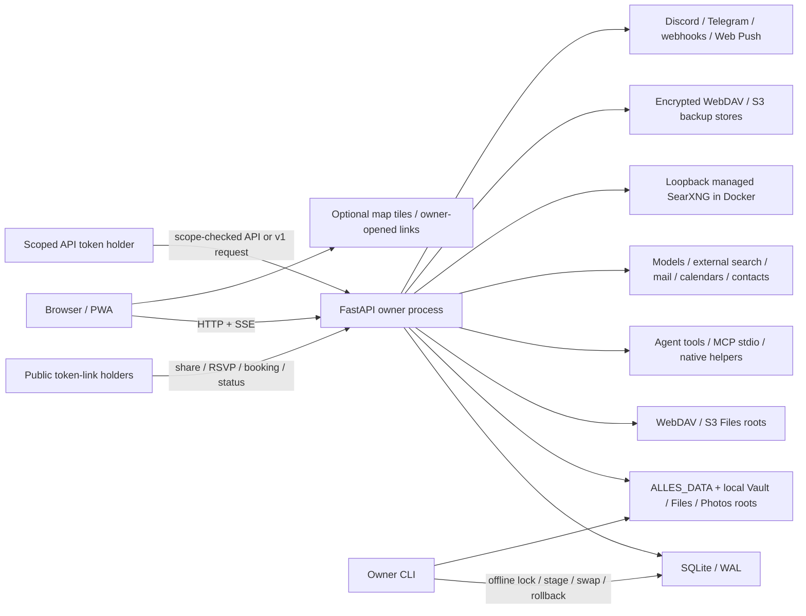

# Afterlife - current trust and compatibility map

- **Status:** code-audited and regression-locked; refreshed 2026-07-26
- **Scope:** behavior shipped on the current `dev-afterlife` worktree
- **Privacy rule:** built from source and synthetic/throwaway tests only; no owner database, vault,
  mail, connector, or file content was opened.

## Trust boundaries

| Area | Current boundary |
| --- | --- |
| Browser/PWA | Vanilla SPA, service worker, Cache Storage, IndexedDB, and browser storage. Some queued request bodies remain in the browser until replay. Browser state is not a server authority. |
| Direct browser network | Core interface fonts and code are local. Gallery can request OpenStreetMap tiles directly when its map is opened; user-opened source/help links leave Alles in a new tab. Markdown keeps TeX and Mermaid source readable locally until reviewed local renderers are bundled. |
| Server entry | Native starts bind to `127.0.0.1` by default. `ALLES_HOST` is the explicit widening control. Public cleartext traffic is rejected; documented container publishing stays loopback-only. Host headers are allowlisted. |
| Authentication | With auth off, anyone who can reach the port can use the app. With auth on, interactive use relies on the owner session cookie; API and `/v1` callers may instead use a valid bearer token with one of `read`, `write`, `models`, `agent`, `secrets`, `connections`, or `admin`. Recent-owner actions require a live, recently reauthenticated session and reject requests that present bearer authentication, even if a session cookie is also present. |
| FastAPI process | One process owns HTTP/SSE routes, session state, the scheduler, event bus, startup work, connectors, and most host integrations. |
| Host execution | Agent shell/Python tools, MCP stdio, Git, optional Docker/OpenCode/Ollama, and native helpers cross into host processes. A Project folder is priority context, not a security sandbox. |
| SQLite and configs | `aide.db` in WAL mode owns structured state. Model, mail, connector, MCP, DAV, Storage Location, and sensitive Settings credentials use field-bound encryption plus `secret.key`. |
| Managed local files | Markdown Vault owns documents/notes. The default Files root and Photos root own bytes. Uploads, Gallery, blobs, revisions, trash, offline copies, research state, skills, operation state, and helpers default under `ALLES_DATA`. |
| Managed Actual Finance | A pinned Node bridge and sync server bind to loopback, use private Alles-owned authentication, and keep app, server/cache data, migration exports, backups, and rollback state under `ALLES_DATA`. Actual becomes authoritative only after parity and a cold backup; legacy ledger rows then stay unchanged and read-only. |
| Files Storage Locations | Files can browse local, HTTPS WebDAV, and HTTPS S3-compatible locations. Remote listings, metadata, XML, redirects, and bytes are untrusted. Durable operations, exact identity checks, claims, hidden partial transfers, quarantine, recovery, and undo protect publication/deletion boundaries. Unsafe remote directory or versioned-object mutations fail closed. |
| External roots | Vault, Files, Photos, watch folders, Projects, agent workspaces, additional local Storage Locations, caches, and PhotoKit may point outside `ALLES_DATA`. Backup captures an external Vault through its explicit freeze/remap path but records and excludes other external roots. |
| Models/search | Prompts or queries cross to the selected model and search providers. Managed SearXNG uses a reviewed digest, loopback-only port, owner-controlled Compose definition, resource limits, and configuration under `ALLES_DATA`; its fetched pages/results remain untrusted. External HTTPS SearXNG and fallback providers remain supported. Docker must be able to mount the selected `ALLES_DATA` path. |
| Mail/calendar/contacts | IMAP/SMTP, CalDAV, CardDAV, and ICS feeds are separate remote systems. SQLite is local cache/state, not always the remote authority. |
| WebDAV backup | An owner-configured HTTPS collection is a separate backup store. Alles sends encrypted `.alles-backup` artifacts and never sends the recovery-key file with them. Remote names and metadata are untrusted until validated. This is separate from a WebDAV Files Storage Location. |
| S3-compatible backup | An owner-configured HTTPS bucket is a separate backup store. Alles uses SigV4 and sends encrypted `.alles-backup` artifacts without the recovery-key file. Object names, metadata, XML, and responses are untrusted until validated. This is separate from an S3 Files Storage Location. |
| MCP | Outbound stdio/SSE peers can return untrusted content; stdio inherits the server environment. Inbound `/api/mcp/rpc` is default-deny until the owner grants an exact scope, and returned content cannot widen that grant. |
| Deliveries | Jarvis on Discord is an optional owner-scoped Gateway connection. Its bot token is encrypted, one owner is paired through a short-lived code, and inbound messages are limited to owner DMs or exact approved private channels. Mutations still require approval inside Alles. Telegram remains outbound-only; webhooks are signed one-attempt deliveries; Web Push crosses external browser push providers. |
| macOS | PhotoKit uses a separately signed helper with Photos permission. Calendar/Reminders import uses `icalBuddy`; Keychain remains an unwired seam. |
| Background work | The process-local loop drives 26 registered jobs plus durable Jarvis schedules, heartbeats, reviewed events, and delivery outbox work. Lease and occurrence records survive restart and prevent two workers from blindly repeating one action. |
| Recovery/update | Web routes may create/download/upload encrypted artifacts and stage restores, but never live-swap data. The owner CLI holds locks, journals swaps, checks health, and owns rollback. Normal start fails closed while restore/update maintenance is unfinished. |

## Route snapshot

- 83 included FastAPI router modules
- 888 HTTP method/path pairs
- 871 `/api/*`, 2 `/v1/*`, and 15 non-API shell/public pairs
- SHA-256: `a6c51b746852141e2f0144c1585b0322ece56828dc622fcc5d6f7b5de2a2b1f9`
- No WebSocket route; long responses use SSE/streaming HTTP

Public routes are limited to the app shell/PWA, `/health`, optional `/status`, token shares and their
rate-limited password unlock under `/s` and `/sv`, plus public booking/RSVP reads and writes. The exact
surface and digest are locked by `tests/test_route_compatibility.py`.

## Hosts and deep links

The hub is the bare base host, such as `localhost:6769`. There are 16 canonical app subdomains:
`aide`, `docs`, `files`, `finance`, `passwords`, `server`, `mail`, `calendar`, `tasks`, `days`, `habits`,
`read`, `books`, `health`, `contacts`, and `watch`. Compatibility aliases remain `home`, `today`,
`system`, `secrets`, `vault`, `money`, `subs`, `subscriptions`, `notes`, `wiki`, `journal`, `gallery`,
`photos`, `activity`, `cowork`, `jarvis`, and `chat`.

The baseline covers `?app=`, `?view=`, Aide `?ask=&web=1`, Docs/session hashes, Files
`?p=&sort=&order=`, Money `?m=`, Journal `?d=`, Activity filters, Obsidian links, and public
share/booking routes. Exact host ownership and parser markers are regression-tested.

## Current registered jobs

`read_feeds`, `scheduled_news`, `holdings_price`, `blob_gc`, `clip_index`, `faces_index`, `user_model`, `insights`,
`subscriptions`, `day_events`, `automations`, `jarvis_scheduler`, `jarvis_outbox`, `jarvis_events`,
`reminders`, `calendar_reminders`, `mail_outbox`, `model_refresh`, `model_oauth_refresh`, `photo_watch`, `ics_subscriptions`,
`carddav_auto`, `watch`, `personal_reconcile`, `proactive`, and `automatic_backup`.

## Known limits kept visible

- Automatic local backups require the Alles process to be running. The hourly job checks whether the
  configured once-daily encrypted backup is due; it is not an external scheduler.
- Shell commands remain a separate, higher-risk boundary. Approved file roots govern agent file tools,
  not arbitrary paths typed inside shell commands.
- Managed SearXNG requires a reachable Docker daemon and a Docker-shareable `ALLES_DATA` path. If that
  preflight fails, Alles does not start Compose and preserves a retryable stopped definition.
- API bearer tokens cannot create other tokens or perform other recent-owner actions. Those requests
  must use a live, recently reauthenticated owner session without a bearer header.
- Whole-data recovery does not contain external Files/Photos roots, extra local Storage Locations, or
  remote WebDAV/S3 Files bytes. Their local config, indexes, operations, and verified offline copies are
  included.

## Fresh evidence

- Runtime enumeration on 2026-07-26 reproduced the locked 888-route digest and 871/2/15 grouping,
  including the bodyless browser-disconnect route and POST-only context-handoff redemption.
- Scoped bearer tests prove independent API authentication, exact scope denial, revocation, malformed
  scope fail-closed behavior, and the recent-owner boundary.
- Phase 7 local/WebDAV/S3 Files tests cover listing, operations, recovery, isolation, exact identity,
  offline mode, crash safety, and unsafe-mutation refusal.
- A real isolated Colima run installed the reviewed SearXNG image, passed loopback health and JSON
  search, restarted healthy, reported the update current, and uninstalled while preserving config.
- `tests/test_afterlife_phase0_inventory.py` locks the route snapshot, mapped-table inventory, root
  roles, and registered-job list to the current implementation.
