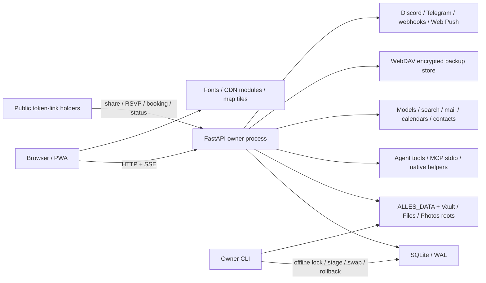

# Afterlife — current trust and compatibility map

- **Status:** code-audited and regression-locked
- **Scope:** behavior shipped on the current Afterlife branch
- **Privacy rule:** built from source and synthetic tests only; no private database, vault, mail, or file
  content was opened.

## Trust boundaries

| Area | Current boundary |
| --- | --- |
| Browser/PWA | Vanilla SPA, service worker, Cache Storage, IndexedDB, and browser storage. Some queued request bodies stay in the browser for later replay. |
| Direct browser network | Google Fonts, jsDelivr modules, and OpenStreetMap tiles can be requested directly by the browser instead of through Alles. |
| Server entry | Native starts bind to `127.0.0.1` by default. `ALLES_HOST` is the explicit widening control. Docker listens broadly inside the container; documented host publishing stays loopback-only. |
| Authentication | With auth off, anyone who can reach the port can use the app. With auth on, the current middleware requires the session cookie. A valid bearer token alone does not currently replace that cookie. |
| FastAPI process | One process owns HTTP/SSE routes, login state, scheduler, event bus, startup work, connectors, and most host integrations. |
| Host execution | Agent shell/Python tools, MCP stdio, Git, optional Docker/OpenCode/Ollama, and native helpers cross into host processes. A Project folder is priority context, not a security sandbox. |
| SQLite and configs | `aide.db` in WAL mode owns structured state. Model, mail, connector, MCP, DAV, and sensitive Settings credentials use field-bound encryption plus `secret.key`. |
| Managed files | Markdown Vault owns docs/notes. Files and Photos roots own their bytes. Uploads, Gallery, blobs, revisions, trash, research state, skills, and helpers default under `ALLES_DATA`. |
| External roots | Vault, Files, Photos, watch folders, Projects, agent workspaces, caches, and PhotoKit may point outside `ALLES_DATA`; recovery records but does not silently copy them. |
| Models/search | Prompts or queries cross to the selected model and search providers. SearXNG is currently a configured URL, not an Alles-managed service. Fetched pages and results are untrusted input. |
| Mail/calendar/contacts | IMAP/SMTP, CalDAV, CardDAV, and ICS feeds are separate remote systems. SQLite is local cache/state, not always the remote authority. |
| WebDAV backup | An owner-configured HTTPS collection is a separate external store. Alles sends only encrypted `.alles-backup` artifacts; it never sends the recovery-key file separately or in plaintext. Remote names and metadata are untrusted until validated. |
| MCP | Outbound stdio/SSE peers can return untrusted content; stdio inherits the server environment. Inbound `/api/mcp/rpc` currently reaches capability execution without the full chat-agent approval path. |
| Deliveries | Discord/Telegram are outbound only. Webhooks are signed, one-attempt deliveries. Web Push crosses external browser push providers. There is no inbound Jarvis Discord bot yet. |
| macOS | PhotoKit uses a separately signed helper with Photos permission. Calendar/Reminders import uses `icalBuddy`; Keychain is an unwired seam. |
| Background work | One sequential, process-local scheduler checks about every 30 seconds. Timing resets on restart; durable outcome claims exist where Phase 0 added them. |
| Recovery/update | Web routes may create, download, or upload encrypted artifacts and stage restores, but never live-swap data. The owner CLI holds locks, journals swaps, checks health, and owns rollback. Normal start fails closed while restore/update maintenance is unfinished. |

## Route snapshot

- 69 mounted route modules
- 680 HTTP method/path pairs
- 663 `/api/*`, 2 `/v1/*`, and 15 non-API shell/public pairs
- SHA-256: `dcd27050f28a45587c5154ddee4cea79a537b2f1c308ec49e2b851833ed664bc`
- No WebSocket route; long responses use SSE/streaming HTTP

Public routes are limited to the app shell/PWA, `/health`, optional `/status`, token shares and their
rate-limited password unlock under `/s` and `/sv`, plus public booking/RSVP reads and writes. The exact set is locked by
`tests/test_route_compatibility.py`.

## Hosts and deep links

The hub is the bare base host, such as `localhost:8000`. There are 20 canonical app subdomains:
`aide`, `mail`, `docs`, `gallery`, `calendar`, `tasks`, `subs`, `money`, `days`, `journal`, `activity`,
`system`, `watch`, `habits`, `read`, `books`, `health`, `files`, `contacts`, and `secrets`.
Compatibility aliases remain `notes → docs` and `photos → gallery`.

The baseline covers `?app=`, `?view=`, Aide `?ask=&web=1`, Docs/session hashes, Files `?p=&sort=&order=`,
Money `?m=`, Journal `?d=`, Activity filters, Obsidian links, and public share/booking routes. Exact host
ownership and parser markers are regression-tested.

## Current registered jobs

`read_feeds`, `holdings_price`, `blob_gc`, `clip_index`, `faces_index`, `user_model`, `insights`,
`subscriptions`, `day_events`, `automations`, `reminders`, `calendar_reminders`, `mail_outbox`,
`model_refresh`, `photo_watch`, `ics_subscriptions`, `carddav_auto`, `watch`, `personal_reconcile`, and
`proactive`.

## Known gaps kept visible

- S3 backup, scheduled backup runs, and general WebDAV/S3 Files browsing remain future work.
- Shell commands remain a separate, higher-risk boundary; approved file roots govern agent file tools,
  not arbitrary paths typed inside shell commands.
- Managed SearXNG, durable cron/heartbeats, and inbound Discord/Jarvis are future work.
- Current API tokens are not a substitute for the login cookie when auth is enabled.
