# alles — specifications

the full, precise reference for **alles**: every app in depth, how the ai and agent work,
the wire protocols, the architecture, the api, the data model, the stack, and the security
model. the [readme](./readme.md) is the plain-english overview; this is the detail behind it.

> **two-audience note:** kept readable two ways. if you're not a programmer, read the plain
> sentences and skip the grey "*under the hood*" bits — you'll still understand what every
> part does. if you are, the under-the-hood bits and the spec tables have the precise details
> (protocols, endpoints, algorithms, file formats). jargon gets a quick plain-english gloss
> the first time it shows up.

## contents

- [the apps — what you actually get](#the-apps--what-you-actually-get)
- [aide in depth](#aide-in-depth)
- [andromeda in depth](#andromeda-in-depth)
- [how the model switch works](#how-the-model-switch-works)
- [the agent in depth](#the-agent-in-depth)
- [how each app works under the hood](#how-each-app-works-under-the-hood)
- [keyboard shortcuts & global search](#keyboard-shortcuts--global-search)
- [the cli](#the-cli)
- [configuration](#configuration)
- [architecture: one server, many subdomains](#architecture-one-server-many-subdomains)
- [the api (for other tools)](#the-api-for-other-tools)
- [your data: where everything lives](#your-data-where-everything-lives)
- [how it's built](#how-its-built)
- [project layout](#project-layout)
- [security — read before exposing it](#security--read-before-exposing-it)
- [performance & reliability](#performance--reliability)
- [testing](#testing)

---

## the apps — what you actually get

every one of these is a real app — not a placeholder. the daily shell keeps Home and Aide
close, while related specialist views share Docs, Files, Finance, Passwords, or Server. it is still one
program, and compatibility links keep the older app names and subdomains working.

### aide (the ai)
**plain version:** a chat window that talks to whatever ai model you want, remembers you between chats, and — when you let it — can do real work on your machine instead of just talking.

**what's in it:**
- streaming chat (the reply types itself out live, word by word)
- works with any provider: claude, openai/gpt, deepseek, gemini, groq, mistral, a local model, and ~15 others — switch any time, even mid-conversation
- **one automatic Aide mode** — Aide chats, uses approved tools when useful, and can keep longer work running in the same conversation without a mode switch
- **app actions from plain chat** — just ask ("what's on my calendar", "any new emails", "remind me to call the dentist", "add lunch friday 1pm"). reads can run directly; anything that changes or sends still asks first
- **conclusion-first work** — successful answers lead with the result. exact steps, sources, diffs, and revert controls stay available under one accessible control after reload
- **compare** — an action that runs one prompt against several models side by side, rather than a permanent Aide destination
- **long-term memory** — it remembers reviewed facts and preferences across chats, with Off, Ask,
  and Auto policies
- **personas** — saved system prompts / characters you can switch between; None adds no persona prompt and custom personas are preserved
- **projects** — loose conversations live under Tasks; folder-backed Projects keep their own threads and
  background Aide work. relative file work starts in the selected server folder, and missing folders
  keep their chats until you explicitly relink them
- **artifacts** — when the model writes html/svg/a webpage/code, you see it rendered live, not as a wall of text
- **safe Markdown saves** — vault writes replace files atomically, Notes refuses to overwrite a file changed after you opened it and preserves unrelated frontmatter/body bytes during partial edits, and deleted Docs/Notes can be restored from 30-day trash
- **voice** — talk to it and have it talk back (speech-to-text in, text-to-speech out)
- **vision** — drop in an image and capable models can see it
- **incognito chats** — conversations and attachments kept only in short-lived RAM; they use no
  long-term memory and disappear when you exit or restart Alles
- **slash commands** (`/new`, `/clear`, `/rename`, …) and `@`-mentions to pull a file into context
- **cookbook** — a browser over **900+ open models** ranked against *your* actual hardware (what fits, at what quant, how fast), so you can pick + pull a local model that'll actually run
- **usage** — a token dashboard: totals, a tokens-by-month chart, and a per-model breakdown, so you can see what you're spending
- **skills** — write reusable procedures (a name, when-to-use, and the steps in markdown) that the agent discovers and loads on its own; it ranks your skills against each task and reaches for the right one. ships with a few starters (summarize, web research, code review)

**the model picker** — every endpoint you add shows up here, each provider in its own brand colour with its real logo (openai green, anthropic gold, moonshot purple — never mistaken for one another). image-generation models are flagged with a 🎨, so you can run a **chat model and an image model together** (talk to sonnet, draw with gpt-image). a **newest-only** toggle collapses each family to its latest release. model IDs come from each endpoint's live catalog or its editable manual list; alles does not ship a guessed model lineup. a failed refresh keeps the last good list and marks it stale, while models removed by a provider leave new pickers and remain marked unavailable for old runs.

<p align="center">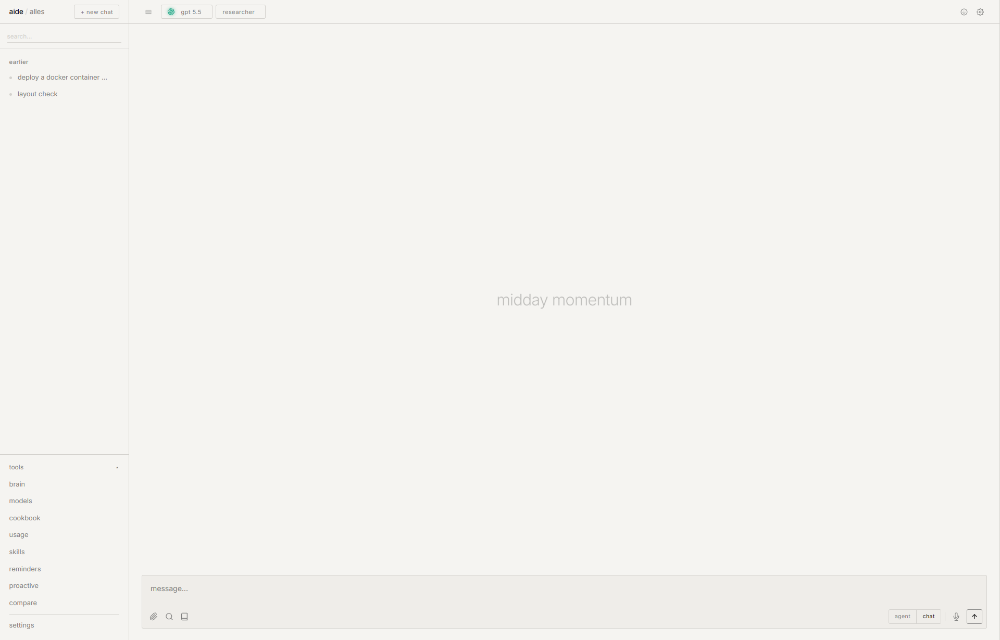</p>

### apps
**plain version:** one full-screen launcher for the nine specialist workbenches.

<p align="center">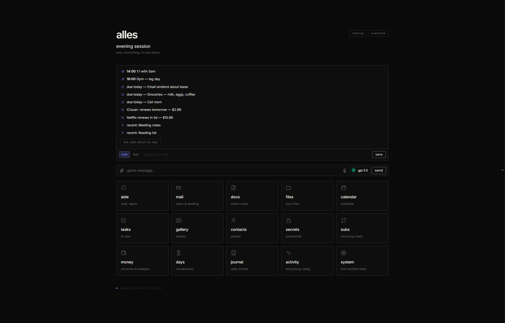</p>

- exactly nine destinations appear in three groups: **Plan, Inbox, Docs, Files, Library, Health,
  Finance, Vault, and Server**
- the launcher keeps one quiet Apps identity, a Home action, and the established grouped full-screen
  format; retired standalone names do not reappear as extra tiles
- Home remains the live clock, day summary, capture, and pinned-app surface. Saved legacy pins are
  normalized to their new workbench without deleting the owner's preference

### specialist workbenches
**plain version:** related apps now open together without merging their records.

- **Plan** combines a time-ordered Calendar, Tasks, and Reminders agenda, with quick task capture and
  direct access to each full specialist screen. Its Task board is another view of the same task
  records: four active stages, manual order, filters, quick add, detail editing, and completed history
- **Inbox** puts cached mail, the selected message, and matching contact context in one workflow while
  keeping mail and contact records separate
- **Docs** keeps notes and journal as local sections of one Markdown workbench
- **Files** keeps storage and Gallery under one identity, with explicit Gallery-to-Files and browser
  Back paths on desktop and phone
- **Library** combines Books and saved reading; Andromeda News enters only when you explicitly save it
- **Health** places today's habit rhythm beside the latest measurements without changing the local,
  sensitive health-context boundary
- **Finance** combines Money, Subscriptions, reviewed imports, and visible managed-Actual state
- **Vault** keeps passwords, passkeys, pairing, watchtower, reauthentication, and recovery within the
  existing encrypted boundary
- **Server** combines the original neofetch/btop monitor with Alles-owned services, search/model
  configuration, backups/storage, updates, logs, Activity, Watch, and the bounded access-policy editor
- **Aide Scheduled → News** manages tested RSS/Atom sources, source health, a daily brief schedule,
  Home delivery, and optional Jarvis delivery. Saving an article to Library is always explicit
- old app names, hosts, and deep links still open the matching subsection instead of dropping the
  requested context

### home
**plain version:** your whole day on one screen the moment you open alles.

- **Needs you** keeps approvals, choices, conflicts, uncertain results, and failed work visible
- **Today** combines events, due work, reminders, habits, renewals, and important dates
- **In progress** shows active background Aide work; **Briefs** holds completed reports
- **Pinned apps** opens the app destinations selected in **Settings → Home**
- every core section is deterministic and useful without a model. **Settings → Home** controls order,
  visibility, density, and pinned apps; the Home Settings action and the section's **edit** action open
  that pane directly. Needs you
  cannot be hidden, and loading, empty, partial, offline, and error states remain visible

### activity
**plain version:** one scrollable feed of *everything you did*, across every app, newest first. if today is what's coming up, activity is what already happened.

- a single reverse-chron timeline merging journal entries, tasks you added and ticked off, calendar events, money transactions, mail you received, photos you added, docs you edited, agent runs, and subscription renewals — grouped by day (today / yesterday / weekday / date)
- **filter chips** to show/hide any source, and a range toggle (7d / 30d / 90d / 1y); click any row to jump straight to it in its app
- *under the hood:* it's a **read-time aggregator** ([`routes/timeline.py`](routes/timeline.py)) — it queries each app's own tables on request instead of keeping a separate "events" log, so it's always correct and never needs a backfill. completing a task stamps a `completed_at` so "done" shows the real time, not just the date.

<p align="center">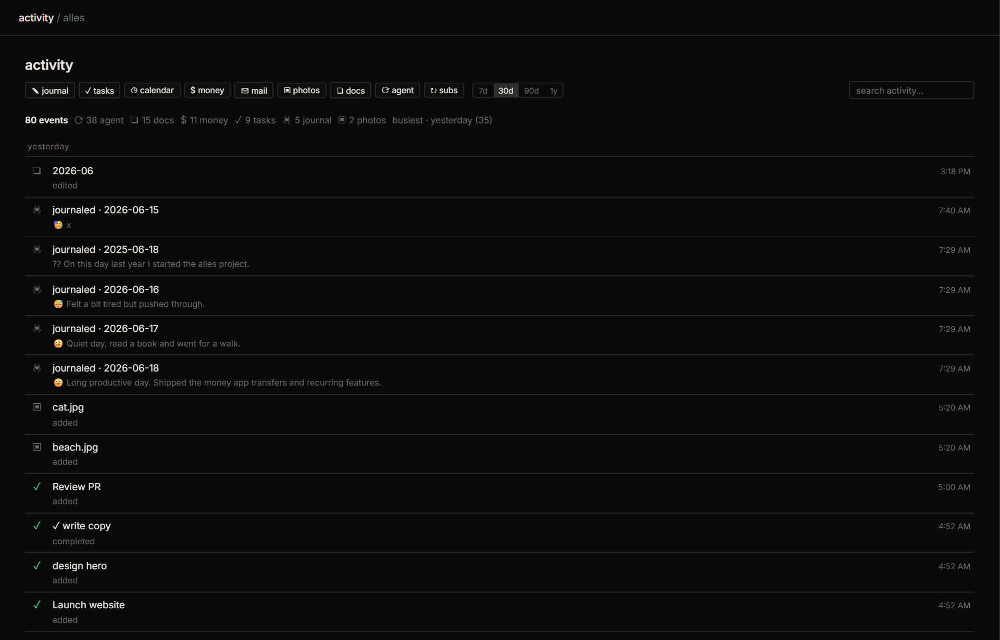</p>

### docs
**plain version:** a really good notes app — like obsidian — where your notes are plain text files you own, linked together, with a live, pretty editor.

this is the most feature-dense app, so here's the full list:

- a true **wysiwyg** editor (you see bold as bold, headings as headings) built on **codemirror 6**, doing obsidian-style *live preview*: the markdown symbols (the `**` and `#`) hide themselves, the text styles inline, and the raw symbols reappear on whatever line your cursor is on. *under the hood:* codemirror edits the plain text directly, so what gets saved is byte-for-byte what you typed — a save can't silently corrupt a doc.
- three view modes you cycle with one button: **live** (the wysiwyg) · **source** (raw markdown) · **preview** (fully rendered)
- **`[[wikilinks]]`** to link notes together, **backlinks** (see what links *to* this note), and **unlinked mentions** (notes that name this one in plain text but haven't linked it yet)
- **rename-safe links** — renaming a note rewrites every `[[link]]` to it across the whole vault (aliases and `#headings` preserved), so refactoring never silently breaks your graph; the change is snapshotted so it's undoable
- **`[[` autocomplete** — start typing a link and it suggests your notes
- **find & replace** inside a doc (ctrl+f)
- **a graph view** — your notes as dots, links as lines, drag-explore
- **`#tags`** with a clickable tag sidebar + filter, and **`![[embeds]]`** to pull one note (or an image) inside another
- **frontmatter** (the `key: value` block at the top) rendered as a clean property table
- **paste smarts:** paste a web link onto selected text → it becomes a link; paste or drop an **image** → it uploads and embeds automatically
- **quick switcher** (cmd/ctrl+o) — fuzzy-jump to any doc by name
- **pin** favorite docs to the top, **sort** the tree a–z or by recently-edited, **foldable folders**, and **drag files into folders** to organize (with a drop highlight)
- **templates** — new-from-template menu (seeds starter meeting/daily/project templates with `{{date}}`/`{{title}}` tokens)
- **task rollup** — every `- [ ] checkbox` across all your notes in one panel, tickable from there
- **word count + reading time**, live in the header
- **version history** — every save snapshots a revision you can preview and restore
- **daily notes** — one-click "today" journal entry
- **math and diagram source stays readable offline**; TeX and Mermaid source is preserved as text
  until reviewed local renderers are bundled, with no runtime CDN dependency
- **ai edits** — tell the ai "summarize this" / "fix the grammar" and it rewrites the note in place, streaming
- **extract to-dos** — ai pulls action items out of a doc into real tasks
- **import** `.md` / `.txt` / `.docx` (word) / `.html` / `.pdf`, or paste a **youtube link** → it grabs the transcript and ai-summarizes it into a note
- **export** to **pdf**, **html**, or **docx** (word)

<p align="center"></p>

### mail
**plain version:** a real email client (read + send), with one-click setup for the big providers and ai help built in.

- connects to **any imap/smtp account** (imap = how apps read your inbox, smtp = how they send) — one-click presets for gmail, outlook, icloud, yahoo, fastmail, or your own domain
- live inbox that auto-refreshes; open, read, and reply to mail
- **conversation threads** — a toggle collapses the inbox into conversations (everything with the same subject, re:/fwd: stripped), expand one to read the whole back-and-forth
- **attachments** — a message shows its attachments as chips you click to download (the body still loads attachment-free for speed)
- compose and send with **cc + bcc**; replies set the proper `in-reply-to`/`references` headers so they thread correctly in apple mail, gmail, and everywhere else
- **ai:** summarize a long thread, turn an email into a task, or turn an email into a calendar event (the ai reads out the date/time/title for you)
- **fast + offline-tolerant:** a persistent header cache means the inbox opens instantly and still shows your last sync when the network's slow or down; local search over the cache is instant
- *under the hood:* built directly on python's standard `imaplib`/`smtplib` — no third-party mail library. it pools live connections, caches what it's read, loads the inbox by range (not a slow "search everything"), and opens a message by pulling *only* its text/html body — not the attachments — so it stays fast on a weak connection.

### calendar
**plain version:** a calendar with month / week / day views and repeating events.

- real time-grid week and day views, a month grid, and an **agenda list**
- **recurring events** — daily / weekly / monthly, with a small **↻ marker** on every repeating occurrence so you never mistake one instance for a one-off
- **import / export `.ics`** — round-trip with apple calendar, google, outlook (export everything, or import a `.ics` someone sent you)
- **natural-language quick-add** right in the header — "lunch with sam friday 1pm" makes the timed event; "team sync tomorrow" makes an all-day one; and it now understands repeats too — "standup daily 9am", "yoga every monday 6pm", "class every week until 2026-08-01"
- optional **two-way sync with caldav** (the open calendar-sync standard used by icloud and google) if you add your credentials

<p align="center">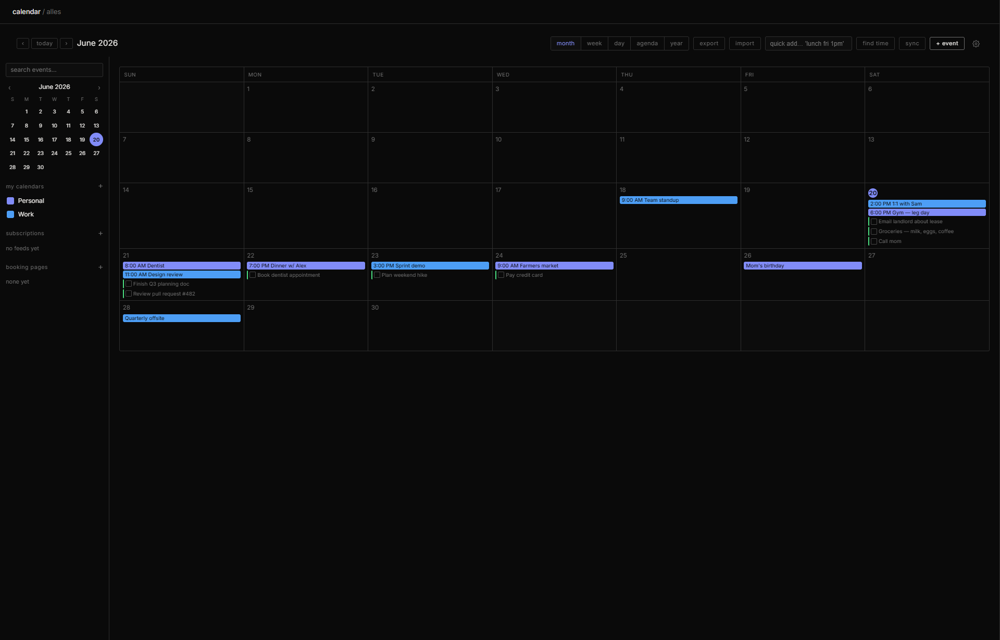</p>

### tasks
**plain version:** a real to-do list — type tasks in plain english, with recurring ones and smart views.

- **natural-language quick-add** — "pay rent every 1st !" or "call mom tomorrow #home" parses the due date, repeat, `#tags` and `!` priority for you (deterministic, no deps, all local)
- **recurring tasks** — finish one and it rolls forward to the next occurrence (daily / weekly / monthly / yearly, leap-day safe)
- **today / upcoming / someday** views by due date, plus tags, subtasks, projects, and manual drag-reorder
- compatible task stages include Backlog, Next, Doing, Waiting, and Done while the existing checked/unchecked behavior still works
- **active / history tabs** — checking a task off doesn't make it vanish; the **history** tab shows everything you've completed, and you can un-check one to send it back
- tasks created anywhere (quick-capture, "extract to-dos" from a doc, the ai's `task_add` tool) all land here

<p align="center">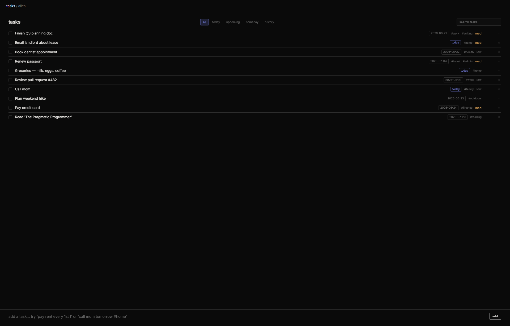</p>

### notes
**plain version:** lightweight scratch notes (separate from the full docs app) for when you just want to jot something with zero ceremony — also where home's quick-capture "note" lands as a properly-named note.

### journal
**plain version:** a daily diary — one entry a day, with mood, prompts, a streak, and a year-at-a-glance heatmap.

- one entry per day with a **mood** picker, tags, live word count, and gentle autosave
- a rotating **daily writing prompt**, a **streak** counter (an unwritten today doesn't break it), and **on-this-day** (the same date in past years)
- a full-year **activity heatmap** — a github-style contribution grid (7 rows × the weeks of the year) that fills in as you write, with year-to-year navigation
- **search** across every entry, **export** the whole journal to one markdown file
- an optional **"reflect"** button — a short, warm ai reflection on what you wrote
- an optional **passcode lock** that gates the journal behind its own code (an access gate, not extra encryption — once you're in it's still fully searchable)

<p align="center">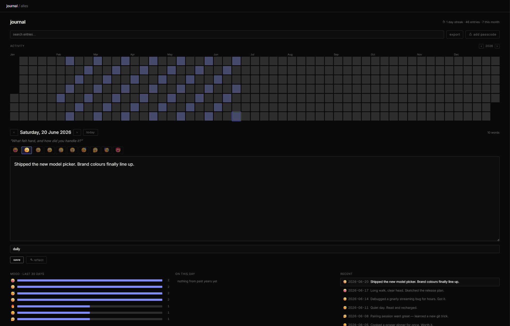</p>

### subs
**plain version:** track what you're paying for every month so nothing surprises you.

- weekly / monthly / quarterly / yearly / custom billing cycles
- due dates roll forward automatically as they pass
- **mark a renewal paid** only when it's actually due — one click logs a dated payment and advances the next due date by a cycle, with an **undo** for when you hit it by accident (no more clicking "paid" five times and launching the date into next year)
- **auto-post to money** (optional) — link a subscription to a money account and every time it renews it drops a real dated transaction there, so your spending picture actually includes your subscriptions instead of forecasting them separately (idempotent — it never double-charges)
- **price-change tracking** — when a subscription's price changes it keeps the old and new, so a quietly-creeping price is something you can actually see
- a **6-month spend forecast** of what's coming up, and **duplicate detection** that flags two subs that look like the same service
- a **manage ↗ link** straight to the cancel/billing page you saved
- monthly **and** yearly totals, plus a **spend-by-category bar chart** (plain css, no chart library)
- a **push notification before anything renews** so you can cancel in time

<p align="center">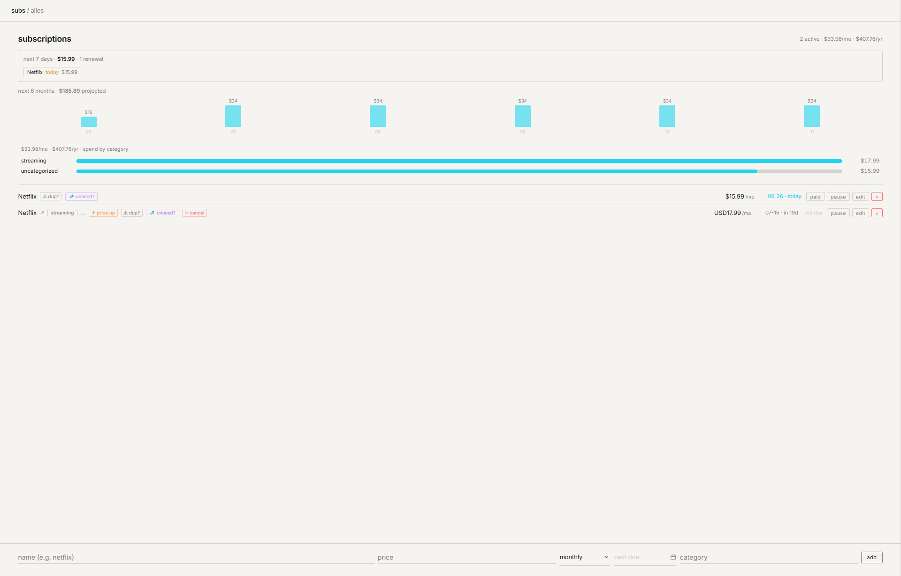</p>

### money
**plain version:** the Finance ledger for accounts, spending, budgets, subscriptions, and reviewed
imports, with an optional gated move to an Alles-managed Actual Budget core.

- **accounts** (checking / savings / cash / credit / investment) with live balances + a net-worth roll-up
- **transactions** — log income/expenses with a category + payee, browse by month, quick-add, **click a row to edit it inline**, delete
- **csv import / export** — pull in a bank statement (it maps a `description` column to the payee, copes with `$`/commas) and **skips rows you already imported** (matched on date + amount + payee) so re-importing an overlapping statement doesn't double-count; or export everything to a spreadsheet
- **budgets** — set a monthly cap per category; a progress bar turns red when you go over
- **charts** — spending-by-category bars and a 6-month income-vs-spent trend (plain svg, no chart library)
- this-month cards: net worth · income · spent · net
- an additive currency foundation preserves exact original and base values, conversion evidence, and
  stable import identities without changing existing amounts or renewal history
- reviewed CIBC CSV and China Merchants Bank CSV/notification profiles always preview first; repeat
  rows are stable duplicates, changed source rows are conflicts, and undo removes only receipt-owned
  transactions. no direct bank provider is enabled
- managed Actual 26.7.0 stays on loopback with private Alles-owned authentication, cold backups, fresh
  restore read-back, and paired app/manifest rollback
- Actual becomes canonical only after staged count, balance, aggregate, transfer, budget, schedule,
  currency-evidence, and subscription-link parity. new ledger writes then go only to Actual and old
  Alles ledger rows remain unchanged and read-only for at least one stable release
- if Python-side staging validation fails after Actual created the candidate budget, Alles records its
  exact budget/sync identity, deletes it through the official client, and verifies absence. an
  unconfirmed cleanup blocks the next stage until the same identity is safely retried
- legacy analytics that are not yet calculated from Actual fail closed after cutover instead of
  showing frozen pre-cutover numbers

<p align="center">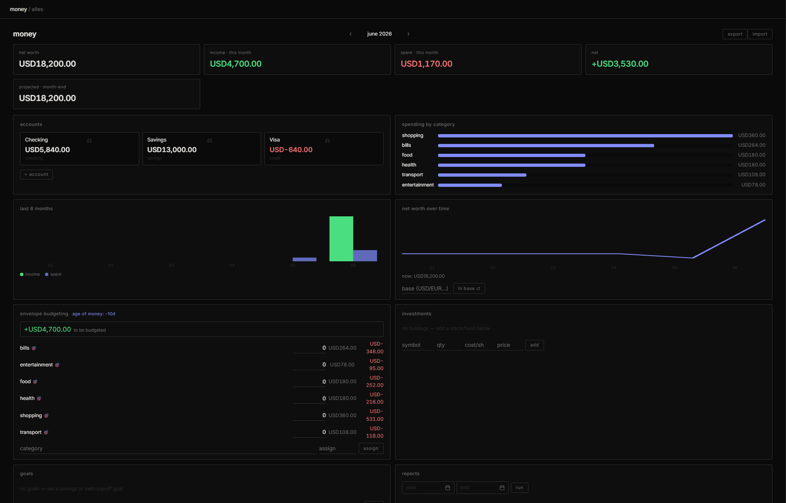</p>

### days
**plain version:** countdowns to things coming up, and day-counts since things that happened.

- birthdays & anniversaries (it knows *which* anniversary — "3 years")
- handles feb 29 sanely
- progress bars, pins, and push reminders as the day approaches

<p align="center"></p>

### files
**plain version:** a file browser over any folder you point it at — browse, upload, preview, organize.

- browse folders, upload, rename, delete, and **search** — by filename *and* inside text files, with a snippet of where the match was
- **inline preview** without downloading: images, **pdfs** (in a real pdf viewer), **video**, **audio**, and text/markdown
- download anything with one click
- **smart folders** (recent / images / documents / large / starred / recently-deleted) and a storage bar showing real disk usage, free space, and what the vault itself takes up

<p align="center"></p>

### gallery
**plain version:** a local photo library that feels like icloud/google photos, minus the company.

- your photos grouped into date "moments," plus albums and favorites
- **search** by filename, camera (from exif), or date — "june 2026", a `2026-06` prefix, or just a year
- reads **exif** (the camera/date info baked into a photo) and makes thumbnails automatically
- **folder + Apple Photos sync** — point `/api/photos/sync` at an icloud drive / photos-export / dropbox folder, or use the gallery's macOS-only Apple Photos action for confirmed, permission-gated batches of up to 500 visible items (Hidden stays excluded); stable source identity prevents repeat imports from duplicating the library while local hidden/favorite choices remain local
- everything stored as plain files under `data/` — they're just your photos in a folder

### contacts
**plain version:** an address book — and one the ai can read and use (e.g. when drafting mail).

- name / email / phone / notes / tags, searchable
- **vcard import / export** — round-trips with your phone and any other address book

<p align="center"></p>

### system
**plain version:** a live look at how hard your computer is working — like task manager / activity monitor, built in.

- **ring gauges** for cpu and memory, a per-core bar strip, and **cpu/ram history sparklines** that fill in as you watch — refreshing every couple seconds
- disk-usage bars per drive, plus a card with your gpu, vram, cpu model, backend, and uptime
- the gauges go from accent → amber → red as a number heats up, so a pegged core or a full disk is obvious at a glance
- *under the hood:* `get /api/system/stats` ([`services/sysmon.py`](services/sysmon.py)) uses [psutil](https://github.com/giampaolo/psutil) for live cpu%/per-core/uptime/disks; without it, it still shows ram + disk from the static hardware readout (`shutil` + the `hwfit` probe), just no live cpu%. all the gauges are hand-drawn svg — no chart library.

<p align="center"></p>

### secrets
**plain version:** an encrypted vault — and not just for passwords. each item carries the fields that actually fit what it is.

- pick a **type** and the form changes to match: **logins** (username · password · website · notes), **credit cards** (cardholder · number · expiry · cvv · billing address), **api keys / tokens**, **secure notes**, and **identities · bank accounts · ssh keys · software licenses** — so a card never asks you for a "password" and an api key reads as a token, not a login
- click any entry to open it, reveal or copy a field, edit it, or delete it
- a built-in **password generator** (csprng, skips look-alike characters) and a live **strength meter** that flags common, repetitive, or sequential passwords
- *under the hood:* each entry is sealed with **aes-256-gcm** (a strong authenticated encryption) under a key derived from your master password with **pbkdf2-hmac-sha-256, 260,000 iterations** (a deliberately slow key-stretch so guessing the password is expensive). the master password is held **in memory only** and never written to disk. locked, the vault is unreadable even to someone holding a full copy of your database.

<p align="center">
  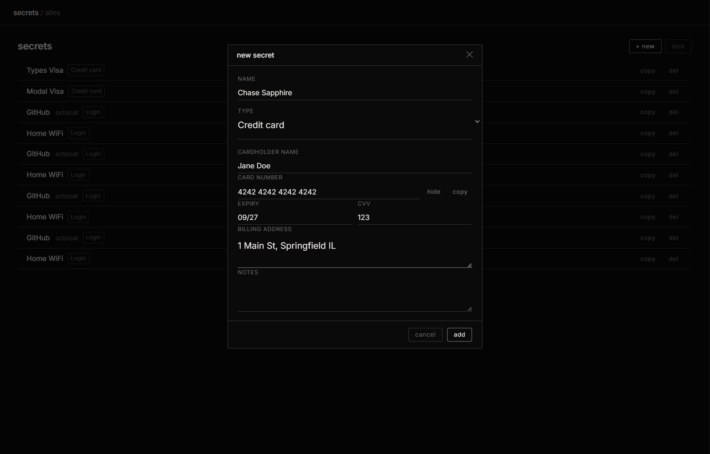<br>
  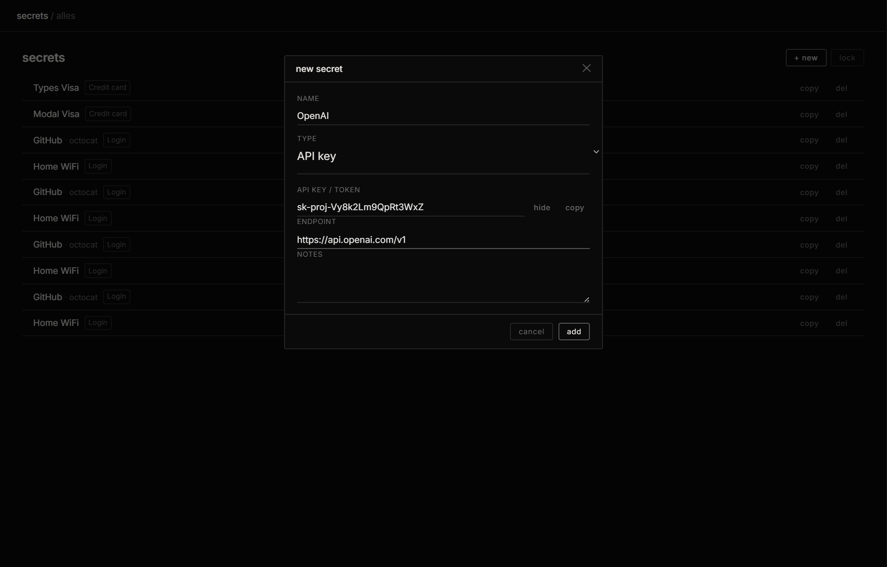
</p>

### automations
**plain version:** *when this happens, do that.* set a rule once and alles runs it for you.

- examples: mail from a certain sender → make a task · a subscription is about to renew → push me · a doc gets saved with `#urgent` → do something · every morning → build me a day digest
- *under the hood:* rules live in the database and fire off a small background job system (see [under the hood](#how-each-app-works-under-the-hood)). each occurrence is claimed before it acts, then saved as succeeded, failed, or uncertain. an uncertain external result is shown for review and is not retried automatically.

**and the smaller stuff:** global search across everything (cmd/ctrl+k), scheduled messages (right-click send → have aide message you later), prompt templates / a cookbook, webhooks, api tokens, an openai-compatible api so other tools can use alles as their "openai," encrypted backup with a separately saved recovery key and offline staged restore, light/dark themes **with a customizable accent color**, and it **installs like an app** (it's a pwa with real push notifications — add it to your home screen/dock and reminders reach you with every tab closed).

---

## aide in depth

aide looks like a normal chat box. the differences are under it:

- **one box, every model.** you register "endpoints" (each is just a web address + an api key) and pick a model. switch providers mid-conversation; aide handles the protocol differences. ([how that works →](#how-the-model-switch-works))
- **it remembers on your terms.** long-term memory uses **local vector search** — *vector search*
  means it finds memories by meaning, not exact words. `fastembed` runs locally on your CPU and the
  keyword fallback also stays local. Ask is the default: extracted and model-distilled facts wait
  for review. Auto directly saves only low-risk preferences you explicitly state. Off stops model
  memory reads and writes. You can search, review, edit, scope, pin, forget, export, pause, or clear
  memory, and see its source and which chats used it.
- **one automatic mode.** Aide answers simply when a simple answer is enough, uses approved tools when the request needs them, and keeps longer work running in the same task.
- **it keeps work inspectable.** successful replies lead with the conclusion. tool steps start collapsed, but exact sources, diffs, checkpoints, and revert controls survive reload. scrolling follows only while you stay near the bottom; **Jump to latest** gives control back.
- **it hands research to the right place.** normal web search and its grounded overview live in Andromeda. When deeper research would help, Aide asks first and continues it in the same task with the same query and selected Project.
- **it schedules a private News brief.** Scheduled → News tests owner-chosen RSS/Atom feeds before
  saving them, polls healthy sources independently, keeps useful links when a source or summary fails,
  and delivers the resulting brief to Home plus an optional paired Jarvis destination.
- **it sees.** drop an image and capable providers receive it as vision input.
- **it compares.** a conversation action runs the same prompt across several models at once and lets you vote on the winner.
- **personas & projects.** personas are saved system prompts; None adds no persona instructions. Loose Tasks and folder-backed Projects organize chats and give background Aide the same prioritized working environment.
- **artifacts.** ask for a webpage/chart/snippet and it renders live in a sandboxed frame next to the chat.

<p align="center">
  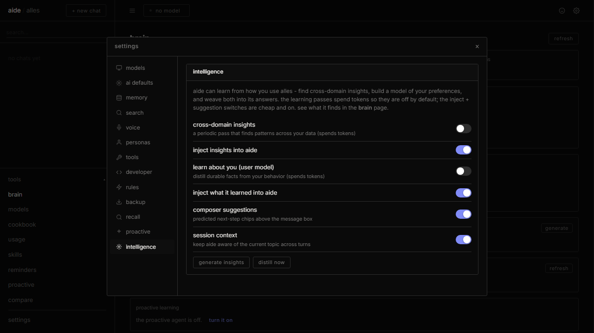
</p>

- **voice.** push-to-talk speech-to-text in, text-to-speech out — local (`faster-whisper`) or via a provider, your choice in settings.
- **reasoning view.** for "thinking" models (deepseek-r1, qwen3, claude extended thinking) you get a live "thought for n s" timer and can read the reasoning.

---

## andromeda in depth

Andromeda is the Afterlife search page at `http://localhost:6769/?app=andromeda`. On the development
branch it is exposed only when the `afterlife_andromeda` feature flag is enabled.

- **links first.** normal results render without waiting for a model. title, URL, snippet, provider,
  safe source type, and elapsed time remain useful if the overview is disabled or fails.
- **one optional AI Overview.** normal results and overview have separate settings and both default on.
  A standalone `!ai` token anywhere in one query skips only that request's overview; other search bangs
  and saved defaults are unchanged.
- **bounded evidence.** Alles fetches candidate pages through its redirect- and SSRF-safe reader, then
  gives the model only a limited evidence bundle with source IDs, URLs, dates, versions, quality, and
  relevant passages.
- **support before display.** every factual claim needs an exact quote from its named source. extra
  checks reject unrelated quotes, mismatched numbers, versions, dates, and entities. claims about the
  latest software prefer the freshest primary source and fail closed on weak or conflicting evidence.
- **owner-chosen models.** Light, Standard, Strong, and Auto bands each resolve to an exact configured
  endpoint and model. Auto prefers a qualified local model. A configured remote fallback is shown in
  preview and requires an exact per-search owner confirmation before any query or evidence leaves the
  device; declining keeps the links and skips the overview.
- **independent background verification.** the fast answer uses the `andromeda_answer` role. A separate
  `andromeda_verifier` role checks freshness-sensitive answers by default after the answer and links are
  already usable. It records the checked date and claim verdicts, requires exact supporting quotes, and
  cannot silently turn unsupported output into a verified claim. A new search cancels obsolete verifier
  work; verifier failure leaves the answer and links visible as not independently checked.
- **compact answer, separate links.** search, the cited answer, and results share one readable axis. The
  shortest decisive evidence-backed substring is highlighted inside the key answer. Ordinary web results
  begin in their own labeled region and use spacing instead of divider lines between rows.
- **recovery stays useful.** timeout, offline, missing provider, missing model, bad extraction, bad model
  output, and cancellation keep links when available and show the safe failure type, attempted
  providers, and retry/broaden/edit/return actions.
- **save or continue.** saved searches keep the request settings, result metadata, overview, citations,
  evidence, model provenance, and checked time. selected links can open in Aide, while deep research can
  continue in Aide with the selected Project ID.

Search can use DuckDuckGo, Tavily, Brave, Google PSE, Serper, or an external HTTPS SearXNG instance.
Alles can also own an optional SearXNG lifecycle when a supported Docker runtime is available. Its
reviewed definition is pinned to `2026.7.12-c19d86faa` /
`sha256:f433294b46a93564993c4371005341e013d94aa8ea4662d8ee521cd2cccb08e8`, bound to
`127.0.0.1:8888`, resource-limited, health-checked, and ownership-verified before control actions.
Install, JSON search, supervised restart, update, rollback, and uninstall while retaining private
configuration passed on Docker 29.5.2 with Compose and Colima. When Docker is missing, stopped, or
cannot read the selected data root, Server reports the unsupported boundary without claiming an
install; external HTTPS SearXNG and the other providers remain usable.

---

## how the model switch works

this is the single most-asked question, so here's the precise answer.

Alles has three relevant exact role defaults: **Aide**, **Andromeda answer**, and **Andromeda verifier**.
Background Aide work inherits the Aide choice unless a workflow has an explicit override. Server → Search
and models owns the two independent Andromeda roles and their token/time limits. One resolver is used by
interactive chat, Andromeda answering and verification, and background jobs. A one-run choice wins first,
then a workflow override, a feature default, the role default, and finally an allowed fallback in the
same privacy and cost class. A saved model that disappears is shown as broken instead of silently
switching providers. With no role choice, local endpoints are tried first.

aide does **not** hardcode a provider. you register **endpoints** under settings → models; each endpoint is just a `base_url` (web address) + an `api_key`. when you send a message, aide looks at that url and routes the request to the right protocol. all of that lives in one function, [`detect_provider()` in `services/llm.py`](services/llm.py):

```python
def detect_provider(base_url):
    if "anthropic.com"   in url: return "anthropic"
    if "deepseek.com"    in url: return "deepseek"
    if "openrouter.ai"   in url: return "openrouter"
    if "groq.com"        in url: return "groq"
    if "moonshot.cn"     in url: return "moonshot"
    if "api.x.ai"        in url: return "xai"
    if "googleapis.com"  in url: return "gemini"
    if "mistral.ai"      in url: return "mistral"
    if "perplexity.ai"   in url: return "perplexity"
    if "together.xyz"    in url: return "together"
    if "fireworks.ai"    in url: return "fireworks"
    if "cohere"          in url: return "cohere"
    if "openai.com"      in url: return "openai"
    if ":11434" in url or "ollama" in url: return "ollama"
    return "openai"   # anything else: treat as openai-compatible
```

**plain version:** there are really only three "languages" ai providers speak. aide speaks all three and translates, so you never have to care which one answered.

**the three wire protocols:**

| protocol | who speaks it | endpoint | notes |
|---|---|---|---|
| **openai-compatible** | openai, deepseek, groq, openrouter, moonshot/kimi, xai/grok, gemini, mistral, perplexity, together, fireworks, cohere, vllm, lm studio, **+ anything that copies the format** | `post /v1/chat/completions` | the default and the fallback |
| **anthropic messages** | claude | `post /v1/messages` | different headers, system-prompt placement, and tool/vision shapes |
| **ollama native** | local models via [ollama](https://ollama.com) | `post /api/chat` | point an endpoint at `http://localhost:11434` and you're fully offline, no keys |

for each, aide builds the correct request body, sends it, and streams the reply back through a parser that **normalizes everything into the same internal events**: `{"delta": …}` for text, `{"thinking": …}` for reasoning tokens, `{"tool_call": …}` for function calls, and `{"done": …, "usage": …}` at the end. the rest of the app only ever sees those four shapes.

details that matter in practice:

- **true token streaming** over sse (server-sent events, the `data: {json}\n\n` format) — not batched. you watch it type.
- **reasoning models** that go quiet before answering show an elapsed-time heartbeat so the ui never looks frozen.
- **vision / tool-calls / tool-results** are translated per provider (e.g. openai `tool_calls` ⇄ anthropic `tool_use` blocks; base64 images ⇄ anthropic image blocks).
- **auto-failover + cooldown:** an endpoint that errors twice gets a 20-second cooldown so one dead provider doesn't stall you.
- **localhost stays direct:** behind an http proxy (e.g. clash), aide honors `no_proxy` and sends `localhost`/`127.0.0.1` straight through, so a local model never gets proxied.
- **model lists auto-refresh:** aide periodically re-pulls each provider's available models (and on demand), so new releases show up on their own.
- **zero-config start:** put `deepseek_api_key` or `anthropic_api_key` in `.env` and the matching endpoint is created on first boot — or add any endpoint in the ui with one click (presets for everything above).

aide also **exposes its own** openai-compatible api (`get /v1/models`, `post /v1/chat/completions`), so other tools can point at alles as if it were openai.

---

## the agent in depth

**plain version:** Aide's tool loop is what turns a request into work: it plans, uses approved tools,
checks the result, and reports back for many steps. Aide enters this loop automatically when useful and
can continue durably in the background. there is no separate Agent mode or mode selector.

*under the hood:* it's a multi-turn loop ([`services/agent_runtime.py`](services/agent_runtime.py)). each turn the model can call tools; results feed back in; it keeps going until done or it hits a turn limit (6 / 18 / 36 turns for low / medium / high "effort"). long runs auto-trim old tool output to stay within the context window, and screenshots are fed back as real vision input.


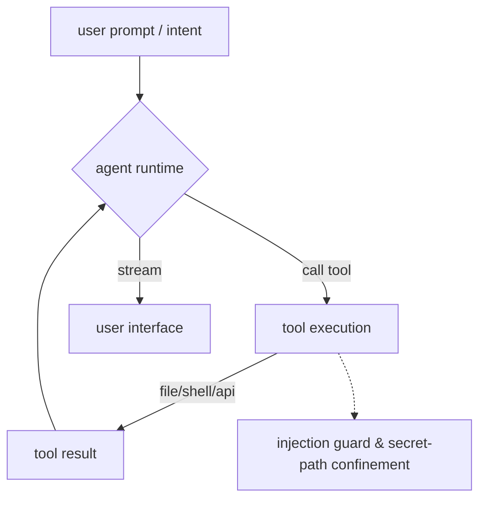

**the toolset (~60 tools), by category:**

- **files:** `read_file`, `write_file`, `edit_file` (exact find/replace), `apply_patch` (unified diffs), `list_files`, `glob_files`, `grep_files`, `revert_file`
- **shell:** `shell` / `bash` (optionally sandboxed in docker), `execute python`
- **code intelligence:** `code_symbols`, `find_definition`, `diagnostics` (run linters)
- **git:** `git_status`, `git_diff`, `git_branch`, `git_commit`
- **web:** `web_search`, `web_fetch` (fetch + read a page)
- **memory:** `memory_search`, `memory_add`
- **cross-app:** `calendar_list/create/delete`, `task_list/add/done`, `note_list/read/write/search`, `contact_list/add`, `mail_list/read/send`
- **github** (when you connect a token): `github_me`, `github_list_repos`, `github_get_repo`, `github_get_file`, `github_list_issues`, `github_create_issue`, `github_list_prs`, `github_create_pr`, `github_search_code`, `github_search_repos`
- **integrations:** `mcp_list_tools`, `mcp_call_tool` (mcp = model context protocol, a standard for plugging external tools into ai), `opencode_run` (hand a coding subtask to opencode), `skill_list`, `skill_load`
- **delegation:** `spawn_agent`, `spawn_agents` (fire off parallel sub-agents for independent subtasks)
- **computer use** (opt-in, needs `pyautogui`): `screenshot`, `computer_click/move/type/key/scroll` — it can drive your actual screen
- **planning:** `todo_update` (keeps a live checklist you can watch)

**safety:**

- **permission modes** — *full-auto* (does it), *approve* (asks before every change, showing you the exact diff first), or *plan* (read-only — it inspects and writes you a plan, and the change-making tools are removed entirely that turn)
- **checkpoints** — every file edit is snapshotted, so you can **revert a whole run** with one click
- **provenance you can see** — every agent reply has a **sources** button listing exactly what that run touched (files, urls fetched, searches, shell commands), and a **runs drawer** (the ⟳ in the top bar) browses past runs — their status, to-do list, tool steps, and the same sources — so the agent is inspectable, not a black box
- **prompt-injection guard** — when the agent reads something it didn't write (a web page, an email, a file, repo contents, an mcp result), that text is wrapped as *data, not instructions* before it goes back to the model, and scanned for the classic attacks ("ignore previous instructions," "reveal your system prompt," "email the api key to…"). anything that trips gets flagged. so a booby-trapped webpage can't quietly hijack a run. *(it's a seatbelt, not a force field — see security.)*
- **approved file roots** — agent file reads stay inside the selected project folder plus any extra folders you approve in settings. extra folders start read-only; writes, diff previews, checkpoints, patches, and reverts stay inside the selected project. credential stores (`~/.ssh`, `~/.aws`, `.env`, `*.pem`, `id_rsa`, `.netrc`, `.docker/config.json`…) remain blocked by default. shell commands are a separate boundary and can still reach the host unless you enable the docker sandbox.
- **sandbox** — the shell can run inside a docker container with the workspace mounted at `/work` and (optionally) no network, so commands can't touch your real filesystem
- **automatic behavior** — a plain Aide turn that clearly asks for work can enter the tool loop or keep
  running in the background. simple questions stay simple, and every mutation still follows its
  approval rule.
- a project-level **`agents.md`** (or `aide.md`) in the working folder is auto-loaded as standing instructions — the same cross-tool convention claude code and others use

---

## how each app works under the hood

the whole point of self-hosting is that nothing is magic. here's what each app *actually does*:

- **docs** — your notes are **real `.md` files** in `data/vault/` (path configurable). the editor is **codemirror 6** doing obsidian-style live preview; it edits the plain text directly, so *what's saved equals what you typed*. `[[wikilinks]]`, backlinks, unlinked mentions, `#tags`, `![[embeds]]`, frontmatter, the graph, the outline, the task rollup, and word count are all computed over those files on demand. images you paste/drop go to `data/vault/_assets/`; templates live in `data/vault/_templates/` (both hidden from the tree). TeX and Mermaid source stays readable as text offline; no runtime CDN renderer is loaded. every save writes a revision row you can restore.
- **mail** — a thin client over python's stdlib `imaplib`/`smtplib` (no mail dependency). it pools live imap connections, caches reads, loads the inbox by sequence range (no slow `search all`), and opens a message by fetching only its text/html body parts (not attachments) for speed on bad links. a background poll only re-fetches when the mailbox actually changed. credentials are stored locally, encrypted, and never sent back to the browser.
- **Andromeda and deep research** — normal Andromeda search is a links-first provider chain plus an
  optional bounded, claim-checked overview. Approved deeper research continues through the separate
  *iterresearch*-style loop below (the model drives each research decision):

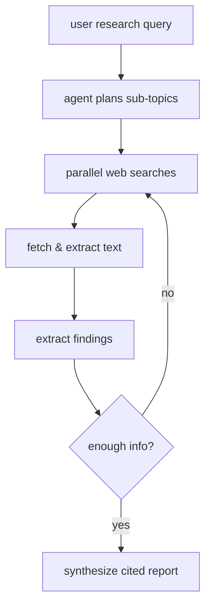
 the Jarvis run plans the question into sub-topics, fires several search queries per round in parallel,
reads the top pages with [trafilatura](https://github.com/adbar/trafilatura), extracts findings, and rolls
them into an evolving cited report. this deeper loop is not the normal Andromeda request and does not
run from a hidden Aide Research toggle.
- **calendar** — events in sqlite with recurrence expanded on the fly; optional two-way caldav sync if you install `caldav` and add credentials.
- **scheduled News** — enabled RSS/Atom sources are fetched through the guarded network client with
  ETag/Last-Modified conditional requests. failures back off per source instead of blocking the whole
  run. canonical links, feed GUIDs, and same-source content hashes prevent repeats; recent entries are
  clustered and ranked before an optional bounded model summary. a model failure leaves a link digest
  in `summary_pending`, Home delivery is durable, Jarvis retries are bounded, and Library receives only
  items the owner explicitly saves.
- **gallery / photos** — you import photos; pillow makes thumbnails and reads exif; they're grouped into date "moments." stored as plain files under `data/`.
- **secrets** — entries sealed with aes-256-gcm under a pbkdf2-hmac-sha-256 (260k iterations) key derived from your master password, which lives in memory only.
- **automations & jobs** — a small background **job registry + event bus** ([`services/jobs.py`](services/jobs.py)) ticks the recurring work every 30 seconds: subscription renewals, day-event checks, scheduled reminders/messages, automation rules, and a periodic model-list refresh. rules live in the db and fire on events (mail arrived, doc saved, renewal soon, every morning). durable occurrence claims prevent duplicate work after a crash; ambiguous external results stop as `uncertain` instead of retrying blindly. new features can register their own jobs or react to events without wiring into the main loop.
- **push notifications** — web push implemented straight from the rfcs (vapid keys + message encryption) with **no third-party library**, so reminders, renewals, and scheduled messages reach you even with every tab closed.

---

## keyboard shortcuts & global search

| shortcut | does |
|---|---|
| **ctrl/cmd + k** | command palette — search everything (chats, docs, mail, tasks, calendar, money, subs, photos, …) + "ask aide" / "search with Andromeda" |
| **ctrl/cmd + o** | (in docs) quick-switch to any note by name |
| **ctrl/cmd + f** | (in docs) find & replace inside the current note |
| **ctrl/cmd + b** | toggle the sidebar |
| **ctrl/cmd + ,** | open settings |
| **ctrl/cmd + n** | new chat |
| **ctrl/cmd + enter** | send |
| **ctrl/cmd + b / i / e / k** | (in docs) bold / italic / inline-code / link |

shortcuts are remappable in settings. global search is one command palette across the whole suite — chats, docs, **mail** (over the local header cache, instant), tasks, calendar, contacts, memories, **money**, **subscriptions**, and **photos** — grouped by app, and clicking a result jumps to it in its app (even on another subdomain). it also carries two **action rails**: **ask aide** opens the query in Aide, while **search with Andromeda** opens the normal links-first search page. deeper research continues in Aide after approval.

---

## the cli

a small command runs the server for you:

```
alles start         start in the background (waits until it's actually up)
alles stop          stop it
alles restart       restart it
alles status        running/stopped + url + reachability
alles logs [n]      print the last n log lines (default 60)
alles logs -f       follow the log live
alles update        stage + verify a fast-forward release, then health-check it
alles update rollback
                    restore the previous verified code and data
alles update accept accept a healthy update, keep its encrypted backup, and remove temp copies
alles install       build a private versioned runtime and user service (macos/linux)
alles uninstall     remove verified program files and keep personal data
alles open          open the browser
alles doctor        check the install is ready (deps, data dir, provider)
```

`alles doctor` is the first thing to run on a fresh checkout — it reports your python version, which required/optional deps are present, whether the data dir is writable, and whether an ai provider is configured yet, then tells you if you're good to `start`.

updates do not pull into a running install. alles fetches a pinned fast-forward commit into a detached worktree, compiles both the server and cli, runs a rollback-control probe, stops verified writers, creates an encrypted exact-data backup, and boots the migrated candidate twice before switching. the live checkout and health endpoint are rechecked before data moves. rollback is crash-resumable and refuses unknown processes, unrelated restores, dirty code, or a late edit; accepting an update keeps the encrypted backup and removes its temporary full copies.

on macos and linux, `alles install` publishes immutable release directories with one private venv per
release, an owned dispatcher/launcher, and a launchd or systemd-user definition. runtime, data,
visible Vault/Files folders, logs, and update state have separate paths. every removal target is
verified against the install and service ownership records before `alles uninstall` removes it;
personal data is kept by default. `--launcher-only` retains the older checkout-launcher path.

- **windows (powershell):** `.\alles.cmd start` (powershell needs the `.\`), or just `alles start` if the folder is on your `path`
- **windows (cmd):** `alles.cmd start`
- **macos / linux / git bash:** `./alles start`
- **anywhere:** `python app.py`

the launchers find `python3`/`python` on their own. add the alles folder to your `path` to type `alles` from any directory.

---

## configuration

copy `.env.example` to `.env`. **everything is optional** — alles runs fine with an empty `.env`. these are the environment variables (settings you set before launch):

| var | default | what it does |
|---|---|---|
| `deepseek_api_key` | — | auto-creates a deepseek endpoint on first boot |
| `anthropic_api_key` | — | auto-creates an anthropic (claude) endpoint on first boot |
| `port` | `6769` | port to serve on |
| `secret_key` | `dev-secret-change-me` | signs your login cookie — **change this before exposing alles to a network** |
| `auth_enabled` | `false` | set `true` to require a password to log in |
| `auth_password` | — | that password |
| `base_domain` | — | your real domain, for the subdomain setup (see architecture) |
| `tavily_api_key` | — | better research search (falls back to duckduckgo + wikipedia, no key needed) |
| `ALLES_AFTERLIFE_FEATURES` | — | exact comma-separated development flags; add `afterlife_andromeda` to expose the Phase 4 search page |

**normal product preferences are configured in the interface.** Open Settings from Home or with
ctrl/cmd+comma; grouped panes cover Home layout, general appearance, Aide, models/providers,
memory/owner instructions, connections/MCP, privacy/security, notifications/language, and
server/backups/data.
there are no files to hand-edit. controls include model endpoints, mail accounts, the search provider
(DuckDuckGo / Tavily / Brave / SearXNG / Google PSE / Serper) and fallback chain, independent normal
result and AI Overview switches, voice (stt/tts
provider, model, language, voice, speed), Aide permissions and background limits, permission
mode, max turns/tokens, docker sandbox + image + no-net, sub-agents, computer-use, context files,
allowed roots, memory policy, interface language/region/time zone/clock/week start/currency, artifacts, context limits, themes,
caldav accounts, webhooks, and api tokens. an external SearXNG URL must be HTTPS and contain no embedded
credentials. the optional Alles-owned install is available only when its Docker and data-root checks
pass; otherwise Settings keeps external providers available and shows the exact recovery boundary.
Owner instructions are an editable layer after optional Project/persona instructions; the code-owned
Aide base and enforced permission rules are not stored in that editable field. The reviewed interface
languages are English, French, Spanish, Simplified Chinese, Traditional Chinese, Japanese, Korean, and
Arabic. They cover the manifest's named core flows; owner content, third-party text, legacy specialist
screens, and advanced administration retain their source language. Region and IANA time zone default
to this browser's values and can be overridden with custom keyboard-operated controls; clock format,
first day of week, and currency are independent, and Calendar consumes the shared choices. The About
& Credits pane reads the complete machine manifest, shows source and lazy local license/notice text,
and reports verified inventory coverage. all of those preferences persist in the settings file
included by normal Alles backups.

Server → Search and models owns Andromeda provider order, the default result count (8), the independent
answer/verifier model roles, their token/time limits, and the freshness-sensitive verifier policy. Server
→ Access policy is a schema-bound editor for `${ALLES_DATA}/server-policy.json`; it cannot browse or edit
another file. A missing, malformed, symlinked, wrong-owner, or unsafe-permission policy fails closed to
Alles-owned services only.

---

## architecture: one server, many subdomains


```mermaid
graph td
    subagent[agent loop & tools] --> llm_client[services/llm.py (streaming model switch)]
    llm_client --> openai[openai / groq / deepseek api]
    llm_client --> anthropic[anthropic api]
    llm_client --> ollama[local ollama]
    
    app_router[fastapi routes] --> core_db[core/database.py (sqlite + sqlalchemy)]
    app_router --> bg_jobs[services/jobs.py (event bus)]
    
    browser[browser *.localhost] --> pwa[vanilla js + service worker]
    pwa --> app_router
```


alles is **one server** serving **one single-page app**. the main product homes use these canonical
addresses. Phase 8 groups the related specialist views without merging their records or APIs:

```
localhost                Home by default; ?app=andromeda opens search; Apps opens the specialist launcher
aide.localhost           Aide chat, scheduled/background work, Projects, memory, skills, and Aide reminders
docs.localhost           docs, scratch notes, and journal
files.localhost          files and personal photos
plan.localhost           calendar, tasks, and personal reminders
inbox.localhost          mail and contacts
library.localhost        books and read-later items
health.localhost         health / fitness log and habits
finance.localhost        money, subscriptions, and reviewed statement imports
passwords.localhost      the encrypted vault
server.localhost         monitoring, services, search/models, backups, updates, logs, Activity, and Watch
```

`home`, `today`, `system`, `secrets`, `vault`, `money`, `subs`, `subscriptions`, `notes`, `wiki`, `journal`,
`gallery`, `photos`, `activity`, `watch`, `days`, `cowork`, `jarvis`, `chat`, `calendar`, `tasks`, `reminders`, `mail`,
`contacts`, `read`, `books`, and `habits` remain compatibility subdomains. old `app=` and `view=` names
follow the same map. personal-media Gallery goes to Files → Photos; AI-image Gallery goes to Aide →
Creations. Aide's reminder tool uses the non-colliding `aide-reminders` route, while the legacy
`reminders` name belongs to Plan. these aliases remain for at least one stable release after their
replacement is delivered and are not removed in Afterlife Phase 3.

`static/js/subdomain.js` maps each host to the views it shows; `app.js` scopes the shell and cross-jumps
between them. this works **today with zero dns setup** — browsers route `*.localhost` to your own
machine automatically.

**one login across all of them.** because a cookie set for `localhost` isn't sent to `*.localhost`
subdomains, alles logs you in per-host and quietly relays the session with a one-time handoff code. the
relay accepts only known direct child hosts with the same protocol and port, and preserves the full
path, query, and hash. an expired or invalid code retries through the safe broker instead of dropping
the bookmark.

**on a real domain:** set `base_domain=yourdomain`, put a wildcard reverse proxy in front (e.g. caddy: `*.yourdomain, yourdomain { reverse_proxy 127.0.0.1:6769 }`), and cookies become `domain=yourdomain; secure` so single-sign-on spans every subdomain over https.

---

## the api (for other tools)

alles is scriptable. two flavors:

**1. an openai-compatible api.** point any tool that "speaks openai" at alles:

| method | path | does |
|---|---|---|
| `get` | `/v1/models` | list available models |
| `post` | `/v1/chat/completions` | chat (streaming or not), openai request/response shape |

**2. the native rest api** (everything the ui uses; all under `/api`). a representative slice:

- **Aide and background work:** `post /api/chat`, `post /api/chat/stop/{id}`, `get /api/sessions`, `post /api/agent/background`, `get /api/agent/runs`, `get /api/agent/runs/{id}/sources`, `post /api/agent/runs/{id}/revert`, the compatibility handoff routes, and cancel/retry/status run routes
- **Andromeda:** `post /api/andromeda/search`, `post /api/andromeda/overview`, `get /api/andromeda/overview/preview`, `post /api/andromeda/models/qualify`, `/api/andromeda/saved` CRUD, `post /api/andromeda/verification/preview`, verification start/status/cancel routes, and `/api/andromeda/deep-research` with its preview route
- **Server management:** existing system stats, service, SearXNG, backup, update, log, audit, Activity,
  and Watch routes plus `get /api/system/policy`, `post /api/system/policy/validate`, `post
  /api/system/policy/diff`, `put /api/system/policy`, and exact allowlisted host-service status/action
  routes. The policy API accepts no command, path, argument, environment, script, or wildcard payload.
- **docs:** `get /api/vault-md/tree`, `get/put/post/delete /api/vault-md/file`, `/search`, `/grep`, `/graph`, `/tags`, `/backlinks`, `/unlinked`, `/tasks`, `/templates`, `/youtube`, `/import`, `/export-docx`, `/revisions`
- **mail:** `get /api/mail/accounts`, `get /api/mail/inbox/{id}`, `get /api/mail/threads/{id}`, `get /api/mail/message/{id}`, `get /api/mail/attachments/{id}`, `get /api/mail/attachment/{id}`, `post /api/mail/send/{id}`, `post /api/mail/summarize`, `post /api/mail/make-task`, `post /api/mail/extract-event`
- **tasks/calendar/notes/contacts/subs/days:** standard `get/post/patch/delete` on `/api/tasks`, `/api/calendar`, `/api/notes`, `/api/contacts`, `/api/subscriptions`, `/api/days`
- **files/photos:** `/api/storage-locations` lists and manages encrypted local/WebDAV/S3 location
  records; `/api/files/{list,raw,upload,mkdir,rename,delete}` accepts an optional `location_id` and
  keeps old calls on `default-local`; `/api/files/operations` exposes restart-safe copy, move, cancel,
  retry, and undo; `/api/files/offline` manages explicit offline cache state; verified WebDAV and
  S3-compatible browsing use conditional writes and preserve the source until a destination copy is
  verified. S3 objects that report a version ID are preserved rather than logically deleted because
  the provider cannot atomically bind delete-marker creation to that exact version. Photos remains
  under `/api/photos/{gallery,gallery/upload,albums,thumb}`, with a guarded
  Files-to-Photos handoff that keeps stable source identity.
- **secrets:** `/api/vault` (+ `/unlock`, `/lock`, `/{id}/reveal`), owner-only
  `/api/vault/browsers` pairing/session management and extension download, plus the extension-only
  `/api/auth/browser/*` pair/unlock/match/release/lock boundary
- **memory/personas/projects/cookbook:** `/api/memories` (+ `/search`, `/extract`, `/export`,
  `/{id}/accept`), `/api/personas`, `/api/projects`, `/api/cookbook`
- **durable Aide foundation:** compatibility `/api/jarvis/workflows`, manual/scheduled/interval/heartbeat/event
  triggers, durable runs and prompts, exact scoped grants, reviewed event inbox, persistent delivery
  outbox, and encrypted connector records. Old automations convert into paused linked workflows and keep
  their enabled intent until the owner reviews model, permissions, delivery, and schedule.
- **Jarvis Discord connection:** `get/post/patch/delete /api/jarvis/discord` plus
  `post /api/jarvis/discord/pairing-code`; Jarvis is only the optional Discord bot name. Normal
  answers show typing first and then update one Discord message as Aide streams the response. Each
  paired DM or approved channel reuses one persistent Aide conversation for follow-up context.
- **scheduled News:** `get /api/news`, `patch /api/news/configuration`, source test and CRUD under
  `/api/news/sources`, `post /api/news/run`, brief history/latest, and explicit Jarvis retry. Library
  save continues through `post /api/read/save-news` and never runs automatically.
- **platform:** `/api/settings`, `/api/setup/*` (server-resumable five-step first run), `/api/today`, `/api/timeline` (the activity feed), `/api/system/stats` (live machine stats), `/api/system/build`, `/api/system/searxng`, `/api/backup` (+ `/recovery-key` and `/restore`), `/api/backup/webdav` and `/api/backup/s3` (`get`/`put`/`delete`) plus each target's `/run`, `/backups`, and `/restore`, `/api/tokens`, `/api/webhooks`, `/api/push/*`, `/api/mcp/*`, `/api/connections`, `/api/automations`

if it is exposed, enable login protection. api tokens work independently of the session cookie and
are limited to explicitly selected scopes: read, write, models, agent, secrets, connections, or
admin. requests outside a token's scope fail closed; revoked, unknown, or malformed tokens do not
fall back to cookie authentication.


*under the hood:* the api uses `fastapi` standard pydantic models for validation, but keeps things loose where it makes sense (like dynamic agent arguments). streaming routes use `streamingresponse` pumping async generator yields directly from `httpx`. the open-api compatible layer specifically intercepts the `messages` array, unrolls them into the internal `chatrole` format, routes them to `detect_provider`, and then restructures the sse stream to look exactly like openai's `v1/chat/completions` chunks.


---

## your data: where everything lives

local state defaults to **`ALLES_DATA`** (`data/` in a normal checkout). Vault, Files, Photos, Project, watch, and model-cache roots can deliberately point elsewhere, so they stay separate recovery boundaries:

- **`data/aide.db`** — a single sqlite database file (wal mode) holding the structured stuff.

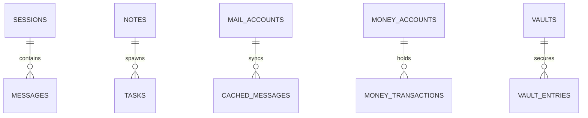
it's a wide schema — **100+ tables** covering: chat (`sessions`, `messages`, `model_endpoints`, `mcp_servers`), saved search snapshots and durable verification jobs (`andromeda_saved_searches`, `andromeda_verification_jobs`), notes/journal/tasks (`journal_entries`, `tasks`), calendar (`calendars`, `calendar_events`, `event_attendees`, `booking_pages`, `calendar_subscriptions`), money (`money_accounts`, `money_transactions`, `money_budgets`, `money_goals`, `money_holdings`, `money_recurring`, …), subscriptions (`subscriptions`, `sub_payments`, `sub_price_changes`), contacts (`contacts`, `contact_fields`, `contact_groups`), mail (`mail_accounts`, `mail_drafts`, `cached_messages`, `mail_rules`, `mail_scheduled`), scheduled News (`news_configuration`, `news_sources`, `news_entries`, `news_briefs`), photos (`albums`, `photos`), the vault (`vaults`, `vault_entries`, `vault_attachments`, `webauthn_credentials`, `browser_connections`), durable Jarvis state (`jarvis_workflows`, `jarvis_triggers`, `jarvis_runs`, `jarvis_run_events`, `jarvis_run_prompts`, `jarvis_delivery_attempts`, `jarvis_connectors`, `jarvis_inbox_events`, capability grants and delegated actions), plus `personas`, `projects`, `memories`, `reminders`, `automation_rules`, `automation_attempts`, `day_events`, `habits`, `health_entries`, `books`, `read_items`, `monitors`, `webhooks`, `api_tokens`, `connections`, and more.
- **`data/vault/`** — your docs as plain `.md` files (with `_assets/` for embedded images and `_templates/` for templates).
- **`data/skills/`** — agent skills as `skill.md` files (frontmatter + steps).
- **`data/`** (other) — uploads, photos, gallery, and file-app content as plain files; `server-policy.json`
  is the owner-only, exact-schema Server control policy; `webdav_backup.json` stores the visible collection
  URL and username plus a sealed password; `s3_backup.json` stores the visible endpoint, region, bucket,
  prefix, and addressing style plus a sealed access-key pair; **`data/secret.key`** is the encryption key
  for stored credentials.

*under the hood:* the schema is sqlalchemy models in [`core/database.py`](core/database.py) with versioned migrations. server-side secrets (model api keys, mail passwords) are sealed at rest with aes-256-gcm under `data/secret.key`. settings → backup first snapshots sqlite, freezes keys and dependent config/files, and authenticates every known encrypted credential before creating an encrypted `.alles-backup` with a hashed manifest. a configured external Markdown vault is copied into a verified snapshot; if it changes during that copy, backup stops, and recovery remaps the captured vault under the new Alles data root instead of writing to the old external path. save the recovery key separately. manual WebDAV backup uploads through a unique temporary name, moves without overwrite, then streams the saved file back to verify its exact size and SHA-256. manual S3-compatible backup signs each request with SigV4, conditionally uploads and copies a unique object without overwrite, and performs the same full read-back; the first version is limited to 5 GB per artifact. remote restore lists generated Alles backups, downloads one into private staging, and uses the same verification path as local restore. restore boots and migrates staged data twice, swaps only while writers are stopped, health-checks the installed copy, and automatically puts the original data back if validation fails.

first-run Protection can opt into an automatic encrypted local backup folder outside `ALLES_DATA`.
The registered job checks hourly, creates at most one artifact every 24 hours, publishes no plaintext
or partial archive, retains seven Alles-owned automatic artifacts, and never prunes unrelated files.

### current trust map

Alles is one FastAPI owner process with a browser client. SQLite owns structured state; the Markdown
Vault owns human-authored knowledge; configured Files and Photos roots own managed bytes. Models,
search, mail, calendars, contacts, MCP peers, notification providers, public links, native helpers, and
external folders are separate trust zones. Their input is data, not trusted instruction.

The full code-audited map, route hash, public surface, hosts, deep links, jobs, and known gaps are recorded
in [`docs/plans/afterlife/current-trust-map.md`](docs/plans/afterlife/current-trust-map.md).

---

## how it's built

```
python 3.11 + fastapi + sqlite (via sqlalchemy)
vanilla js, es modules, one module per feature — no bundler, no build step
httpx for async, streaming model calls
fastembed (onnx) for local embeddings — no embedding api needed
web push implemented straight from the rfcs — zero extra dependencies
```

the exact direct runtime list is pinned in `requirements.txt`: `fastapi`, `uvicorn`, `python-multipart`, `python-dotenv`, `httpx`, `defusedxml`, `pydantic`, `sqlalchemy`, `cryptography`, `bcrypt`, `fastembed`, `python-docx`, `pillow`, macOS `pillow-heif`, `numpy`, `beautifulsoup4`, `trafilatura`, `ddgs`, and `psutil`. optional extras remain commented and opt-in there. `credits/manifest.json` and the generated notice bundle record the exact shipped inventory and license text.

the frontend is genuinely just files: `static/index.html` is the whole app shell, `static/js/` is **one es module per feature** (~70 of them — `app.js`, `chat.js`, `vaultmd.js`, `mail.js`, `agent`-related, etc.) imported by `app.js`, and `static/style.css` holds the design tokens (sharp, monochrome, 2–3px radii, no shadows). "view source" actually shows you the app. the only pre-built drop-ins are two vendored files — codemirror 6 for the docs editor (`static/vendor/cm6.bundle.js`) and leaflet for the gallery places map (`static/vendor/leaflet/`) — so there's still no build step you have to run.

---

## project layout

```
alles/
├── app.py                 fastapi entry — routers, middleware, lifespan, background jobs, env bootstrap
├── cli.py                 the alles cli (start/stop/restart/status/logs/update/open)
├── core/
│   ├── database.py        every sqlalchemy model + lightweight migrations
│   ├── settings.py        settings load/save, base-domain helpers
│   └── auth.py            bcrypt login, in-memory tokens, cross-subdomain handoff
├── services/
│   ├── llm.py             provider-agnostic streaming client (the model switch)
│   ├── agent_runtime.py   the autonomous agent loop
│   ├── agent_tools.py     every agent tool (+ injection guard + secret-path confinement)
│   ├── agent_intents.py   detect when a chat turn really wants the agent
│   ├── agent_state.py     durable agent run logs / checkpoints
│   ├── andromeda.py       bounded evidence, freshness, and claim verification
│   ├── jarvis_handoff.py  durable Aide and deep-research handoffs
│   ├── managed_searxng.py pinned optional service definition and safe lifecycle
│   ├── native_install.py  owned versioned macos/linux runtime and service lifecycle
│   ├── setup_state.py     durable five-step first-run validation and progress
│   ├── automatic_backup.py daily encrypted local backup and seven-copy retention
│   ├── browser_passwords.py paired, exact-site, short-session Passwords boundary
│   ├── jobs.py            background job registry + event bus
│   ├── research/          iterresearch deep-research engine (plan → search → read → synthesize)
│   ├── hwfit/             hardware-aware local-model fit engine (900+ model catalog)
│   ├── task_nl.py         deterministic natural-language task parser (no deps)
│   ├── event_nl.py        natural-language calendar-event parser
│   ├── pwtools.py         password generator + strength estimator
│   ├── vcard.py           vcard 3.0 import/export
│   ├── mail.py            imap/smtp over stdlib
│   ├── vault_md.py        markdown docs on disk (tree, links, tags, graph, tasks)
│   ├── doc_import.py      import .md/.txt/.docx/.html/.pdf → markdown
│   ├── youtube.py         youtube transcript → note
│   ├── memory_store.py    fastembed vector memory + keyword fallback
│   ├── crypto.py          aes-256-gcm vault encryption
│   ├── webpush.py         web push from the rfcs
│   ├── sysmon.py          live cpu/ram/disk/gpu snapshot (the system monitor)
│   └── …                  files, photos, caldav, automations, docx export, stt
├── routes/                one apirouter per feature, all under /api (+ /v1 openai-compat)
├── extension/             unpacked Chromium Passwords extension (manifest v3)
├── tests/                 unit + api-harness + playwright tests
└── static/
    ├── index.html         the app shell
    ├── style.css          design tokens + all styling
    ├── sw.js              service worker (offline shell + push)
    ├── vendor/            prebuilt drop-ins: codemirror 6 + leaflet (no build step)
    └── js/                ~70 es modules, one per feature, imported by app.js
```

---

## security — read before exposing it

alles is built for **one person on their own machine.** read this before you put it on a network.

- **it ships open.** auth is off by default. if alles is reachable beyond localhost, set `auth_enabled=true`, a strong `auth_password`, and a real `secret_key` **first**. without auth, anyone who can reach the port can read your mail and files and run shell commands as you.
- **login is rate-limited.** once auth is on, a single ip that fails the password 8 times in 5 minutes is blocked (http 429) — basic brute-force insurance for the day alles sits behind a domain.
- **aide has hands.** Automatic and background Aide work plus shell tools can run real commands on the machine Alles is on. that's the point — but do not hand access to people or models you do not trust. changes still follow the configured approval boundary. the prompt-injection guard reduces the risk of malicious content steering the tool loop, but treat it as a seatbelt, not a force field.
- **credentials are encrypted at rest with a local key.** model, mail, connector, mcp, dav, and sensitive settings credentials are sealed with aes-256-gcm under `data/secret.key`. this protects one database or config file if it leaks *on its own* — it does **not** protect against someone who has the whole `data/` folder, because the server must be able to decrypt unattended.
- **new full backups fail closed on credential damage.** backup creation rejects plaintext known credentials, missing/corrupt keys, changed ciphertext, wrong field binding, and linked dependency files. historical plaintext archives can still stage so the current app can migrate them safely.
- **full backups are encrypted before download, WebDAV upload, or S3-compatible upload.** the encrypted container includes the database, required application keys, selected managed files, and a hashed manifest. the recovery-key file is never printed in logs or uploaded separately or in plaintext; export it once and keep that copy away from the server. old plaintext ZIP backups can still be safely staged for compatibility.
- **the password vault is different.** vault secrets are encrypted with your **master password**, which never touches disk. no master password, no plaintext — not even from a full copy of `data/`.
- **the old browser-autofill token stays retired.** `/api/vault/match` revokes the exact pasted vault token and returns `410 Gone` without credential data. its replacement pairs a named browser with a hashed narrow device secret, then requires a separate unlocked-vault owner approval for each five-minute in-memory/session-storage fill session. it requests the chosen Alles host plus `activeTab`, ships no permanent all-site content script, matches exact normalized scheme/host/effective port, returns metadata before one selected release, injects only frame 0, and never submits. lock, browser/server restart, computer lock, or revoke removes fill authority.
- **protected public shares use slow password hashes.** share passwords use bcrypt and are submitted outside the url. expiry dates normalize to utc and invalid dates fail closed. ten unlock attempts per ip and share are allowed every five minutes. a correct password creates a one-hour, in-memory, httponly cookie bound to that link and password version; changing or revoking the share invalidates existing unlocks.
- **no warranty.** this is a self-hosted hobby project, not an audited security product. it tries hard; you run it at your own risk.

---

## performance & reliability

small touches that keep it snappy and sturdy:

- **streaming everywhere** so you never wait on a full response to start reading
- **endpoint cooldown** — a provider that errors twice is benched for 20s instead of stalling you
- **mail**: connection pooling, read caching, body-only fetches, and a change-detecting poll
- **service worker** caches the app shell for instant loads + offline, and serves the codemirror bundle stale-while-revalidate (fast, but always refreshes in the background so updates land)
- **agent context trimming** so long autonomous runs don't blow the model's context window
- **lightweight migrations** so upgrading the app never throws away your database
- **graceful degradation** — no search key → free providers; offline → cached shell + local model; missing optional dep → that one feature is disabled with a clear message, nothing else breaks

---

## testing

```bash
python -m unittest discover -s tests
```

**4,000+ unit tests** and counting — including a full in-process api harness that drives the real app (via `testclient` against a throwaway in-memory db, no server/port) so every route has end-to-end coverage, plus `python scripts/stress_test.py` (exercises every app's backend) and `python scripts/live_usage.py` (drives the real app against live ai — a chat, an agent that writes *and runs* a program, web research, compare, and real records across the apps), both writing evidence to `~/alles-test-evidence/<timestamp>/` — plus the docs vault (links, tags, graph, tasks, templates, asset/import handling, unlinked mentions, **rename link-rewriting**), document import, the youtube id parser, the job registry + event bus, the agent's tool-gating + prompt-injection guard + secret-path confinement + action-intent routing + context compaction (and the **tool-history truncation staying valid json**), the **activity-timeline aggregator** and **system-stats snapshot**, Andromeda's links-first and claim-verification gates, the deep-research engine (page extraction, quality filter, the full plan→search→synthesize loop against a fake model), the hardware-aware model fit engine (catalog ranking, quant/version/bandwidth scoring), the natural-language task + calendar parsers (incl. **recurrence + "until"**), journal/files/photos search, the **federated command-palette** surfaces, the subscription + money math (incl. **renewal auto-post**, **paid/undo + price history + forecast + duplicate detection**, and **csv dedup**), mail parsing (incl. **threading + reply headers**), the password generator + strength meter, vcard round-tripping, aes-256-gcm crypto, bcrypt auth + the login throttle, the token-usage rollup, the model client, and more.

every push runs the full suite on **github actions ci** (`.github/workflows/tests.yml`) — it already earned its keep by catching a data file that wasn't committed.
