# alles — specifications

this is the technical side of alles: what runs where, which part owns the data, how requests turn into work, and what happens when something fails. the [readme](README.md) explains what it's useful for and how to start it. this file covers the implementation behind that.

the explanations come first, followed by complete api, table, migration, job, tool, and settings inventories.

## contents

- [runtime and backend](#runtime-and-backend)
- [frontend and offline state](#frontend-and-offline-state)
- [write safety and ownership](#write-safety-and-ownership)
- [integrations and background work](#integrations-and-background-work)
- [the apps — what you actually get](#the-apps--what-you-actually-get)
- [aide in depth](#aide-in-depth)
- [andromeda in depth](#andromeda-in-depth)
- [how the model switch works](#how-the-model-switch-works)
- [the agent in depth](#the-agent-in-depth)
- [how each app works under the hood](#how-each-app-works-under-the-hood)
- [keyboard shortcuts & global search](#keyboard-shortcuts--global-search)
- [the cli](#the-cli)
- [configuration](#configuration)
- [architecture: one server, many subdomains](#architecture-one-server-many-subdomains)
- [the api (for other tools)](#the-api-for-other-tools)
- [your data: where everything lives](#your-data-where-everything-lives)
- [how it's built](#how-its-built)
- [project layout](#project-layout)
- [security — read before exposing it](#security--read-before-exposing-it)
- [performance & reliability](#performance--reliability)
- [testing](#testing)
- [complete endpoint inventory](#complete-endpoint-inventory)
- [database table inventory](#database-table-inventory)
- [migration inventory](#migration-inventory)
- [job inventory](#job-inventory)
- [tool inventory](#tool-inventory)
- [settings inventory](#settings-inventory)
- [environment inventory](#environment-inventory)

## runtime and backend

alles is one fastapi owner process with a browser client. it serves the shell, handles app requests, talks to configured providers, and runs the periodic job loop. enabled companions, model servers, terminal children, and the actual bridge are separate processes.

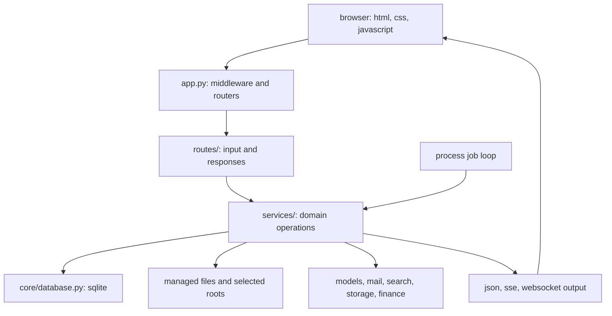
```mermaid
flowchart TD
    browser["browser: html, css, javascript"] --> app["app.py: middleware and routers"]
    app --> routes["routes/: input and responses"]
    routes --> services["services/: domain operations"]
    services --> db["core/database.py: sqlite"]
    services --> files["managed files and selected roots"]
    services --> providers["models, mail, search, storage, finance"]
    jobs["process job loop"] --> services
    services --> results["json, sse, websocket output"]
    results --> browser
```

the directories tell you where to look, but they are not perfectly isolated layers. some handlers still coordinate several operations, and `app.py` owns registration and startup orchestration. shared domain helpers let the browser, ai tools, and background jobs use the same validation and write rules.

### request path

host, https, authentication, cors, and observability checks surround the router. the selected handler validates input and applies dependencies before calling its domain operation. the database dependency supplies a sqlalchemy session; the operation controls commits, and the dependency closes the session afterward.

when authentication is enabled, the http gate protects `/api/` except auth entry points, plus `/v1/`. sensitive routes can also require recent owner authentication or a token scope. public shares and booking/rsvp links have their own checks.

streaming uses pure asgi middleware so the response is not buffered before display. [core/observability_middleware.py](core/observability_middleware.py) adds `x-request-id` and records status, duration, and write outcomes. [core/api_errors.py](core/api_errors.py) handles explicit structured errors; legacy routes also use standard fastapi responses.

### startup and shutdown

the lifespan in [app.py](app.py) rejects unfinished restore/update maintenance state, acquires the selected data root's instance lock, initializes sqlite, and runs migrations. it then recovers interrupted document writes, file transfers, offline copies, and trash operations.

automation, aide, delegated-action, and verification records are reconciled before periodic work begins. an interrupted external effect can become uncertain; it is not blindly repeated. eligible queued handoffs resume through their own recovery path.

startup also loads configured integrations, seeds defaults, starts photo backfill, connects mcp peers, launches the periodic loop and optional discord connection, and runs an endpoint connectivity probe. shutdown cancels owned background tasks and releases the lock.

run one application owner per data root. session tokens, registry jobs, and several caches are process-local; durable runs, prompts, receipts, and recovery journals live in database rows or managed files. independent workers change those assumptions.

### sqlite and migrations

the default database is `ALLES_DATA/aide.db`; `ALLES_DB` can override its location. [core/database.py](core/database.py) configures wal mode, foreign keys, a 5,000 ms busy timeout, normal synchronous mode, about 16 mib of page cache, and in-memory temporary storage. sqlalchemy uses `check_same_thread=False` and sessions with automatic commit/autoflush disabled.

a local transaction can make related sqlite changes atomic. it cannot atomically include a remote api operation or an arbitrary external filesystem writer.

[core/migrations/runner.py](core/migrations/runner.py) discovers migrations in version order and records successful history in `schema_migrations`. history validation includes the known photos migration fork. failed migrations propagate instead of recording success; the baseline has an explicit idempotent rerun policy.

the table inventory covers 121 declared sqlalchemy tables; `schema_migrations` is an additional runner-created table. json fields and string ids can carry application-level links that are not declared foreign keys.

schema declarations live in [core/schema/](core/schema). its package registers every model on one `Base` before mapper configuration or schema creation. `finance.py` owns ledger, import and authority records; `files.py` owns storage identities, operation claims and their triggers. the remaining related records stay together in `application.py`. existing callers still import models and sessions through `core.database`.

[core/startup.py](core/startup.py) owns the database initialization order: create declared tables, set the application id, run versioned migrations, seal database credentials, migrate settings secrets, then migrate caldav, carddav, s3 and webdav backup secrets. `core.database.init_db()` remains the entry point and supplies its current engine, including isolated test engines. [core/database_credentials.py](core/database_credentials.py) owns the credential write lock and reseal loop; the lock remains held through the outer session transaction and releases after commit or rollback. the application lifespan still owns restore/update guards, the instance lock and interrupted-work recovery before background jobs start.


## frontend and offline state

[static/index.html](static/index.html) loads shared css and native es modules from [static/js/](static/js). [static/js/app.js](static/js/app.js) owns boot and the common shell; feature modules keep their own request/render state. bundled browser assets live under `static/vendor/`.

[static/js/subdomain.js](static/js/subdomain.js) maps canonical hosts to views. [static/js/routecompat.js](static/js/routecompat.js) resolves old names while preserving destination context. ip/single-host deployments switch views on the same origin. cross-host localhost login uses a one-time handoff with destination, scheme, and port checks.

[static/sw.js](static/sw.js) caches the shell and selected resources. scripts and css prefer the network when online, with cached assets available offline. cached ui does not make every connected app work offline.

the indexeddb outbox stores selected eligible json mutations. it excludes multipart uploads, auth, model/agent execution, vault writes, durable transfers, finance authority changes, storage changes, and service/policy control. a queued response means stored for replay, not saved on the server.

replay is ordered; auth failures, conflicts, and blocked writes stay visible. unsafe older items can be quarantined. draft storage and queued requests have distinct states, and browser-storage failure needs a recovery action.

tasks use owner-scoped tab drafts. docs also have server-managed recovery drafts; failed draft persistence can block navigation that would discard the document. a draft, revision, queued request, and confirmed write are different things.

[design-system/](design-system) defines semantic tokens, components, custom controls, accessibility, responsive behavior, and motion rules. the current styles also contain legacy feature code. a control inventory is a source map, not proof that every screen already passes rendered qa.

### frontend ownership

`style.css` remains the baseline and legacy composition; `kokuen.css` follows it as the final product layer. keeping this order avoids changing the cascade while giving each rule a named owner. screen scopes use `:where(...)`, which adds no selector specificity.

| owner | rules and scope | change here for |
| --- | --- | --- |
| foundations | theme variables in `style.css`; semantic `--k-*` / `--ui-*` aliases at the start of `kokuen.css` | palette, type, spacing, motion and geometry |
| shared controls | `.btn`, `.settings-input`, `.custom-select`, `.chk`, `.seg`, `.s-switch`; v5 primitive geometry and state rules in `kokuen.css` | reusable interaction states and hit areas |
| shared form composition | `.s-card` and `.s-field` in `style.css` | cards used by Settings and Projects, fields used by Settings and the Skills editor |
| settings shell and panes | `#settings-modal`, with pane-local roots for Home, language, credits, providers and connections | modal layout and pane composition |
| Home | `#today-view` and its `.today-*` descendants | the daily ledger and capture layout |
| Finance | `#money-view` for ledger/card rules; `#finance-view` for Actual and import panels | amounts, forecasts, transactions, authority and import state |
| other workspaces | explicit screen roots, `body[data-app]`, `body[data-space]` and existing feature namespaces | the corresponding feature layout; keep shared controls outside these rules |

Finance's short private classes such as `.ms-card`, `.cat-row` and `.env-row` cannot style elements outside Money. summary cards fit as many readable tracks as the available width allows. large grouped numbers and cents stay intact; a currency prefix can occupy another line in a narrow card. dialog and dropdown roots retain their own styles because they can live outside a screen's DOM tree.

[static/js/settings.js](static/js/settings.js) owns modal navigation, the focus trap, close/reopen focus return and remaining small panes. [static/js/settings/](static/js/settings) owns independent Home, language, credits, backup, provider and connection panes. each initializes once, loads for its current opening and disposes transient reads/menu state when left. disposal retains draft fields and pending saves. a late read cannot overwrite a newer opening or edited form; saves retain their own status and error handling. `shared.js` keeps the existing ordered settings write queue, switch behavior, escaping and recent-owner authorization. backup staging and provider writes keep their different protocols rather than sharing a generic form framework.

the PWA precache walks nested modules and their exact import URLs, so a cold offline shell can load the same settings module graph. this caches the interface; it does not turn provider, backup or credential operations into offline writes.


## write safety and ownership

| data | current owner | constraint |
| --- | --- | --- |
| tasks, events, contacts, habits, health, reading, chats | sqlite/domain helpers | preserve validation, ids, and lifecycle rules across ui/tool paths |
| docs and scratch notes | configured markdown vault | compare the opened version, preserve unrelated bytes |
| journal | database with optional unlocked mirror | staging markdown copies does not switch authority |
| files | selected local/webdav/s3 location | serialize canonical identities and verify destination bytes |
| photos | sqlite records plus media root | stable source identity and local hidden/favorite state |
| local finance | sqlite ledger | supported retries use request receipts and tombstones |
| canonical actual finance | actual plus local links/sidecars | use the active authority rather than frozen local balances |
| credentials | sealed fields and relevant key | server, master-password, and recovery keys have different boundaries |
| workflows/delivery | durable runs, grants, intents, attempts | inspect uncertain effects before another external write |

[services/events.py](services/events.py) records mutations for its explicit tracked-model set. a successful listener inserts the event in the same database transaction as the record; post-commit subscribers are best-effort. listener failures are logged, so this is not a guaranteed event log for every row.

http audit metadata in [services/audit.py](services/audit.py) is separate from domain mutation events. activity/timeline aggregates current domain records at read time. [services/lifecycle.py](services/lifecycle.py) handles the models it lists; archive and timestamp-based trash have different semantics.

[services/document_safety.py](services/document_safety.py) owns hashes, conflicts, drafts, revisions, conditional replacement, and restart-safe rename transactions. [services/notes_vault.py](services/notes_vault.py) maps scratch notes into markdown while preserving unrelated frontmatter/body bytes during partial edits.

[services/storage_locations.py](services/storage_locations.py), [services/storage_backends.py](services/storage_backends.py), and [services/file_operations.py](services/file_operations.py) own storage identities and verified transfers. source/path claims coordinate alles writers; another filesystem program is outside those claims. an etag/hash mismatch must remain a conflict.

`file_operations` remains the single operation, durable-claim and undo/recovery coordinator. [services/file_operation_metadata.py](services/file_operation_metadata.py) owns one location/path/kind selector for rekeying, collision checks and Trash snapshots/restoration. operation callers retain transaction ownership for those changes; permanent purge preserves the existing version-asset cleanup contract. [services/file_operation_paths.py](services/file_operation_paths.py) owns item normalization and canonical remote claim identities without persistence. descriptor access, physical local identities and claim release stay beside recovery because their ordering protects concurrent replacements and surviving bytes. storage backends remain the adapters for local, webdav and s3 access.

[services/blobstore.py](services/blobstore.py) stores adopted attachments by sha-256 under `data/.blobs/<prefix>/<hash>`, with references for garbage collection. not every managed file has moved into that store, and it does not independently encrypt all blob bytes.

[services/finance_requests.py](services/finance_requests.py) supports stable-uuid local creates: identical retry returns the receipt, changed payload conflicts, and deletion retains a tombstone. [services/actual_finance.py](services/actual_finance.py) owns authority selection and guarded provider intents. after cutover, failed actual reads must show unavailable state instead of old ledger values.

## integrations and background work

| integration | implementation | boundary |
| --- | --- | --- |
| models/catalogs | [services/llm.py](services/llm.py), [services/model_providers.py](services/model_providers.py) | protocol formatting and live model ids |
| search/pages | [services/andromeda.py](services/andromeda.py), [services/net_guard.py](services/net_guard.py) | bounded evidence, quotes, guarded urls/redirects |
| mail | [services/mail.py](services/mail.py), [services/mail_compose.py](services/mail_compose.py) | imap/smtp, local cache, compose, sending |
| calendars/contacts | [services/caldav_sync.py](services/caldav_sync.py), [services/carddav_sync.py](services/carddav_sync.py) | configured synchronization |
| remote storage | [services/webdav_locations.py](services/webdav_locations.py), [services/s3_locations.py](services/s3_locations.py) | selected locations and conditional operations |
| remote backup | [services/webdav_backup.py](services/webdav_backup.py), [services/s3_backup.py](services/s3_backup.py) | encrypted artifacts and exact read-back |
| actual | [services/actual_bridge.py](services/actual_bridge.py), [integrations/actual/bridge.mjs](integrations/actual/bridge.mjs) | pinned official node client |
| bank aggregation | [services/finance_connectors.py](services/finance_connectors.py) | read-only simplefin/plaid, sealed credentials, stable provenance |
| mcp | [services/mcp_registry.py](services/mcp_registry.py), [services/mcp_server.py](services/mcp_server.py) | external peers and alles tool interface |
| discord | [services/jarvis_discord.py](services/jarvis_discord.py), [services/jarvis_outbox.py](services/jarvis_outbox.py) | pairing, persistent conversations, delivery |
| notifications | [services/webpush.py](services/webpush.py), [services/webhook_delivery.py](services/webhook_delivery.py) | push and configured webhook delivery |
| native helpers | [services/macos_bridge.py](services/macos_bridge.py), [services/photokit.py](services/photokit.py) | platform and permission gates |
| service control | [services/native_install.py](services/native_install.py), [services/server_policy.py](services/server_policy.py) | verified ownership and exact allowlisted host services |

### model and action decisions

[services/model_resolver.py](services/model_resolver.py) resolves exact endpoints/models with privacy/cost constraints. internal roles are `aide_chat`, `andromeda_answer`, `andromeda_verifier`, and `jarvis`. the interface presents aide plus independent andromeda roles; workflows can override background choices.

provider detection formats requests; catalog adapters fetch model ids. memory keeps reviewed facts and local embeddings with keyword fallback. personal indexes remain derived state owned by their source records.

[services/agent_runtime.py](services/agent_runtime.py) owns the multi-turn loop; [services/agent_tools.py](services/agent_tools.py) supplies schemas, dispatch, checkpoints, file roots, and untrusted-result handling. orchestration turn limits and provider reasoning effort are separate settings.

[services/delegated_actions.py](services/delegated_actions.py) stores permission decisions with general/project/workflow scope, exact argument hashes, prompts, expiry, and revocation. a registered tool name does not give every run authority to execute it.

[services/chains.py](services/chains.py) substitutes earlier outputs into later arguments and stops at failure. previous side effects remain unless their individual operation supports recovery; a chain is not a transaction across remote tools.

### job and delivery state

[services/jobs.py](services/jobs.py) provides process-local interval jobs and event handlers. the loop catches job failures and continues. configured intervals are scheduling targets, not guaranteed delivery times; the loop cadence and earlier work affect execution.

durable workflows separately store triggers, occurrence claims, runs, prompts, grants, and deliveries through [services/jarvis_store.py](services/jarvis_store.py), [services/jarvis_scheduler.py](services/jarvis_scheduler.py), and the inbox/outbox services. an interrupted external action can be uncertain even when its local run survives.

scheduled news has source health, conditional requests, deduplication, clustered entries, briefs, and delivery state. a summary failure keeps usable links. saving news to library is explicit; read-later feeds and scheduled news are separate jobs.

### domain helpers and recovery

subscription creates and paid renewals keep one request identity through uncertain retries.
the paid action also names its due date, so a stale action cannot pay another cycle. payment
history distinguishes a failed read from an empty history and offers refresh. undo names the
specific latest-created payment; an old retry cannot remove an earlier payment. deleted creates
and undone payments retain receipt tombstones. legacy callers without these optional fields
remain supported; canonical actual schedules and payments remain read-only here. detected
recurring charges fill a reviewable form and require an explicit add.

[services/book_items.py](services/book_items.py) shares book saves between the screen and aide, including status/dates/ratings. [services/health_entries.py](services/health_entries.py) validates finite measurements and real dates. [services/habit_logs.py](services/habit_logs.py) gives api and aide one canonical completion-day identity. ambiguous habit names require an exact id, and unsupported cadence is rejected.

health entry forms keep one save identity while a response is uncertain. retrying returns the existing
reading; changed values offer the saved entry for correction, and closing warns that the entry may
already be saved. new forms allow intentional repeated readings. create acknowledgments survive server
restarts and retain a content-free deletion marker so an old retry cannot recreate a deleted reading.
unsent health forms stay in the open page; their contents are not copied into browser storage.

csv imports keep their file and batch identity in page memory after an uncertain response. retry
checks the same batch; closing it warns before discarding that retry identity. the screen rejects
invalid values and dates before importing any rows. a blank date uses today; old api clients may
still skip invalid numeric rows and receive the skipped count. edits and deletes from the screen
include a stable record identity so a stale action cannot change a replacement with a reused id.
failed deletions offer refresh and a retry against the original reading.

health's default dates, habit grids and overview use the configured timezone, or the browser's
timezone when automatic. a reading or csv batch keeps the same chosen day through an uncertain
retry, including across midnight. csv rows with explicit dates keep those dates. api callers that
omit a calendar day retain the server-day default.

habit forms also keep one create identity while a response is uncertain. a retry returns the same
habit; changed or archived records require opening the current saved habit before correction.
deleted habits cannot be recreated by retrying an old request. **archived habits** keeps completion
history visible and provides an explicit restore action. restoring brings the same habit and history
back to the active list; it does not create a replacement.

[services/personal_index.py](services/personal_index.py) indexes supported records for recall. [services/journal_migration.py](services/journal_migration.py) stages verified markdown copies while the database remains authoritative; [services/journal_vault.py](services/journal_vault.py) provides the optional unlocked mirror. locked content is not copied to plaintext implicitly.

install/update separates versioned code, private data, logs, and service ownership. candidates need validation before switching. restore/update journals and maintenance locks prevent normal startup through an unfinished swap.

[services/backup_recovery.py](services/backup_recovery.py), [services/recovery_crypto.py](services/recovery_crypto.py), [services/recovery_consistency.py](services/recovery_consistency.py), and [services/restore_apply.py](services/restore_apply.py) snapshot, authenticate, stage, migrate, apply, and roll back recovery data. external roots have separate ownership/capture checks.

## the apps — what you actually get

the daily shell keeps home and aide close, while related specialist views share docs, files,
finance, passwords, or server. it is still one
program, and compatibility links keep the older app names and subdomains working.

### aide (the ai)
a chat window that talks to whatever ai model you want, remembers you between chats, and (when you let it) can do real work on your machine instead of just talking.

what it supports:

- streaming chat (the reply types itself out live, word by word)
- works with any provider: claude, openai/gpt, deepseek, gemini, groq, mistral, a local model, and ~15 others; switch any time, even mid-conversation
- **one automatic aide mode**: aide chats, uses approved tools when useful, and can keep longer work running in the same conversation without a mode switch
- **app actions from plain chat**: just ask ("what's on my calendar", "any new emails", "remind me to call the dentist", "add lunch friday 1pm"). reads can run directly; changes and sends follow the configured permission rules
- **conclusion-first work**: successful answers lead with the result. exact steps, sources, diffs, and revert controls stay available under one accessible control after reload
- **compare**: an action that runs one prompt against several models side by side, rather than a permanent aide destination
- **long-term memory**: it remembers reviewed facts and preferences across chats, with off, ask,
  and auto policies
- **personas**: saved system prompts / characters you can switch between; none adds no persona prompt and custom personas are preserved
- **projects**: loose conversations live under tasks; folder-backed projects keep their own threads and
  background aide work. relative file work starts in the selected server folder, and missing folders
  keep their chats until you explicitly relink them
- **artifacts**: when the model writes html/svg/a webpage/code, you see it rendered live, not as a wall of text
- **safe markdown saves**: vault writes replace files atomically, notes refuses to overwrite a file changed after you opened it and preserves unrelated frontmatter/body bytes during partial edits, and deleted docs/notes can be restored from 30-day trash
- **voice**: talk to it and have it talk back (speech-to-text in, text-to-speech out)
- **vision**: drop in an image and capable models can see it
- **incognito chats**: conversations and attachments kept only in short-lived ram; they use no
  long-term memory and disappear when you exit or restart alles
- **slash commands** (`/new`, `/clear`, `/rename`, …) and `@`-mentions to pull a file into context
- **cookbook**: a browser over **900+ open models** ranked against *your* actual hardware (what fits, at what quant, how fast), so you can pick + pull a local model that'll actually run
- **usage**: a token dashboard: totals, a tokens-by-month chart, and a per-model breakdown, so you can see what you're spending
- **skills**: write reusable procedures (a name, when-to-use, and the steps in markdown) that the agent discovers and loads on its own; it ranks your skills against each task and reaches for the right one. ships with a few starters (summarize, web research, code review)

**the model picker**: every endpoint you add shows up here, with provider labels and logos. image-generation models are flagged with a 🎨, so you can run a **chat model and an image model together** (talk to sonnet, draw with gpt-image). a **newest-only** toggle collapses each family to its latest release. model ids come from each endpoint's live catalog or its editable manual list; alles does not ship a guessed model lineup. a failed refresh keeps the last good list and marks it stale, while models removed by a provider leave new pickers and remain marked unavailable for old runs.

<p align="center">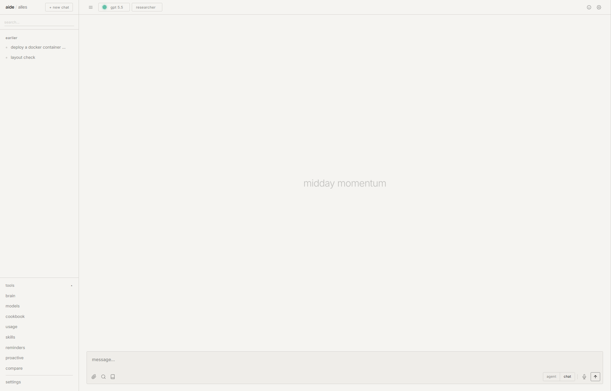</p>

### apps
one full-screen launcher for the nine specialist workbenches.

<p align="center">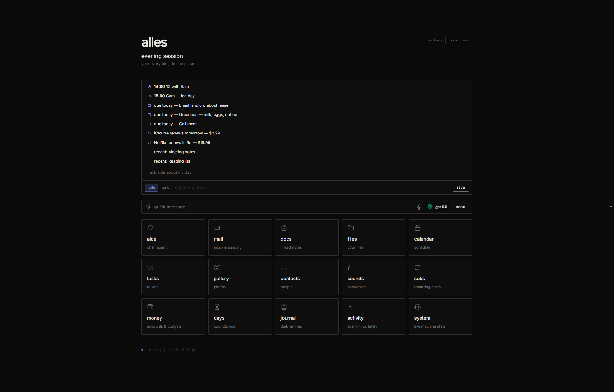</p>

- exactly nine destinations appear in three groups: **plan, inbox, docs, files, library, health,
  finance, vault, and server**
- the launcher keeps one quiet apps identity, a home action, and the established grouped full-screen
  format; retired standalone names do not reappear as extra tiles
- home remains the live clock, day summary, capture, and pinned-app surface. saved legacy pins are
  normalized to their new workbench without deleting the owner's preference
- home's day question opens an editable incognito draft in aide. it carries the available day context
  through a one-time code across app subdomains; it does not send or create a conversation until the
  owner chooses to send.

### specialist workbenches
related apps now open together without merging their records.

- **plan** combines a time-ordered calendar, tasks, and reminders agenda, with quick task capture and
  direct access to each full specialist screen. its task board is another view of the same task
  records: four active stages, manual order, filters, quick add, detail editing, and completed history
- **inbox** puts cached mail, the selected message, and matching contact context in one workflow while
  keeping mail and contact records separate
- **docs** keeps notes and journal as local sections of one markdown workbench. if a document's
  recovery draft cannot be saved, tabs and browser back/forward keep that document visible
  with an error until the save can be retried
- **files** keeps storage and gallery under one identity, with explicit gallery-to-files and browser
  back paths on desktop and phone
- **library** combines books and saved reading; andromeda news enters only when you explicitly save it
- **health** places today's habit rhythm beside the latest measurements without changing the local,
  sensitive health-context boundary
- **finance** combines money, subscriptions, reviewed imports, and visible managed-actual state
- **vault** keeps passwords, passkeys, pairing, watchtower, reauthentication, and recovery within the
  existing encrypted boundary
- **server** combines the original neofetch/btop monitor with alles-owned services, search/model
  configuration, backups/storage, updates, logs, activity, watch, and the bounded access-policy editor
- **aide scheduled → news** manages tested rss/atom sources, source health, a daily brief schedule,
  home delivery, and optional jarvis delivery. saving an article to library is always explicit
- old app names, hosts, and deep links still open the matching subsection instead of dropping the
  requested context

### home
your whole day on one screen the moment you open alles.

- **needs you** keeps approvals, choices, conflicts, uncertain results, and failed work visible.
  aide job links open the exact job with its current state, result and activity; reload and browser
  history preserve that target. answer its pending question, review and decide an exact action,
  cancel eligible work, or open the original conversation. eligible failed, cancelled or interrupted
  handoffs can be retried; a retained request identity confirms the same child after a lost reply.
  uncertain outcomes require inspection and cannot be retried from this view
- **today** combines events, due work, reminders, habits, renewals, and important dates
- **in progress** shows active background aide work; **briefs** holds completed reports
- **pinned apps** opens the app destinations selected in **settings → home**
- **suggestions** appears only when aide has saved proactive cards. it stays separate from needs you;
  opening or dismissing a card records feedback only after the server confirms it, while an uncertain
  or offline response leaves the card visible for a later check
- old `home` links and deployments with the old `afterlife_today` flag use this same home; the flag
  name remains accepted for existing configurations but no longer selects a separate screen
- on first use, older browser-local home tile choices can seed pinned apps only when this server has
  no saved home layout; the original browser choices remain available for rollback
- every core section is deterministic and useful without a model. **settings → home** controls order,
  visibility, density, and pinned apps; the home settings action and the section's **edit** action open
  that pane directly. needs you
  cannot be hidden, and loading, empty, partial, offline, and error states remain visible
- home capture reviews tasks before acceptance into plan and saves uniquely named markdown notes in
  docs → documents. an unconfirmed response keeps the original text and request identity for manual
  retry after reload; an unknown or queued reply is not treated as a confirmed save. saved notes open
  directly in docs. capture never auto-retries an uncertain write.

### activity
one scrollable feed of *everything you did*, across every app, newest first. if today is what's coming up, activity is what already happened.

- a single reverse-chron timeline merging journal entries, tasks you added and ticked off, calendar events, money transactions, mail you received, photos you added, docs you edited, agent runs, and subscription renewals, grouped by day (today / yesterday / weekday / date)
- **filter chips** to show/hide any source, and a range toggle (7d / 30d / 90d / 1y); click any row to jump straight to it in its app
- *under the hood:* it's a **read-time aggregator** ([`routes/timeline.py`](routes/timeline.py)): it queries each app's current data owner instead of keeping a separate "events" log. after the finance cutover, money comes from actual transactions and renewals from linked payments plus unmatched historical payment records. if finance is unavailable, other events remain visible and totals are marked partial instead of replaying frozen rows. completing a task stamps a `completed_at` so "done" shows the real time instead of only the date.

<p align="center">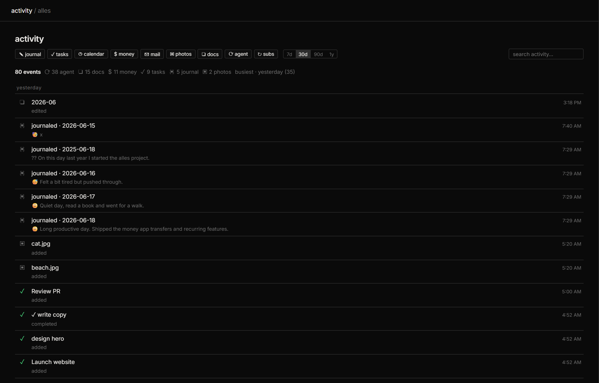</p>

### docs
a markdown workbench where your notes are plain text files you own, linked together, with a live, pretty editor.

the editor and file operations support:

- a **live-preview** editor (you see bold as bold, headings as headings) built on **codemirror 6**, doing obsidian-style *live preview*: the markdown symbols (the `**` and `#`) hide themselves, the text styles inline, and the raw symbols reappear on whatever line your cursor is on. *under the hood:* codemirror edits the plain text directly, the saved document stays markdown. the document-safety layer checks the version you opened before replacing it.
- three view modes you cycle with one button: **live** (the wysiwyg) · **source** (raw markdown) · **preview** (fully rendered)
- **`[[wikilinks]]`** to link notes together, **backlinks** (see what links *to* this note), and **unlinked mentions** (notes that name this one in plain text but haven't linked it yet)
- **rename-safe links**: renaming a note rewrites every `[[link]]` to it across the whole vault (aliases and `#headings` preserved), so refactoring never silently breaks your graph; the change is snapshotted so it's undoable
- **`[[` autocomplete**: start typing a link and it suggests your notes
- **find & replace** inside a doc (ctrl+f)
- **a graph view**: your notes as dots, links as lines, drag-explore
- **`#tags`** with a clickable tag sidebar + filter, and **`![[embeds]]`** to pull one note (or an image) inside another
- **frontmatter** (the `key: value` block at the top) rendered as a clean property table
- **paste smarts:** paste a web link onto selected text → it becomes a link; paste or drop an **image** → it uploads and embeds automatically
- **quick switcher** (cmd/ctrl+o): fuzzy-jump to any doc by name
- **pin** favorite docs to the top, **sort** the tree a–z or by recently-edited, **foldable folders**, and **drag files into folders** to organize (with a drop highlight)
- **templates**: new-from-template menu (seeds starter meeting/daily/project templates with `{{date}}`/`{{title}}` tokens)
- **task rollup**: every `- [ ] checkbox` across all your notes in one panel, tickable from there
- **word count + reading time**, live in the header
- **version history**: every save snapshots a revision you can preview and restore
- **daily notes**: one-click "today" journal entry
- **math and diagram source stays readable offline**; tex and mermaid source is preserved as text
  until reviewed local renderers are bundled, with no runtime cdn dependency
- **ai edits**: tell the ai "summarize this" / "fix the grammar" and it rewrites the note in place, streaming
- **extract to-dos**: ai pulls action items out of a doc into real tasks
- **import** `.md` / `.txt` / `.docx` (word) / `.html` / `.pdf`, or paste a **youtube link** → it grabs the transcript and ai-summarizes it into a note
- **export** to **pdf**, **html**, or **docx** (word)

<p align="center"></p>

### mail
a real email client (read + send), with one-click setup for the big providers and ai help built in.

- connects to **any imap/smtp account** (imap = how apps read your inbox, smtp = how they send); one-click presets for gmail, outlook, icloud, yahoo, fastmail, or your own domain
- live inbox that auto-refreshes; open, read, and reply to mail
- search and folder reads keep failures visible with retry; an older response cannot replace a
  newer selection. offline cached mail is labelled, partial account failures keep known rows,
  and a successful empty refresh clears stale rows. a failed message read does not mark it read
  or open an empty message. refreshing or retrying the current list preserves the reader and
  unsaved reply. keyboard retries keep focus unless it has moved elsewhere
- save a search and reopen it from the keyboard. failed saves retain their exact query for retry
  after reload; a lost response cannot create duplicates. deleted searches stay deleted on retry,
  and removal failures remain visible until confirmed
- flag, label, mute, snooze, unread and VIP controls check the saved result before showing success.
  failed changes keep the current message visible; refresh can recover a change whose reply was lost.
  actions use the exact account, folder and message UID, and delayed replies preserve a newer reader
- adding a label merges with the stored labels, including after a lost reply or concurrent addition.
  the label API accepts `add_label` for additions; existing `labels` replacement requests keep their behavior.
  opening a message waits for its pending action before marking it read; marking it unread restores
  its row in the unread view
- archive asks the server to confirm its move before removing the local message. an unconfirmed
  result stays visible and asks for a mailbox refresh before another attempt
- mail changes are never added to the generic offline queue, and older queued mail writes remain
  blocked for review. saved labels can be opened from the keyboard
- muted and snoozed views keep hidden messages reachable. unmute a thread or end a message’s snooze
  from its row; if both apply, clear both to return it to the inbox. failed restores remain visible,
  and retries keep the same requested state. hidden results retain their account and folder
- **conversation threads**: a toggle collapses the inbox into conversations (everything with the same subject, re:/fwd: stripped), expand one to read the whole back-and-forth
- **attachments**: a message shows its attachments as chips you click to download (the body still loads attachment-free for speed)
- compose and send with **cc + bcc**; replies set the proper `in-reply-to`/`references` headers so they thread correctly in apple mail, gmail, and everywhere else
- compose text stays open when switching message lists. replacing the editor or leaving mail asks
  before discarding changes; browsers that support leave warnings also protect unsaved text on reload
- late message, draft, signature and image reads cannot replace newer work. failed draft deletion
  keeps the editor; edits made during successful deletion remain available to save as a new draft
- drafts cannot reopen while deletion is pending. accepted sends keep their undo action after editor
  replacement, and send or schedule responses preserve text entered while the request was pending
- keyboard formatting and the custom link dialog preserve the selected text; saved links reopen in drafts
- saving a draft keeps that exact attempt in this tab before sending it, including recipients and
  reply headers. retry and reload check the same save without creating another draft. later typing
  stays in the editor and needs its own save; a checked current read confirms the saved version
- changed or deleted drafts keep the pending version for review or an explicit separate copy.
  recovery is tied to the current mail store; removed sending accounts remain identifiable until
  an account is explicitly chosen. unreadable recovery data and failed cleanup have retry controls
- draft writes are never replayed by the generic offline queue. older queued draft writes stay
  blocked for review; reconnecting alone does not send them
- sending or scheduling retains the exact request in this tab before delivery is queued. a lost
  response or reload checks that same request; later typing stays unsent. failed cancellation has
  explicit status and retry controls, and canceled message text remains available to reopen
- an accepted delivery removes only the captured saved draft version. newer saved versions remain;
  unsaved text entered during delivery becomes a separate draft when that original is accepted.
  failed cleanup can be retried separately without sending again. cancellation that loses to
  delivery still finalizes the accepted request. recovery storage failures keep the editor and
  prevent a new delivery request
- scheduling uses the configured timezone and rejects invalid or nonexistent local times. send,
  schedule and cancellation writes are excluded from automatic offline replay; older queued
  delivery writes stay blocked for review
- the delivery API accepts an optional `request_id` for exact queue retries. reusing it returns
  the same message and current status, including sent, uncertain or canceled outcomes; changing
  its payload returns a conflict. an undo retry keeps its original scheduled instant
- `GET /api/mail/scheduled?context=true` includes mail-store recovery scopes. a `request_id`
  lookup also returns terminal outcomes. scoped cancellation succeeds only before delivery starts;
  sending, sent and uncertain messages keep their true status and return a conflict
- clients can cancel an unresolved create with `reserve_if_missing=true`, a canonical request UUID
  and a matching store scope. a content-free cancellation record prevents that request from being
  queued later. ordinary cancellation of an unknown id still returns not found
- schedule API timestamps require a valid date and time. explicit offsets normalize to UTC;
  valid timestamps without an offset retain their legacy UTC meaning. existing records are unchanged
- **ai:** summarize a long thread, turn an email into a task, or turn an email into a calendar event (the ai reads out the date/time/title for you)
- **fast + offline-tolerant:** a persistent header cache means the inbox opens instantly and still shows your last sync when the network's slow or down; local search over the cache is instant
- *under the hood:* built directly on python's standard `imaplib`/`smtplib`; no third-party mail library. it pools live connections, caches what it's read, loads the inbox by range (not a slow "search everything"), and opens a message by pulling *only* its text/html body (not the attachments), so it stays fast on a weak connection.

### calendar
a calendar with month / week / day views and repeating events.

- real time-grid week and day views, a month grid, and an **agenda list**
- **recurring events**: daily / weekly / monthly, with a small **↻ marker** on every repeating occurrence so you never mistake one instance for a one-off
- **import / export `.ics`**: round-trip with apple calendar, google, outlook (export everything, or import a `.ics` someone sent you)
- **natural-language quick-add** right in the header: "lunch with sam friday 1pm" makes the timed event; "team sync tomorrow" makes an all-day one; and it now understands repeats too: "standup daily 9am", "yoga every monday 6pm", "class every week until 2026-08-01"
- optional **two-way sync with caldav** (the open calendar-sync standard used by icloud and google) if you add your credentials

<p align="center">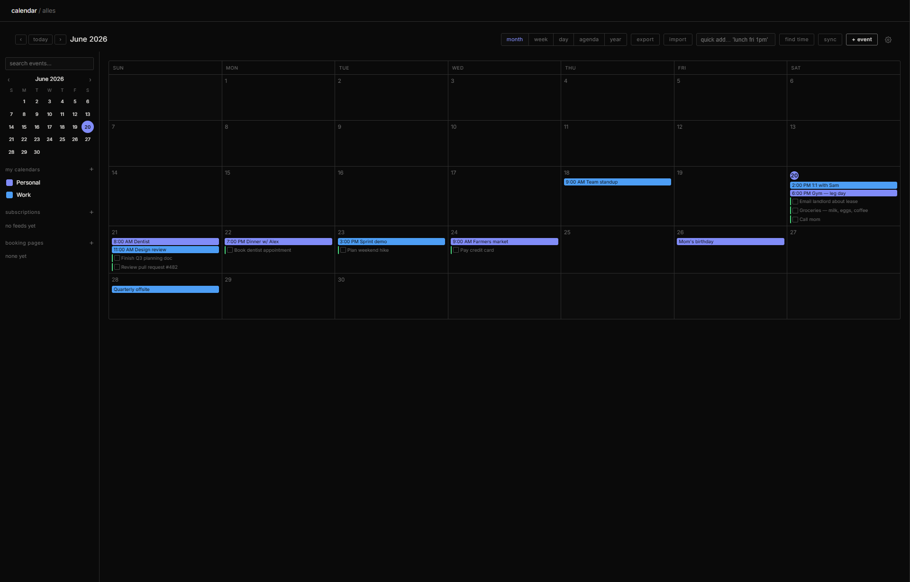</p>

### tasks
a real to-do list: type tasks in plain english, with recurring ones and smart views.

- **natural-language quick-add**: "pay rent every 1st !" or "call mom tomorrow #home" parses the due date, repeat, `#tags` and `!` priority for you (deterministic, no deps, all local)
- home task capture previews these fields before saving, using home's displayed day for relative dates. the accepted task keeps the exact original text, available in its editor and completed history; an uncertain acceptance can be resumed from home after reload without creating another task.
- **recurring tasks**: finish one and it rolls forward to the next occurrence (daily / weekly / monthly / yearly, leap-day safe)
- **today / upcoming / someday** views by due date, plus tags, subtasks, projects, and manual drag-reorder
- compatible task stages include backlog, next, doing, waiting, and done while the existing checked/unchecked behavior still works
- task edits send only changed fields with their original values; conflicting saves retain both versions for review, download and explicit resolution. legacy api clients without preconditions keep their existing behavior.
- unsaved task edits recover after reload/history in the same tab, scoped to the installation owner. storage failures show a warning and download action; closing the tab or clearing its storage is not a durable backup.
- **active / history tabs**: history lists up to 50 completed tasks; search finds older completed tasks too. un-check a task to return it to active work. search keeps the selected today, upcoming or someday queue.
- tasks created anywhere (quick-capture, "extract to-dos" from a doc, the ai's `task_add` tool) all land here

<p align="center">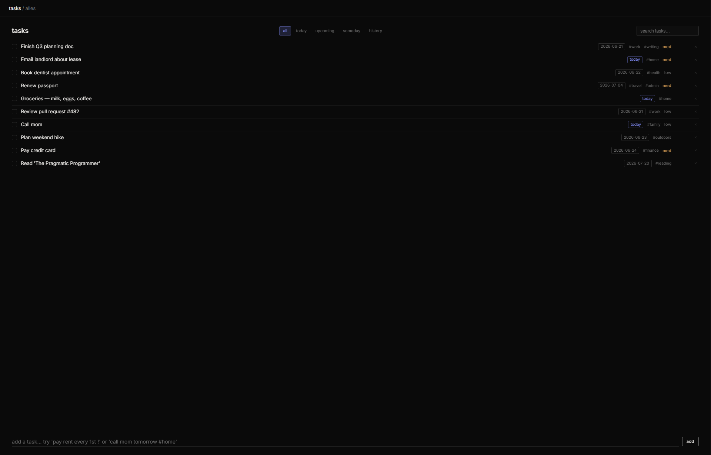</p>

### notes
lightweight scratch notes for when you just want to jot something with zero ceremony. home's quick-capture "note" instead creates a markdown document in docs → documents.

### journal
a daily diary: one entry a day, with mood, prompts, a streak, and a year-at-a-glance heatmap.

- one entry per day with a **mood** picker, tags, live word count, and gentle autosave
- a rotating **daily writing prompt**, a **streak** counter (an unwritten today doesn't break it), and **on-this-day** (the same date in past years)
- a full-year **activity heatmap**: a github-style contribution grid (7 rows × the weeks of the year) that fills in as you write, with year-to-year navigation
- **search** across every entry, **export** the whole journal to one markdown file
- an optional **"reflect"** button: a short, warm ai reflection on what you wrote
- an optional **passcode lock** that gates the journal behind its own code (an access gate, not extra encryption; once you're in it's still fully searchable)

<p align="center">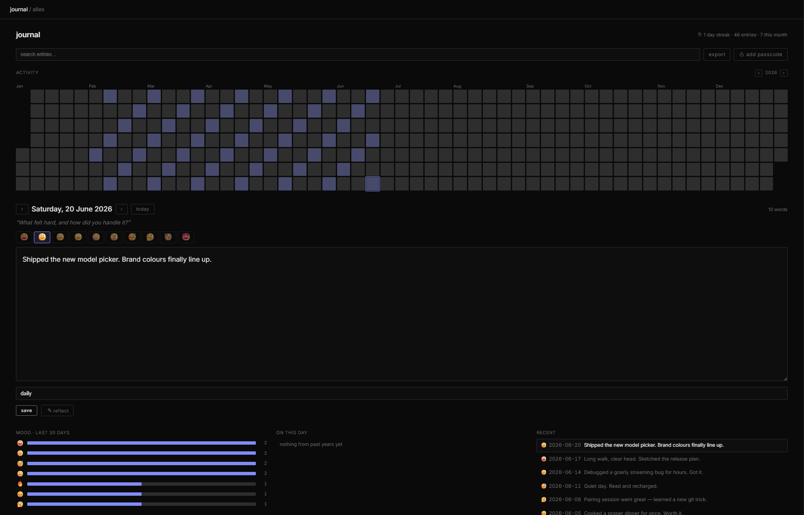</p>

### subs
track what you're paying for every month so nothing surprises you.

- weekly / monthly / quarterly / yearly / custom billing cycles
- due dates roll forward automatically as they pass
- **mark a renewal paid** only when it's actually due; one click logs a dated payment and advances the next due date by a cycle, with an **undo** for when you hit it by accident (no more clicking "paid" five times and launching the date into next year)
- **auto-post to money** (optional): link a subscription to a money account and every time it renews it drops a real dated transaction there, so your spending picture actually includes your subscriptions instead of forecasting them separately (the renewal write uses a stable identity so retries don't create a second transaction)
- **price-change tracking**: when a subscription's price changes it keeps the old and new, so a quietly-creeping price is something you can actually see
- a **6-month spend forecast** of what's coming up, and **duplicate detection** that flags two subs that look like the same service
- a **manage ↗ link** straight to the cancel/billing page you saved
- monthly **and** yearly totals, plus a **spend-by-category bar chart** (plain css, no chart library)
- a **push notification before anything renews** so you can cancel in time

<p align="center">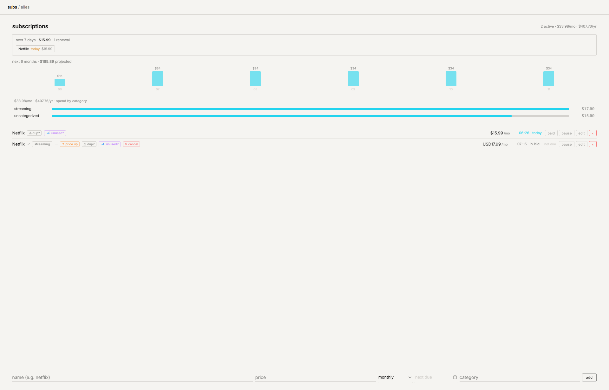</p>

### money
the finance ledger for accounts, spending, budgets, subscriptions, and reviewed
imports, with an optional gated move to an alles-managed actual budget core.

- **accounts** (checking / savings / cash / credit / investment) with live balances + a net-worth roll-up
- **transactions**: log income/expenses with a category + payee, browse by month, quick-add, **use edit on its row**, delete
- manual amounts validate the entire decimal input; grouped numbers or trailing text keep the draft and show an error
- local account, transaction and transfer creates accept an optional canonical uuid `request_id`.
  retrying identical values returns the saved result; reusing the id with changed values returns
  409. deletion clears saved receipt content and retains a tombstone so a late retry returns 410
  instead of recreating the entry. requests without an id retain their existing behavior
- **csv import / export**: money's import button opens the reviewed import flow. choose the
  destination account, preview rows, then apply them with a receipt and supported undo. generic csv
  accepts named date and amount (or debit/credit) columns in any order, with optional
  payee/description, currency, reference, category, notes and tags. absent currency uses the selected account
  or the canonical ledger's base currency. local category/tag rules are included in the preview;
  changes to those rules after preview do not silently change the approved values. metadata survives
  apply and retry; undo refuses to remove an imported row that was edited afterward. export all
  transactions to csv; existing direct-import api callers keep their legacy behavior.
- **budgets**: set a monthly cap per category; a progress bar turns red when you go over
- **charts**: spending-by-category bars and a 6-month income-vs-spent trend (plain svg, no chart library)
- this-month cards: net worth · income · spent · net
- an additive currency foundation preserves exact original and base values, conversion evidence, and
  stable import identities without changing existing amounts or renewal history
- reviewed generic csv and supported bank statement/notification profiles always preview first; repeat
  rows are stable duplicates, changed source rows are conflicts, and undo removes only receipt-owned
  transactions. read-only simplefin and plaid connections are available after provider setup
- managed actual 26.7.0 stays on loopback with private alles-owned authentication, cold backups, fresh
  restore read-back, and paired app/manifest rollback
- actual becomes canonical only after staged count, balance, aggregate, transfer, budget, schedule,
  currency-evidence, and subscription-link parity. new ledger writes then go only to actual and old
  alles ledger rows remain unchanged and read-only for at least one stable release
- if python-side staging validation fails after actual created the candidate budget, alles records its
  exact budget/sync identity, deletes it through the official client, and verifies absence. an
  unconfirmed cleanup blocks the next stage until the same identity is safely retried
- legacy analytics that are not yet calculated from actual fail closed after cutover instead of
  showing frozen pre-cutover numbers
- the six-month net-worth history follows the active ledger, using month-end totals from one
  actual snapshot after cutover. new actual accounts enter the history on their dated starting-
  balance entries; migrated accounts keep the old opening baseline because their original opening
  dates are unknown. a failed history read shows a retry action instead of claiming no history
- the money month-end forecast uses the active ledger. after cutover, one actual snapshot supplies
  the balance, three-month category averages, and active posting schedules; subscription renewals
  remain in their separate forecast. the projected card offers retry when this read is unavailable
- the money recurring list reads current actual auto-post schedules and linked paused schedules
  after cutover, excluding subscription schedules. a failed read shows retry rather than an empty
  list. new cutovers stage schedules with posting off, verify a schedule-only actual rule that sets
  category and notes, then enable posting for active schedules. this does not silently rewrite
  schedules in already-canonical budgets. for an older linked recurring schedule, finance offers
  an explicit category choice and in-place posting-rule repair after a verified actual backup.
  it keeps the schedule id, amount, dates, and prior posting state; an interrupted repair stays
  visible with a retry of the saved category. linked schedules with a verified guarded rule can
  pause or resume actual posting without changing their recurrence, using a saved retry for an
  uncertain response. finance can also create a guarded recurring schedule in actual using an
  explicit account and optional spending category chosen by id, a verified backup, and a stable
  request identity. an uncertain response leaves a visible retry that checks the same marker;
  a missing marker stops for review instead of making another schedule. unlinked native and
  unrepaired old schedules stay read-only. the canonical edit api accepts a complete target
  for a linked guarded schedule using existing actual account, payee, and spending-category
  ids. it saves a verified backup and durable before/target intent, pauses posting during the
  provider edit, and offers an exact pending retry or review when a write is uncertain. the
  edit form reads the current schedule and eligible account, payee, and category ids from
  one actual snapshot. it offers amount, sign, recurrence (including custom days), next date,
  auto-post, and notes. an uncertain edit shows the saved retry or review state; a failed
  status check blocks a second save until the current schedule can be read. finance can
  delete one eligible linked guarded schedule after an explicit confirmation and verified actual
  backup. actual removes its linked rule with the schedule; past transactions remain.
  an interrupted deletion leaves the saved intent visible for exact retry or review,
  while native, unlinked, and unrepaired schedules still require actual
- money alerts use the active ledger for large purchases, watched transactions, upcoming bills,
  and low account balances. after cutover, they read one actual snapshot plus local watches;
  variable bill amounts are not shown as zero, and a failed read offers retry instead of hiding alerts
- the age-of-money figure fifo-matches income to spending from the active ledger, excluding
  transfers and account starting balances. after cutover it reads one actual snapshot, and a
  failed read shows retry instead of hiding the figure. the money envelope card reads actual's
  budget-month totals, category assignments, spending, and rollover balances after cutover;
  a failed read offers retry. finance edits a month's assignment through its existing actual
  spending-category id, checks the amount first seen by the editor, and keeps uncertain writes
  available for an exact retry. finance spending caps are separate, persistent alles sidecars
  bound to actual spending categories; changing or removing a cap does not rewrite a month's
  assignment. funding target amounts and dates remain alles sidecars bound to stable actual
  spending-category ids; new dates must be valid calendar dates. fresh cutovers bind targets
  during staging. targets from older cutovers remain visible for an explicit category choice
  rather than being guessed from a name, and a linked target can be moved to another category
- aide's finance account, transaction, and spending-read tools follow the active ledger; if actual
  cannot be read after cutover, they return an error instead of quoting old balances or charges
- the unified transaction json/csv download also reads the active ledger, and fails if it cannot
  verify that source instead of exporting frozen pre-cutover rows

<p align="center">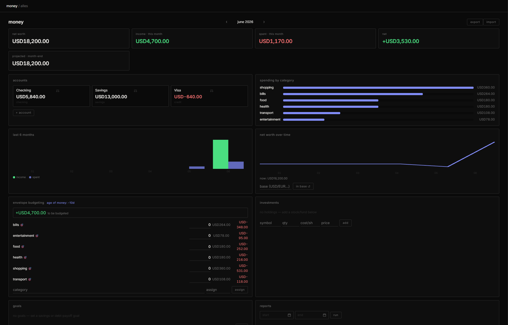</p>

### days
countdowns to things coming up, and day-counts since things that happened.

- birthdays & anniversaries (it knows *which* anniversary, "3 years")
- handles feb 29 sanely
- progress bars, pins, and push reminders as the day approaches

<p align="center"></p>

### files
a file browser over any folder you point it at: browse, upload, preview, organize.

- browse folders, upload, rename, delete, and **search**: by filename *and* inside text files, with a snippet of where the match was
- **inline preview** without downloading: images, **pdfs** (in a real pdf viewer), **video**, **audio**, and text/markdown
- download anything with one click
- **smart folders** (recent / images / documents / large / starred / recently-deleted) and a storage bar showing real disk usage, free space, and what the vault itself takes up

<p align="center"></p>

### gallery
a local photo library that feels like icloud/google photos, minus the company.

- your photos grouped into date "moments," plus albums and favorites
- **search** by filename, camera (from exif), or date: "june 2026", a `2026-06` prefix, or just a year
- reads **exif** (the camera/date info baked into a photo) and makes thumbnails automatically
- **folder + apple photos sync**: point `/api/photos/sync` at an icloud drive / photos-export / dropbox folder, or use the gallery's macos-only apple photos action for confirmed, permission-gated batches of up to 500 visible items (hidden stays excluded); stable source identity prevents repeat imports from duplicating the library while local hidden/favorite choices remain local
- everything stored as plain files under `data/`. they're just your photos in a folder

### contacts
an address book, and one the ai can read and use (e.g. when drafting mail).

- name / email / phone / notes / tags, searchable
- **vcard import / export**: round-trips with your phone and any other address book

<p align="center"></p>

### system
a live look at how hard your computer is working: like task manager / activity monitor, built in.

- **ring gauges** for cpu and memory, a per-core bar strip, and **cpu/ram history sparklines** that fill in as you watch; refreshing every couple seconds
- disk-usage bars per drive, plus a card with your gpu, vram, cpu model, backend, and uptime
- the gauges go from accent → amber → red as a number heats up, so a pegged core or a full disk is obvious at a glance
- *under the hood:* `get /api/system/stats` ([`services/sysmon.py`](services/sysmon.py)) uses [psutil](https://github.com/giampaolo/psutil) for live cpu%/per-core/uptime/disks; without it, it still shows ram + disk from the static hardware readout (`shutil` + the `hwfit` probe), just no live cpu%. all the gauges are hand-drawn svg; no chart library.

<p align="center"></p>

### secrets
an encrypted vault that holds more than passwords. each item carries the fields that actually fit what it is.

ordinary new-entry forms keep one save identity across uncertain responses. retrying recovers the
existing encrypted entry; changed values offer an explicit correction instead of adding a duplicate.
receipts are scoped to the unlocked vault and contain only identifiers and a timestamp. deleted entries
leave a content-free marker; password changes preserve retry recovery. pending responses cannot reopen
a locked editor or replace a newer form. expired access returns to unlock, and unsent secrets are never
stored in browser storage. passkey creation uses its separate endpoint and is not covered by these
ordinary-entry receipts.

- pick a **type** and the form changes to match: **logins** (username · password · website · notes), **credit cards** (cardholder · number · expiry · cvv · billing address), **api keys / tokens**, **secure notes**, and **identities · bank accounts · ssh keys · software licenses**; so a card never asks you for a "password" and an api key reads as a token, not a login
- click any entry to open it, reveal or copy a field, edit it, or delete it
- a built-in **password generator** (csprng, skips look-alike characters) and a live **strength meter** that flags common, repetitive, or sequential passwords
- first use checks the default vault's setup state without creating a record. an empty vault asks
  for a master password of at least 12 characters and confirmation; existing vaults ask to unlock.
  a failed setup-state read offers retry. if initial creation succeeds but its response is lost,
  checking the saved state switches the form to unlock rather than offering a password reset.
  the screen explains that the vault password is separate from alles sign-in and cannot be reset
  to recover encrypted entries. existing data or enrolled authentication without a verifier
  requires a valid backup; it is never treated as a new empty vault. expired entry edits lock and
  clear the form, preserving the saved value until the owner unlocks and deliberately edits again
- attachment uploads keep a request UUID and the selected file in browser memory until confirmed.
  retrying the same upload returns its saved attachment; changed files or destinations conflict,
  and deleted uploads cannot be recreated by a retry. the vault-scoped receipt stores no file
  content or secret fingerprint. migration 53 adds these receipts without changing existing files
- failed copy, delete, attachment and share actions show recovery instructions. failed attachment
  reads offer retry instead of claiming the list is empty. locking clears the open form and pending
  upload; late responses cannot trigger a copy, download or share-link display after that lock
- sharing uses the saved entry. the form provides a copyable link when clipboard access fails,
  plus revocation for existing links. revocation prevents future access; it cannot erase a copy
  someone already read
- *under the hood:* each entry is sealed with **aes-256-gcm** (a strong authenticated encryption) under a key derived from your master password with **pbkdf2-hmac-sha-256, 260,000 iterations** (a deliberately slow key-stretch so guessing the password is expensive). the master password is held **in memory only** and never written to disk. locked, the vault is unreadable even to someone holding a full copy of your database.

<p align="center">
  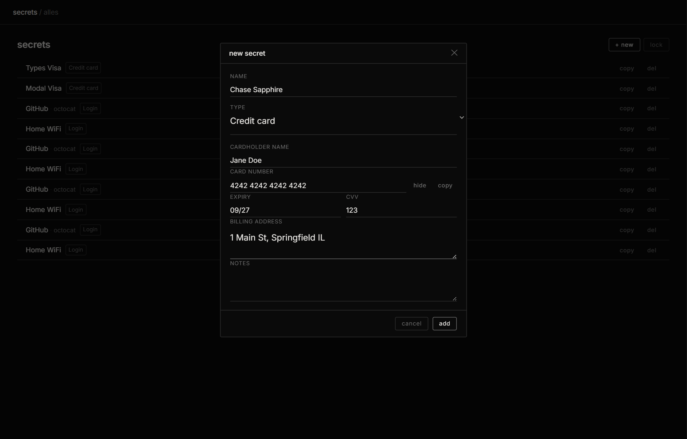<br>
  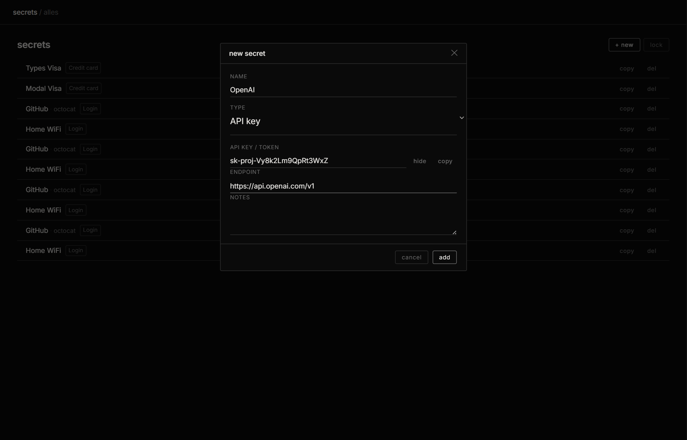
</p>

### automations
*when this happens, do that.* set a rule once and alles runs it for you.

- examples: mail from a certain sender → make a task · a subscription is about to renew → push me · a doc gets saved with `#urgent` → do something · every morning → build me a day digest
- *under the hood:* rules live in the database and fire off a small background job system (see [under the hood](#how-each-app-works-under-the-hood)). each occurrence is claimed before it acts, then saved as succeeded, failed, or uncertain. an uncertain external result is shown for review and is not retried automatically.

reminders keep a submitted request identity through an uncertain response, so retrying the same panel, slash command or send-later action confirms that reminder. chosen times use the configured timezone; nonexistent spring clock times are rejected and repeated autumn times choose the first occurrence. browser delivery is acknowledged after displaying the reminder in a visible tab. scheduled messages resolve the conversation's explicit, persona or inherited aide model; a message that has already started cannot be cancelled as if it had not run.

**and the smaller stuff:** global search across everything (cmd/ctrl+k), scheduled messages (right-click send → have aide message you later), prompt templates / a cookbook, webhooks, api tokens, an openai-compatible api so other tools can use alles as their "openai," encrypted backup with a separately saved recovery key and offline staged restore, light/dark themes **with a customizable accent color**, and it **installs like an app** (it's a pwa with real push notifications; add it to your home screen/dock and reminders reach you with every tab closed).

---

## aide in depth

aide looks like a normal chat box. the differences are under it:

- **one box, every model.** you register "endpoints" (each is just a web address + an api key) and pick a model. switch providers mid-conversation; aide handles the protocol differences. ([how that works →](#how-the-model-switch-works))
- **it remembers on your terms.** long-term memory uses **local vector search**: *vector search*
  means it finds memories by meaning, not exact words. `fastembed` runs locally on your cpu and the
  keyword fallback also stays local. ask is the default: extracted and model-distilled facts wait
  for review. auto directly saves only low-risk preferences you explicitly state. off stops model
  memory reads and writes. you can search, review, edit, scope, pin, forget, export, pause, or clear
  memory, and see its source and which chats used it.
- **one automatic mode.** aide answers simply when a simple answer is enough, uses approved tools when the request needs them, and keeps longer work running in the same task.
- **it keeps work inspectable.** successful replies lead with the conclusion. tool steps start collapsed, but exact sources, diffs, checkpoints, and revert controls survive reload. scrolling follows only while you stay near the bottom; **jump to latest** gives control back.
- **it hands research to the right place.** normal web search and its grounded overview live in andromeda. when deeper research would help, aide asks first and continues it in the same task with the same query and selected project.
- **it schedules a private news brief.** scheduled → news tests owner-chosen rss/atom feeds before
  saving them, polls healthy sources independently, keeps useful links when a source or summary fails,
  and delivers the resulting brief to home plus an optional paired jarvis destination.
- **it sees.** drop an image and capable providers receive it as vision input.
- **it compares.** a conversation action runs the same prompt across several models at once and lets you vote on the winner.
- **personas & projects.** personas are saved system prompts; none adds no persona instructions. loose tasks and folder-backed projects organize chats and give background aide the same prioritized working environment.
- **artifacts.** ask for a webpage/chart/snippet and it renders live in a sandboxed frame next to the chat.

<p align="center">
  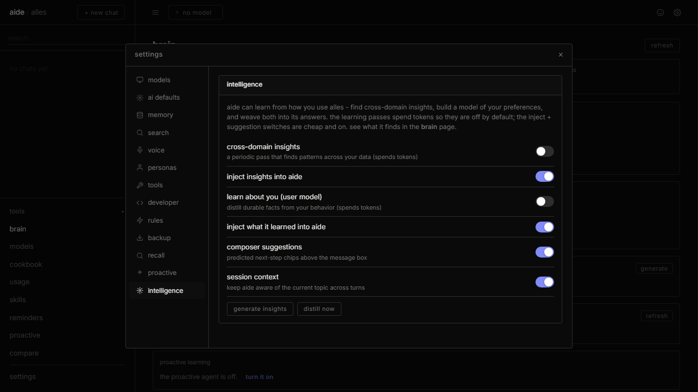
</p>

- **voice.** push-to-talk speech-to-text in, text-to-speech out; local (`faster-whisper`) or via a provider, your choice in settings.
- **reasoning view.** for "thinking" models (deepseek-r1, qwen3, claude extended thinking) you get a live "thought for n s" timer and can read the reasoning.

---

## andromeda in depth

andromeda opens at `http://localhost:6769/?app=andromeda` or its own app host. it is enabled by default; an explicit feature allow-list can change that.

- **links first.** normal results render without waiting for a model. title, url, snippet, provider,
  safe source type, and elapsed time remain useful if the overview is disabled or fails.
- **one optional ai overview.** normal results and overview have separate settings and both default on.
  a standalone `!ai` token anywhere in one query skips only that request's overview; other search bangs
  and saved defaults are unchanged.
- **bounded evidence.** alles fetches candidate pages through its redirect- and ssrf-safe reader, then
  gives the model only a limited evidence bundle with source ids, urls, dates, versions, quality, and
  relevant passages.
- **support before display.** every factual claim needs an exact quote from its named source. extra
  checks reject unrelated quotes, mismatched numbers, versions, dates, and entities. claims about the
  latest software prefer the freshest primary source and fail closed on weak or conflicting evidence.
- **owner-chosen models.** light, standard, strong, and auto bands each resolve to an exact configured
  endpoint and model. auto prefers a qualified local model. a configured remote fallback is shown in
  preview and requires an exact per-search owner confirmation before any query or evidence leaves the
  device; declining keeps the links and skips the overview.
- **independent background verification.** the fast answer uses the `andromeda_answer` role. a separate
  `andromeda_verifier` role checks freshness-sensitive answers by default after the answer and links are
  already usable. it records the checked date and claim verdicts, requires exact supporting quotes, and
  cannot silently turn unsupported output into a verified claim. a new search cancels obsolete verifier
  work; verifier failure leaves the answer and links visible as not independently checked.
- **compact answer, separate links.** search, the cited answer, and results share one readable axis. the
  shortest decisive evidence-backed substring is highlighted inside the key answer. ordinary web results
  begin in their own labeled region and use spacing instead of divider lines between rows.
- **recovery stays useful.** timeout, offline, missing provider, missing model, bad extraction, bad model
  output, and cancellation keep links when available and show the safe failure type, attempted
  providers, and retry/broaden/edit/return actions.
- **save or continue.** saved searches keep the request settings, result metadata, overview, citations,
  evidence, model provenance, and checked time. selected links can open in aide, while deep research can
  continue in aide with the selected project id.

search can use duckduckgo, tavily, brave, google pse, serper, or an external https searxng instance.
alles can also own an optional searxng lifecycle when a supported docker runtime is available. its
reviewed definition is pinned to `2026.7.12-c19d86faa` /
`sha256:f433294b46a93564993c4371005341e013d94aa8ea4662d8ee521cd2cccb08e8`, bound to
`127.0.0.1:8888`, resource-limited, health-checked, and ownership-verified before control actions.
the service supports install, health checks, restart, update, rollback, and removal while retaining private configuration. when docker is missing, stopped, or
cannot read the selected data root, server reports the unsupported boundary without claiming an
install; external https searxng and the other providers remain usable.

---

## how the model switch works

model selection and provider formatting are separate steps.

alles has three relevant exact role defaults: **aide**, **andromeda answer**, and **andromeda verifier**.
background aide work inherits the aide choice unless a workflow has an explicit override. server → search
and models owns the two independent andromeda roles and their token/time limits. one resolver is used by
interactive chat, andromeda answering and verification, and background jobs. a one-run choice wins first,
then a workflow override, a feature default, the role default, and finally an allowed fallback in the
same privacy and cost class. a saved model that disappears is shown as broken instead of silently
switching providers. with no role choice, local endpoints are tried first.

aide does **not** hardcode a provider. you register **endpoints** under settings → models; each endpoint is just a `base_url` (web address) + an `api_key`. when you send a message, aide looks at that url and routes the request to the right protocol. all of that lives in one function, [`detect_provider()` in `services/llm.py`](services/llm.py):

```python
def detect_provider(base_url: str) -> str:
    url = base_url.lower()
    if "anthropic.com" in url:
        return "anthropic"
    if "deepseek.com" in url:
        return "deepseek"
    if "openrouter.ai" in url:
        return "openrouter"
    if "groq.com" in url:
        return "groq"
    if "moonshot.cn" in url or "moonshot.ai" in url or "kimi.ai" in url:
        return "moonshot"
    if "api.x.ai" in url:
        return "xai"
    if "googleapis.com" in url:
        return "gemini"
    if "mistral.ai" in url:
        return "mistral"
    if "perplexity.ai" in url:
        return "perplexity"
    if "together.xyz" in url or "togetherai.com" in url:
        return "together"
    if "fireworks.ai" in url:
        return "fireworks"
    if "cohere.ai" in url or "api.cohere.com" in url:
        return "cohere"
    if "openai.com" in url:
        return "openai"
    if ":11434" in url or "ollama" in url:
        return "ollama"
    return "openai"  # openai-compat fallback
```

there are really only three "languages" ai providers speak. aide speaks all three and translates, so you never have to care which one answered.

**the three wire protocols:**

| protocol | who speaks it | endpoint | notes |
|---|---|---|---|
| **openai-compatible** | openai, deepseek, groq, openrouter, moonshot/kimi, xai/grok, gemini, mistral, perplexity, together, fireworks, cohere, vllm, lm studio, **+ anything that copies the format** | `post /v1/chat/completions` | the default and the fallback |
| **anthropic messages** | claude | `post /v1/messages` | different headers, system-prompt placement, and tool/vision shapes |
| **ollama native** | local models via [ollama](https://ollama.com) | `post /api/chat` | point an endpoint at `http://localhost:11434` and you're fully offline, no keys |

for each, aide builds the correct request body, sends it, and streams the reply back through a parser that **normalizes everything into the same internal events**: `{"delta": …}` for text, `{"thinking": …}` for reasoning tokens, `{"tool_call": …}` for function calls, and `{"done": …, "usage": …}` at the end. the rest of the app only ever sees those four shapes.

details that matter in practice:

- **true token streaming** over sse (server-sent events, the `data: {json}\n\n` format); not batched. you watch it type.
- **reasoning models** that go quiet before answering show an elapsed-time heartbeat so the ui never looks frozen.
- **vision / tool-calls / tool-results** are translated per provider (e.g. openai `tool_calls` ⇄ anthropic `tool_use` blocks; base64 images ⇄ anthropic image blocks).
- **auto-failover + cooldown:** an endpoint that errors twice gets a 20-second cooldown so one dead provider doesn't stall you.
- **localhost stays direct:** aide's model client bypasses environment proxies for loopback endpoints; remote endpoints use the normal proxy configuration.
- **model lists auto-refresh:** aide periodically re-pulls each provider's available models (and on demand), so new releases show up on their own.
- **endpoint bootstrap:** put `DEEPSEEK_API_KEY` or `ANTHROPIC_API_KEY` in `.env` and the matching endpoint is created on first boot, or add an endpoint in the interface.

aide also **exposes its own** openai-compatible api (`GET /v1/models`, `POST /v1/chat/completions`), so other tools can point at alles as if it were openai.

---

## the agent in depth

aide's tool loop is what turns a request into work: it plans, uses approved tools,
checks the result, and reports back for many steps. aide enters this loop automatically when useful and
can continue durably in the background. there is no separate agent mode or mode selector.

*under the hood:* it's a multi-turn loop ([`services/agent_runtime.py`](services/agent_runtime.py)). each turn the model can call tools; results feed back in; it keeps going until done or it hits a turn limit (6 / 18 / 36 / 60 / 100 turns for low / medium / high / xhigh / max effort; deep_work uses 48). long runs auto-trim old tool output to stay within the context window, and screenshots are fed back as real vision input.


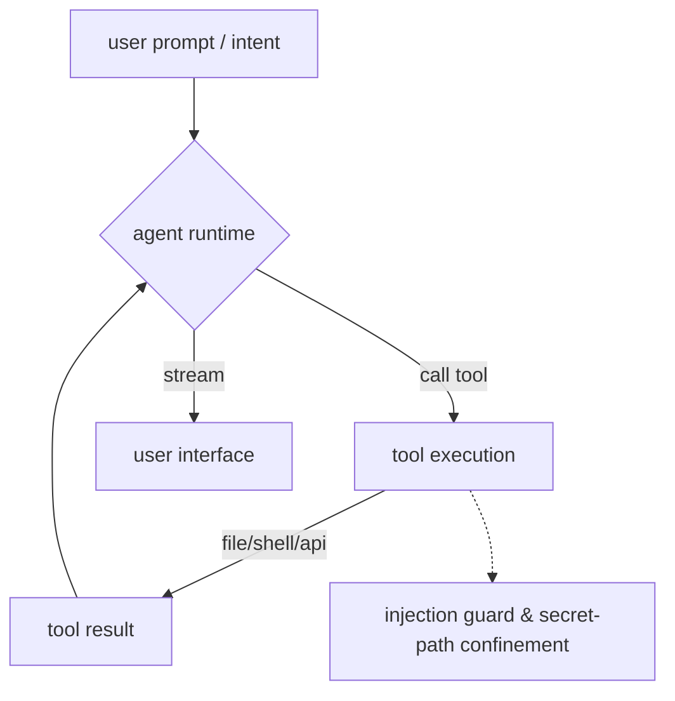
```mermaid
graph TD
    user[user prompt / intent] --> agent_loop{agent runtime}
    agent_loop -->|call tool| tools[tool execution]
    tools -->|file/shell/api| result[tool result]
    result --> agent_loop
    agent_loop -->|stream| UI[user interface]

    tools -.-> guard[injection guard & secret-path confinement]
```

**the toolset (registered tools), by category:**

- **files:** `read_file`, `write_file`, `edit_file` (exact find/replace), `apply_patch` (unified diffs), `list_files`, `glob_files`, `grep_files`, `revert_file`
- **shell:** `shell` runs the platform shell, including python commands; docker sandboxing is optional
- **code intelligence:** `code_symbols`, `find_definition`, `diagnostics` (run linters)
- **git:** `git_status`, `git_diff`, `git_branch`, `git_commit`
- **web:** `web_search`, `web_fetch` (fetch + read a page)
- **memory:** `memory_search`, `memory_add`
- **cross-app:** `calendar_list/create/delete`, `task_list/add/done`, `note_list/read/write/search`, `contact_list/add`, `mail_list/read/send`
- **github** (when you connect a token): `github_me`, `github_list_repos`, `github_get_repo`, `github_get_file`, `github_list_issues`, `github_create_issue`, `github_list_prs`, `github_create_pr`, `github_search_code`, `github_search_repos`
- **integrations:** `mcp_list_tools`, `mcp_call_tool` (mcp = model context protocol, a standard for plugging external tools into ai), `opencode_run` (hand a coding subtask to opencode), `skill_list`, `skill_load`
- **delegation:** `spawn_agent`, `spawn_agents` (fire off parallel sub-agents for independent subtasks)
- **computer use** (opt-in, needs `pyautogui`): `screenshot`, `computer_click/move/type/key/scroll`; it can drive your actual screen
- **planning:** `todo_update` (keeps a live checklist you can watch)

**safety:**

- **permission modes**: `full_auto` allows routine local work and asks for risky actions; `approve` asks before state changes; `plan` denies state-changing tools; `full_access` allows ordinary scoped work without approval. disabled tools, persona rules, and file-root/secret guards still apply. a diff preview is available for supported file changes
- **checkpoints**: `write_file`, `edit_file`, and `apply_patch` attempt to capture the original text before changing it. revert restores available checkpoints; it does not undo shell commands, remote actions, or edits that were not captured
- **provenance you can see**: every agent reply has a **sources** button listing exactly what that run touched (files, urls fetched, searches, shell commands), and a **runs drawer** (the ⟳ in the top bar) browses past runs: their status, to-do list, tool steps, and the same sources; so the agent is inspectable, not a black box
- **prompt-injection guard**: when the agent reads something it didn't write (a web page, an email, a file, repo contents, an mcp result), that text is wrapped as *data, not instructions* before it goes back to the model, and scanned for the classic attacks ("ignore previous instructions," "reveal your system prompt," "email the api key to…"). anything that trips gets flagged. this reduces the chance of untrusted content steering the run; it does not guarantee that a model will ignore every attack. *(it's a seatbelt, not a force field, see security.)*
- **approved file roots**: agent file reads stay inside the selected project folder plus any extra folders you approve in settings. extra folders start read-only; writes, diff previews, checkpoints, patches, and reverts stay inside the selected project. credential stores (`~/.ssh`, `~/.aws`, `.env`, `*.pem`, `id_rsa`, `.netrc`, `.docker/config.json`…) remain blocked by default. shell commands are a separate boundary and can still reach the host unless you enable the docker sandbox.
- **sandbox**: the shell can run inside a docker container with the workspace mounted at `/work` and (optionally) no network, so commands can't touch your real filesystem
- **automatic behavior**: a plain aide turn that clearly asks for work can enter the tool loop or keep
  running in the background. simple questions stay simple, and every mutation still follows its
  approval rule.
- project context can load `AGENTS.md`, `AGENT.md`, `aide.md`, and `.aide/instructions.md` from the working folder when context-file loading is enabled

---

## how each app works under the hood

here's how the main apps store and process their data:

- **docs**: your notes are **real `.md` files** in `data/vault/` (path configurable). the editor is **codemirror 6** doing obsidian-style live preview; it edits the plain text directly, so *what's saved equals what you typed*. `[[wikilinks]]`, backlinks, unlinked mentions, `#tags`, `![[embeds]]`, frontmatter, the graph, the outline, the task rollup, and word count are all computed over those files on demand. images you paste/drop go to `data/vault/_assets/`; templates live in `data/vault/_templates/` (both hidden from the tree). tex and mermaid sources stay readable as text offline; no runtime cdn renderer is loaded. every save writes a revision row you can restore.
- **mail**: a thin client over python's stdlib `imaplib`/`smtplib` (no mail dependency). it pools live imap connections, caches reads, loads the inbox by sequence range (no slow `search all`), and opens a message by fetching only its text/html body parts (not attachments) for speed on bad links. a background poll only re-fetches when the mailbox actually changed. credentials are stored locally, encrypted, and never sent back to the browser.
- **andromeda and deep research**: normal andromeda search is a links-first provider chain plus an
  optional bounded, claim-checked overview. approved deeper research continues through the separate
  *iterresearch*-style loop below (the model drives each research decision):

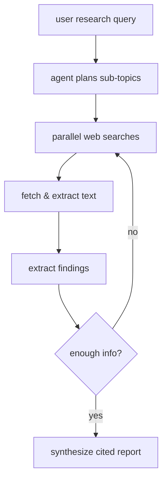
```mermaid
graph TD
    query[user research query] --> planner[agent plans sub-topics]
    planner --> search[parallel web searches]
    search --> read[fetch & extract text]
    read --> extract[extract findings]
    extract --> check{enough info?}
    check -->|no| search
    check -->|yes| write[synthesize cited report]
```
 the jarvis run plans the question into sub-topics, fires several search queries per round in parallel,
reads the top pages with [trafilatura](https://github.com/adbar/trafilatura), extracts findings, and rolls
them into an evolving cited report. this deeper loop is not the normal andromeda request and does not
run from a hidden aide research toggle.
- **calendar**: events in sqlite with recurrence expanded on the fly; optional two-way caldav sync if you install `caldav` and add credentials.
- **scheduled news**: enabled rss/atom sources are fetched through the guarded network client with
  etag/last-modified conditional requests. failures back off per source instead of blocking the whole
  run. canonical links, feed guids, and same-source content hashes prevent repeats; recent entries are
  clustered and ranked before an optional bounded model summary. a model failure leaves a link digest
  in `summary_pending`, home delivery is durable, jarvis retries are bounded, and library receives only
  items the owner explicitly saves.
- **gallery / photos**: you import photos; pillow makes thumbnails and reads exif; they're grouped into date "moments." stored as plain files under `data/`.
- **secrets**: entries sealed with aes-256-gcm under a pbkdf2-hmac-sha-256 (260k iterations) key derived from your master password, which lives in memory only.
- **automations & jobs**: a small background **job registry + event bus** ([`services/jobs.py`](services/jobs.py)) ticks the recurring work every 30 seconds: subscription renewals, day-event checks, scheduled reminders/messages, automation rules, and a periodic model-list refresh. rules live in the db and fire on events (mail arrived, doc saved, renewal soon, every morning). durable occurrence claims prevent duplicate work after a crash; ambiguous external results stop as `uncertain` instead of retrying blindly. new features can register their own jobs or react to events without wiring into the main loop.
- **push notifications**: web push implemented straight from the rfcs (vapid keys + message encryption) with **no third-party library**, so reminders, renewals, and scheduled messages reach you even with every tab closed.

---

## keyboard shortcuts & global search

| shortcut | does |
|---|---|
| **ctrl/cmd + k** | command palette: search everything (chats, docs, mail, tasks, calendar, money, subs, photos, …) + "ask aide" / "search with andromeda" |
| **/** | open the command palette when you are not typing in a field or aide's composer |
| **ctrl/cmd + o** | (in docs) quick-switch to any note by name |
| **ctrl/cmd + f** | (in docs) find & replace inside the current note |
| **ctrl/cmd + b** | toggle the sidebar |
| **ctrl/cmd + ,** | open settings |
| **ctrl/cmd + n** | new chat |
| **ctrl/cmd + enter** | send |
| **ctrl/cmd + b / i / e / k** | (in docs) bold / italic / inline-code / link |

shortcuts are remappable in settings. global search is one command palette across the whole suite: chats, docs, **mail** (over the local header cache, instant), tasks, calendar, contacts, memories, **money**, **subscriptions**, and **photos**, grouped by app, and clicking a result jumps to it in its app (even on another subdomain). local matches appear first; finance matches follow through a separate read from the active ledger, with a visible unavailable state if that read fails. it also carries two **action rails**: **ask aide** opens the query in aide, while **search with andromeda** opens the normal links-first search page. deeper research continues in aide after approval.

---

## the cli

a small command runs the server for you:

```
alles start         start in the background (waits until it's actually up)
alles stop          stop it
alles restart       restart it
alles status        running/stopped + url + reachability
alles logs [n]      print the last n log lines (default 60)
alles logs -f       follow the log live
alles update        stage + verify a fast-forward release, then health-check it
alles update rollback
                    restore the previous verified code and data
alles update accept accept a healthy update, keep its encrypted backup, and remove temp copies
alles install       build a private versioned runtime and user service (macos/linux)
alles uninstall     remove verified program files and keep personal data
alles open          open the browser
alles doctor        check the install is ready (deps, data dir, provider)
```

`alles doctor` is the first thing to run on a fresh checkout; it reports your python version, which required/optional deps are present, whether the data dir is writable, and whether an ai provider is configured yet, then tells you if you're good to `start`.

updates do not pull into a running install. alles fetches a pinned fast-forward commit into a detached worktree, compiles both the server and cli, runs a rollback-control probe, stops verified writers, creates an encrypted exact-data backup, and boots the migrated candidate twice before switching. the live checkout and health endpoint are rechecked before data moves. rollback is crash-resumable and refuses unknown processes, unrelated restores, dirty code, or a late edit; accepting an update keeps the encrypted backup and removes its temporary full copies.

on macos and linux, `alles install` publishes immutable release directories with one private venv per
release, an owned dispatcher/launcher, and a launchd or systemd-user definition. runtime, data,
visible vault/files folders, logs, and update state have separate paths. every removal target is
verified against the install and service ownership records before `alles uninstall` removes it;
personal data is kept by default. `--launcher-only` retains the older checkout-launcher path.

- **windows (powershell):** `.\alles.cmd start` (powershell needs the `.\`), or just `alles start` if the folder is on your `PATH`
- **windows (cmd):** `alles.cmd start`
- **macos / linux / git bash:** `./alles start`
- **anywhere:** `python app.py`

the launchers find `python3`/`python` on their own. add the alles folder to your `PATH` to type `alles` from any directory.

---

## configuration

you can start with no `.env` file. most preferences live in the interface and persist through `core/settings.py`. environment variable names are case-sensitive, so use the exact names below. the example file contains placeholder credentials; replace the relevant values before using it for a real connection.

| variable | default or behavior | purpose |
| --- | --- | --- |
| `ALLES_DATA` | checkout `data/` | private application state |
| `ALLES_DB` | `ALLES_DATA/aide.db` | explicit database override |
| `PORT` | `6769` | listening port |
| `ALLES_ACCESS_PROFILE` | `device` | device, lan, or public exposure |
| `ALLES_HOST` | `127.0.0.1` in device mode | listening interface; container device mode uses its internal interface |
| `AUTH_ENABLED` | off unless saved settings enable it | override for password login |
| `AUTH_PASSWORD` | no default owner password | owner password supplied through the environment |
| `SECRET_KEY` | development placeholder only when auth is off | required authentication configuration secret when auth is enabled |
| `BASE_DOMAIN` | `localhost` | base host for app subdomains |
| `ALLES_PUBLIC_URL` | unset | exact https public origin |
| `ALLES_TRUSTED_HOSTS` | narrow device hosts or configured policy | accepted host headers |
| `ALLES_FORWARDED_ALLOW_IPS` | unset | exact proxy addresses or cidrs trusted for forwarded headers |
| `ALLES_CORS_ORIGINS` | empty | exact additional browser origins; wildcards are rejected |
| `DEEPSEEK_API_KEY` | unset | deepseek endpoint bootstrap |
| `ANTHROPIC_API_KEY` | unset | anthropic endpoint bootstrap |
| `TAVILY_API_KEY` | unset | optional search credential |
| `ALLES_AFTERLIFE_FEATURES` | shipped defaults | strict comma-separated feature allow-list |
| `ALLES_VERSION` / `ALLES_BUILD_ID` | `development` / `local` | public build and recovery markers |
| `ALLES_RELOAD` | unset | development reload when set |
| `PYTHON_DOTENV_DISABLED` | unset | disable dotenv loading for isolated tools and tests |

the shipped defaults enable `afterlife_shell`, `afterlife_today`, `afterlife_aide_projects`, and `afterlife_andromeda`. `afterlife_jarvis` and `afterlife_storage_locations` default off. the old today flag is accepted but home stays enabled. a nonempty allow-list disables other flags unless you name them; unknown, blank, and repeated names are errors. [core/build_info.py](core/build_info.py) defines the behavior.

settings cover appearance, home layout, models, memory, owner instructions, connections, privacy, notifications, locale, voice, permissions, sandboxing, calendars, backups, and server controls. the [settings inventory](#settings-inventory) lists every top-level default key. font size, compact navigation, and some other interface choices are browser-local rather than server state.

server → search and models owns andromeda provider order and its independent answer/verifier roles. model endpoints use live catalogs or a manual list. a failed refresh retains the last good list with a stale state; a removed saved model does not silently switch an old run.

server → access policy edits only `ALLES_DATA/server-policy.json`. the schema accepts `owned_only` or `allowlisted_host` and exact launchd/systemd service ids, with no arbitrary command or path field. unsafe permissions, wrong ownership, symlinks, and malformed policies fail closed to owned services.

language, region, iana time zone, clock format, week start, and currency are separate preferences. owner content, provider text, and some specialist or advanced screens retain their source language. [services/localization.py](services/localization.py) defines the localization behavior. the about pane reads [credits/manifest.json](credits/manifest.json).

## architecture: one server, many subdomains


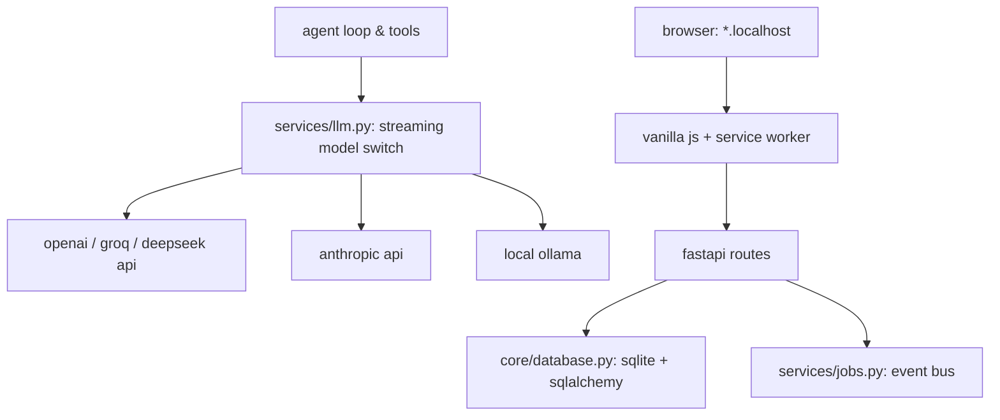
```mermaid
graph TD
    subagent["agent loop & tools"] --> llm_client["services/llm.py: streaming model switch"]
    llm_client --> openai["openai / groq / deepseek api"]
    llm_client --> anthropic["anthropic api"]
    llm_client --> ollama["local ollama"]

    app_router["fastapi routes"] --> core_db["core/database.py: sqlite + sqlalchemy"]
    app_router --> bg_jobs["services/jobs.py: event bus"]

    browser["browser: *.localhost"] --> pwa["vanilla js + service worker"]
    pwa --> app_router
```


alles is **one server** serving **one single-page app**. the main product homes use these canonical
addresses. related specialist views share a workbench without merging their records or apis:

```
localhost                home; ?app=andromeda opens search; apps opens the specialist launcher
aide.localhost           chat, scheduled/background work, projects, memory, skills, and aide reminders
andromeda.localhost      web search and verified overviews
docs.localhost           docs, scratch notes, and journal
files.localhost          files and personal photos
plan.localhost           calendar, tasks, and personal reminders
inbox.localhost          mail and contacts
library.localhost        books and read-later items
health.localhost         health / fitness log and habits
finance.localhost        money, subscriptions, and reviewed statement imports
passwords.localhost      the encrypted vault
server.localhost         monitoring, services, search/models, backups, updates, logs, activity, and watch
```

`home`, `today`, `system`, `secrets`, `vault`, `money`, `subs`, `subscriptions`, `notes`, `wiki`, `journal`,
`gallery`, `photos`, `activity`, `watch`, `days`, `cowork`, `jarvis`, `chat`, `calendar`, `tasks`, `reminders`, `mail`,
`contacts`, `read`, `books`, and `habits` remain compatibility subdomains. old `app=` and `view=` names
follow the same map. personal-media gallery goes to files → photos; ai-image gallery goes to aide →
creations. aide's reminder tool uses the non-colliding `aide-reminders` route, while the legacy
`reminders` name belongs to plan. these aliases remain in the current routing implementation.

`static/js/subdomain.js` maps each host to the views it shows; `app.js` scopes the shell and cross-jumps
between them. `*.localhost` is the local subdomain setup; a configured domain needs matching dns and
reverse-proxy routing.
the visible app name opens one navigation sheet with home, aide, andromeda, and the nine specialist
apps. it is the same button on single-host routes and subdomains; the workbench keeps its local tabs.

**one login across all of them.** because a cookie set for `localhost` isn't sent to `*.localhost`
subdomains, alles logs you in per-host and quietly relays the session with a one-time handoff code. the
relay accepts only known direct child hosts with the same protocol and port, and preserves the full
path, query, and hash. an expired or invalid code retries through the safe broker instead of dropping
the bookmark.

**on a real domain:** public access needs enabled owner authentication, `ALLES_ACCESS_PROFILE=public`, an exact https `ALLES_PUBLIC_URL`, explicit trusted hosts, and explicit forwarded-proxy addresses. set `BASE_DOMAIN` to the dotted base domain and route its app subdomains through your https reverse proxy. real-domain cookies use that domain with `Secure` and `HttpOnly`; [core/server_config.py](core/server_config.py) validates the access policy.

---

## the api (for other tools)

the browser uses the native `/api/` routes. external clients can use those same routes, or the openai-compatible `GET /v1/models` and `POST /v1/chat/completions` interface.

the [complete endpoint inventory](#complete-endpoint-inventory) lists every registered http operation and its handler. `/openapi.json` supplies the machine-readable request/response models; `/docs` and `/redoc` expose fastapi's schema viewers. handlers with generic dictionary inputs still apply their own validation.

json errors may contain `detail` and a stable `code`; legacy handlers also use normal fastapi errors. `401` means missing/invalid authentication, `403` means insufficient authority, `409` means a conflicting version/value/identity, and `410` marks a retired or deliberately deleted target. inspect the operation's response before deciding whether retry is safe.

api tokens are stored as hashes and use explicit `read`, `write`, `models`, `agent`, `secrets`, `connections`, or `admin` scopes. admin grants every scope. an invalid recognized bearer token fails instead of falling back to a cookie. [core/api_tokens.py](core/api_tokens.py) contains the exact prefix-to-scope mapping; individual dependencies can impose more requirements.

chat and tool execution use server-sent events. provider output is normalized into text, reasoning, tool calls, completion, and usage. higher-level streams also emit run, approval, question, status, and error events; native streams contain more event types than the openai-compatible interface.

`/api/shell/pty` is the registered websocket endpoint. it provides an interactive posix terminal in the chosen project/session environment. [routes/shell.py](routes/shell.py) checks authentication and browser origin before accepting it; binary terminal output and control messages are distinct from sse.

public share, booking, and rsvp routes sit outside the ordinary owner api gate and enforce their own link-specific rules.

## your data: where everything lives

local state defaults to **`ALLES_DATA`** (`data/` in a normal checkout). vault, files, photos, project, watch, and model-cache roots can deliberately point elsewhere, so they stay separate recovery boundaries:

- **`data/aide.db`**: a single sqlite database file (wal mode) holding the structured stuff.

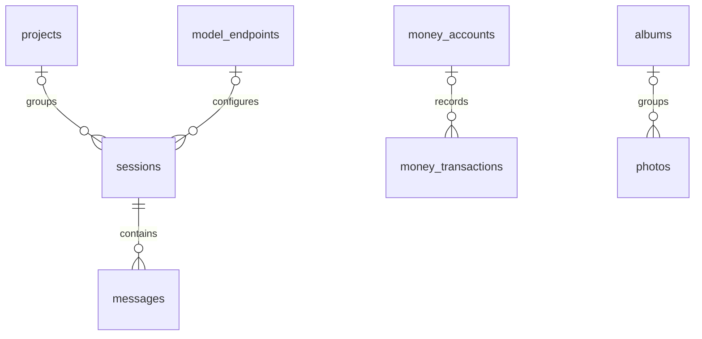
```mermaid
erDiagram
    projects |o--o{ sessions : groups
    model_endpoints |o--o{ sessions : configures
    sessions ||--o{ messages : contains
    money_accounts |o--o{ money_transactions : records
    albums |o--o{ photos : groups
```
the declared schema has **128 tables** covering: chat (`sessions`, `messages`, `model_endpoints`, `mcp_servers`), saved search snapshots and durable verification jobs (`andromeda_saved_searches`, `andromeda_verification_jobs`), notes/journal/tasks (`journal_entries`, `tasks`), calendar (`calendars`, `calendar_events`, `event_attendees`, `booking_pages`, `calendar_subscriptions`), money (`money_accounts`, `money_transactions`, `money_budgets`, `money_goals`, `money_holdings`, `money_recurring`, …), subscriptions (`subscriptions`, `sub_payments`, `sub_price_changes`), contacts (`contacts`, `contact_fields`, `contact_groups`), mail (`mail_accounts`, `mail_drafts`, `cached_messages`, `mail_rules`, `mail_scheduled`), scheduled news (`news_configuration`, `news_sources`, `news_entries`, `news_briefs`), photos (`albums`, `photos`), the vault (`vaults`, `vault_entries`, `vault_attachments`, `webauthn_credentials`, `browser_connections`), durable jarvis state (`jarvis_workflows`, `jarvis_triggers`, `jarvis_runs`, `jarvis_run_events`, `jarvis_run_prompts`, `jarvis_delivery_attempts`, `jarvis_connectors`, `jarvis_inbox_events`, capability grants and delegated actions), plus `personas`, `projects`, `memories`, `reminders`, `automation_rules`, `automation_attempts`, `day_events`, `habits`, `health_entries`, `books`, `read_items`, `monitors`, `webhooks`, `api_tokens`, `connections`, and more.
- **`data/vault/`**: your docs as plain `.md` files (with `_assets/` for embedded images and `_templates/` for templates).
- **`data/skills/`**: agent skills as `SKILL.md` files (frontmatter + steps).
- **`data/`** (other): uploads, photos, gallery, and file-app content as plain files; `server-policy.json`
  is the owner-only, exact-schema server control policy; `webdav_backup.json` stores the visible collection
  url and username plus a sealed password; `s3_backup.json` stores the visible endpoint, region, bucket,
  prefix, and addressing style plus a sealed access-key pair; **`data/secret.key`** is the encryption key
  for stored credentials.

*under the hood:* the schema is sqlalchemy models in [`core/database.py`](core/database.py) with versioned migrations. server-side secrets (model api keys, mail passwords) are sealed at rest with aes-256-gcm under `data/secret.key`. settings → backup first snapshots sqlite, freezes keys and dependent config/files, and authenticates every known encrypted credential before creating an encrypted `.alles-backup` with a hashed manifest. a configured external markdown vault is copied into a verified snapshot; if it changes during that copy, backup stops, and recovery remaps the captured vault under the new alles data root instead of writing to the old external path. save the recovery key separately. manual webdav backup uploads through a unique temporary name, moves without overwrite, then streams the saved file back to verify its exact size and sha-256. manual s3-compatible backup signs each request with sigv4, conditionally uploads and copies a unique object without overwrite, and performs the same full read-back; the first version is limited to 5 gb per artifact. remote restore lists generated alles backups, downloads one into private staging, and uses the same verification path as local restore. restore boots and migrates staged data twice, swaps only while writers are stopped, health-checks the installed copy, and automatically puts the original data back if validation fails.

first-run protection can opt into an automatic encrypted local backup folder that neither
contains nor sits inside `ALLES_DATA`. the folder also cannot contain alles' private backup
work area. the registered job checks hourly, creates at most one artifact every 24 hours,
and writes temporary plaintext only in owner-private work beside the data folder. it
publishes only an encrypted artifact, retains seven alles-owned automatic artifacts, and
never prunes unrelated files. if the process dies, the next job check removes its own
abandoned private work even when another backup is not due.

### backup root roles

the backup manifest records each root's purpose. an excluded root still appears in the manifest so
recovery can explain what the archive contains.

| role | backup policy |
| --- | --- |
| `data` | include the managed `ALLES_DATA` tree and a consistent sqlite snapshot |
| `vault` | include the markdown vault; freeze external vaults and restore them under the new data root |
| `files` | include the default files root when it is inside `ALLES_DATA`; exclude external bytes |
| `photos` | include managed photos when selected, or when overlap with another included root requires it |
| `photos_watch` | exclude the source folder; imported copies follow the photos policy |
| `agent_allowed_roots` | record permission roots without copying their contents |
| `project_workspaces` | retain path metadata in sqlite; exclude workspace contents |
| `photokit_library` | exclude the system photos library; imported copies follow the photos policy |
| `remote_services` | include local configuration and cache; exclude the remote service's authoritative copy |
| `webdav` | record the backup destination; exclude its remote contents |
| `s3` | record the backup destination; exclude its remote objects |
| `model_cache` | exclude rebuildable model caches |
| `codex_home` | exclude separate tool state |
| `recovery_work` | exclude staging, exports, journals, and rollback work to prevent recursive backups |

### current trust map

alles is one fastapi owner process with a browser client. sqlite owns structured state; the markdown
vault owns human-authored knowledge; configured files and photos roots own managed bytes. models,
search, mail, calendars, contacts, mcp peers, notification providers, public links, native helpers, and
external folders are separate trust zones. their input is data, not trusted instruction.

see [runtime and backend](#runtime-and-backend) for request handling and
[security](#security--read-before-exposing-it) for access boundaries. the endpoint and job inventories
below list the registered public surfaces and background work.

---

## how it's built

the main app runs on python 3.11 or newer with fastapi, uvicorn, sqlalchemy, and sqlite. the browser loads html, css, and native javascript modules directly. there is no frontend compilation step for normal use.

[requirements.txt](requirements.txt) pins direct python dependencies; [requirements.lock](requirements.lock) records the install set. httpx handles model/integration requests, fastembed provides local embeddings, pillow handles images, and document readers support imports and exports. optional packages enable local speech recognition, caldav, computer use, semantic photo search, and face recognition.

[static/vendor/](static/vendor) contains bundled editor, map, terminal, and other reviewed browser assets. licenses and notices live in [third_party_notices.md](THIRD_PARTY_NOTICES.md) and [credits/manifest.json](credits/manifest.json).

the optional actual integration is a separate node bridge pinned through [integrations/actual/package.json](integrations/actual/package.json) and its lockfile. it requires node 22.12.0 or newer and uses the official actual api, cli, and sync server at the versions recorded there.

[mobile/](mobile) contains a capacitor wrapper with its own dependencies and platform build steps. it wraps the server-backed app; the fastapi backend still runs on the host. the chromium password companion has its own manifest and pairing boundary under [extension/](extension).

## project layout

| path | responsibility |
| --- | --- |
| [app.py](app.py) | route registration, middleware, lifespan, periodic jobs, static shell |
| [cli.py](cli.py), [alles](alles), [alles.cmd](alles.cmd) | process and installation commands |
| [core/database.py](core/database.py) | models, sessions, database initialization |
| [core/migrations/](core/migrations) | ordered schema migrations and history validation |
| [core/settings.py](core/settings.py) | server preferences and sealed persistence |
| [core/auth.py](core/auth.py), [core/api_tokens.py](core/api_tokens.py) | owner sessions, password rules, token scopes |
| [core/server_config.py](core/server_config.py), [core/access_middleware.py](core/access_middleware.py) | profile, host, origin, proxy, and https constraints |
| [routes/](routes) | feature http/websocket handlers |
| [services/](services) | domain operations, providers, execution, storage, recovery, jobs |
| [static/index.html](static/index.html) | shared browser shell |
| [static/js/](static/js) | feature modules and common browser helpers |
| [static/style.css](static/style.css), [static/kokuen.css](static/kokuen.css) | app styles and semantic tokens |
| [static/sw.js](static/sw.js) | offline shell, selected write queue, push |
| [static/vendor/](static/vendor) | bundled browser dependencies |
| [integrations/actual/](integrations/actual) | optional actual node bridge |
| [extension/](extension), [mobile/](mobile) | password extension and mobile wrapper |
| [features/](features) | behavior and coverage registries |
| [design-system/](design-system) | product rules, components, accessibility, responsive behavior, qa |
| [scripts/](scripts) | inventory generation, lint helpers, browser gates, diagnostics |
| [tests/](tests) | python, javascript, api, integration, browser checks |
| [docs/](docs) | product screenshots, readme translations, test-referenced prototypes |

runtime data belongs under the private data root or explicitly selected external roots. [the data section](#your-data-where-everything-lives) explains what recovery needs to capture.

## security — read before exposing it

alles is built for **one person on their own machine.** read this before you put it on a network.

- **local device access is the default.** authentication is off on a fresh install and the device profile binds to loopback. if alles is reachable beyond localhost, set `AUTH_ENABLED=true`, a strong `AUTH_PASSWORD`, and a real `SECRET_KEY` **first**. without auth, anyone who can reach the port can read your mail and files and run shell commands as you.
- **owner login uses bcrypt.** password hashes use 12 rounds. password setup requires at least 12 characters. sessions are random server-held tokens with a 30-day lifetime and an httponly cookie; restarting the owner process clears them. sensitive actions can require password confirmation within the last ten minutes.
- **login is rate-limited.** a single ip that fails the password eight times in five minutes is blocked with `429`. this throttle is process-local and resets on restart.
- **aide has hands.** automatic and background aide work plus shell tools can run real commands on the machine alles is on. that's the point, but do not hand access to people or models you do not trust. changes still follow the configured approval boundary. the prompt-injection guard reduces the risk of malicious content steering the tool loop, but treat it as a seatbelt, not a force field.
- **credentials are encrypted at rest with a local key.** model, mail, connector, mcp, dav, and sensitive settings credentials are sealed with aes-256-gcm under `data/secret.key`. this protects one database or config file if it leaks *on its own*; it does **not** protect against someone who has the whole `data/` folder, because the server must be able to decrypt unattended.
- **new full backups fail closed on credential damage.** backup creation rejects plaintext known credentials, missing/corrupt keys, changed ciphertext, wrong field binding, and linked dependency files. historical plaintext archives can still stage so the current app can migrate them safely.
- **full backups are encrypted before download, webdav upload, or s3-compatible upload.** the encrypted container includes the database, required application keys, selected managed files, and a hashed manifest. the recovery-key file is never printed in logs or uploaded separately or in plaintext; export it once and keep that copy away from the server. old plaintext zip backups can still be safely staged for compatibility.
- **the password vault has its own key.** [services/crypto.py](services/crypto.py) derives a 32-byte key from the master password using pbkdf2-hmac-sha-256 with 260,000 iterations. each encrypted payload has a fresh 16-byte salt and 12-byte nonce. entries use aes-256-gcm; unlocking keeps the master password in an expiring in-memory context. the server credential key does not unlock vault entries.
- **network guards depend on the operation.** ordinary guarded integrations block loopback, link-local, reserved, multicast, and unspecified addresses while allowing private lan targets for self-hosted services. public-only fetches, including search images, also reject private targets. [services/net_guard.py](services/net_guard.py) contains these policies and redirect handling.
- **the old browser-autofill token stays retired.** `/api/vault/match` revokes the exact pasted vault token and returns `410 Gone` without credential data. its replacement pairs a named browser with a hashed narrow device secret, then requires a separate unlocked-vault owner approval for each five-minute in-memory/session-storage fill session. it requests the chosen alles host plus `activeTab`, ships no permanent all-site content script, matches exact normalized scheme/host/effective port, returns metadata before one selected release, injects only frame 0, and never submits. lock, browser/server restart, computer lock, or revoke removes fill authority.
- **protected public shares use slow password hashes.** share passwords use bcrypt and are submitted outside the url. expiry dates normalize to utc and invalid dates fail closed. ten unlock attempts per ip and share are allowed every five minutes. a correct password creates a one-hour, in-memory, httponly cookie bound to that link and password version; changing or revoking the share invalidates existing unlocks.
- this reference describes implemented boundaries; it does not establish an independent security audit of every provider, platform, or deployment.

---

## performance & reliability

the main mechanisms are:

- **streamed model output**: chat and agent responses use sse so text can appear before the run finishes
- **endpoint cooldown**: two recorded failures trigger a 20-second host cooldown; model fallback still follows resolver constraints
- **mail**: connection pooling, read caching, body-only fetches, and a change-detecting poll
- **service worker**: code and styles prefer the network, with cache fallback; other static assets can use cached bytes while refreshing. public share viewers stay live so cached pages cannot bypass revocation
- **agent context trimming**: older tool output is shortened during long runs; the model's actual context limit still applies
- **migrations and recovery**: version history, staging, maintenance locks, and rollback paths protect supported upgrades and restores. an unsuccessful validation remains a failure
- **partial availability**: search can try configured fallbacks, and optional integrations report their own unavailable state. an offline browser can load cached ui; it still needs a reachable server for uncached data, connected apps, and model execution

---

## testing

run checks with temporary `ALLES_DATA` and dotenv loading disabled so imports and server instances stay away from normal private settings and data.

```bash
python - <<'PYTEST'
import os
import subprocess
import tempfile

with tempfile.TemporaryDirectory(prefix="alles-tests-") as data:
    env = dict(
        os.environ,
        ALLES_DATA=data,
        PYTHON_DOTENV_DISABLED="1",
    )
    env.pop("ALLES_DB", None)
    subprocess.run(
        ["python", "-m", "unittest", "discover", "-s", "tests", "-v"],
        env=env,
        check=True,
    )
PYTEST
ruff check .
ruff format --check .
node --test tests/js/*.test.mjs
```

python checks cover domain operations, math, migrations, api handlers, permissions, adapters, files, backups, and restart/retry behavior. javascript checks cover navigation, state, controls, drafts, and offline decisions. in-process api checks do not prove real-provider behavior or browser layout.

[scripts/run_browser_gates.py](scripts/run_browser_gates.py) owns temporary data and nonconflicting ports for the maintained smoke/full browser suites. native and external-provider gates can require additional software, credentials, or a real owner device.

[.github/workflows/tests.yml](.github/workflows/tests.yml) declares python, ruff, javascript, and browser jobs for main/dev pushes, pull requests, and manual runs. a workflow or route being declared does not establish that a particular run passed.

[features/registry.json](features/registry.json) records behavior and test ownership. the catalog, interaction-map, and control-census generators accept `--output-dir` for local reports; tests generate and validate their output in temporary directories. development plans and review evidence stay local; this specification describes implemented behavior.

## complete endpoint inventory

the registered http operations are grouped by handler source. use `/openapi.json` for payload models and [the api section](#the-api-for-other-tools) for authentication/streaming semantics. paths keep fastapi converter syntax: `{subpath:path}` accepts multiple path segments, while openapi shows the parameter as `{subpath}`.

900 http operations across 83 source files, plus one websocket endpoint.

the compatibility snapshot locks the registered http surface:

- 83 included fastapi router modules
- 907 http method/path pairs
- 890 `/api/*`, 2 `/v1/*`, and 15 non-api shell/public pairs
- sha-256: `7afc73dd69ef226c7097d1c2ec80f5c3c5475b05e386399150f89a389ba6de15`

<details>
<summary>app.py · 6 operations</summary>

[source](app.py)

| method | path | handler |
| --- | --- | --- |
| `GET` | `/` | `index` |
| `GET` | `/api/ping` | `ping` |
| `GET` | `/api/pwa/precache` | `pwa_precache` |
| `GET` | `/health` | `health` |
| `GET` | `/manifest.json` | `manifest` |
| `GET` | `/sw.js` | `service_worker` |

</details>

<details>
<summary>routes/agent.py · 13 operations</summary>

[source](routes/agent.py)

| method | path | handler |
| --- | --- | --- |
| `GET` | `/api/agent/files` | `agent_files` |
| `POST` | `/api/agent/permission/{request_id}` | `agent_permission` |
| `POST` | `/api/agent/questions/{request_id}/answer` | `agent_question_answer` |
| `GET` | `/api/agent/runs` | `runs` |
| `GET` | `/api/agent/runs/active` | `active_run` |
| `GET` | `/api/agent/runs/analysis` | `runs_analysis` |
| `GET` | `/api/agent/runs/incomplete` | `incomplete_runs` |
| `GET` | `/api/agent/runs/{run_id}` | `run_detail` |
| `GET` | `/api/agent/runs/{run_id}/events` | `run_events` |
| `GET` | `/api/agent/runs/{run_id}/replay-plan` | `run_replay_plan` |
| `POST` | `/api/agent/runs/{run_id}/revert` | `agent_revert` |
| `GET` | `/api/agent/runs/{run_id}/sources` | `run_sources` |
| `GET` | `/api/agent/status` | `status` |

</details>

<details>
<summary>routes/andromeda.py · 16 operations</summary>

[source](routes/andromeda.py)

| method | path | handler |
| --- | --- | --- |
| `POST` | `/api/andromeda/deep-research` | `deep_research` |
| `GET` | `/api/andromeda/deep-research/preview` | `deep_research_preview` |
| `GET` | `/api/andromeda/media` | `media` |
| `POST` | `/api/andromeda/models/qualify` | `qualify_local_model` |
| `POST` | `/api/andromeda/overview` | `overview` |
| `GET` | `/api/andromeda/overview/preview` | `overview_preview` |
| `GET` | `/api/andromeda/providers` | `providers` |
| `GET` | `/api/andromeda/saved` | `list_saved` |
| `POST` | `/api/andromeda/saved` | `save_search` |
| `DELETE` | `/api/andromeda/saved/{search_id}` | `delete_saved` |
| `GET` | `/api/andromeda/saved/{search_id}` | `get_saved` |
| `POST` | `/api/andromeda/search` | `search` |
| `POST` | `/api/andromeda/verification` | `start_verification` |
| `POST` | `/api/andromeda/verification/preview` | `verification_preview` |
| `GET` | `/api/andromeda/verification/{job_id}` | `get_verification` |
| `POST` | `/api/andromeda/verification/{job_id}/cancel` | `cancel_verification` |

</details>

<details>
<summary>routes/api_tokens.py · 3 operations</summary>

[source](routes/api_tokens.py)

| method | path | handler |
| --- | --- | --- |
| `GET` | `/api/tokens` | `list_tokens` |
| `POST` | `/api/tokens` | `create_token` |
| `DELETE` | `/api/tokens/{tid}` | `delete_token` |

</details>

<details>
<summary>routes/appearance.py · 2 operations</summary>

[source](routes/appearance.py)

| method | path | handler |
| --- | --- | --- |
| `GET` | `/api/appearance` | `get_appearance` |
| `PUT` | `/api/appearance` | `put_appearance` |

</details>

<details>
<summary>routes/auth.py · 10 operations</summary>

[source](routes/auth.py)

| method | path | handler |
| --- | --- | --- |
| `POST` | `/api/auth/change-password` | `change_password` |
| `POST` | `/api/auth/config` | `set_auth_config` |
| `POST` | `/api/auth/context-handoff` | `create_context_handoff` |
| `POST` | `/api/auth/context-handoff/{code}` | `consume_context_handoff` |
| `GET` | `/api/auth/handoff` | `handoff` |
| `POST` | `/api/auth/login` | `login` |
| `POST` | `/api/auth/logout` | `logout` |
| `GET` | `/api/auth/me` | `me` |
| `POST` | `/api/auth/reauth` | `reauth` |
| `GET` | `/api/auth/redeem` | `redeem` |

</details>

<details>
<summary>routes/automations.py · 7 operations</summary>

[source](routes/automations.py)

| method | path | handler |
| --- | --- | --- |
| `GET` | `/api/automations` | `list_rules` |
| `POST` | `/api/automations` | `create_rule` |
| `GET` | `/api/automations/options` | `options` |
| `DELETE` | `/api/automations/{rid}` | `delete_rule` |
| `PATCH` | `/api/automations/{rid}` | `patch_rule` |
| `GET` | `/api/automations/{rid}/attempts` | `list_attempts` |
| `POST` | `/api/automations/{rid}/test` | `test_rule` |

</details>

<details>
<summary>routes/backup.py · 17 operations</summary>

[source](routes/backup.py)

| method | path | handler |
| --- | --- | --- |
| `GET` | `/api/backup` | `export_backup` |
| `GET` | `/api/backup/recovery-key` | `export_recovery_key` |
| `POST` | `/api/backup/restore` | `restore_backup` |
| `DELETE` | `/api/backup/restores/{restore_id}` | `cancel_restore` |
| `GET` | `/api/backup/restores/{restore_id}` | `restore_status` |
| `DELETE` | `/api/backup/s3` | `disconnect_s3` |
| `GET` | `/api/backup/s3` | `s3_status` |
| `PUT` | `/api/backup/s3` | `configure_s3` |
| `GET` | `/api/backup/s3/backups` | `list_s3_backups` |
| `POST` | `/api/backup/s3/restore` | `restore_s3_backup` |
| `POST` | `/api/backup/s3/run` | `run_s3_backup` |
| `DELETE` | `/api/backup/webdav` | `disconnect_webdav` |
| `GET` | `/api/backup/webdav` | `webdav_status` |
| `PUT` | `/api/backup/webdav` | `configure_webdav` |
| `GET` | `/api/backup/webdav/backups` | `list_webdav_backups` |
| `POST` | `/api/backup/webdav/restore` | `restore_webdav_backup` |
| `POST` | `/api/backup/webdav/run` | `run_webdav_backup` |

</details>

<details>
<summary>routes/books.py · 7 operations</summary>

[source](routes/books.py)

| method | path | handler |
| --- | --- | --- |
| `POST` | `/api/books` | `create_book` |
| `PUT` | `/api/books/goal` | `set_goal` |
| `POST` | `/api/books/import` | `import_books` |
| `GET` | `/api/books/lookup` | `lookup` |
| `GET` | `/api/books/overview` | `overview` |
| `DELETE` | `/api/books/{bid}` | `delete_book` |
| `PATCH` | `/api/books/{bid}` | `update_book` |

</details>

<details>
<summary>routes/briefing.py · 2 operations</summary>

[source](routes/briefing.py)

| method | path | handler |
| --- | --- | --- |
| `GET` | `/api/briefing` | `preview` |
| `POST` | `/api/briefing/send` | `send_now` |

</details>

<details>
<summary>routes/browser_passwords.py · 17 operations</summary>

[source](routes/browser_passwords.py)

| method | path | handler |
| --- | --- | --- |
| `POST` | `/api/auth/browser/disconnect` | `device_disconnect` |
| `POST` | `/api/auth/browser/lock` | `device_lock` |
| `POST` | `/api/auth/browser/match` | `match` |
| `POST` | `/api/auth/browser/pair/ack` | `pair_ack` |
| `POST` | `/api/auth/browser/pair/poll` | `pair_poll` |
| `POST` | `/api/auth/browser/pair/start` | `pair_start` |
| `POST` | `/api/auth/browser/release` | `release` |
| `POST` | `/api/auth/browser/unlock/poll` | `unlock_poll` |
| `POST` | `/api/auth/browser/unlock/start` | `unlock_start` |
| `GET` | `/api/vault/browsers` | `owner_status` |
| `GET` | `/api/vault/browsers/extension` | `download_extension` |
| `DELETE` | `/api/vault/browsers/pairings/{pairing_id}` | `cancel_pairing` |
| `POST` | `/api/vault/browsers/pairings/{pairing_id}/approve` | `approve_pairing` |
| `DELETE` | `/api/vault/browsers/unlock-requests/{request_id}` | `cancel_unlock` |
| `POST` | `/api/vault/browsers/unlock-requests/{request_id}/approve` | `approve_unlock` |
| `DELETE` | `/api/vault/browsers/{connection_id}` | `owner_revoke` |
| `POST` | `/api/vault/browsers/{connection_id}/lock` | `owner_lock` |

</details>

<details>
<summary>routes/caldav.py · 3 operations</summary>

[source](routes/caldav.py)

| method | path | handler |
| --- | --- | --- |
| `POST` | `/api/caldav/connect` | `connect` |
| `GET` | `/api/caldav/status` | `status` |
| `POST` | `/api/caldav/sync` | `sync` |

</details>

<details>
<summary>routes/calendar.py · 26 operations</summary>

[source](routes/calendar.py)

| method | path | handler |
| --- | --- | --- |
| `GET` | `/api/calendar` | `list_events` |
| `POST` | `/api/calendar` | `create_event` |
| `GET` | `/api/calendar/agenda` | `agenda` |
| `DELETE` | `/api/calendar/attendees/{aid}` | `delete_attendee` |
| `GET` | `/api/calendar/birthdays` | `calendar_birthdays` |
| `GET` | `/api/calendar/booking-pages` | `list_booking_pages` |
| `POST` | `/api/calendar/booking-pages` | `create_booking_page` |
| `DELETE` | `/api/calendar/booking-pages/{bid}` | `delete_booking_page` |
| `GET` | `/api/calendar/conflicts` | `calendar_conflicts` |
| `GET` | `/api/calendar/export.ics` | `export_ics` |
| `GET` | `/api/calendar/free` | `free_time` |
| `GET` | `/api/calendar/free-slots` | `calendar_free_slots` |
| `POST` | `/api/calendar/import` | `import_ics` |
| `POST` | `/api/calendar/quick` | `quick_event` |
| `GET` | `/api/calendar/subscriptions` | `list_subscriptions` |
| `POST` | `/api/calendar/subscriptions` | `create_subscription` |
| `DELETE` | `/api/calendar/subscriptions/{sid}` | `delete_subscription` |
| `POST` | `/api/calendar/subscriptions/{sid}/refresh` | `refresh_subscription_endpoint` |
| `GET` | `/api/calendar/tasks` | `calendar_tasks` |
| `DELETE` | `/api/calendar/{eid}` | `delete_event` |
| `PATCH` | `/api/calendar/{eid}` | `update_event` |
| `GET` | `/api/calendar/{eid}/attendees` | `list_attendees` |
| `POST` | `/api/calendar/{eid}/duplicate` | `duplicate_event` |
| `POST` | `/api/calendar/{eid}/invite` | `invite` |
| `GET` | `/api/calendar/{eid}/invite-suggestions` | `invite_suggestions` |
| `POST` | `/api/calendar/{eid}/meeting-link` | `add_meeting_link` |

</details>

<details>
<summary>routes/calendars.py · 4 operations</summary>

[source](routes/calendars.py)

| method | path | handler |
| --- | --- | --- |
| `GET` | `/api/calendars` | `list_calendars` |
| `POST` | `/api/calendars` | `create_calendar` |
| `DELETE` | `/api/calendars/{cid}` | `delete_calendar` |
| `PATCH` | `/api/calendars/{cid}` | `update_calendar` |

</details>

<details>
<summary>routes/capabilities.py · 2 operations</summary>

[source](routes/capabilities.py)

| method | path | handler |
| --- | --- | --- |
| `GET` | `/api/capabilities` | `list_capabilities` |
| `GET` | `/api/capabilities/extras` | `list_extras` |

</details>

<details>
<summary>routes/carddav.py · 5 operations</summary>

[source](routes/carddav.py)

| method | path | handler |
| --- | --- | --- |
| `POST` | `/api/carddav/connect` | `connect` |
| `POST` | `/api/carddav/disconnect` | `disconnect` |
| `POST` | `/api/carddav/interval` | `set_interval` |
| `GET` | `/api/carddav/status` | `status` |
| `POST` | `/api/carddav/sync` | `sync` |

</details>

<details>
<summary>routes/chains.py · 4 operations</summary>

[source](routes/chains.py)

| method | path | handler |
| --- | --- | --- |
| `GET` | `/api/chains` | `list_chains` |
| `POST` | `/api/chains` | `create_chain` |
| `DELETE` | `/api/chains/{cid}` | `delete_chain` |
| `POST` | `/api/chains/{cid}/run` | `run_chain` |

</details>

<details>
<summary>routes/chat.py · 5 operations</summary>

[source](routes/chat.py)

| method | path | handler |
| --- | --- | --- |
| `POST` | `/api/agent/background` | `chat_background` |
| `GET` | `/api/aide/suggestions` | `aide_suggestions` |
| `POST` | `/api/chat` | `chat` |
| `POST` | `/api/chat/rewrite` | `rewrite_last` |
| `POST` | `/api/chat/stop/{session_id}` | `stop_chat` |

</details>

<details>
<summary>routes/code.py · 2 operations</summary>

[source](routes/code.py)

| method | path | handler |
| --- | --- | --- |
| `POST` | `/api/code/reindex` | `code_reindex` |
| `GET` | `/api/code/search` | `code_search` |

</details>

<details>
<summary>routes/compare.py · 5 operations</summary>

[source](routes/compare.py)

| method | path | handler |
| --- | --- | --- |
| `POST` | `/api/compare` | `start_compare` |
| `GET` | `/api/compare/stats` | `compare_stats` |
| `POST` | `/api/compare/vote` | `record_vote` |
| `DELETE` | `/api/compare/{compare_id}` | `stop_compare` |
| `GET` | `/api/compare/{compare_id}/stream/{idx}` | `compare_stream` |

</details>

<details>
<summary>routes/connections.py · 5 operations</summary>

[source](routes/connections.py)

| method | path | handler |
| --- | --- | --- |
| `GET` | `/api/connections` | `list_conns` |
| `POST` | `/api/connections` | `add_conn` |
| `POST` | `/api/connections/rotate-key` | `rotate_connection_key` |
| `DELETE` | `/api/connections/{conn_id}` | `del_conn` |
| `GET` | `/api/connections/{service}/test` | `test_conn` |

</details>

<details>
<summary>routes/contacts.py · 27 operations</summary>

[source](routes/contacts.py)

| method | path | handler |
| --- | --- | --- |
| `GET` | `/api/contacts` | `list_contacts` |
| `POST` | `/api/contacts` | `create_contact` |
| `GET` | `/api/contacts/birthdays` | `upcoming_birthdays` |
| `GET` | `/api/contacts/duplicates` | `duplicates` |
| `GET` | `/api/contacts/export` | `export_contacts` |
| `GET` | `/api/contacts/groups` | `list_groups` |
| `POST` | `/api/contacts/groups` | `create_group` |
| `DELETE` | `/api/contacts/groups/{gid}` | `delete_group` |
| `GET` | `/api/contacts/groups/{gid}/members` | `group_members` |
| `POST` | `/api/contacts/groups/{gid}/members` | `add_member` |
| `DELETE` | `/api/contacts/groups/{gid}/members/{cid}` | `remove_member` |
| `POST` | `/api/contacts/import` | `import_contacts` |
| `GET` | `/api/contacts/me` | `get_me` |
| `POST` | `/api/contacts/merge` | `merge_contacts` |
| `DELETE` | `/api/contacts/{cid}` | `delete_contact` |
| `GET` | `/api/contacts/{cid}` | `get_contact` |
| `PATCH` | `/api/contacts/{cid}` | `patch_contact` |
| `DELETE` | `/api/contacts/{cid}/avatar` | `delete_avatar` |
| `GET` | `/api/contacts/{cid}/avatar` | `get_avatar` |
| `POST` | `/api/contacts/{cid}/avatar` | `set_avatar` |
| `GET` | `/api/contacts/{cid}/events` | `contact_events` |
| `GET` | `/api/contacts/{cid}/fields` | `list_fields` |
| `POST` | `/api/contacts/{cid}/fields` | `add_field` |
| `DELETE` | `/api/contacts/{cid}/fields/{fid}` | `delete_field` |
| `POST` | `/api/contacts/{cid}/links` | `contact_link` |
| `DELETE` | `/api/contacts/{cid}/links/{other_id}` | `contact_unlink` |
| `GET` | `/api/contacts/{cid}/related` | `contact_related` |

</details>

<details>
<summary>routes/cookbook.py · 4 operations</summary>

[source](routes/cookbook.py)

| method | path | handler |
| --- | --- | --- |
| `GET` | `/api/cookbook` | `list_entries` |
| `POST` | `/api/cookbook` | `create_entry` |
| `DELETE` | `/api/cookbook/{eid}` | `delete_entry` |
| `PATCH` | `/api/cookbook/{eid}` | `update_entry` |

</details>

<details>
<summary>routes/days.py · 4 operations</summary>

[source](routes/days.py)

| method | path | handler |
| --- | --- | --- |
| `GET` | `/api/days` | `list_days` |
| `POST` | `/api/days` | `create_day` |
| `DELETE` | `/api/days/{eid}` | `delete_day` |
| `PATCH` | `/api/days/{eid}` | `update_day` |

</details>

<details>
<summary>routes/delegation.py · 6 operations</summary>

[source](routes/delegation.py)

| method | path | handler |
| --- | --- | --- |
| `GET` | `/api/delegation/actions` | `list_actions` |
| `POST` | `/api/delegation/actions/{action_id}/decision` | `action_decision` |
| `GET` | `/api/delegation/events` | `list_events` |
| `GET` | `/api/delegation/grants` | `list_grants` |
| `POST` | `/api/delegation/grants` | `add_grant` |
| `DELETE` | `/api/delegation/grants/{grant_id}` | `remove_grant` |

</details>

<details>
<summary>routes/export.py · 2 operations</summary>

[source](routes/export.py)

| method | path | handler |
| --- | --- | --- |
| `GET` | `/api/export` | `list_kinds` |
| `GET` | `/api/export/{kind}` | `export_kind` |

</details>

<details>
<summary>routes/file_operations.py · 8 operations</summary>

[source](routes/file_operations.py)

| method | path | handler |
| --- | --- | --- |
| `GET` | `/api/files/operations` | `list_operations` |
| `POST` | `/api/files/operations` | `create_operation` |
| `DELETE` | `/api/files/operations/{operation_id}` | `discard_operation` |
| `GET` | `/api/files/operations/{operation_id}` | `get_operation` |
| `POST` | `/api/files/operations/{operation_id}/cancel` | `cancel_operation` |
| `POST` | `/api/files/operations/{operation_id}/retry` | `retry_operation` |
| `POST` | `/api/files/operations/{operation_id}/run` | `run_operation` |
| `POST` | `/api/files/operations/{operation_id}/undo` | `undo_operation` |

</details>

<details>
<summary>routes/files.py · 29 operations</summary>

[source](routes/files.py)

| method | path | handler |
| --- | --- | --- |
| `GET` | `/api/files/activity` | `activity` |
| `GET` | `/api/files/by-tag` | `files_by_tag` |
| `GET` | `/api/files/comments` | `list_comments` |
| `POST` | `/api/files/comments` | `add_comment` |
| `DELETE` | `/api/files/comments/{cid}` | `delete_comment` |
| `POST` | `/api/files/comments/{cid}/resolve` | `resolve_comment` |
| `DELETE` | `/api/files/delete` | `delete` |
| `GET` | `/api/files/duplicates` | `duplicates` |
| `GET` | `/api/files/list` | `list_files` |
| `POST` | `/api/files/mkdir` | `mkdir` |
| `GET` | `/api/files/preview` | `preview` |
| `GET` | `/api/files/quota` | `quota` |
| `GET` | `/api/files/raw` | `raw_file` |
| `GET` | `/api/files/read` | `read_file` |
| `POST` | `/api/files/rename` | `rename` |
| `GET` | `/api/files/search` | `search_files` |
| `GET` | `/api/files/smart/{kind}` | `smart_folder` |
| `PUT` | `/api/files/star` | `set_star` |
| `GET` | `/api/files/starred` | `list_starred` |
| `GET` | `/api/files/tags` | `get_tags` |
| `PUT` | `/api/files/tags` | `set_tags` |
| `GET` | `/api/files/tags/all` | `all_tags` |
| `POST` | `/api/files/to-photos` | `to_photos` |
| `GET` | `/api/files/trash` | `list_trash` |
| `POST` | `/api/files/trash/purge` | `purge_trash` |
| `POST` | `/api/files/trash/restore` | `restore_trash` |
| `POST` | `/api/files/upload` | `upload` |
| `GET` | `/api/files/versions` | `list_versions` |
| `POST` | `/api/files/versions/restore` | `restore_version` |

</details>

<details>
<summary>routes/finance_actual.py · 8 operations</summary>

[source](routes/finance_actual.py)

| method | path | handler |
| --- | --- | --- |
| `GET` | `/api/finance/actual` | `actual_status` |
| `POST` | `/api/finance/actual/cutover/{run_id}` | `cutover_actual` |
| `POST` | `/api/finance/actual/evidence` | `set_currency_evidence` |
| `POST` | `/api/finance/actual/rollback-ledger` | `rollback_ledger` |
| `GET` | `/api/finance/actual/runs` | `migration_runs` |
| `POST` | `/api/finance/actual/service/restore` | `restore_service` |
| `POST` | `/api/finance/actual/service/{action}` | `manage_service` |
| `POST` | `/api/finance/actual/stage` | `stage_actual` |

</details>

<details>
<summary>routes/finance_connections.py · 8 operations</summary>

[source](routes/finance_connections.py)

| method | path | handler |
| --- | --- | --- |
| `GET` | `/api/finance/connections` | `connections` |
| `POST` | `/api/finance/connections/plaid` | `configure_plaid` |
| `GET` | `/api/finance/connections/plaid/return` | `plaid_return` |
| `POST` | `/api/finance/connections/simplefin` | `connect_simplefin` |
| `DELETE` | `/api/finance/connections/{connection_id}` | `disconnect` |
| `POST` | `/api/finance/connections/{connection_id}/plaid/exchange` | `plaid_exchange` |
| `POST` | `/api/finance/connections/{connection_id}/plaid/link-token` | `plaid_link_token` |
| `POST` | `/api/finance/connections/{connection_id}/sync` | `sync` |

</details>

<details>
<summary>routes/finance_imports.py · 10 operations</summary>

[source](routes/finance_imports.py)

| method | path | handler |
| --- | --- | --- |
| `GET` | `/api/finance/imports` | `list_batches` |
| `POST` | `/api/finance/imports/preview` | `preview` |
| `GET` | `/api/finance/imports/profiles` | `profiles` |
| `GET` | `/api/finance/imports/{batch_id}` | `get_batch` |
| `POST` | `/api/finance/imports/{batch_id}/apply` | `apply_batch` |
| `POST` | `/api/finance/imports/{batch_id}/rows/{row_id}/confirm-account` | `confirm_notification_account` |
| `PATCH` | `/api/finance/imports/{batch_id}/rows/{row_id}/conversion` | `review_conversion` |
| `POST` | `/api/finance/imports/{batch_id}/rows/{row_id}/resolve-match` | `resolve_ambiguous_match` |
| `POST` | `/api/finance/imports/{batch_id}/rows/{row_id}/resolve-recovery` | `resolve_incomplete_actual_write` |
| `POST` | `/api/finance/imports/{batch_id}/undo` | `undo_batch` |

</details>

<details>
<summary>routes/gallery.py · 6 operations</summary>

[source](routes/gallery.py)

| method | path | handler |
| --- | --- | --- |
| `GET` | `/api/gallery` | `list_images` |
| `GET` | `/api/gallery/file/{filename}` | `serve_file` |
| `POST` | `/api/gallery/rescan` | `rescan_gallery` |
| `GET` | `/api/gallery/thumb/{iid}` | `serve_thumb` |
| `POST` | `/api/gallery/upload` | `upload_image` |
| `DELETE` | `/api/gallery/{iid}` | `delete_image` |

</details>

<details>
<summary>routes/habits.py · 7 operations</summary>

[source](routes/habits.py)

| method | path | handler |
| --- | --- | --- |
| `POST` | `/api/habits` | `create_habit` |
| `GET` | `/api/habits/overview` | `overview` |
| `GET` | `/api/habits/requests/{request_id}` | `recover_habit` |
| `DELETE` | `/api/habits/{hid}` | `delete_habit` |
| `PATCH` | `/api/habits/{hid}` | `update_habit` |
| `GET` | `/api/habits/{hid}/risk` | `habit_risk` |
| `POST` | `/api/habits/{hid}/toggle` | `toggle` |

</details>

<details>
<summary>routes/health.py · 8 operations</summary>

[source](routes/health.py)

| method | path | handler |
| --- | --- | --- |
| `GET` | `/api/health` | `list_entries` |
| `GET` | `/api/health/requests/{request_id}` | `recover_saved_entry` |
| `POST` | `/api/health` | `create_entry` |
| `POST` | `/api/health/import` | `import_health` |
| `GET` | `/api/health/overview` | `overview` |
| `PUT` | `/api/health/target` | `set_target` |
| `DELETE` | `/api/health/{eid}` | `delete_entry` |
| `PATCH` | `/api/health/{eid}` | `update_entry` |
| `GET` | `/api/health/{kind}/anomalies` | `health_anomalies` |

</details>

<details>
<summary>routes/images.py · 2 operations</summary>

[source](routes/images.py)

| method | path | handler |
| --- | --- | --- |
| `POST` | `/api/images/chat` | `generate_in_chat` |
| `POST` | `/api/images/generate` | `generate_image` |

</details>

<details>
<summary>routes/insights.py · 4 operations</summary>

[source](routes/insights.py)

| method | path | handler |
| --- | --- | --- |
| `GET` | `/api/insights` | `list_insights` |
| `POST` | `/api/insights/run` | `run_now` |
| `POST` | `/api/insights/{iid}/dismiss` | `dismiss` |
| `POST` | `/api/insights/{iid}/pin` | `pin` |

</details>

<details>
<summary>routes/jarvis.py · 31 operations</summary>

[source](routes/jarvis.py)

| method | path | handler |
| --- | --- | --- |
| `POST` | `/api/jarvis/aide-schedules` | `add_aide_schedule` |
| `PATCH` | `/api/jarvis/aide-schedules/{workflow_id}` | `patch_aide_schedule` |
| `PATCH` | `/api/jarvis/aide-schedules/{workflow_id}/state` | `patch_aide_schedule_state` |
| `GET` | `/api/jarvis/connectors` | `list_connectors` |
| `POST` | `/api/jarvis/connectors` | `add_connector` |
| `DELETE` | `/api/jarvis/connectors/{connector_id}` | `delete_connector` |
| `GET` | `/api/jarvis/deliveries` | `list_deliveries` |
| `POST` | `/api/jarvis/deliveries/{delivery_id}/retry` | `retry_delivery` |
| `DELETE` | `/api/jarvis/discord` | `disconnect_discord` |
| `GET` | `/api/jarvis/discord` | `get_discord_connection` |
| `PATCH` | `/api/jarvis/discord` | `patch_discord_connection` |
| `POST` | `/api/jarvis/discord` | `connect_discord` |
| `POST` | `/api/jarvis/discord/pairing-code` | `create_discord_pairing_code` |
| `GET` | `/api/jarvis/events` | `list_inbox_events` |
| `POST` | `/api/jarvis/events/{event_id}/review` | `review_inbox_event` |
| `POST` | `/api/jarvis/handoffs` | `add_handoff` |
| `GET` | `/api/jarvis/handoffs/preview` | `preview_handoff` |
| `POST` | `/api/jarvis/prompts/{prompt_id}/answer` | `submit_choice` |
| `GET` | `/api/jarvis/runs` | `list_runs` |
| `GET` | `/api/jarvis/runs/{run_id}` | `get_run` |
| `POST` | `/api/jarvis/runs/{run_id}/cancel` | `cancel_run` |
| `POST` | `/api/jarvis/runs/{run_id}/deliveries` | `queue_delivery` |
| `POST` | `/api/jarvis/runs/{run_id}/retry` | `retry_run` |
| `PATCH` | `/api/jarvis/triggers/{trigger_id}` | `patch_trigger` |
| `GET` | `/api/jarvis/workflows` | `list_workflows` |
| `POST` | `/api/jarvis/workflows` | `add_workflow` |
| `PATCH` | `/api/jarvis/workflows/{workflow_id}` | `patch_workflow` |
| `POST` | `/api/jarvis/workflows/{workflow_id}/review` | `review_workflow` |
| `POST` | `/api/jarvis/workflows/{workflow_id}/runs` | `queue_manual_run` |
| `GET` | `/api/jarvis/workflows/{workflow_id}/triggers` | `list_triggers` |
| `POST` | `/api/jarvis/workflows/{workflow_id}/triggers` | `add_trigger` |

</details>

<details>
<summary>routes/journal.py · 18 operations</summary>

[source](routes/journal.py)

| method | path | handler |
| --- | --- | --- |
| `GET` | `/api/journal` | `list_entries` |
| `GET` | `/api/journal/calendar` | `entry_calendar` |
| `GET` | `/api/journal/export` | `export_entries` |
| `POST` | `/api/journal/lock` | `journal_lock` |
| `POST` | `/api/journal/lock/disable` | `lock_disable` |
| `POST` | `/api/journal/lock/set` | `lock_set` |
| `GET` | `/api/journal/lock/status` | `lock_status` |
| `GET` | `/api/journal/mood-correlations` | `mood_correlations` |
| `GET` | `/api/journal/moods` | `mood_trends` |
| `GET` | `/api/journal/on-this-day` | `on_this_day` |
| `GET` | `/api/journal/prompt` | `todays_prompt` |
| `GET` | `/api/journal/search` | `search_entries` |
| `GET` | `/api/journal/tags` | `journal_tags` |
| `POST` | `/api/journal/unlock` | `journal_unlock` |
| `DELETE` | `/api/journal/{day}` | `delete_entry` |
| `GET` | `/api/journal/{day}` | `get_entry` |
| `PUT` | `/api/journal/{day}` | `upsert_entry` |
| `POST` | `/api/journal/{day}/reflect` | `reflect` |

</details>

<details>
<summary>routes/journal_migration.py · 6 operations</summary>

[source](routes/journal_migration.py)

| method | path | handler |
| --- | --- | --- |
| `GET` | `/api/journal-migration/operations` | `migration_operations` |
| `GET` | `/api/journal-migration/plan` | `migration_plan` |
| `POST` | `/api/journal-migration/prepare` | `prepare_migration` |
| `GET` | `/api/journal-migration/{operation_id}` | `migration_status` |
| `POST` | `/api/journal-migration/{operation_id}/apply` | `apply_migration` |
| `POST` | `/api/journal-migration/{operation_id}/rollback` | `rollback_migration` |

</details>

<details>
<summary>routes/local_models.py · 11 operations</summary>

[source](routes/local_models.py)

| method | path | handler |
| --- | --- | --- |
| `GET` | `/api/local-models/catalog` | `catalog` |
| `POST` | `/api/local-models/delete` | `delete` |
| `POST` | `/api/local-models/download_model` | `download` |
| `GET` | `/api/local-models/hwfit` | `hardware_fit` |
| `GET` | `/api/local-models/jobs` | `jobs` |
| `GET` | `/api/local-models/jobs/{job_id}` | `job` |
| `GET` | `/api/local-models/presets` | `presets` |
| `POST` | `/api/local-models/serve` | `serve` |
| `POST` | `/api/local-models/start` | `start` |
| `GET` | `/api/local-models/status` | `status` |
| `GET` | `/api/local-models/system` | `system_info` |

</details>

<details>
<summary>routes/macos.py · 3 operations</summary>

[source](routes/macos.py)

| method | path | handler |
| --- | --- | --- |
| `POST` | `/api/macos/calendar` | `macos_calendar` |
| `POST` | `/api/macos/reminders` | `macos_reminders` |
| `GET` | `/api/macos/status` | `macos_status` |

</details>

<details>
<summary>routes/mail.py · 63 operations</summary>

inbox task and event capture opens an editable review before acceptance into plan. a cancelled review writes nothing. acceptance uses a durable request identity; an uncertain response can be retried after reload without creating another item. task/event edits and recurrence keep the original message reference. opening that source checks a fresh message against its saved fingerprint; missing or changed sources show the retained excerpt and a retry action. legacy mail API callers without `preview: true` retain their direct-create behavior. pending acceptance details stay in owner-scoped browser session storage until confirmed or explicitly discarded. a confirmed save remains usable if browser cleanup fails: its exact plan link stays available, and any retained retry resolves the same item.

home reuses this review and acceptance flow. `POST /api/tasks/quick` with `preview: true` returns a parsed candidate and a bounded literal-text source without writing; optional `today` supplies the displayed calendar day. calls without preview retain direct quick-add behavior. literal sources preserve up to 6000 characters exactly and require a matching sha256 fingerprint. mail and literal sources remain attached through task recurrence and event edits. home's note mode creates a separate markdown document with an optional unique-create request identity. pending note text and identity remain in owner-scoped session storage across reloads; retry resolves the same file, and saved notes open directly in docs. private document-safety receipts and atomic create-only publication preserve existing files through collisions and interrupted responses. changed or deleted results require inspection or explicit discard rather than creating another note. if publication was interrupted before its completed receipt became durable, recovery stops for inspection; matching file contents alone never prove that this request created a note. legacy clients without a request identity retain their existing behavior.

[source](routes/mail.py)

| method | path | handler |
| --- | --- | --- |
| `GET` | `/api/mail/accounts` | `accounts` |
| `POST` | `/api/mail/accounts` | `add_account` |
| `DELETE` | `/api/mail/accounts/{aid}` | `del_account` |
| `PATCH` | `/api/mail/accounts/{aid}` | `patch_account` |
| `GET` | `/api/mail/adv-search/{aid}` | `adv_search` |
| `POST` | `/api/mail/archive/{aid}` | `archive_message` |
| `GET` | `/api/mail/attachment/{aid}` | `attachment` |
| `GET` | `/api/mail/attachments/{aid}` | `attachments` |
| `GET` | `/api/mail/by-label/{aid}` | `by_label` |
| `GET` | `/api/mail/cache-search/{aid}` | `cache_search` |
| `GET` | `/api/mail/cached/{aid}` | `cached_inbox` |
| `GET` | `/api/mail/category/{aid}` | `category` |
| `GET` | `/api/mail/drafts` | `list_drafts` |
| `POST` | `/api/mail/drafts` | `save_draft` |
| `DELETE` | `/api/mail/drafts/{did}` | `delete_draft` |
| `GET` | `/api/mail/drafts/{did}` | `get_draft` |
| `POST` | `/api/mail/extract-event` | `extract_event` |
| `POST` | `/api/mail/flag/{aid}` | `flag` |
| `GET` | `/api/mail/folders/{aid}` | `folders` |
| `GET` | `/api/mail/idle-status/{aid}` | `idle_status` |
| `GET` | `/api/mail/inbox/{aid}` | `inbox` |
| `POST` | `/api/mail/labels/{aid}` | `set_labels` |
| `POST` | `/api/mail/make-task` | `make_task` |
| `GET` | `/api/mail/source/{kind}/{record_id}` | `commitment_source` |
| `GET` | `/api/mail/message/{aid}` | `message` |
| `POST` | `/api/mail/move/{aid}` | `move_message` |
| `POST` | `/api/mail/mute/{aid}` | `mute_thread` |
| `GET` | `/api/mail/oauth/google/callback` | `oauth_callback` |
| `GET` | `/api/mail/oauth/google/start` | `oauth_start` |
| `GET` | `/api/mail/oauth/status` | `oauth_status` |
| `POST` | `/api/mail/read/{aid}` | `read` |
| `GET` | `/api/mail/recipients` | `recipients` |
| `GET` | `/api/mail/rules` | `list_rules` |
| `POST` | `/api/mail/rules` | `add_rule` |
| `POST` | `/api/mail/rules/run/{aid}` | `run_rules` |
| `DELETE` | `/api/mail/rules/{rid}` | `delete_rule` |
| `GET` | `/api/mail/saved-searches` | `list_saved_searches` |
| `POST` | `/api/mail/saved-searches` | `add_saved_search` |
| `DELETE` | `/api/mail/saved-searches/{sid}` | `delete_saved_search` |
| `POST` | `/api/mail/schedule/{aid}` | `schedule_send` |
| `GET` | `/api/mail/scheduled` | `list_scheduled` |
| `POST` | `/api/mail/scheduled/{sid}/cancel` | `cancel_scheduled` |
| `GET` | `/api/mail/search/{aid}` | `search_mail` |
| `POST` | `/api/mail/seen/{aid}` | `seen` |
| `POST` | `/api/mail/send-undoable/{aid}` | `send_undoable` |
| `POST` | `/api/mail/send/{aid}` | `send` |
| `GET` | `/api/mail/signatures` | `list_signatures` |
| `POST` | `/api/mail/signatures` | `save_signature` |
| `DELETE` | `/api/mail/signatures/{sid}` | `delete_signature` |
| `POST` | `/api/mail/smart-reply` | `smart_reply` |
| `GET` | `/api/mail/smart-search/{aid}` | `smart_search` |
| `GET` | `/api/mail/smart/{aid}` | `smart` |
| `POST` | `/api/mail/snooze/{aid}` | `snooze_message` |
| `GET` | `/api/mail/snoozed/{aid}` | `list_snoozed` |
| `POST` | `/api/mail/summarize` | `summarize_mail` |
| `GET` | `/api/mail/test/{aid}` | `test` |
| `GET` | `/api/mail/threads/{aid}` | `threads` |
| `GET` | `/api/mail/unified` | `unified` |
| `GET` | `/api/mail/vacation` | `get_vacation` |
| `POST` | `/api/mail/vacation` | `set_vacation` |
| `POST` | `/api/mail/vacation/run/{aid}` | `run_vacation` |
| `GET` | `/api/mail/vips` | `get_vips` |
| `POST` | `/api/mail/vips` | `set_vip` |

</details>

<details>
<summary>routes/mcp.py · 9 operations</summary>

[source](routes/mcp.py)

| method | path | handler |
| --- | --- | --- |
| `POST` | `/api/mcp/call` | `call_tool` |
| `GET` | `/api/mcp/presets` | `list_presets` |
| `POST` | `/api/mcp/presets/{preset_id}` | `add_preset` |
| `POST` | `/api/mcp/rpc` | `mcp_rpc` |
| `GET` | `/api/mcp/servers` | `list_servers` |
| `POST` | `/api/mcp/servers` | `add_server` |
| `DELETE` | `/api/mcp/servers/{sid}` | `delete_server` |
| `POST` | `/api/mcp/servers/{sid}/connect` | `connect_server` |
| `POST` | `/api/mcp/servers/{sid}/disconnect` | `disconnect_server` |

</details>

<details>
<summary>routes/memory.py · 13 operations</summary>

[source](routes/memory.py)

| method | path | handler |
| --- | --- | --- |
| `DELETE` | `/api/memories` | `clear_all_memories` |
| `GET` | `/api/memories` | `list_memories` |
| `POST` | `/api/memories` | `create_memory` |
| `POST` | `/api/memories/debug` | `debug` |
| `GET` | `/api/memories/export` | `export_memories` |
| `POST` | `/api/memories/extract` | `extract_from_session` |
| `POST` | `/api/memories/search` | `search` |
| `DELETE` | `/api/memories/{mid}` | `remove_memory` |
| `PATCH` | `/api/memories/{mid}` | `patch_memory` |
| `POST` | `/api/memories/{mid}/accept` | `approve_memory` |
| `POST` | `/api/memory/distill/run` | `distill_run` |
| `GET` | `/api/memory/distilled` | `list_distilled` |
| `POST` | `/api/memory/{mid}/veto` | `veto_distilled` |

</details>

<details>
<summary>routes/models.py · 12 operations</summary>

[source](routes/models.py)

| method | path | handler |
| --- | --- | --- |
| `GET` | `/api/models` | `list_models` |
| `POST` | `/api/models/endpoint` | `add_endpoint` |
| `DELETE` | `/api/models/endpoint/{ep_id}` | `delete_endpoint` |
| `PATCH` | `/api/models/endpoint/{ep_id}` | `patch_endpoint` |
| `POST` | `/api/models/endpoint/{ep_id}/auth/refresh` | `refresh_endpoint_auth` |
| `POST` | `/api/models/endpoint/{ep_id}/auth/revoke` | `revoke_endpoint_auth` |
| `POST` | `/api/models/endpoint/{ep_id}/probe` | `probe_endpoint` |
| `POST` | `/api/models/endpoint/{ep_id}/test` | `test_endpoint` |
| `GET` | `/api/models/oauth/gemini/callback` | `gemini_oauth_callback` |
| `POST` | `/api/models/oauth/gemini/start` | `start_gemini_oauth` |
| `POST` | `/api/models/refresh` | `refresh_models` |
| `GET` | `/api/models/roles` | `model_roles` |

</details>

<details>
<summary>routes/money.py · 66 operations</summary>

[source](routes/money.py)

| method | path | handler |
| --- | --- | --- |
| `GET` | `/api/money/accounts` | `list_accounts` |
| `POST` | `/api/money/accounts` | `create_account` |
| `DELETE` | `/api/money/accounts/{aid}` | `delete_account` |
| `PATCH` | `/api/money/accounts/{aid}` | `update_account` |
| `GET` | `/api/money/accounts/{aid}/reconcile` | `reconcile` |
| `GET` | `/api/money/age-of-money` | `age_of_money` |
| `GET` | `/api/money/alerts` | `alerts` |
| `GET` | `/api/money/budgets` | `list_budgets` |
| `POST` | `/api/money/budgets` | `upsert_budget` |
| `DELETE` | `/api/money/budgets/{bid}` | `delete_budget` |
| `GET` | `/api/money/envelope` | `envelope` |
| `PUT` | `/api/money/envelope/assign` | `assign_envelope` |
| `PUT` | `/api/money/envelope/target` | `set_target` |
| `POST` | `/api/money/envelope/target/bind` | `bind_target` |
| `GET` | `/api/money/forecast` | `forecast` |
| `GET` | `/api/money/goals` | `list_goals` |
| `POST` | `/api/money/goals` | `add_goal` |
| `DELETE` | `/api/money/goals/{gid}` | `delete_goal` |
| `PATCH` | `/api/money/goals/{gid}` | `update_goal` |
| `GET` | `/api/money/holdings` | `list_holdings` |
| `POST` | `/api/money/holdings` | `add_holding` |
| `POST` | `/api/money/holdings/refresh` | `refresh_holdings` |
| `DELETE` | `/api/money/holdings/{hid}` | `delete_holding` |
| `PATCH` | `/api/money/holdings/{hid}` | `update_holding` |
| `GET` | `/api/money/holdings/{sym}/history` | `holding_history` |
| `GET` | `/api/money/income/summary` | `income_summary` |
| `GET` | `/api/money/networth-base` | `networth_base` |
| `GET` | `/api/money/networth-history` | `networth_history` |
| `GET` | `/api/money/recurring` | `list_recurring` |
| `POST` | `/api/money/recurring` | `create_recurring` |
| `DELETE` | `/api/money/recurring/{rid}` | `delete_recurring` |
| `PATCH` | `/api/money/recurring/{rid}` | `update_recurring` |
| `POST` | `/api/money/recurring/{rid}/delete` | `delete_canonical_recurring` |
| `POST` | `/api/money/recurring/{rid}/delete/retry` | `retry_canonical_recurring_delete` |
| `POST` | `/api/money/recurring/{rid}/edit` | `edit_recurring` |
| `GET` | `/api/money/recurring/{rid}/edit-options` | `get_recurring_edit_options` |
| `POST` | `/api/money/recurring/{rid}/edit/retry` | `retry_recurring_edit` |
| `POST` | `/api/money/recurring/{rid}/repair` | `repair_recurring` |
| `POST` | `/api/money/recurring/{rid}/retry` | `retry_recurring` |
| `GET` | `/api/money/report` | `report` |
| `GET` | `/api/money/report/export.csv` | `report_csv` |
| `GET` | `/api/money/rules` | `list_rules` |
| `POST` | `/api/money/rules` | `create_rule` |
| `POST` | `/api/money/rules/apply` | `apply_rules` |
| `DELETE` | `/api/money/rules/{rid}` | `delete_rule` |
| `GET` | `/api/money/summary` | `summary` |
| `GET` | `/api/money/tag-rules` | `list_tag_rules` |
| `POST` | `/api/money/tag-rules` | `create_tag_rule` |
| `POST` | `/api/money/tag-rules/apply` | `apply_tag_rules` |
| `DELETE` | `/api/money/tag-rules/{rid}` | `delete_tag_rule` |
| `GET` | `/api/money/transactions` | `list_txns` |
| `POST` | `/api/money/transactions` | `create_txn` |
| `GET` | `/api/money/transactions/export.csv` | `export_txns_csv` |
| `POST` | `/api/money/transactions/import-ofx` | `import_txns_ofx` |
| `POST` | `/api/money/transactions/import.csv` | `import_txns_csv` |
| `GET` | `/api/money/transactions/recurring-detect` | `recurring_detect` |
| `GET` | `/api/money/transactions/search` | `search_txns` |
| `DELETE` | `/api/money/transactions/{tid}` | `delete_txn` |
| `PATCH` | `/api/money/transactions/{tid}` | `update_txn` |
| `GET` | `/api/money/transactions/{tid}/splits` | `get_splits` |
| `PUT` | `/api/money/transactions/{tid}/splits` | `put_splits` |
| `POST` | `/api/money/transfer` | `create_transfer` |
| `DELETE` | `/api/money/transfer/{tid}` | `delete_transfer` |
| `GET` | `/api/money/watches` | `list_watches` |
| `POST` | `/api/money/watches` | `add_watch` |
| `DELETE` | `/api/money/watches/{wid}` | `delete_watch` |

</details>

<details>
<summary>routes/news.py · 10 operations</summary>

[source](routes/news.py)

| method | path | handler |
| --- | --- | --- |
| `GET` | `/api/news` | `get_news` |
| `GET` | `/api/news/briefs` | `list_briefs` |
| `GET` | `/api/news/briefs/latest` | `latest_brief` |
| `POST` | `/api/news/briefs/{brief_id}/retry-jarvis` | `retry_jarvis` |
| `PATCH` | `/api/news/configuration` | `patch_configuration` |
| `POST` | `/api/news/run` | `run_now` |
| `POST` | `/api/news/sources` | `create_source` |
| `POST` | `/api/news/sources/test` | `test_source` |
| `DELETE` | `/api/news/sources/{source_id}` | `delete_source` |
| `PATCH` | `/api/news/sources/{source_id}` | `patch_source` |

</details>

<details>
<summary>routes/notes.py · 6 operations</summary>

[source](routes/notes.py)

| method | path | handler |
| --- | --- | --- |
| `GET` | `/api/notes` | `list_notes` |
| `POST` | `/api/notes` | `create_note` |
| `GET` | `/api/notes/tags` | `list_tags` |
| `DELETE` | `/api/notes/{nid}` | `delete_note` |
| `PATCH` | `/api/notes/{nid}` | `update_note` |
| `POST` | `/api/notes/{nid}/archive` | `archive_note` |

</details>

<details>
<summary>routes/notify.py · 2 operations</summary>

[source](routes/notify.py)

| method | path | handler |
| --- | --- | --- |
| `GET` | `/api/notify/status` | `status` |
| `POST` | `/api/notify/test` | `test` |

</details>

<details>
<summary>routes/offline_files.py · 7 operations</summary>

[source](routes/offline_files.py)

| method | path | handler |
| --- | --- | --- |
| `DELETE` | `/api/files/offline` | `disable_offline` |
| `GET` | `/api/files/offline` | `list_offline` |
| `POST` | `/api/files/offline` | `enable_offline` |
| `GET` | `/api/files/offline/list` | `list_cached_folder` |
| `GET` | `/api/files/offline/raw` | `read_offline` |
| `GET` | `/api/files/offline/read` | `read_cached_file` |
| `POST` | `/api/files/offline/{offline_id}/cancel` | `cancel_offline` |

</details>

<details>
<summary>routes/openai_compat.py · 2 operations</summary>

[source](routes/openai_compat.py)

| method | path | handler |
| --- | --- | --- |
| `POST` | `/v1/chat/completions` | `chat_completions` |
| `GET` | `/v1/models` | `list_models` |

</details>

<details>
<summary>routes/personas.py · 10 operations</summary>

[source](routes/personas.py)

| method | path | handler |
| --- | --- | --- |
| `GET` | `/api/personas` | `list_personas` |
| `POST` | `/api/personas` | `create_persona` |
| `DELETE` | `/api/personas/{pid}` | `delete_persona` |
| `PATCH` | `/api/personas/{pid}` | `update_persona` |
| `GET` | `/api/personas/{pid}/docs` | `list_persona_docs` |
| `POST` | `/api/personas/{pid}/docs` | `add_persona_doc` |
| `DELETE` | `/api/personas/{pid}/docs/{doc_id}` | `remove_persona_doc` |
| `POST` | `/api/personas/{pid}/duplicate` | `duplicate_persona` |
| `DELETE` | `/api/personas/{pid}/share` | `unshare_persona` |
| `POST` | `/api/personas/{pid}/share` | `share_persona` |

</details>

<details>
<summary>routes/photos.py · 41 operations</summary>

[source](routes/photos.py)

| method | path | handler |
| --- | --- | --- |
| `GET` | `/api/photos/albums` | `albums` |
| `POST` | `/api/photos/albums` | `add_album` |
| `DELETE` | `/api/photos/albums/{aid}` | `del_album` |
| `GET` | `/api/photos/archive` | `list_archive` |
| `POST` | `/api/photos/batch` | `batch` |
| `GET` | `/api/photos/clip-status` | `clip_status` |
| `GET` | `/api/photos/duplicates` | `duplicates` |
| `POST` | `/api/photos/edit-save` | `edit_save` |
| `GET` | `/api/photos/face/{fid}` | `face_crop` |
| `GET` | `/api/photos/faces-status` | `faces_status` |
| `GET` | `/api/photos/facets` | `facets` |
| `GET` | `/api/photos/hidden` | `list_hidden` |
| `GET` | `/api/photos/list` | `list_photos` |
| `GET` | `/api/photos/map` | `photos_map` |
| `GET` | `/api/photos/memories` | `memories` |
| `GET` | `/api/photos/original/{pid}` | `original` |
| `GET` | `/api/photos/people` | `people` |
| `POST` | `/api/photos/people/merge` | `merge_people` |
| `GET` | `/api/photos/person/{pid}` | `person_photos` |
| `POST` | `/api/photos/person/{pid}/hide` | `hide_person` |
| `POST` | `/api/photos/person/{pid}/name` | `name_person` |
| `GET` | `/api/photos/photo/{pid}/faces` | `photo_faces` |
| `GET` | `/api/photos/place` | `place_photos` |
| `GET` | `/api/photos/places` | `places` |
| `POST` | `/api/photos/rescan` | `rescan` |
| `GET` | `/api/photos/search` | `search_photos` |
| `GET` | `/api/photos/semantic` | `semantic` |
| `GET` | `/api/photos/smart` | `smart_photos` |
| `POST` | `/api/photos/stack` | `stack` |
| `GET` | `/api/photos/stack/{cover_id}` | `stack_members` |
| `POST` | `/api/photos/sync` | `sync` |
| `POST` | `/api/photos/sync/macos` | `sync_macos` |
| `GET` | `/api/photos/sync/macos/jobs/{job_id}` | `sync_macos_job` |
| `GET` | `/api/photos/sync/macos/status` | `sync_macos_status` |
| `GET` | `/api/photos/thumb/{pid}` | `thumb` |
| `GET` | `/api/photos/trash` | `photo_trash` |
| `POST` | `/api/photos/unstack` | `unstack` |
| `POST` | `/api/photos/upload` | `upload` |
| `DELETE` | `/api/photos/{pid}` | `delete_photo` |
| `PATCH` | `/api/photos/{pid}` | `patch_photo` |
| `POST` | `/api/photos/{pid}/restore` | `restore_photo` |

</details>

<details>
<summary>routes/proactive.py · 5 operations</summary>

[source](routes/proactive.py)

| method | path | handler |
| --- | --- | --- |
| `GET` | `/api/proactive` | `list_items` |
| `POST` | `/api/proactive/run` | `run_now` |
| `GET` | `/api/proactive/stats` | `stats` |
| `POST` | `/api/proactive/{item_id}/act` | `act` |
| `POST` | `/api/proactive/{item_id}/dismiss` | `dismiss` |

</details>

<details>
<summary>routes/projects.py · 14 operations</summary>

[source](routes/projects.py)

| method | path | handler |
| --- | --- | --- |
| `GET` | `/api/project-folders` | `browse_project_folders` |
| `GET` | `/api/projects` | `list_projects` |
| `POST` | `/api/projects` | `create_project` |
| `GET` | `/api/projects/general` | `general_environment` |
| `DELETE` | `/api/projects/{pid}` | `delete_project` |
| `GET` | `/api/projects/{pid}` | `get_project` |
| `PATCH` | `/api/projects/{pid}` | `patch_project` |
| `GET` | `/api/projects/{pid}/files` | `project_files` |
| `GET` | `/api/projects/{pid}/git/branches` | `project_git_branches` |
| `POST` | `/api/projects/{pid}/git/branches` | `switch_project_branch` |
| `POST` | `/api/projects/{pid}/open` | `open_project` |
| `POST` | `/api/projects/{pid}/relink` | `relink_project` |
| `DELETE` | `/api/projects/{pid}/sessions/{sid}` | `unassign_session` |
| `POST` | `/api/projects/{pid}/sessions/{sid}` | `assign_session` |

</details>

<details>
<summary>routes/push.py · 5 operations</summary>

[source](routes/push.py)

| method | path | handler |
| --- | --- | --- |
| `GET` | `/api/push/status` | `status` |
| `POST` | `/api/push/subscribe` | `subscribe` |
| `POST` | `/api/push/test` | `test_push` |
| `POST` | `/api/push/unsubscribe` | `unsubscribe` |
| `GET` | `/api/push/vapid-key` | `vapid_key` |

</details>

<details>
<summary>routes/rag.py · 3 operations</summary>

[source](routes/rag.py)

| method | path | handler |
| --- | --- | --- |
| `POST` | `/api/rag/ask` | `ask` |
| `POST` | `/api/rag/reindex` | `reindex` |
| `GET` | `/api/rag/status` | `status` |

</details>

<details>
<summary>routes/read.py · 12 operations</summary>

[source](routes/read.py)

| method | path | handler |
| --- | --- | --- |
| `GET` | `/api/read` | `list_items` |
| `POST` | `/api/read` | `save_item` |
| `GET` | `/api/read/feeds` | `list_feeds` |
| `POST` | `/api/read/feeds` | `add_feed` |
| `POST` | `/api/read/feeds/refresh` | `refresh_now` |
| `DELETE` | `/api/read/feeds/{fid}` | `delete_feed` |
| `POST` | `/api/read/save-news` | `save_news` |
| `GET` | `/api/read/stats` | `read_stats` |
| `DELETE` | `/api/read/{rid}` | `delete_item` |
| `GET` | `/api/read/{rid}` | `get_item` |
| `PATCH` | `/api/read/{rid}` | `patch_item` |
| `POST` | `/api/read/{rid}/read` | `toggle_read` |

</details>

<details>
<summary>routes/recall.py · 3 operations</summary>

[source](routes/recall.py)

| method | path | handler |
| --- | --- | --- |
| `POST` | `/api/recall/clear` | `clear` |
| `POST` | `/api/recall/reindex` | `reindex` |
| `GET` | `/api/recall/stats` | `stats` |

</details>

<details>
<summary>routes/reminders.py · 5 operations</summary>

[source](routes/reminders.py)

| method | path | handler |
| --- | --- | --- |
| `GET` | `/api/reminders` | `list_reminders` |
| `POST` | `/api/reminders` | `create_reminder` |
| `GET` | `/api/reminders/due` | `due_reminders` |
| `DELETE` | `/api/reminders/{rid}` | `delete_reminder` |
| `POST` | `/api/reminders/{rid}/ack` | `acknowledge_reminder` |

</details>

<details>
<summary>routes/research.py · 5 operations</summary>

[source](routes/research.py)

| method | path | handler |
| --- | --- | --- |
| `POST` | `/api/research` | `start_research` |
| `GET` | `/api/research/cache` | `research_cache` |
| `GET` | `/api/research/{session_id}` | `get_research` |
| `POST` | `/api/research/{session_id}/cancel` | `cancel_research` |
| `GET` | `/api/research/{session_id}/result` | `get_research_result` |

</details>

<details>
<summary>routes/search.py · 3 operations</summary>

[source](routes/search.py)

| method | path | handler |
| --- | --- | --- |
| `GET` | `/api/search` | `search` |
| `GET` | `/api/search/finance` | `finance_search` |
| `GET` | `/api/search/fts` | `fts_search` |

</details>

<details>
<summary>routes/sessions.py · 13 operations</summary>

[source](routes/sessions.py)

| method | path | handler |
| --- | --- | --- |
| `GET` | `/api/sessions` | `list_sessions` |
| `POST` | `/api/sessions` | `create_session` |
| `GET` | `/api/sessions/archived` | `list_archived` |
| `DELETE` | `/api/sessions/{session_id}` | `delete_session` |
| `PATCH` | `/api/sessions/{session_id}` | `patch_session` |
| `POST` | `/api/sessions/{session_id}/archive` | `archive_session` |
| `POST` | `/api/sessions/{session_id}/auto-name` | `auto_name_session` |
| `GET` | `/api/sessions/{session_id}/export` | `export_session` |
| `POST` | `/api/sessions/{session_id}/fork` | `fork_session` |
| `GET` | `/api/sessions/{session_id}/git/branches` | `session_git_branches` |
| `POST` | `/api/sessions/{session_id}/git/branches` | `switch_session_branch` |
| `GET` | `/api/sessions/{session_id}/history` | `get_history` |
| `POST` | `/api/sessions/{session_id}/messages/{msg_id}/edit` | `edit_message` |

</details>

<details>
<summary>routes/settings.py · 16 operations</summary>

[source](routes/settings.py)

| method | path | handler |
| --- | --- | --- |
| `GET` | `/api/credits` | `get_credits` |
| `GET` | `/api/credits/{entry_id}` | `get_credit_detail` |
| `GET` | `/api/download/obsidian-plugin` | `download_obsidian_plugin` |
| `GET` | `/api/settings` | `get_settings` |
| `PATCH` | `/api/settings` | `patch_settings` |
| `GET` | `/api/settings/localization/options` | `get_localization_options` |
| `GET` | `/api/vault-location` | `vault_location` |
| `POST` | `/api/vault-transfer/import` | `apply_vault_import` |
| `POST` | `/api/vault-transfer/import/preview` | `preview_vault_import` |
| `POST` | `/api/vault-transfer/move` | `prepare_vault_move` |
| `GET` | `/api/vault-transfer/pending` | `pending_vault_transfers` |
| `POST` | `/api/vault-transfer/relink` | `prepare_vault_relink` |
| `GET` | `/api/vault-transfer/{operation_id}` | `vault_transfer_status` |
| `POST` | `/api/vault-transfer/{operation_id}/delete-old` | `delete_old_vault` |
| `POST` | `/api/vault-transfer/{operation_id}/resume` | `resume_vault_transfer` |
| `POST` | `/api/vault-transfer/{operation_id}/rollback` | `rollback_vault_transfer` |

</details>

<details>
<summary>routes/setup.py · 7 operations</summary>

[source](routes/setup.py)

| method | path | handler |
| --- | --- | --- |
| `POST` | `/api/setup/complete` | `complete` |
| `POST` | `/api/setup/dismiss` | `dismiss` |
| `GET` | `/api/setup/obsidian` | `obsidian_status` |
| `POST` | `/api/setup/obsidian` | `install_obsidian` |
| `POST` | `/api/setup/resume` | `resume` |
| `GET` | `/api/setup/status` | `status` |
| `PATCH` | `/api/setup/step` | `save_step` |

</details>

<details>
<summary>routes/shared.py · 15 operations</summary>

[source](routes/shared.py)

| method | path | handler |
| --- | --- | --- |
| `DELETE` | `/api/sessions/{sid}/share` | `revoke_share_link` |
| `POST` | `/api/sessions/{sid}/share` | `generate_share_link` |
| `DELETE` | `/api/share` | `delete_share` |
| `GET` | `/api/share` | `get_share` |
| `POST` | `/api/share` | `create_share` |
| `GET` | `/book/{token}` | `book_page` |
| `POST` | `/book/{token}` | `book` |
| `GET` | `/book/{token}/slots` | `book_slots` |
| `GET` | `/rsvp/{token}` | `rsvp_page` |
| `POST` | `/rsvp/{token}` | `rsvp` |
| `GET` | `/s/{token}` | `view_shared` |
| `POST` | `/s/{token}/unlock` | `unlock_shared` |
| `GET` | `/s/{token}/{subpath:path}` | `view_shared_child` |
| `GET` | `/sv/{token}` | `vault_share_page` |
| `GET` | `/sv/{token}/data` | `vault_share_data` |

</details>

<details>
<summary>routes/shell.py · 3 operations</summary>

[source](routes/shell.py)

| method | path | handler |
| --- | --- | --- |
| `POST` | `/api/execute/python` | `execute_python` |
| `POST` | `/api/shell/exec` | `shell_exec` |
| `POST` | `/api/shell/stream` | `shell_stream` |

</details>

<details>
<summary>routes/skills.py · 17 operations</summary>

[source](routes/skills.py)

| method | path | handler |
| --- | --- | --- |
| `GET` | `/api/skills` | `list_skills` |
| `POST` | `/api/skills` | `create` |
| `GET` | `/api/skills/catalog` | `catalog` |
| `POST` | `/api/skills/import-github` | `import_github` |
| `POST` | `/api/skills/install` | `install` |
| `GET` | `/api/skills/match` | `match` |
| `GET` | `/api/skills/sources` | `sources` |
| `GET` | `/api/skills/sources/{sid}/browse` | `browse_source` |
| `GET` | `/api/skills/sources/{sid}/preview` | `preview_source` |
| `POST` | `/api/skills/upload` | `upload` |
| `DELETE` | `/api/skills/{slug}` | `delete` |
| `GET` | `/api/skills/{slug}` | `get` |
| `PUT` | `/api/skills/{slug}` | `update` |
| `GET` | `/api/skills/{slug}/export` | `export_skill` |
| `POST` | `/api/skills/{slug}/feedback` | `feedback` |
| `POST` | `/api/skills/{slug}/pin` | `pin` |
| `POST` | `/api/skills/{slug}/update` | `update_from_source` |

</details>

<details>
<summary>routes/status.py · 3 operations</summary>

[source](routes/status.py)

| method | path | handler |
| --- | --- | --- |
| `GET` | `/api/status/config` | `get_config` |
| `PUT` | `/api/status/config` | `set_config` |
| `GET` | `/status` | `status_page` |

</details>

<details>
<summary>routes/storage_locations.py · 7 operations</summary>

[source](routes/storage_locations.py)

| method | path | handler |
| --- | --- | --- |
| `GET` | `/api/storage-locations` | `list_locations` |
| `POST` | `/api/storage-locations` | `create_location` |
| `DELETE` | `/api/storage-locations/{location_id}` | `remove_location` |
| `PATCH` | `/api/storage-locations/{location_id}` | `update_location` |
| `GET` | `/api/storage-locations/{location_id}/index` | `index_status` |
| `POST` | `/api/storage-locations/{location_id}/index` | `index_location` |
| `POST` | `/api/storage-locations/{location_id}/test` | `test_location` |

</details>

<details>
<summary>routes/subscriptions.py · 16 operations</summary>

[source](routes/subscriptions.py)

| method | path | handler |
| --- | --- | --- |
| `GET` | `/api/subscriptions` | `list_subscriptions` |
| `POST` | `/api/subscriptions` | `create_subscription` |
| `GET` | `/api/subscriptions/analytics` | `analytics` |
| `GET` | `/api/subscriptions/detect` | `detect_subscriptions` |
| `GET` | `/api/subscriptions/duplicates` | `duplicates` |
| `GET` | `/api/subscriptions/forecast` | `forecast` |
| `GET` | `/api/subscriptions/overlaps` | `overlaps` |
| `GET` | `/api/subscriptions/trials` | `trials_ending` |
| `GET` | `/api/subscriptions/unused` | `unused_subscriptions` |
| `GET` | `/api/subscriptions/upcoming` | `upcoming_renewals` |
| `DELETE` | `/api/subscriptions/{sid}` | `delete_subscription` |
| `PATCH` | `/api/subscriptions/{sid}` | `update_subscription` |
| `POST` | `/api/subscriptions/{sid}/paid` | `mark_paid` |
| `GET` | `/api/subscriptions/{sid}/payments` | `list_payments` |
| `POST` | `/api/subscriptions/{sid}/payments/undo` | `undo_payment` |
| `GET` | `/api/subscriptions/{sid}/price-history` | `price_history` |

</details>

<details>
<summary>routes/system.py · 28 operations</summary>

[source](routes/system.py)

| method | path | handler |
| --- | --- | --- |
| `GET` | `/api/system/audit` | `audit_records` |
| `GET` | `/api/system/build` | `build` |
| `GET` | `/api/system/companions` | `companion_statuses` |
| `GET` | `/api/system/companions/adguard-home/dashboard` | `companion_adguard_dashboard` |
| `PUT` | `/api/system/companions/adguard-home/filtering` | `companion_adguard_filtering` |
| `POST` | `/api/system/companions/adguard-home/rewrites/{action}` | `companion_adguard_rewrite` |
| `POST` | `/api/system/companions/nginx-proxy-manager/connect` | `companion_npm_connect` |
| `GET` | `/api/system/companions/nginx-proxy-manager/dashboard` | `companion_npm_dashboard` |
| `POST` | `/api/system/companions/nginx-proxy-manager/disconnect` | `companion_npm_disconnect` |
| `POST` | `/api/system/companions/nginx-proxy-manager/proxy-hosts` | `companion_npm_proxy_host` |
| `POST` | `/api/system/companions/{service_id}/activate` | `companion_activate` |
| `POST` | `/api/system/companions/{service_id}/preflight` | `companion_preflight` |
| `POST` | `/api/system/companions/{service_id}/prepare` | `companion_prepare` |
| `POST` | `/api/system/companions/{service_id}/rollback` | `companion_rollback` |
| `POST` | `/api/system/companions/{service_id}/uninstall` | `companion_uninstall` |
| `GET` | `/api/system/health` | `runtime_health` |
| `GET` | `/api/system/host-services` | `host_services` |
| `POST` | `/api/system/host-services/{manager}/{service_id}/{action}` | `control_host_service` |
| `GET` | `/api/system/logs` | `logs` |
| `GET` | `/api/system/policy` | `get_server_policy` |
| `PUT` | `/api/system/policy` | `save_server_policy` |
| `POST` | `/api/system/policy/diff` | `diff_server_policy` |
| `POST` | `/api/system/policy/validate` | `validate_server_policy` |
| `GET` | `/api/system/searxng` | `searxng_status` |
| `POST` | `/api/system/searxng/{action}` | `manage_searxng` |
| `GET` | `/api/system/services` | `services` |
| `POST` | `/api/system/services/{service_id}/{action}` | `control_service` |
| `GET` | `/api/system/stats` | `stats` |

</details>

<details>
<summary>routes/tasks.py · 12 operations</summary>

[source](routes/tasks.py)

| method | path | handler |
| --- | --- | --- |
| `GET` | `/api/tasks` | `list_tasks` |
| `POST` | `/api/tasks` | `create_task` |
| `GET` | `/api/tasks/done` | `list_done` |
| `GET` | `/api/tasks/draft-scope` | `task_draft_scope` |
| `POST` | `/api/tasks/quick` | `quick_add` |
| `POST` | `/api/tasks/reorder` | `reorder_tasks` |
| `GET` | `/api/tasks/search` | `search_tasks` |
| `GET` | `/api/tasks/tree` | `task_tree` |
| `GET` | `/api/tasks/views/{view}` | `list_view` |
| `DELETE` | `/api/tasks/{tid}` | `delete_task` |
| `PATCH` | `/api/tasks/{tid}` | `update_task` |
| `POST` | `/api/tasks/{tid}/reschedule` | `reschedule_task` |

</details>

<details>
<summary>routes/textindex.py · 2 operations</summary>

[source](routes/textindex.py)

| method | path | handler |
| --- | --- | --- |
| `POST` | `/api/index/reindex` | `reindex` |
| `GET` | `/api/index/search` | `search` |

</details>

<details>
<summary>routes/timeline.py · 2 operations</summary>

[source](routes/timeline.py)

| method | path | handler |
| --- | --- | --- |
| `GET` | `/api/timeline` | `timeline` |
| `GET` | `/api/timeline/summary` | `timeline_summary` |

</details>

<details>
<summary>routes/today.py · 4 operations</summary>

[source](routes/today.py)

| method | path | handler |
| --- | --- | --- |
| `GET` | `/api/today` | `today_view` |
| `GET` | `/api/today/preferences` | `today_preferences` |
| `PUT` | `/api/today/preferences` | `update_today_preferences` |
| `POST` | `/api/today/preferences/import-legacy` | `import_legacy_home_preferences` |

</details>

<details>
<summary>routes/uploads.py · 3 operations</summary>

[source](routes/uploads.py)

| method | path | handler |
| --- | --- | --- |
| `POST` | `/api/uploads` | `upload_file` |
| `DELETE` | `/api/uploads/{upload_id}` | `delete_upload` |
| `GET` | `/api/uploads/{upload_id}` | `serve_upload` |

</details>

<details>
<summary>routes/usage.py · 2 operations</summary>

[source](routes/usage.py)

| method | path | handler |
| --- | --- | --- |
| `GET` | `/api/usage/by-session` | `usage_by_session` |
| `GET` | `/api/usage/summary` | `usage_summary` |

</details>

<details>
<summary>routes/vault.py · 46 operations</summary>

[source](routes/vault.py)

| method | path | handler |
| --- | --- | --- |
| `GET` | `/api/vault` | `list_vault` |
| `GET` | `/api/vault/requests/{request_id}` | `recover_created_entry` |
| `POST` | `/api/vault` | `create_entry` |
| `GET` | `/api/vault/2fa` | `twofa_status` |
| `PUT` | `/api/vault/2fa` | `twofa_set` |
| `POST` | `/api/vault/2fa/register` | `twofa_register` |
| `DELETE` | `/api/vault/2fa/totp` | `totp_disable` |
| `POST` | `/api/vault/2fa/totp` | `totp_enable` |
| `POST` | `/api/vault/2fa/totp/setup` | `totp_setup` |
| `DELETE` | `/api/vault/attachments/{aid}` | `delete_attachment` |
| `GET` | `/api/vault/attachments/{aid}` | `download_attachment` |
| `GET` | `/api/vault/categories` | `vault_categories` |
| `PUT` | `/api/vault/category-schema` | `put_category_schema` |
| `GET` | `/api/vault/custom-types` | `get_custom_types` |
| `DELETE` | `/api/vault/custom-types/{key}` | `delete_custom_type` |
| `PUT` | `/api/vault/custom-types/{key}` | `put_custom_type` |
| `GET` | `/api/vault/generate` | `vault_generate` |
| `POST` | `/api/vault/lock` | `vault_lock` |
| `GET` | `/api/vault/match` | `vault_match` |
| `POST` | `/api/vault/passkey/new` | `passkey_new` |
| `GET` | `/api/vault/passkeys` | `passkey_list` |
| `POST` | `/api/vault/strength` | `vault_strength` |
| `GET` | `/api/vault/travel-mode` | `get_travel_mode` |
| `PUT` | `/api/vault/travel-mode` | `set_travel_mode` |
| `GET` | `/api/vault/setup` | `vault_setup` |
| `POST` | `/api/vault/unlock` | `vault_unlock` |
| `POST` | `/api/vault/unlock/2fa` | `twofa_unlock` |
| `POST` | `/api/vault/unlock/2fa/totp` | `totp_unlock` |
| `GET` | `/api/vault/vaults` | `list_vaults` |
| `POST` | `/api/vault/vaults` | `create_vault` |
| `POST` | `/api/vault/vaults/password` | `change_vault_password` |
| `DELETE` | `/api/vault/vaults/{vid}` | `delete_vault` |
| `PATCH` | `/api/vault/vaults/{vid}` | `patch_vault` |
| `GET` | `/api/vault/watchtower` | `watchtower` |
| `GET` | `/api/vault/webauthn/challenge` | `webauthn_challenge` |
| `GET` | `/api/vault/webauthn/credentials` | `webauthn_credentials` |
| `DELETE` | `/api/vault/webauthn/credentials/{cid}` | `webauthn_delete` |
| `POST` | `/api/vault/webauthn/register` | `webauthn_register` |
| `POST` | `/api/vault/webauthn/unlock` | `webauthn_unlock` |
| `DELETE` | `/api/vault/{entry_id}` | `delete_entry` |
| `PATCH` | `/api/vault/{entry_id}` | `patch_entry` |
| `GET` | `/api/vault/{entry_id}/attachments` | `list_attachments` |
| `POST` | `/api/vault/{entry_id}/attachments` | `add_attachment` |
| `POST` | `/api/vault/{entry_id}/passkey/sign` | `passkey_sign` |
| `GET` | `/api/vault/{entry_id}/reveal` | `reveal_entry` |
| `DELETE` | `/api/vault/{entry_id}/share` | `revoke_entry_share` |
| `POST` | `/api/vault/{entry_id}/share` | `share_entry` |
| `GET` | `/api/vault/{entry_id}/totp` | `entry_totp` |

</details>

<details>
<summary>routes/vault_md.py · 29 operations</summary>

[source](routes/vault_md.py)

| method | path | handler |
| --- | --- | --- |
| `GET` | `/api/vault-md/ask` | `ask_vault` |
| `GET` | `/api/vault-md/backlinks` | `backlinks` |
| `DELETE` | `/api/vault-md/file` | `delete_file` |
| `GET` | `/api/vault-md/file` | `read_file` |
| `POST` | `/api/vault-md/file` | `create_file` |
| `POST` | `/api/vault-md/folder` | `make_folder` |
| `GET` | `/api/vault-md/grep` | `grep` |
| `GET` | `/api/vault-md/names` | `names` |
| `GET` | `/api/vault-md/preview` | `preview_note` |
| `GET` | `/api/vault-md/raw` | `raw_asset` |
| `POST` | `/api/vault-md/rename` | `rename_file` |
| `GET` | `/api/vault-md/rename/pending` | `pending_renames` |
| `POST` | `/api/vault-md/rename/recover` | `recover_rename` |
| `POST` | `/api/vault-md/safety/compare` | `compare_document` |
| `GET` | `/api/vault-md/safety/conflicts/{conflict_id}` | `read_document_conflict` |
| `DELETE` | `/api/vault-md/safety/draft` | `remove_document_draft` |
| `GET` | `/api/vault-md/safety/draft` | `read_document_draft` |
| `PUT` | `/api/vault-md/safety/draft` | `write_document_draft` |
| `GET` | `/api/vault-md/safety/revisions` | `document_revisions` |
| `POST` | `/api/vault-md/safety/revisions/restore` | `restore_document_revision` |
| `POST` | `/api/vault-md/safety/save` | `save_document` |
| `GET` | `/api/vault-md/search` | `search` |
| `GET` | `/api/vault-md/stream` | `stream` |
| `GET` | `/api/vault-md/tag` | `by_tag` |
| `GET` | `/api/vault-md/tags` | `tags` |
| `GET` | `/api/vault-md/trash` | `list_trash` |
| `POST` | `/api/vault-md/trash/restore` | `restore_trash` |
| `GET` | `/api/vault-md/tree` | `tree` |
| `GET` | `/api/vault-md/unlinked` | `unlinked` |

</details>

<details>
<summary>routes/voice.py · 5 operations</summary>

[source](routes/voice.py)

| method | path | handler |
| --- | --- | --- |
| `POST` | `/api/audio-overview` | `audio_overview` |
| `POST` | `/api/stt` | `speech_to_text` |
| `POST` | `/api/tts` | `text_to_speech` |
| `POST` | `/api/voice/realtime/session` | `realtime_session` |
| `GET` | `/api/voice/realtime/status` | `realtime_status` |

</details>

<details>
<summary>routes/watch.py · 7 operations</summary>

[source](routes/watch.py)

| method | path | handler |
| --- | --- | --- |
| `GET` | `/api/watch` | `list_monitors` |
| `POST` | `/api/watch` | `create_monitor` |
| `GET` | `/api/watch/overview` | `overview` |
| `DELETE` | `/api/watch/{mid}` | `delete_monitor` |
| `PATCH` | `/api/watch/{mid}` | `update_monitor` |
| `POST` | `/api/watch/{mid}/check` | `check_now` |
| `GET` | `/api/watch/{mid}/history` | `history` |

</details>

<details>
<summary>routes/webhooks.py · 6 operations</summary>

[source](routes/webhooks.py)

| method | path | handler |
| --- | --- | --- |
| `GET` | `/api/webhooks` | `list_webhooks` |
| `POST` | `/api/webhooks` | `create_webhook` |
| `GET` | `/api/webhooks/events` | `valid_events` |
| `DELETE` | `/api/webhooks/{wid}` | `delete_webhook` |
| `PATCH` | `/api/webhooks/{wid}` | `update_webhook` |
| `POST` | `/api/webhooks/{wid}/test` | `test_webhook` |

</details>


| websocket | source | handler |
| --- | --- | --- |
| `/api/shell/pty` | [routes/shell.py](routes/shell.py) | `shell_pty` |

## database table inventory

this lists **128 mapped tables**. `schema_migrations` is additional migration history created by the runner.

declared columns come from [core/database.py](core/database.py). `pk` means primary key, `?` means nullable, and `sealed` marks the encrypted-text adapter. json/text fields can contain state validated by the owning service.

<details>
<summary>all declared tables and columns</summary>

| table | declared columns | declared foreign keys |
| --- | --- | --- |
| `actual_entity_links` | `id: VARCHAR pk`, `run_id: VARCHAR`, `entity_kind: VARCHAR`, `source_id: VARCHAR`, `actual_id: VARCHAR`, `metadata_json: TEXT ?`, `created_at: DATETIME ?` | — |
| `actual_migration_runs` | `id: VARCHAR pk`, `status: VARCHAR`, `base_currency_code: VARCHAR`, `snapshot_sha256: VARCHAR`, `snapshot_path: TEXT`, `actual_budget_id: VARCHAR ?`, `actual_sync_id: VARCHAR ?`, `report_json: TEXT ?`, `error: TEXT ?`, `created_at: DATETIME ?`, `verified_at: DATETIME ?`, `cutover_at: DATETIME ?`, `rolled_back_at: DATETIME ?` | — |
| `albums` | `id: VARCHAR pk`, `name: VARCHAR`, `cover_id: VARCHAR ?`, `created_at: DATETIME ?` | — |
| `andromeda_saved_searches` | `id: VARCHAR pk`, `query: TEXT`, `request_json: TEXT ?`, `results_json: TEXT ?`, `overview_json: TEXT ?`, `evidence_json: TEXT ?`, `model_json: TEXT ?`, `verification_json: TEXT ?`, `verifier_model_json: TEXT ?`, `checked_at: DATETIME ?`, `created_at: DATETIME ?` | — |
| `andromeda_verification_jobs` | `id: VARCHAR pk`, `query: TEXT`, `answer_json: TEXT`, `results_json: TEXT`, `evidence_json: TEXT`, `model_json: TEXT`, `result_json: TEXT`, `status: VARCHAR`, `error_code: VARCHAR`, `checked_at: DATETIME ?`, `created_at: DATETIME ?`, `updated_at: DATETIME ?` | — |
| `api_tokens` | `id: VARCHAR pk`, `name: VARCHAR`, `token_hash: VARCHAR`, `prefix: VARCHAR`, `scopes: TEXT`, `created_at: DATETIME ?`, `last_used_at: DATETIME ?` | — |
| `attachments` | `id: VARCHAR pk`, `resource_kind: VARCHAR ?`, `resource_id: VARCHAR ?`, `blob_id: VARCHAR`, `meta: TEXT ?`, `created_at: DATETIME ?` | — |
| `audit_records` | `id: VARCHAR pk`, `action: VARCHAR`, `outcome: VARCHAR`, `actor: VARCHAR ?`, `target: VARCHAR ?`, `request_id: VARCHAR ?`, `details: TEXT ?`, `created_at: DATETIME ?` | — |
| `automation_attempts` | `id: VARCHAR pk`, `rule_id: VARCHAR`, `occurrence_key: VARCHAR(64)`, `status: VARCHAR`, `action: VARCHAR`, `error: TEXT ?`, `started_at: DATETIME ?`, `finished_at: DATETIME ?` | `rule_id → automation_rules.id` |
| `automation_rules` | `id: VARCHAR pk`, `name: VARCHAR ?`, `trigger: VARCHAR`, `trigger_arg: VARCHAR ?`, `action: VARCHAR`, `action_arg: TEXT ?`, `enabled: BOOLEAN ?`, `state: TEXT ?`, `migrated_workflow_id: VARCHAR ?`, `enabled_intent: BOOLEAN ?`, `created_at: DATETIME ?` | — |
| `blobs` | `id: VARCHAR pk`, `sha256: VARCHAR`, `size: INTEGER ?`, `mime: VARCHAR ?`, `refcount: INTEGER ?`, `created_at: DATETIME ?` | — |
| `booking_pages` | `id: VARCHAR pk`, `token: VARCHAR ?`, `title: VARCHAR ?`, `duration_min: INTEGER ?`, `work_start: INTEGER ?`, `work_end: INTEGER ?`, `days_ahead: INTEGER ?`, `calendar_id: VARCHAR ?`, `created_at: DATETIME ?` | — |
| `books` | `id: VARCHAR pk`, `title: VARCHAR`, `author: VARCHAR ?`, `status: VARCHAR ?`, `rating: INTEGER ?`, `started: VARCHAR ?`, `finished: VARCHAR ?`, `cover: VARCHAR ?`, `notes: TEXT ?`, `isbn: VARCHAR ?`, `year: INTEGER ?`, `created_at: DATETIME ?` | — |
| `browser_connections` | `id: VARCHAR pk`, `vault_id: VARCHAR`, `name: VARCHAR`, `secret_hash: VARCHAR`, `extension_origin: VARCHAR`, `created_at: DATETIME ?`, `last_seen_at: DATETIME ?`, `revoked_at: DATETIME ?` | — |
| `cached_messages` | `id: VARCHAR pk`, `account_id: VARCHAR`, `folder: VARCHAR ?`, `uid: VARCHAR`, `sender: TEXT ?`, `recipients: TEXT ?`, `subject: TEXT ?`, `date: VARCHAR ?`, `date_ts: FLOAT ?`, `seen: BOOLEAN ?`, `flagged: BOOLEAN ?`, `has_attachment: BOOLEAN ?`, `list_unsubscribe: TEXT ?`, `muted: BOOLEAN ?`, `snoozed_until: VARCHAR ?`, `labels: TEXT ?`, `autoreplied: BOOLEAN ?`, `message_id: VARCHAR ?`, `in_reply_to: VARCHAR ?`, `references: TEXT ?`, `thread_id: VARCHAR ?`, `body_indexed: BOOLEAN ?`, `cached_at: DATETIME ?` | — |
| `calendar_events` | `id: VARCHAR pk`, `calendar_id: VARCHAR ?`, `title: VARCHAR`, `description: TEXT ?`, `source_json: TEXT ?`, `location: VARCHAR ?`, `guests: TEXT ?`, `start_dt: VARCHAR`, `end_dt: VARCHAR ?`, `all_day: BOOLEAN ?`, `color: VARCHAR ?`, `reminders: TEXT ?`, `recurrence: VARCHAR ?`, `recur_interval: INTEGER ?`, `recur_byday: VARCHAR ?`, `recur_count: INTEGER ?`, `recur_until: VARCHAR ?`, `recur_except: TEXT ?`, `caldav_uid: VARCHAR ?`, `subscription_id: VARCHAR ?`, `meeting_url: VARCHAR ?`, `created_at: DATETIME ?` | — |
| `calendar_subscriptions` | `id: VARCHAR pk`, `name: VARCHAR`, `url: VARCHAR`, `calendar_id: VARCHAR ?`, `last_synced: VARCHAR ?`, `last_status: VARCHAR ?`, `created_at: DATETIME ?` | — |
| `calendars` | `id: VARCHAR pk`, `name: VARCHAR`, `color: VARCHAR ?`, `visible: BOOLEAN ?`, `is_default: BOOLEAN ?`, `sort_order: INTEGER ?`, `created_at: DATETIME ?` | — |
| `capability_grant_events` | `id: VARCHAR pk`, `grant_id: VARCHAR ?`, `action_id: VARCHAR ?`, `kind: VARCHAR`, `actor: VARCHAR ?`, `scope_kind: VARCHAR ?`, `scope_id: VARCHAR ?`, `capability: VARCHAR ?`, `created_at: DATETIME ?` | `grant_id → capability_grants.id`, `action_id → delegated_actions.id` |
| `capability_grants` | `id: VARCHAR pk`, `scope_kind: VARCHAR`, `scope_id: VARCHAR ?`, `capability: VARCHAR`, `target_root: TEXT ?`, `access_mode: VARCHAR`, `state: VARCHAR`, `expires_at: DATETIME ?`, `last_used_at: DATETIME ?`, `revoked_at: DATETIME ?`, `created_at: DATETIME ?`, `updated_at: DATETIME ?` | — |
| `connections` | `id: VARCHAR pk`, `service: VARCHAR`, `token: TEXT ? sealed`, `meta: TEXT ? sealed`, `created_at: DATETIME ?` | — |
| `contact_fields` | `id: VARCHAR pk`, `contact_id: VARCHAR`, `kind: VARCHAR ?`, `label: VARCHAR ?`, `value: TEXT ?`, `sort_order: INTEGER ?` | — |
| `contact_group_members` | `id: VARCHAR pk`, `group_id: VARCHAR`, `contact_id: VARCHAR` | — |
| `contact_groups` | `id: VARCHAR pk`, `name: VARCHAR`, `smart: BOOLEAN ?`, `rule_tag: VARCHAR ?`, `rule_company: VARCHAR ?`, `created_at: DATETIME ?` | — |
| `contact_links` | `id: VARCHAR pk`, `from_id: VARCHAR`, `to_id: VARCHAR`, `kind: VARCHAR ?`, `created_at: DATETIME ?` | — |
| `commitment_create_receipts` | `id: VARCHAR pk`, `kind: VARCHAR`, `payload_hash: VARCHAR`, `resource_id: VARCHAR ?`, `created_at: DATETIME ?` | — |
| `contacts` | `id: VARCHAR pk`, `name: VARCHAR`, `email: VARCHAR ?`, `phone: VARCHAR ?`, `notes: TEXT ?`, `tags: TEXT ?`, `company: VARCHAR ?`, `title: VARCHAR ?`, `address: TEXT ?`, `birthday: VARCHAR ?`, `website: VARCHAR ?`, `favorite: BOOLEAN ?`, `avatar: VARCHAR ?`, `is_me: BOOLEAN ?`, `carddav_uid: VARCHAR ?`, `carddav_href: VARCHAR ?`, `carddav_etag: VARCHAR ?`, `created_at: DATETIME ?`, `updated_at: DATETIME ?` | — |
| `cookbook` | `id: VARCHAR pk`, `name: VARCHAR`, `description: VARCHAR ?`, `prompt: TEXT`, `created_at: DATETIME ?` | — |
| `day_events` | `id: VARCHAR pk`, `name: VARCHAR`, `date: VARCHAR`, `repeat: VARCHAR ?`, `category: VARCHAR ?`, `notes: TEXT ?`, `pinned: BOOLEAN ?`, `notify_days: INTEGER ?`, `last_notified: VARCHAR ?`, `created_at: DATETIME ?` | — |
| `delegated_actions` | `id: VARCHAR pk`, `origin: VARCHAR`, `run_id: VARCHAR ?`, `agent_run_id: VARCHAR ?`, `session_id: VARCHAR ?`, `grant_id: VARCHAR ?`, `scope_kind: VARCHAR`, `scope_id: VARCHAR ?`, `capability: VARCHAR`, `action: VARCHAR`, `target: TEXT ?`, `data_summary: TEXT ?`, `privacy_effect: TEXT ?`, `cost: VARCHAR ?`, `exact_hash: VARCHAR(64)`, `pending_key: VARCHAR(64) ?`, `state: VARCHAR`, `expires_at: DATETIME`, `approved_at: DATETIME ?`, `used_at: DATETIME ?`, `finished_at: DATETIME ?`, `created_at: DATETIME ?`, `updated_at: DATETIME ?` | `run_id → jarvis_runs.id`, `session_id → sessions.id`, `grant_id → capability_grants.id` |
| `doc_comments` | `id: VARCHAR pk`, `doc: VARCHAR`, `anchor: TEXT ?`, `body: TEXT ?`, `author: VARCHAR ?`, `parent_id: VARCHAR ?`, `resolved: BOOLEAN ?`, `created_at: DATETIME ?` | — |
| `doc_revisions` | `id: VARCHAR pk`, `path: VARCHAR`, `content: TEXT ?`, `created_at: DATETIME ?` | — |
| `event_attendees` | `id: VARCHAR pk`, `event_id: VARCHAR`, `name: VARCHAR ?`, `email: VARCHAR ?`, `status: VARCHAR ?`, `token: VARCHAR ?`, `created_at: DATETIME ?` | — |
| `faces` | `id: VARCHAR pk`, `photo_id: VARCHAR`, `person_id: VARCHAR ?`, `bbox: VARCHAR ?`, `det_score: FLOAT ?`, `embedding: BLOB ?`, `created_at: DATETIME ?` | `photo_id → photos.id`, `person_id → people.id` |
| `file_comments` | `id: VARCHAR pk`, `path: VARCHAR`, `location_id: VARCHAR`, `normalized_path: VARCHAR`, `body: TEXT ?`, `author: VARCHAR ?`, `parent_id: VARCHAR ?`, `resolved: BOOLEAN ?`, `created_at: DATETIME ?` | `location_id → storage_locations.id` |
| `file_operation_path_claims` | `id: VARCHAR pk`, `operation_id: VARCHAR`, `location_id: VARCHAR`, `claim_scope: VARCHAR`, `normalized_path: VARCHAR`, `created_at: DATETIME ?` | `operation_id → file_operations.id`, `location_id → storage_locations.id` |
| `file_operation_source_claims` | `operation_id: VARCHAR pk`, `location_id: VARCHAR`, `claim_scope: VARCHAR`, `normalized_path: VARCHAR`, `created_at: DATETIME ?` | `operation_id → file_operations.id`, `location_id → storage_locations.id` |
| `file_operations` | `id: VARCHAR pk`, `action: VARCHAR`, `source_location_id: VARCHAR`, `source_path: VARCHAR`, `destination_location_id: VARCHAR ?`, `destination_path: VARCHAR ?`, `state: VARCHAR`, `bytes_total: INTEGER ?`, `bytes_done: INTEGER ?`, `error_code: VARCHAR ?`, `undo_json: TEXT ?`, `created_at: DATETIME ?`, `updated_at: DATETIME ?` | — |
| `file_tags` | `id: VARCHAR pk`, `path: VARCHAR ?`, `location_id: VARCHAR`, `normalized_path: VARCHAR`, `tags: VARCHAR ?`, `color: VARCHAR ?`, `starred: BOOLEAN ?`, `created_at: DATETIME ?` | `location_id → storage_locations.id` |
| `file_versions` | `id: VARCHAR pk`, `path: VARCHAR`, `location_id: VARCHAR`, `normalized_path: VARCHAR`, `sha: VARCHAR ?`, `size: INTEGER ?`, `stored: VARCHAR ?`, `created_at: DATETIME ?` | `location_id → storage_locations.id` |
| `finance_connections` | `id: VARCHAR pk`, `provider: VARCHAR`, `label: VARCHAR`, `environment: VARCHAR`, `status: VARCHAR`, `client_id: TEXT ? sealed`, `client_secret: TEXT ? sealed`, `access_token: TEXT ? sealed`, `item_id: VARCHAR ?`, `cursor: TEXT ?`, `account_map_json: TEXT ?`, `consent_expires_at: DATETIME ?`, `last_synced_at: DATETIME ?`, `last_error: TEXT ?`, `created_at: DATETIME ?`, `updated_at: DATETIME ?` | — |
| `finance_create_receipts` | `id: VARCHAR pk`, `payload_hash: VARCHAR(64)`, `resource_id: VARCHAR`, `response_json: TEXT`, `created_at: DATETIME ?` | — |
| `finance_import_batches` | `id: VARCHAR pk`, `account_id: VARCHAR`, `profile: VARCHAR`, `source_name: VARCHAR`, `source_sha256: VARCHAR`, `original_currency_code: VARCHAR ?`, `status: VARCHAR ?`, `row_count: INTEGER ?`, `applied_count: INTEGER ?`, `duplicate_count: INTEGER ?`, `conflict_count: INTEGER ?`, `receipt_json: TEXT ?`, `created_at: DATETIME ?`, `applied_at: DATETIME ?`, `undone_at: DATETIME ?` | — |
| `finance_import_rows` | `id: VARCHAR pk`, `batch_id: VARCHAR`, `row_number: INTEGER`, `stable_identity: VARCHAR`, `raw_json: TEXT`, `parsed_json: TEXT`, `conversion_json: TEXT ?`, `status: VARCHAR ?`, `existing_transaction_id: VARCHAR ?`, `created_transaction_id: VARCHAR ?`, `conflict_reason: VARCHAR ?`, `created_at: DATETIME ?` | `batch_id → finance_import_batches.id` |
| `finance_ledger_state` | `id: VARCHAR pk`, `mode: VARCHAR`, `base_currency_code: VARCHAR`, `active_run_id: VARCHAR ?`, `actual_budget_id: VARCHAR ?`, `actual_sync_id: VARCHAR ?`, `legacy_read_only: BOOLEAN`, `cutover_at: DATETIME ?`, `rollback_at: DATETIME ?`, `updated_at: DATETIME ?` | — |
| `gallery_images` | `id: VARCHAR pk`, `filename: VARCHAR`, `prompt: TEXT ?`, `tags: TEXT ?`, `source: VARCHAR ?`, `created_at: DATETIME ?` | — |
| `habit_create_receipts` | `id: VARCHAR pk`, `habit_id: VARCHAR ?`, `created_at: DATETIME ?` | — |
| `habit_logs` | `id: INTEGER pk`, `habit_id: VARCHAR ?`, `date: VARCHAR ?`, `created_at: DATETIME ?` | — |
| `habits` | `id: VARCHAR pk`, `name: VARCHAR`, `icon: VARCHAR ?`, `color: VARCHAR ?`, `cadence: VARCHAR ?`, `target: INTEGER ?`, `created_at: DATETIME ?`, `archived: BOOLEAN ?` | — |
| `health_create_receipts` | `id: VARCHAR pk`, `payload_hash: VARCHAR(64)`, `entry_id: INTEGER ?`, `created_at: DATETIME ?` | — |
| `health_entries` | `id: INTEGER pk`, `record_id: VARCHAR`, `kind: VARCHAR ?`, `date: VARCHAR ?`, `value: FLOAT ?`, `unit: VARCHAR ?`, `note: VARCHAR ?`, `label: VARCHAR ?`, `created_at: DATETIME ?` | — |
| `health_import_receipts` | `id: VARCHAR pk`, `payload_hash: VARCHAR(64)`, `imported: INTEGER`, `skipped: INTEGER`, `created_at: DATETIME ?` | — |
| `index_chunks` | `id: VARCHAR pk`, `kind: VARCHAR`, `ref: VARCHAR`, `location_id: VARCHAR ?`, `normalized_path: VARCHAR ?`, `chunk_no: INTEGER ?`, `text: TEXT ?`, `vec: TEXT ?`, `created_at: DATETIME ?` | — |
| `insights` | `id: VARCHAR pk`, `kind: VARCHAR ?`, `title: VARCHAR`, `body: TEXT ?`, `evidence: TEXT ?`, `dedupe_key: VARCHAR ?`, `pinned: BOOLEAN ?`, `dismissed: BOOLEAN ?`, `created_at: DATETIME ?` | — |
| `jarvis_connectors` | `id: VARCHAR pk`, `name: VARCHAR`, `kind: VARCHAR`, `config: TEXT ?`, `secret: TEXT ? sealed`, `allowlist: TEXT ?`, `enabled: BOOLEAN ?`, `external: BOOLEAN ?`, `created_at: DATETIME ?`, `updated_at: DATETIME ?` | — |
| `jarvis_delivery_attempts` | `id: VARCHAR pk`, `run_id: VARCHAR`, `event_id: VARCHAR ?`, `connector_id: VARCHAR ?`, `channel: VARCHAR`, `privacy_level: VARCHAR ?`, `state: VARCHAR`, `attempt_count: INTEGER ?`, `next_attempt_at: DATETIME ?`, `lease_owner: VARCHAR ?`, `lease_expires_at: DATETIME ?`, `idempotency_supported: BOOLEAN ?`, `last_attempt_at: DATETIME ?`, `safe_error_class: VARCHAR ?`, `provider_message_id: VARCHAR ?`, `idempotency_key: VARCHAR(64)`, `created_at: DATETIME ?`, `updated_at: DATETIME ?` | `run_id → jarvis_runs.id`, `event_id → jarvis_run_events.id`, `connector_id → jarvis_connectors.id` |
| `jarvis_inbox_events` | `id: VARCHAR pk`, `source_kind: VARCHAR`, `source_id: VARCHAR ?`, `event_type: VARCHAR`, `entity_kind: VARCHAR ?`, `entity_id: VARCHAR ?`, `safe_summary: TEXT ?`, `external: BOOLEAN ?`, `state: VARCHAR`, `dedupe_key: VARCHAR(64)`, `reviewed_at: DATETIME ?`, `dispatched_at: DATETIME ?`, `created_at: DATETIME ?` | — |
| `jarvis_run_events` | `id: VARCHAR pk`, `run_id: VARCHAR`, `sequence: INTEGER`, `kind: VARCHAR`, `source: VARCHAR ?`, `tool_name: VARCHAR ?`, `summary: TEXT ?`, `data: TEXT ?`, `created_at: DATETIME ?` | `run_id → jarvis_runs.id` |
| `jarvis_run_prompts` | `id: VARCHAR pk`, `run_id: VARCHAR`, `kind: VARCHAR`, `state: VARCHAR`, `question: TEXT`, `options: TEXT ?`, `question_schema: TEXT ?`, `action: VARCHAR ?`, `target: TEXT ?`, `data_summary: TEXT ?`, `privacy_effect: TEXT ?`, `cost: VARCHAR ?`, `capability: VARCHAR ?`, `expires_at: DATETIME ?`, `answer: TEXT ?`, `answer_data: TEXT ?`, `responded_at: DATETIME ?`, `used_at: DATETIME ?`, `delegated_action_id: VARCHAR ?`, `created_at: DATETIME ?` | `run_id → jarvis_runs.id` |
| `jarvis_runs` | `id: VARCHAR pk`, `workflow_id: VARCHAR ?`, `trigger_id: VARCHAR ?`, `project_id: VARCHAR ?`, `session_id: VARCHAR ?`, `state: VARCHAR`, `scheduled_for: DATETIME ?`, `occurrence_key: VARCHAR(64) ?`, `lease_owner: VARCHAR ?`, `lease_expires_at: DATETIME ?`, `next_attempt_at: DATETIME ?`, `attempt_count: INTEGER ?`, `failure_class: VARCHAR ?`, `safe_error: TEXT ?`, `result_summary: TEXT ?`, `left_project_root: BOOLEAN ?`, `created_at: DATETIME ?`, `started_at: DATETIME ?`, `finished_at: DATETIME ?`, `updated_at: DATETIME ?` | `workflow_id → jarvis_workflows.id`, `trigger_id → jarvis_triggers.id`, `project_id → projects.id`, `session_id → sessions.id` |
| `jarvis_triggers` | `id: VARCHAR pk`, `workflow_id: VARCHAR`, `kind: VARCHAR`, `config: TEXT ?`, `timezone: VARCHAR ?`, `enabled: BOOLEAN ?`, `next_run_at: DATETIME ?`, `last_run_at: DATETIME ?`, `fingerprint: VARCHAR ?`, `created_at: DATETIME ?`, `updated_at: DATETIME ?` | `workflow_id → jarvis_workflows.id` |
| `jarvis_workflows` | `id: VARCHAR pk`, `name: VARCHAR`, `purpose: TEXT ?`, `project_id: VARCHAR ?`, `prompt: TEXT ?`, `deterministic_action: VARCHAR ?`, `model_override: VARCHAR ?`, `capability_ceiling: TEXT ?`, `concurrency_mode: VARCHAR ?`, `context_mode: VARCHAR ?`, `delivery_policy: TEXT ?`, `enabled: BOOLEAN ?`, `active_run_id: VARCHAR ?`, `legacy_automation_id: VARCHAR ?`, `review_state: VARCHAR`, `legacy_enabled_intent: BOOLEAN ?`, `created_at: DATETIME ?`, `updated_at: DATETIME ?` | `project_id → projects.id` |
| `journal_entries` | `id: VARCHAR pk`, `date: VARCHAR ?`, `content: TEXT ?`, `mood: VARCHAR ?`, `tags: VARCHAR ?`, `created_at: DATETIME ?`, `updated_at: DATETIME ?` | — |
| `mail_accounts` | `id: VARCHAR pk`, `name: VARCHAR ?`, `email: VARCHAR ?`, `imap_host: VARCHAR ?`, `imap_port: INTEGER ?`, `smtp_host: VARCHAR ?`, `smtp_port: INTEGER ?`, `username: VARCHAR ?`, `password: TEXT ? sealed`, `use_ssl: BOOLEAN ?`, `auth_type: VARCHAR ?`, `oauth_provider: VARCHAR ?`, `oauth_access_token: TEXT ? sealed`, `oauth_refresh_token: TEXT ? sealed`, `oauth_expires_at: FLOAT ?`, `created_at: DATETIME ?` | — |
| `mail_drafts` | `id: VARCHAR pk`, `account_id: VARCHAR ?`, `to: TEXT ?`, `cc: TEXT ?`, `bcc: TEXT ?`, `subject: TEXT ?`, `body: TEXT ?`, `in_reply_to: VARCHAR ?`, `references: TEXT ?`, `updated_at: DATETIME ?`, `deleted_at: DATETIME ?` | — |
| `mail_rules` | `id: VARCHAR pk`, `match_field: VARCHAR ?`, `match_value: VARCHAR ?`, `action: VARCHAR ?`, `action_arg: VARCHAR ?`, `enabled: BOOLEAN ?`, `created_at: DATETIME ?` | — |
| `mail_saved_searches` | `id: VARCHAR pk`, `name: VARCHAR`, `query: TEXT ?`, `created_at: DATETIME ?`, `deleted_at: DATETIME ?` | — |
| `mail_scheduled` | `id: VARCHAR pk`, `account_id: VARCHAR`, `to: TEXT ?`, `cc: TEXT ?`, `bcc: TEXT ?`, `subject: TEXT ?`, `body: TEXT ?`, `html: TEXT ?`, `in_reply_to: VARCHAR ?`, `references: VARCHAR ?`, `send_at: VARCHAR ?`, `request_kind: VARCHAR ?`, `request_delay: INTEGER ?`, `status: VARCHAR ?`, `created_at: DATETIME ?` | — |
| `mcp_servers` | `id: VARCHAR pk`, `name: VARCHAR`, `transport: VARCHAR ?`, `command: VARCHAR ?`, `args: TEXT ? sealed`, `url: TEXT ? sealed`, `env: TEXT ? sealed`, `headers: TEXT ? sealed`, `enabled: BOOLEAN ?`, `disabled_tools: TEXT ?`, `created_at: DATETIME ?` | — |
| `memories` | `id: VARCHAR pk`, `text: TEXT`, `category: VARCHAR ?`, `source: VARCHAR ?`, `session_id: VARCHAR ?`, `pinned: BOOLEAN ?`, `timestamp: DATETIME ?`, `confidence: FLOAT ?`, `vetoed: BOOLEAN ?`, `provenance: VARCHAR ?`, `scope: VARCHAR ?`, `project_id: VARCHAR ?`, `status: VARCHAR ?`, `trust: VARCHAR ?`, `updated_at: DATETIME ?`, `used_in_runs: TEXT ?` | — |
| `messages` | `id: VARCHAR pk`, `session_id: VARCHAR`, `role: VARCHAR`, `content: TEXT ?`, `meta: TEXT ?`, `timestamp: DATETIME ?` | `session_id → sessions.id` |
| `model_endpoints` | `id: VARCHAR pk`, `name: VARCHAR`, `base_url: VARCHAR`, `api_key: TEXT ? sealed`, `provider_id: VARCHAR ?`, `auth_type: VARCHAR ?`, `auth_status: VARCHAR ?`, `auth_error: VARCHAR ?`, `account_identity: VARCHAR ?`, `oauth_client_id: TEXT ? sealed`, `oauth_client_secret: TEXT ? sealed`, `oauth_project_id: VARCHAR ?`, `oauth_refresh_token: TEXT ? sealed`, `oauth_expires_at: FLOAT ?`, `oauth_scopes: TEXT ?`, `enabled: BOOLEAN ?`, `cached_models: TEXT ?`, `vision_models: TEXT ?`, `image_models: TEXT ?`, `provider_adapter: VARCHAR ?`, `catalog_status: VARCHAR ?`, `catalog_source: VARCHAR ?`, `catalog_error: VARCHAR ?`, `catalog_refreshed_at: DATETIME ?`, `unavailable_models: TEXT ?`, `model_metadata: TEXT ?`, `health_status: VARCHAR ?`, `last_tested_at: DATETIME ?`, `last_error_code: VARCHAR ?`, `created_at: DATETIME ?` | — |
| `model_votes` | `id: VARCHAR pk`, `winner: VARCHAR`, `loser: VARCHAR ?`, `created_at: DATETIME ?` | — |
| `money_accounts` | `id: VARCHAR pk`, `name: VARCHAR`, `kind: VARCHAR ?`, `currency: VARCHAR ?`, `opening: FLOAT ?`, `color: VARCHAR ?`, `archived: BOOLEAN ?`, `low_balance: FLOAT ?`, `created_at: DATETIME ?`, `currency_code: VARCHAR ?`, `base_currency_code: VARCHAR ?`, `original_opening_text: VARCHAR ?`, `base_opening_text: VARCHAR ?`, `opening_fx_rate_text: VARCHAR ?`, `opening_fx_rate_date: VARCHAR ?`, `opening_fx_source: VARCHAR ?` | — |
| `money_assignments` | `id: VARCHAR pk`, `category: VARCHAR`, `month: VARCHAR`, `assigned: FLOAT ?`, `created_at: DATETIME ?` | — |
| `money_budgets` | `id: VARCHAR pk`, `category: VARCHAR`, `tag: VARCHAR ?`, `limit_amt: FLOAT ?`, `created_at: DATETIME ?` | — |
| `money_category_rules` | `id: VARCHAR pk`, `match: VARCHAR`, `category: VARCHAR ?`, `created_at: DATETIME ?` | — |
| `money_fx_evidence` | `id: VARCHAR pk`, `transaction_id: VARCHAR`, `original_amount_text: VARCHAR`, `original_currency_code: VARCHAR`, `base_amount_text: VARCHAR`, `base_currency_code: VARCHAR`, `rate_text: VARCHAR`, `rate_date: VARCHAR ?`, `source: VARCHAR`, `source_hash: VARCHAR`, `created_at: DATETIME ?` | `transaction_id → money_transactions.id` |
| `money_goals` | `id: VARCHAR pk`, `name: VARCHAR`, `kind: VARCHAR ?`, `target: FLOAT ?`, `current: FLOAT ?`, `monthly: FLOAT ?`, `created_at: DATETIME ?` | — |
| `money_holdings` | `id: VARCHAR pk`, `symbol: VARCHAR`, `name: VARCHAR ?`, `qty: FLOAT ?`, `cost_basis: FLOAT ?`, `price: FLOAT ?`, `created_at: DATETIME ?` | — |
| `money_price_history` | `id: VARCHAR pk`, `symbol: VARCHAR`, `price: FLOAT ?`, `ts: DATETIME ?` | — |
| `money_recurring` | `id: VARCHAR pk`, `account_id: VARCHAR ?`, `amount: FLOAT ?`, `category: VARCHAR ?`, `payee: VARCHAR ?`, `notes: TEXT ?`, `cycle: VARCHAR ?`, `cycle_days: INTEGER ?`, `next_date: VARCHAR ?`, `anchor_day: INTEGER ?`, `active: BOOLEAN ?`, `last_posted: VARCHAR ?`, `created_at: DATETIME ?` | `account_id → money_accounts.id` |
| `money_tag_rules` | `id: VARCHAR pk`, `match: VARCHAR`, `tags: VARCHAR ?`, `created_at: DATETIME ?` | — |
| `money_targets` | `id: VARCHAR pk`, `category: VARCHAR`, `amount: FLOAT ?`, `target_date: VARCHAR ?`, `created_at: DATETIME ?` | — |
| `money_transactions` | `id: VARCHAR pk`, `account_id: VARCHAR ?`, `date: VARCHAR`, `amount: FLOAT ?`, `category: VARCHAR ?`, `payee: VARCHAR ?`, `notes: TEXT ?`, `transfer_id: VARCHAR ?`, `tags: TEXT ?`, `receipt_id: VARCHAR ?`, `cleared: BOOLEAN ?`, `created_at: DATETIME ?`, `original_amount_text: VARCHAR ?`, `original_currency_code: VARCHAR ?`, `base_amount_text: VARCHAR ?`, `base_currency_code: VARCHAR ?`, `fx_rate_text: VARCHAR ?`, `fx_rate_date: VARCHAR ?`, `fx_source: VARCHAR ?`, `import_identity: VARCHAR ?`, `import_batch_id: VARCHAR ?`, `import_source: VARCHAR ?`, `import_row_number: INTEGER ?`, `import_receipt_json: TEXT ?` | `account_id → money_accounts.id` |
| `money_txn_splits` | `id: VARCHAR pk`, `txn_id: VARCHAR ?`, `category: VARCHAR ?`, `amount: FLOAT ?`, `created_at: DATETIME ?` | `txn_id → money_transactions.id` |
| `money_watches` | `id: VARCHAR pk`, `kind: VARCHAR ?`, `value: VARCHAR`, `created_at: DATETIME ?` | — |
| `monitor_checks` | `id: INTEGER pk`, `monitor_id: VARCHAR ?`, `ts: DATETIME ?`, `ok: BOOLEAN ?`, `status_code: INTEGER ?`, `latency_ms: INTEGER ?`, `error: VARCHAR ?`, `detail: VARCHAR ?` | — |
| `monitors` | `id: VARCHAR pk`, `name: VARCHAR`, `url: VARCHAR`, `kind: VARCHAR ?`, `interval_secs: INTEGER ?`, `expect_status: INTEGER ?`, `expect_keyword: VARCHAR ?`, `latency_ceiling_ms: INTEGER ?`, `enabled: BOOLEAN ?`, `created_at: DATETIME ?` | — |
| `mutation_events` | `id: VARCHAR pk`, `entity_kind: VARCHAR`, `entity_id: VARCHAR ?`, `op: VARCHAR`, `fields: TEXT ?`, `actor: VARCHAR ?`, `ts: DATETIME ?` | — |
| `news_briefs` | `id: VARCHAR pk`, `status: VARCHAR`, `title: VARCHAR ?`, `summary: TEXT ?`, `clusters: TEXT ?`, `source_failures: TEXT ?`, `scheduled_for: DATETIME ?`, `published_at: DATETIME ?`, `delivered_home: BOOLEAN ?`, `jarvis_delivery_state: VARCHAR ?`, `jarvis_attempt_count: INTEGER ?`, `jarvis_next_attempt_at: DATETIME ?`, `created_at: DATETIME ?` | — |
| `news_configuration` | `id: VARCHAR pk`, `enabled: BOOLEAN ?`, `cadence: VARCHAR ?`, `time_of_day: VARCHAR ?`, `timezone: VARCHAR ?`, `deliver_home: BOOLEAN ?`, `deliver_jarvis: BOOLEAN ?`, `next_run_at: DATETIME ?`, `run_token: VARCHAR ?`, `run_lease_until: DATETIME ?`, `last_run_at: DATETIME ?`, `last_success_at: DATETIME ?`, `last_safe_error: VARCHAR ?`, `created_at: DATETIME ?`, `updated_at: DATETIME ?` | — |
| `news_entries` | `id: VARCHAR pk`, `source_id: VARCHAR`, `guid: VARCHAR`, `canonical_url: TEXT`, `title: VARCHAR ?`, `excerpt: TEXT ?`, `published_at: DATETIME ?`, `content_hash: VARCHAR(64)`, `cluster_key: VARCHAR(64) ?`, `fetched_at: DATETIME ?` | `source_id → news_sources.id` |
| `news_sources` | `id: VARCHAR pk`, `url: VARCHAR`, `name: VARCHAR ?`, `category: VARCHAR ?`, `language: VARCHAR ?`, `priority: INTEGER ?`, `schedule: VARCHAR ?`, `enabled: BOOLEAN ?`, `etag: VARCHAR ?`, `last_modified: VARCHAR ?`, `last_checked_at: DATETIME ?`, `last_success_at: DATETIME ?`, `last_safe_error: VARCHAR ?`, `next_retry_at: DATETIME ?`, `failure_count: INTEGER ?`, `created_at: DATETIME ?`, `updated_at: DATETIME ?` | — |
| `offline_files` | `id: VARCHAR pk`, `location_id: VARCHAR`, `normalized_path: VARCHAR`, `state: VARCHAR`, `cache_name: VARCHAR ?`, `size: INTEGER ?`, `checksum: VARCHAR ?`, `etag: VARCHAR ?`, `version_id: VARCHAR ?`, `error_code: VARCHAR ?`, `created_at: DATETIME ?`, `updated_at: DATETIME ?` | `location_id → storage_locations.id` |
| `people` | `id: VARCHAR pk`, `name: VARCHAR ?`, `cover_face_id: VARCHAR ?`, `hidden: BOOLEAN ?`, `created_at: DATETIME ?` | — |
| `persona_docs` | `id: VARCHAR pk`, `persona_id: VARCHAR`, `title: VARCHAR ?`, `created_at: DATETIME ?` | — |
| `personas` | `id: VARCHAR pk`, `name: VARCHAR`, `emoji: VARCHAR ?`, `system_prompt: TEXT ?`, `model: VARCHAR ?`, `temperature: FLOAT ?`, `default_mode: VARCHAR ?`, `blocked_scopes: VARCHAR ?`, `blocked_tools: VARCHAR ?`, `accent: VARCHAR ?`, `initial_message: TEXT ?`, `is_default: BOOLEAN ?`, `created_at: DATETIME ?` | — |
| `photos` | `id: VARCHAR pk`, `filename: VARCHAR`, `thumb: VARCHAR ?`, `original_name: VARCHAR ?`, `album_id: VARCHAR ?`, `width: INTEGER ?`, `height: INTEGER ?`, `taken_at: DATETIME ?`, `exif: TEXT ?`, `favorite: BOOLEAN ?`, `caption: TEXT ?`, `keywords: VARCHAR ?`, `hidden: BOOLEAN ?`, `archived: BOOLEAN ?`, `is_video: BOOLEAN ?`, `deleted_at: DATETIME ?`, `created_at: DATETIME ?`, `aspect_ratio: FLOAT ?`, `preview: TEXT ?`, `checksum: VARCHAR ?`, `stack_id: VARCHAR ?`, `clip: BLOB ?`, `faces_at: DATETIME ?`, `source: VARCHAR ?`, `source_id: VARCHAR ?`, `source_asset_id: VARCHAR ?`, `source_modified_at: DATETIME ?` | `album_id → albums.id` |
| `proactive_items` | `id: VARCHAR pk`, `dedupe_key: VARCHAR`, `category: VARCHAR ?`, `title: VARCHAR`, `body: TEXT ?`, `link: VARCHAR ?`, `score: INTEGER ?`, `urgency: INTEGER ?`, `source_keys: TEXT ?`, `status: VARCHAR ?`, `dismissed: BOOLEAN ?`, `pushed: BOOLEAN ?`, `created_at: DATETIME ?`, `updated_at: DATETIME ?` | — |
| `proactive_outcomes` | `id: VARCHAR pk`, `item_id: VARCHAR ?`, `dedupe_key: VARCHAR ?`, `category: VARCHAR ?`, `outcome: VARCHAR`, `latency_sec: FLOAT ?`, `created_at: DATETIME ?` | — |
| `proactive_state` | `id: VARCHAR pk`, `seen_keys: TEXT ?`, `updated_at: DATETIME ?` | — |
| `projects` | `id: VARCHAR pk`, `name: VARCHAR`, `description: TEXT ?`, `system_prompt: TEXT ?`, `working_dir: TEXT ?`, `scratchpad: TEXT ?`, `color: VARCHAR ?`, `created_at: DATETIME ?`, `last_opened_at: DATETIME ?` | — |
| `push_subscriptions` | `id: VARCHAR pk`, `endpoint: TEXT`, `p256dh: VARCHAR ?`, `auth: TEXT ? sealed`, `created_at: DATETIME ?` | — |
| `read_feeds` | `id: VARCHAR pk`, `url: VARCHAR`, `title: VARCHAR ?`, `last_checked: DATETIME ?`, `created_at: DATETIME ?` | — |
| `read_items` | `id: VARCHAR pk`, `url: VARCHAR`, `title: VARCHAR ?`, `text: TEXT ?`, `excerpt: VARCHAR ?`, `site: VARCHAR ?`, `image: VARCHAR ?`, `read_minutes: INTEGER ?`, `added_at: DATETIME ?`, `read_at: VARCHAR ?`, `fav: BOOLEAN ?`, `archived: BOOLEAN ?`, `tags: VARCHAR ?` | — |
| `reminder_create_receipts` | `id: VARCHAR pk`, `reminder_id: VARCHAR ?`, `created_at: DATETIME ?` | — |
| `reminders` | `id: VARCHAR pk`, `text: TEXT`, `trigger_at: DATETIME`, `type: VARCHAR ?`, `session_id: VARCHAR ?`, `fired: BOOLEAN ?`, `notified: BOOLEAN ?`, `created_at: DATETIME ?` | — |
| `research_findings` | `id: VARCHAR pk`, `url: VARCHAR ?`, `question: TEXT ?`, `title: VARCHAR ?`, `summary: TEXT ?`, `ts: DATETIME ?` | — |
| `sessions` | `id: VARCHAR pk`, `name: VARCHAR ?`, `model: VARCHAR ?`, `endpoint_id: VARCHAR ?`, `mode: VARCHAR ?`, `chat_behavior: VARCHAR ?`, `persona_id: VARCHAR ?`, `project_id: VARCHAR ?`, `working_dir: TEXT ?`, `starred: BOOLEAN ?`, `archived: BOOLEAN ?`, `incognito: BOOLEAN ?`, `share_token: VARCHAR ?`, `message_count: INTEGER ?`, `created_at: DATETIME ?`, `last_message_at: DATETIME ?` | `endpoint_id → model_endpoints.id`, `persona_id → personas.id`, `project_id → projects.id` |
| `shares` | `id: VARCHAR pk`, `token: VARCHAR`, `kind: VARCHAR`, `ref: VARCHAR`, `location_id: VARCHAR ?`, `normalized_path: VARCHAR ?`, `level: VARCHAR ?`, `expires_at: VARCHAR ?`, `password_hash: VARCHAR ?`, `created_at: DATETIME ?` | — |
| `signal_snapshots` | `id: VARCHAR pk`, `ts: DATETIME ?`, `category: VARCHAR ?`, `key: VARCHAR ?`, `urgency: INTEGER ?`, `data: TEXT ?` | — |
| `storage_locations` | `id: VARCHAR pk`, `name: VARCHAR`, `kind: VARCHAR`, `access: VARCHAR`, `root_path: TEXT ?`, `endpoint: TEXT ?`, `bucket: VARCHAR ?`, `prefix: TEXT ?`, `config: TEXT ?`, `secret: TEXT ? sealed`, `enabled: BOOLEAN ?`, `is_default: BOOLEAN ?`, `created_at: DATETIME ?`, `updated_at: DATETIME ?` | — |
| `sub_payments` | `id: VARCHAR pk`, `sub_id: VARCHAR`, `date: VARCHAR`, `amount: FLOAT ?`, `txn_id: VARCHAR ?`, `created_at: DATETIME ?`, `original_amount_text: VARCHAR ?`, `original_currency_code: VARCHAR ?`, `base_amount_text: VARCHAR ?`, `base_currency_code: VARCHAR ?`, `fx_rate_text: VARCHAR ?`, `fx_rate_date: VARCHAR ?`, `fx_source: VARCHAR ?` | — |
| `sub_price_changes` | `id: VARCHAR pk`, `sub_id: VARCHAR`, `old_price: FLOAT ?`, `new_price: FLOAT ?`, `date: VARCHAR ?`, `created_at: DATETIME ?` | — |
| `subscriptions` | `id: VARCHAR pk`, `name: VARCHAR`, `price: FLOAT ?`, `currency: VARCHAR ?`, `cycle: VARCHAR ?`, `cycle_days: INTEGER ?`, `next_due: VARCHAR`, `category: VARCHAR ?`, `url: VARCHAR ?`, `notes: TEXT ?`, `active: BOOLEAN ?`, `remind_days: INTEGER ?`, `last_notified_due: VARCHAR ?`, `account_id: VARCHAR ?`, `last_posted_due: VARCHAR ?`, `trial_end: VARCHAR ?`, `cancel_url: VARCHAR ?`, `created_at: DATETIME ?`, `original_price_text: VARCHAR ?`, `original_currency_code: VARCHAR ?`, `base_price_text: VARCHAR ?`, `base_currency_code: VARCHAR ?`, `fx_rate_text: VARCHAR ?`, `fx_rate_date: VARCHAR ?`, `fx_source: VARCHAR ?` | — |
| `tasks` | `id: VARCHAR pk`, `title: VARCHAR`, `done: BOOLEAN ?`, `stage: VARCHAR ?`, `priority: INTEGER ?`, `due_date: VARCHAR ?`, `parent_id: VARCHAR ?`, `tags: VARCHAR ?`, `repeat: VARCHAR ?`, `anchor_day: INTEGER ?`, `notes: TEXT ?`, `source_json: TEXT ?`, `project: VARCHAR ?`, `sort_order: INTEGER ?`, `completed_at: DATETIME ?`, `created_at: DATETIME ?` | — |
| `tool_chains` | `id: VARCHAR pk`, `name: VARCHAR`, `steps: TEXT ?`, `created_at: DATETIME ?` | — |
| `trash_items` | `id: VARCHAR pk`, `kind: VARCHAR`, `ref: VARCHAR`, `location_id: VARCHAR ?`, `normalized_path: VARCHAR ?`, `name: VARCHAR ?`, `payload: TEXT ?`, `trashed_at: DATETIME ?`, `expires_at: DATETIME ?` | — |
| `uploads` | `id: VARCHAR pk`, `filename: VARCHAR`, `original_name: VARCHAR`, `mime_type: VARCHAR ?`, `size: INTEGER ?`, `session_id: VARCHAR ?`, `created_at: DATETIME ?` | — |
| `vault_attachments` | `id: VARCHAR pk`, `entry_id: VARCHAR`, `filename: VARCHAR ?`, `size: INTEGER ?`, `created_at: DATETIME ?` | — |
| `vault_create_receipts` | `vault_id: VARCHAR pk`, `id: VARCHAR pk`, `entry_id: VARCHAR ?`, `created_at: DATETIME ?` | — |
| `vault_entries` | `id: VARCHAR pk`, `vault_id: VARCHAR ?`, `name: VARCHAR`, `username: VARCHAR ?`, `value_encrypted: TEXT ?`, `category: VARCHAR ?`, `type: VARCHAR ?`, `created_at: DATETIME ?` | — |
| `vault_shares` | `id: VARCHAR pk`, `token: VARCHAR ?`, `entry_id: VARCHAR`, `blob: TEXT ?`, `created_at: DATETIME ?` | — |
| `vault_upload_receipts` | `vault_id: VARCHAR pk`, `id: VARCHAR pk`, `attachment_id: VARCHAR ?`, `created_at: DATETIME ?` | — |
| `vaults` | `id: VARCHAR pk`, `name: VARCHAR`, `verifier: VARCHAR ?`, `travel_safe: BOOLEAN ?`, `biometric_blob: TEXT ?`, `created_at: DATETIME ?` | — |
| `webauthn_credentials` | `id: VARCHAR pk`, `vault_id: VARCHAR ?`, `label: VARCHAR ?`, `credential_id: VARCHAR ?`, `public_key: TEXT ?`, `sign_count: INTEGER ?`, `role: VARCHAR ?`, `created_at: DATETIME ?` | — |
| `webhooks` | `id: VARCHAR pk`, `name: VARCHAR`, `url: VARCHAR`, `events: TEXT ?`, `enabled: BOOLEAN ?`, `secret: TEXT ? sealed`, `last_status: VARCHAR ?`, `last_error: VARCHAR ?`, `last_triggered: DATETIME ?`, `created_at: DATETIME ?` | — |

</details>

`schema_migrations` is runner-created with `version`, `name`, and `applied_at`. string/json links are not all declared foreign keys; inspect the owning service before assuming joins or cascades.

## migration inventory

known versions run in ascending order.

<details>
<summary>all migration versions</summary>

| version | name | source |
| --- | --- | --- |
| 1 | `baseline` | [m0001_baseline.py](core/migrations/m0001_baseline.py) |
| 2 | `memory_distill` | [m0002_memory_distill.py](core/migrations/m0002_memory_distill.py) |
| 3 | `budget_tag` | [m0003_budget_tag.py](core/migrations/m0003_budget_tag.py) |
| 4 | `msg_autoreplied` | [m0004_msg_autoreplied.py](core/migrations/m0004_msg_autoreplied.py) |
| 5 | `msg_threading` | [m0005_msg_threading.py](core/migrations/m0005_msg_threading.py) |
| 6 | `persona_policy` | [m0006_persona_policy.py](core/migrations/m0006_persona_policy.py) |
| 7 | `share_expiry_pw` | [m0007_share_expiry_pw.py](core/migrations/m0007_share_expiry_pw.py) |
| 8 | `recurring_anchor_day` | [m0008_recurring_anchor_day.py](core/migrations/m0008_recurring_anchor_day.py) |
| 9 | `notes_to_vault` | [m0009_notes_to_vault.py](core/migrations/m0009_notes_to_vault.py) |
| 10 | `drop_note_table` | [m0010_drop_note_table.py](core/migrations/m0010_drop_note_table.py) |
| 11 | `mail_cache_search_fields` | [m0011_mail_cache_search_fields.py](core/migrations/m0011_mail_cache_search_fields.py) |
| 12 | `photo_archive` | [m0012_photo_archive.py](core/migrations/m0012_photo_archive.py) |
| 13 | `photo_perf` | [m0013_photo_perf.py](core/migrations/m0013_photo_perf.py) |
| 14 | `photo_stack` | [m0014_photo_stack.py](core/migrations/m0014_photo_stack.py) |
| 15 | `photo_clip` | [m0015_photo_clip.py](core/migrations/m0015_photo_clip.py) |
| 16 | `photo_faces` | [m0016_photo_faces.py](core/migrations/m0016_photo_faces.py) |
| 17 | `photo_sources` | [m0017_photo_sources.py](core/migrations/m0017_photo_sources.py) |
| 18 | `automation_attempts` | [m0018_automation_attempts.py](core/migrations/m0018_automation_attempts.py) |
| 19 | `api_token_scopes` | [m0019_api_token_scopes.py](core/migrations/m0019_api_token_scopes.py) |
| 20 | `mcp_credentials` | [m0020_mcp_credentials.py](core/migrations/m0020_mcp_credentials.py) |
| 21 | `audit_records` | [m0021_audit_records.py](core/migrations/m0021_audit_records.py) |
| 22 | `model_catalogs` | [m0022_model_catalogs.py](core/migrations/m0022_model_catalogs.py) |
| 23 | `memory_policy` | [m0023_memory_policy.py](core/migrations/m0023_memory_policy.py) |
| 24 | `share_password_hashes` | [m0024_share_password_hashes.py](core/migrations/m0024_share_password_hashes.py) |
| 25 | `project_environments` | [m0025_project_environments.py](core/migrations/m0025_project_environments.py) |
| 26 | `jarvis_records` | [m0026_jarvis_records.py](core/migrations/m0026_jarvis_records.py) |
| 27 | `jarvis_scheduler` | [m0027_jarvis_scheduler.py](core/migrations/m0027_jarvis_scheduler.py) |
| 28 | `delegated_actions` | [m0028_delegated_actions.py](core/migrations/m0028_delegated_actions.py) |
| 29 | `jarvis_outbox` | [m0029_jarvis_outbox.py](core/migrations/m0029_jarvis_outbox.py) |
| 30 | `jarvis_events_automation` | [m0030_jarvis_events_automation.py](core/migrations/m0030_jarvis_events_automation.py) |
| 31 | `aide_conversation` | [m0031_aide_conversation.py](core/migrations/m0031_aide_conversation.py) |
| 32 | `andromeda_saved_searches` | [m0032_andromeda_saved_searches.py](core/migrations/m0032_andromeda_saved_searches.py) |
| 33 | `storage_locations` | [m0033_storage_locations.py](core/migrations/m0033_storage_locations.py) |
| 34 | `file_transfer_state` | [m0034_file_transfer_state.py](core/migrations/m0034_file_transfer_state.py) |
| 35 | `file_operation_source_claims` | [m0035_file_operation_source_claims.py](core/migrations/m0035_file_operation_source_claims.py) |
| 36 | `file_operation_path_claims` | [m0036_file_operation_path_claims.py](core/migrations/m0036_file_operation_path_claims.py) |
| 37 | `finance_currency_import_foundation` | [m0037_finance_currency_import_foundation.py](core/migrations/m0037_finance_currency_import_foundation.py) |
| 38 | `actual_cutover_state` | [m0038_actual_cutover_state.py](core/migrations/m0038_actual_cutover_state.py) |
| 39 | `finance_import_conversion_evidence` | [m0039_finance_import_conversion_evidence.py](core/migrations/m0039_finance_import_conversion_evidence.py) |
| 40 | `browser_connections` | [m0040_browser_connections.py](core/migrations/m0040_browser_connections.py) |
| 41 | `scheduled_news` | [m0041_scheduled_news.py](core/migrations/m0041_scheduled_news.py) |
| 42 | `file_operation_source_claim_roots` | [m0042_file_operation_source_claim_roots.py](core/migrations/m0042_file_operation_source_claim_roots.py) |
| 43 | `news_run_lease` | [m0043_news_run_lease.py](core/migrations/m0043_news_run_lease.py) |
| 44 | `local_source_claim_casefold` | [m0044_local_source_claim_casefold.py](core/migrations/m0044_local_source_claim_casefold.py) |
| 45 | `andromeda_verification_jobs` | [m0045_andromeda_verification_jobs.py](core/migrations/m0045_andromeda_verification_jobs.py) |
| 46 | `jarvis_structured_questions` | [m0046_jarvis_structured_questions.py](core/migrations/m0046_jarvis_structured_questions.py) |
| 47 | `model_provider_auth` | [m0047_model_provider_auth.py](core/migrations/m0047_model_provider_auth.py) |
| 48 | `finance_connections` | [m0048_finance_connections.py](core/migrations/m0048_finance_connections.py) |
| 49 | `health_create_receipts` | [m0049_health_create_receipts.py](core/migrations/m0049_health_create_receipts.py) |
| 50 | `vault_create_receipts` | [m0050_vault_create_receipts.py](core/migrations/m0050_vault_create_receipts.py) |
| 51 | `habit_create_receipts` | [m0051_habit_create_receipts.py](core/migrations/m0051_habit_create_receipts.py) |
| 52 | `health_import_identity` | [m0052_health_import_identity.py](core/migrations/m0052_health_import_identity.py) |
| 53 | `vault_upload_receipts` | [m0053_vault_upload_receipts.py](core/migrations/m0053_vault_upload_receipts.py) |
| 54 | `reminder_create_receipts` | [m0054_reminder_create_receipts.py](core/migrations/m0054_reminder_create_receipts.py) |
| 55 | `commitment_sources` | [m0055_commitment_sources.py](core/migrations/m0055_commitment_sources.py) |
| 56 | `mail_saved_search_recovery` | [m0056_mail_saved_search_recovery.py](core/migrations/m0056_mail_saved_search_recovery.py) |
| 57 | `mail_draft_recovery` | [m0057_mail_draft_recovery.py](core/migrations/m0057_mail_draft_recovery.py) |
| 58 | `mail_outbox_recovery` | [m0058_mail_outbox_recovery.py](core/migrations/m0058_mail_outbox_recovery.py) |

</details>

## job inventory

registered intervals come from `app.py`. the current loop sleeps 30 seconds between passes, so a five-second interval does not promise five-second wall-clock execution.

| job | interval expression in seconds | due on first pass |
| --- | --- | --- |
| `read_feeds` | `1800` | no |
| `scheduled_news` | `60` | no |
| `holdings_price` | `6 * 3600` | no |
| `blob_gc` | `6 * 3600` | no |
| `clip_index` | `60` | no |
| `faces_index` | `90` | no |
| `user_model` | `24 * 3600` | no |
| `insights` | `24 * 3600` | no |
| `subscriptions` | `30` | yes |
| `day_events` | `30` | yes |
| `automations` | `30` | yes |
| `jarvis_scheduler` | `5` | yes |
| `jarvis_outbox` | `5` | yes |
| `jarvis_events` | `5` | yes |
| `reminders` | `30` | yes |
| `calendar_reminders` | `30` | yes |
| `mail_outbox` | `30` | yes |
| `model_refresh` | `6 * 3600` | yes |
| `model_oauth_refresh` | `300` | yes |
| `photo_watch` | `300` | no |
| `ics_subscriptions` | `3600` | no |
| `carddav_auto` | `600` | no |
| `watch` | `60` | no |
| `personal_reconcile` | `120` | no |
| `automatic_backup` | `3600` | no |
| `proactive` | `_interval_seconds()` | no |

## tool inventory

[services/agent_tools.py](services/agent_tools.py) supplies argument schemas for these built-in tools. available tools still depend on settings, platform, environment, and permission decisions. mcp peers add their own external tools.

<details>
<summary>built-in tool names and purposes</summary>

| tool | declared purpose |
| --- | --- |
| `adguard_dashboard` | read the connected adguard dns status, daily statistics, filtering state, rewrites, and bounded recent activity. |
| `adguard_filtering_set` | enable or disable adguard filtering with a bounded refresh interval. |
| `adguard_rewrite_change` | add or delete one explicit adguard dns rewrite. |
| `apply_patch` | apply a unified diff patch using git apply. prefer this for multi-file or structural code edits. |
| `ask_user` | pause and ask the owner one to four concise selectable questions when their input is genuinely required. each question needs two to five choices. supports single or multiple selection and optional free text. |
| `book_add` | add a book to the reading list. |
| `books_list` | list books on the reading list with their shelf and rating. |
| `browse_click` | click an element on the current page by css selector. |
| `browse_open` | open a url in a real headless browser (dom-level, distinct from computer-use). persists across turns so you can browse statefully. |
| `browse_read` | read the visible text of the current browser page. |
| `browse_screenshot` | screenshot the current browser page (returns a png). |
| `browse_type` | type text into an input/textarea on the current page by css selector. |
| `calendar_create` | create a calendar event. |
| `calendar_delete` | delete a calendar event by id. |
| `calendar_list` | list calendar events, optionally within a yyyy-mm-dd date range. |
| `code_symbols` | index code symbols (functions, classes, types) in a file or tree. faster than reading whole files to understand structure. |
| `computer_click` | click the mouse at screen pixel coordinates (from a screenshot). |
| `computer_key` | press a key or combo, e.g. 'enter', 'ctrl+c', 'alt+tab'. |
| `computer_move` | move the mouse to screen coordinates without clicking. |
| `computer_scroll` | scroll vertically. positive scrolls up, negative down. |
| `computer_type` | type text at the current cursor/focus. |
| `contact_add` | add a contact. |
| `contact_list` | list or search contacts. |
| `diagnostics` | run the project's linter/typechecker (ruff, node --check, tsc, py_compile) and return errors. use to verify code after edits. |
| `docs_read` | read an exact vault-relative markdown path. returns its path, content and hash for a version-checked write; no project or working directory is required. |
| `docs_search` | search markdown documents in docs. returns matching vault-relative paths and snippets. |
| `docs_write` | save markdown in docs. replacing an existing document requires its reviewed `docs_read` hash as `expected_hash`; omitting the hash only creates new documents. approval shows the proposed diff. conflicts preserve both copies and require renewed review; accepted replacements retain restorable revisions. |
| `edit_file` | edit an existing file by exact string replacement. |
| `files_locations_list` | list only owner-approved files locations and access modes. stored credentials are never returned. |
| `files_operation_create` | create a typed files operation between approved locations. it never crawls outside registered locations and preserves the durable undo receipt. |
| `files_operation_undo` | undo a completed durable files operation when its verified recovery receipt permits it. |
| `files_operations_list` | list durable files copy, move, rename, delete, and restore operations with recovery state. |
| `finance_accounts_list` | list finance accounts and computed balances read-only. |
| `finance_import_profiles` | list reviewed bank statement and notification import profiles. |
| `finance_transactions_list` | list recent finance transactions read-only, optionally filtered by account or text. |
| `find_definition` | jump to where a symbol (function/class/type) is defined. |
| `git_branch` | create a git branch, optionally switching to it. |
| `git_commit` | stage files and create a git commit. |
| `git_diff` | show git diff for review. |
| `git_status` | show git branch and short working tree status. |
| `github_create_issue` | open a new issue on a repo. |
| `github_create_pr` | open a pull request. |
| `github_get_file` | read a file's contents from a github repo. |
| `github_get_repo` | get a repository's details. |
| `github_list_issues` | list issues on a repo. |
| `github_list_prs` | list pull requests on a repo. |
| `github_list_repos` | list the connected user's repositories (most recently updated first). |
| `github_me` | show the authenticated github user (verify the connection). |
| `github_search_code` | search code across github (q is a github code-search query). |
| `github_search_repos` | search github repositories. |
| `glob_files` | find files by glob pattern, newest first. |
| `grep_files` | search file contents with a regular expression (ripgrep-style). |
| `habit_add` | create a habit to track. |
| `habit_log` | mark an active habit done today by unique name or exact id. if names repeat, use habits_list for ids. |
| `habits_list` | list active habits and today's status; repeated names include ids. |
| `health_log` | log a health/fitness measurement for today (weight, sleep, workout, etc). |
| `health_summary` | show the latest reading for each tracked health metric. |
| `list_files` | list files and folders. |
| `mail_list` | list recent inbox messages from the configured mail account. |
| `mail_read` | read a full email by its uid (from mail_list). |
| `mail_send` | send an email from the configured account. |
| `mcp_call_tool` | call a connected mcp tool. |
| `mcp_list_tools` | list connected mcp tools. |
| `memory_add` | store a durable memory when the user says something worth remembering. |
| `memory_search` | search aide's long-term memory. |
| `money_query` | read-only money analytics: account balances, net worth, this-month income/spend, spend by category, and the total matching a payee/category term. use for 'how much did i spend / what's my balance' questions. |
| `note_append` | append text to a vault note/doc (creates it if missing). saves against the version read internally, preserving both copies if another writer changes it. |
| `note_backlinks` | list vault notes that link ([[name]]) to a given note — for traversing related notes. |
| `note_list` | list all vault note names. |
| `note_read` | read a vault note or doc by name or path (e.g. 'ideas' or 'projects/ideas.md'). returns its exact path, content and hash. |
| `note_search` | full-text search the vault (notes + docs). returns name, path and a snippet. |
| `note_write` | save a vault note/doc using the same reviewed, version-checked contract as `docs_write`. use the hash returned by `note_read` to replace existing text, or `note_append` to add text. |
| `npm_dashboard` | read connected nginx proxy manager proxy-host and certificate state. |
| `npm_proxy_host_create` | create one typed nginx proxy manager host. credentials stay in the local broker and never enter model context. |
| `opencode_run` | delegate a coding subtask to opencode cli via 'opencode run' when opencode is installed and authenticated. |
| `read_file` | read a file. returns line-numbered content (`nnn\tcode`) so you can cite exact lines and copy precise old_strings for edit_file. read a file before editing it. |
| `read_list` | list saved read-later items. |
| `read_save` | save a url to the read-later archive (fetches + stores the readable text). |
| `recall` | semantically recall the user's own saved text - their notes, journal, mail, contacts, saved articles, and books. use for 'find / what did / remember / which' questions about the user's life. cite each fact with the returned source link; if nothing comes back, say you found nothing rather than guessing. |
| `revert_file` | undo a file back to its state at the start of this agent run. |
| `screenshot` | capture the current screen and see it. always screenshot before clicking/typing so you act on real coordinates. |
| `search_code` | semantic search over the indexed codebase — find code by meaning, not just text. returns ranked file/chunk hits. |
| `server_companions_list` | list pinned managed companions and their verified lifecycle state. |
| `server_service_control` | start, stop, or restart an alles-owned service. arbitrary host services are not reachable. |
| `server_services_list` | list only services whose alles ownership markers verify. |
| `shell` | run a local shell command. on windows this uses powershell; on unix it uses bash. use for tests, builds, git, installs, and system inspection. |
| `skill_list` | list available `SKILL.md` files and cookbook skills. |
| `skill_load` | load a skill by name, path, or cookbook/name. |
| `skill_match` | find the user's skills most relevant to a task, ranked. call this before a multi-step task to reuse an existing procedure. |
| `spawn_agent` | delegate one focused subtask to a fresh sub-agent (own tool loop). returns its summary. use for self-contained chunks of a larger job. |
| `spawn_agents` | run several sub-agents in parallel on independent subtasks, then get all summaries. use to fan out work. |
| `task_add` | add a task / todo. |
| `task_done` | mark a task done or not done. |
| `task_list` | list tasks / todos. |
| `todo_update` | update the visible agent checklist. use before starting multi-step work and whenever progress changes. |
| `watch_add` | add an uptime/status monitor for an external site, endpoint or cert. |
| `watch_status` | show each monitor's latest up/down status. |
| `web_fetch` | fetch and read a url. |
| `web_search` | search the web using aide's configured search provider/fallback chain. |
| `write_file` | create or overwrite a file. |

</details>

## settings inventory

these are source defaults in [core/settings.py](core/settings.py), not values from an owner's installation. long/nested values are abbreviated; the source and settings routes contain their complete structure and validation.

<details>
<summary>all declared server preference keys</summary>

| key | declared default |
| --- | --- |
| `default_model` | `""` |
| `default_endpoint_id` | `""` |
| `model_roles` | `{"aide_chat": {}, "andromeda_answer": {}, "andromeda_verifier": {}, "jarvis": {}}` |
| `system_prompt` | `BASE_AIDE_SYSTEM_PROMPT` |
| `owner_instructions` | `""` |
| `default_chat_behavior` | `"automatic_tools"` |
| `context_limit` | `40` |
| `stream_thinking` | `true` |
| `artifacts_enabled` | `true` |
| `agent_max_turns` | `24` |
| `agent_max_tokens` | `0` |
| `agent_permission_mode` | `"full_auto"` |
| `agent_allowed_roots` | `[]` |
| `agent_context_files` | `true` |
| `agent_sandbox` | `false` |
| `agent_sandbox_image` | `"alpine:latest"` |
| `agent_sandbox_no_net` | `false` |
| `agent_computer_use` | `false` |
| `agent_subagents` | `true` |
| `permission_rules` | `[]` |
| `auto_compact` | `true` |
| `compact_threshold` | `30` |
| `stt_provider` | `"browser"` |
| `stt_model` | `"base"` |
| `tts_provider` | `"browser"` |
| `tts_voice` | `"alloy"` |
| `openai_api_key` | `""` |
| `search_provider` | `"duckduckgo"` |
| `search_result_count` | `8` |
| `search_fallback_chain` | `["duckduckgo"]` |
| `tavily_api_key` | `""` |
| `brave_api_key` | `""` |
| `searxng_url` | `""` |
| `google_pse_api_key` | `""` |
| `google_pse_cx` | `""` |
| `serper_api_key` | `""` |
| `search_fallback` | `"duckduckgo"` |
| `andromeda_normal_results` | `true` |
| `andromeda_overview` | `true` |
| `andromeda_model_band` | `"standard"` |
| `andromeda_model_bands` | `{}` |
| `andromeda_qualified_models` | `[]` |
| `andromeda_answer_max_tokens` | `450` |
| `andromeda_answer_timeout_seconds` | `50` |
| `andromeda_verification_enabled` | `true` |
| `andromeda_verifier_mode` | `"freshness-sensitive"` |
| `andromeda_verifier_max_tokens` | `500` |
| `andromeda_verifier_timeout_seconds` | `30` |
| `memory_auto_inject` | `true` |
| `memory_policy` | `"ask"` |
| `tts_speed` | `1.0` |
| `tts_auto_play` | `false` |
| `stt_language` | `""` |
| `language` | `"en"` |
| `region` | `""` |
| `timezone` | `""` |
| `clock_format` | `"auto"` |
| `week_start` | `"auto"` |
| `currency` | `""` |
| `access_profile` | `"device"` |
| `public_url` | `""` |
| `trusted_hosts` | `""` |
| `forwarded_allow_ips` | `""` |
| `keep_vault_inside_alles` | `true` |
| `automatic_backup_enabled` | `false` |
| `automatic_backup_dir` | `""` |
| `automatic_backup_last_success` | `""` |
| `automatic_backup_last_error` | `""` |
| `setup_state` | `{}` |
| `base_domain` | `"localhost"` |
| `agent_auto_intents` | `true` |
| `cal_default_view` | `"month"` |
| `cal_week_start` | `"sun"` |
| `system_refresh` | `1500` |
| `reading_goal` | `0` |
| `health_targets` | `{}` |
| `status_page_enabled` | `false` |
| `status_page_title` | `"status"` |
| `mail_poll_seconds` | `30` |
| `mail_signature` | `""` |
| `mail_vips` | `[]` |
| `pidx_enabled` | `true` |
| `pidx_mail` | `true` |
| `pidx_note` | `true` |
| `pidx_journal` | `true` |
| `pidx_contact` | `true` |
| `pidx_read` | `true` |
| `pidx_book` | `true` |
| `pidx_proactive_enabled` | `false` |
| `pidx_proactive_every_hours` | `6` |
| `pidx_proactive_quiet_start` | `22` |
| `pidx_proactive_quiet_end` | `7` |
| `pidx_proactive_channel` | `"inapp"` |
| `pidx_proactive_push_min` | `70` |
| `proactive_model` | `""` |
| `pidx_proactive_min_urgency` | `1` |
| `pidx_proactive_max_tokens` | `3000` |
| `pidx_proactive_cat_task` | `true` |
| `pidx_proactive_cat_sub` | `true` |
| `pidx_proactive_cat_event` | `true` |
| `pidx_proactive_cat_habit` | `true` |
| `pidx_proactive_cat_read` | `true` |
| `pidx_proactive_cat_health` | `true` |
| `pidx_proactive_cat_money` | `true` |
| `pidx_proactive_cat_mail` | `true` |
| `pidx_proactive_cat_journal` | `false` |
| `pidx_proactive_synthesis` | `true` |
| `user_model_distill` | `false` |
| `session_context_inject` | `true` |
| `insights_enabled` | `false` |
| `intent_suggestions` | `true` |
| `insights_auto_inject` | `true` |
| `distilled_auto_inject` | `true` |
| `holdings_autoprice` | `false` |
| `tax_reminders` | `false` |
| `tax_setaside_rate` | `0.25` |
| `extra_clip_search` | `false` |
| `extra_ocr` | `false` |
| `extra_eventkit` | `false` |
| `extra_keychain` | `false` |
| `mail_oauth_client_id` | `""` |
| `mail_oauth_client_secret` | `""` |
| `mail_oauth_redirect_base` | `""` |

</details>

## environment inventory

the main configuration table explains the usual setup. this index covers literal environment lookups in the python runtime and cli, plus the dotenv isolation switch. dynamic provider/child-process environments can add their own keys. inherited platform variables and internal recovery/test markers are included for source tracing; they are not all settings to add to your `.env`.

<details>
<summary>environment keys and their source files</summary>

| key | read by |
| --- | --- |
| `AIDE_OLLAMA_URL` | [services/local_models.py](services/local_models.py) |
| `ALLES_ACCESS_PROFILE` | [core/server_config.py](core/server_config.py) |
| `ALLES_ACTUAL_PASSWORD` | [services/managed_actual.py](services/managed_actual.py) |
| `ALLES_ACTUAL_PORT` | [services/managed_actual.py](services/managed_actual.py) |
| `ALLES_AFTERLIFE_FEATURES` | [core/build_info.py](core/build_info.py) |
| `ALLES_BUILD_ID` | [core/build_info.py](core/build_info.py) |
| `ALLES_CLIP_DIR` | [services/clip.py](services/clip.py) |
| `ALLES_CORS_ORIGINS` | [core/server_config.py](core/server_config.py) |
| `ALLES_DATA` | [cli.py](cli.py), [core/settings.py](core/settings.py) |
| `ALLES_DB` | [cli.py](cli.py), [core/database.py](core/database.py), [services/backup_recovery.py](services/backup_recovery.py) |
| `ALLES_FACES_DIR` | [services/faces.py](services/faces.py) |
| `ALLES_FORWARDED_ALLOW_IPS` | [core/server_config.py](core/server_config.py) |
| `ALLES_HOST` | [core/server_config.py](core/server_config.py) |
| `ALLES_NATIVE_ROOT` | [services/native_install.py](services/native_install.py) |
| `ALLES_PHOTOKIT_SIGN_IDENTITY` | [services/photokit.py](services/photokit.py) |
| `ALLES_PUBLIC_URL` | [core/server_config.py](core/server_config.py) |
| `ALLES_RECOVERY_PREFLIGHT` | [app.py](app.py) |
| `ALLES_RELOAD` | [app.py](app.py) |
| `ALLES_RUNTIME` | [core/server_config.py](core/server_config.py) |
| `ALLES_SEARXNG_PORT` | [services/managed_searxng.py](services/managed_searxng.py) |
| `ALLES_TEST_DATA` | [app.py](app.py) |
| `ALLES_TEST_RUN_ID` | [app.py](app.py) |
| `ALLES_TRUSTED_HOSTS` | [core/server_config.py](core/server_config.py) |
| `ALLES_UPDATE_TOKEN` | [app.py](app.py), [cli.py](cli.py) |
| `ALLES_VERSION` | [core/build_info.py](core/build_info.py) |
| `ANTHROPIC_API_KEY` | [core/settings.py](core/settings.py) |
| `AUTH_ENABLED` | [core/settings.py](core/settings.py) |
| `AUTH_PASSWORD` | [core/server_config.py](core/server_config.py), [routes/auth.py](routes/auth.py) |
| `BASE_DOMAIN` | [core/server_config.py](core/server_config.py), [core/settings.py](core/settings.py) |
| `BRAVE_API_KEY` | [services/research/search.py](services/research/search.py) |
| `CODEX_HOME` | [services/agent_tools.py](services/agent_tools.py) |
| `DEEPSEEK_API_KEY` | [core/settings.py](core/settings.py) |
| `GOOGLE_PSE_API_KEY` | [services/research/search.py](services/research/search.py) |
| `GOOGLE_PSE_CX` | [services/research/search.py](services/research/search.py) |
| `OPENAI_API_KEY` | [routes/voice.py](routes/voice.py) |
| `PATH` | [cli.py](cli.py) |
| `PORT` | [cli.py](cli.py), [core/settings.py](core/settings.py) |
| `PYTHON_DOTENV_DISABLED` | [requirements.txt](requirements.txt) |
| `SEARXNG_URL` | [services/research/search.py](services/research/search.py) |
| `SECRET_KEY` | [core/settings.py](core/settings.py) |
| `SERPER_API_KEY` | [services/research/search.py](services/research/search.py) |
| `SHELL` | [cli.py](cli.py), [routes/shell.py](routes/shell.py) |
| `TAVILY_API_KEY` | [services/research/search.py](services/research/search.py) |
| `USER` | [services/sysmon.py](services/sysmon.py) |
| `USERNAME` | [services/sysmon.py](services/sysmon.py) |
| `XDG_CONFIG_HOME` | [services/native_install.py](services/native_install.py) |
| `XDG_DATA_HOME` | [services/native_install.py](services/native_install.py) |

</details>
