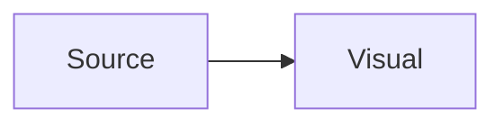

# Preservation corpus

This owner note must stay exact. It links to [[Reference note|the reference]] and
[[Reference note#Known section]].

![[diagram.svg|640]]

> [!warning]- Folded callout
> Keep the marker, fold state, and nested **Markdown**.

| feature | state | note |
| :--- | ---: | :---: |
| tables | ready | `pipes \| stay` |

- [ ] open task #docs
- [x] finished task

Term with a footnote.[^safe]

[^safe]: Footnote text with [[Reference note]].

<details data-owner="true">
<summary>raw html</summary>
<p>Do not normalize this block.</p>
</details>

<!-- ordinary html comment -->
%% Obsidian comment %%

Inline math $E = mc^2$ and a block:

$$
\int_0^1 x^2 dx = \frac{1}{3}
$$



````markdown
```js
const untouched = "fenced code";
```
````

This paragraph owns a block id. ^preserve-me

:::unknown-directive keep="exact"
future syntax stays raw
:::
